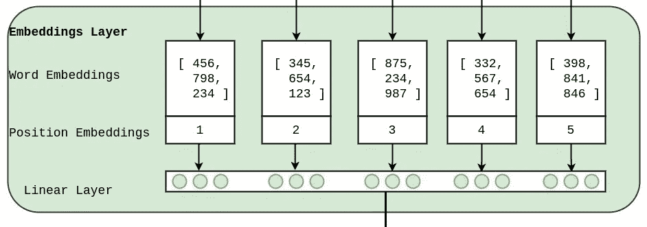
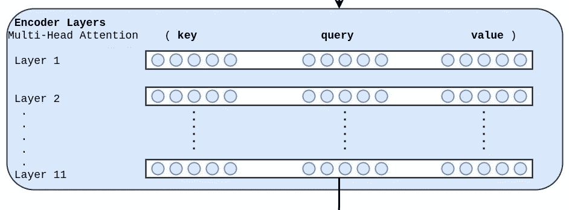
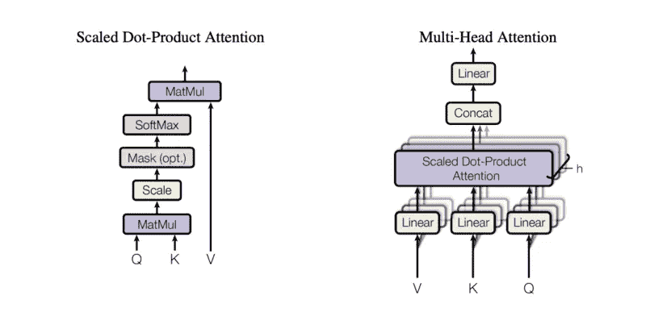
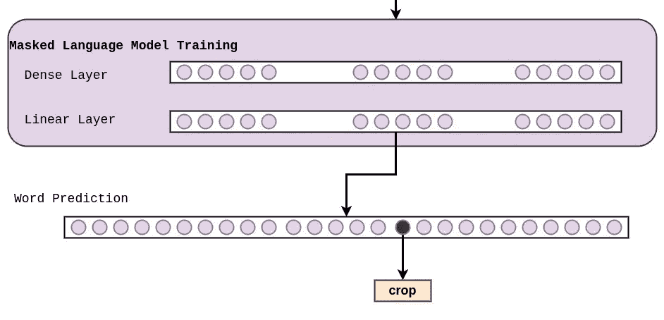
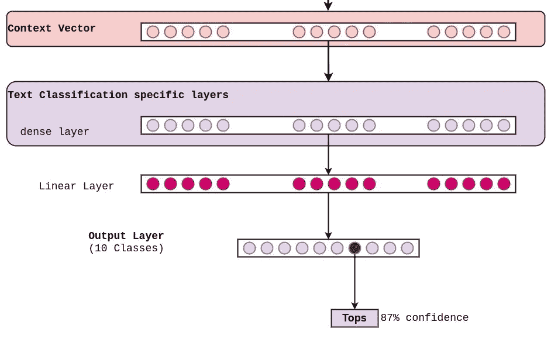
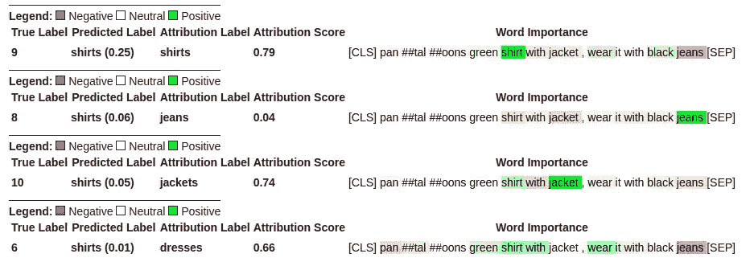
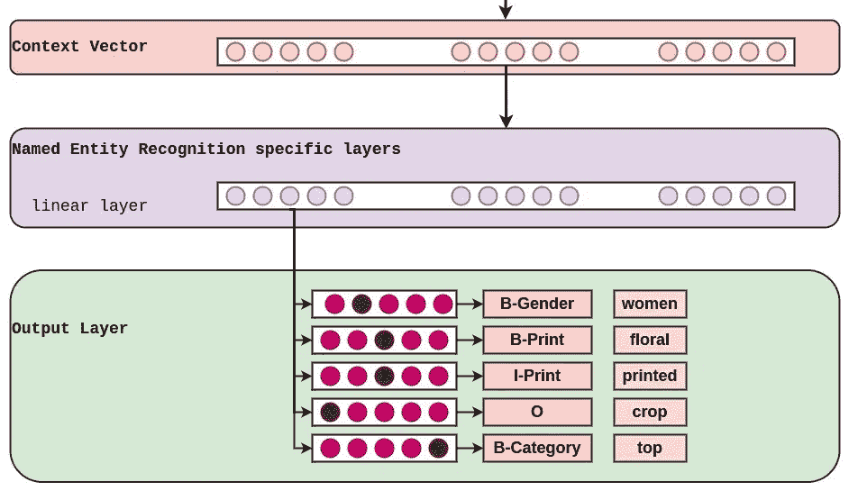
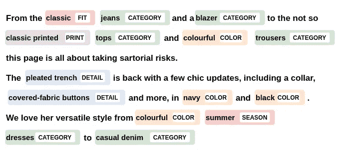

# 变压器的半监督方法

> 原文：<https://towardsdatascience.com/semi-supervised-approach-for-transformers-38722f1b5ce3>

## 一种训练基于变压器的模型的实用方法，通过半监督方法实现鲁棒性和高精度。

阿瑟尼·托古列夫在 [Unsplash](https://unsplash.com/s/photos/transformers?utm_source=unsplash&utm_medium=referral&utm_content=creditCopyText) 上的照片

变形金刚模型已经成为 NLP 任务的首选模型。在本文中，我们将按照自上而下的方法，使用 Transformers 架构来完成训练高度健壮的 NLP 模型的端到端过程。我们总是尝试使用半监督方法来训练 NLP 模型，无论是分类还是生成。

我们将主要讨论微调 BERT 和文本分类。让我们先了解一下总体情况，然后再谈细节。

对于文本数据增强，请阅读这篇[文章](https://medium.com/analytics-vidhya/data-augmentation-for-text-with-code-6da46aad443d)。

## **了解半监督变压器架构**

训练半监督模型需要 2 个步骤:

*   先训练无监督的部分。那就是训练语言模型。对于变压器，可以微调伯特、GPT 等。对于这部分训练，我们只需要未标注的数据或句子。这一步调整模型的权重，以便它能够理解我们想要训练它的数据的上下文。上下文可以是时尚、新闻、体育等。例如，当我们试图训练一个“时尚”模特或“新闻”模特时，“睡觉”这个词可以有不同的上下文。
*   其次是培训被监督的部分。也就是用标注的数据训练模型。如果第一部分具有大量的数据，则受监督部分即使具有少量的数据也会具有高精度，但反之则不成立。

下图是半监督训练的 GIF。首先，我们微调 BERT，然后我们训练一个文本分类器或命名实体识别模型。它给出了在微调语言模型和然后使用微调模型进行分类之间的联系的直观想法。

端到端流程为**微调 BERT** ，训练一个**文本分类**模型，训练一个 **NER** 模型(图片由作者提供)

让我们检查一下上图的所有组件:

## **嵌入层:**

嵌入层(图片由作者提供)

嵌入层的主要工作是将文本输入数据转换成模型可理解的格式。它有三个主要组成部分:

*   **单词嵌入:**这是为了得到每个单词的矩阵表示。对于 BERT 来说，它的词汇量为 30，522，768 个值的数组代表一个单词。因此，如果输入是 4 个单词，单词嵌入的输出将是 4 x 768。
*   **位置嵌入:**用于获取单词的位置。在 transformers 中，单词的位置作为输入传递，因为句子的上下文高度依赖于单词在句子中的位置。
*   **线性层:**该层是一个线性卷积层，用于合并各层，最终提供一个 768 特征的矩阵。

## **编码器层数:**

在这个编码层中总共有 11 个 BERT 层。

BERT 编码器层(图片由作者提供)

每层有两个主要组件:

*   **自我关注层:**这是变形金刚模型的核心，有助于确定每个单词相对于句子中所有其他单词的重要性，以及在句子的整体上下文中的重要性。下图显示了用作键(K)、查询(Q)和值(V)的嵌入。k、Q 和 V 经过几层卷积、点积和 softmax 处理，以获得所需的输出。自我关注本身是一个需要更多解释的话题。如果你没有意识到自我关注，我建议你看一下 youtube 上的视频<https://youtu.be/-9vVhYEXeyQ?t=146>****以获得更好的理解。
    该层接受 768 个特征的输入，进行多头注意操作，并输出具有 768 个特征的矩阵。****

********

****多头关注(图片来自[**wiki . math . waterloo**](https://wiki.math.uwaterloo.ca/statwiki/index.php?title=STAT946F20/BERT:_Pre-training_of_Deep_Bidirectional_Transformers_for_Language_Understanding))****

*   ******回旋层:**这些层之后是自我关注层。它包括一对夫妇的密集层，层正常化，辍学，和 GELU 激活功能。这些图层的输入和输出要素数量为 768。****

## ******语境向量:******

********

****上下文向量(图片由作者提供)****

****不是根据定义，而是上述 2 层(嵌入和编码层)的输出，给出了具有 768 个特征的矩阵，该矩阵是句子的上下文，因此我们将其称为上下文向量。这是模型的**最重要的部分，因为在无监督部分完成的所有训练都是为了训练权重以正确获得上下文向量。******

****在诸如 RNN 和 LSTM 的模型中，模型的输入是不能捕捉句子上下文的单词嵌入。因此，我们在单词嵌入层的顶部训练一个神经网络来捕捉句子的上下文。现在，这个输出捕获了 768 个特征的上下文。该输出可以作为输入传递给分类或生成模型，使得整个模型高度稳健和准确。****

## ******语言模型:******

****这是训练中无人监督的部分。额外的卷积层被添加到上下文向量的输出中。该模型的最终输出是词汇量为 30，522 的矩阵。这个模型需要从现有的词汇中预测一个单词。我们输入数百万未标记的句子，并允许模型调整权重以获得适当的上下文向量。****

****有两种方法可以训练语言模型:****

******蒙面语言模型:******

****我们屏蔽了输入句子的 10–30 %,并要求模型预测被屏蔽的单词。正如你在下图中看到的，输入句子是“女式碎花印花[面具]上衣”。****

********

****MLM 的输入(图片由作者提供)****

****卷积层被添加到编码器层以预测丢失的单词。****

********

****屏蔽语言模型底层(图片由作者提供)****

****该模型的输出是具有 vocab 大小(在这种情况下是 30，522)的矩阵，以预测丢失的单词。基于模型的预测，计算损失并调整模型的权重。****

****在使用掩蔽语言模型技术为时尚领域训练了一个具有 2000 万个句子的 BERT 语言模型之后，您可以在下面的 GIF 中清楚地观察到差异。****

********

****左图:**伯特接受时尚**数据训练，右图:**原始伯特**(图片由作者提供)****

******输入**:女装【面具】上衣
**BERT(时尚)**:女装碎花印花裁剪上衣
**BERT(原创)**:女装上衣****

******休闲语言模式:******

****对于 CLM，该模型试图从现有词汇中预测下一个单词，并将其与真实输出进行比较。通常，CLM 用于生成模型，即 GPT 架构。在本文中，我们不涉及基于 GPT 的架构，但您可以看看下面的 GIF，它显示了特定时尚的 GPT2 模型与具有原始权重的 GPT2 模型之间的差异。****

********

****左:**根据时尚**数据训练的 GPT2，右:**原始 GPT2** (图片由作者提供)****

****一旦伯特/GPT 与定制数据集进行了微调，第二部分是在其上训练分类和生成模型。****

****虽然在训练时整个模型的权重得到更新，但是为了我们的理解，我们可以假设上下文向量现在是模型的输入。****

## ****文本分类****

****现在是一个简单的分类问题。在下图中，密集图层已被添加到上下文矢量的输出中，并最终将特征减少到类的数量。上下文层输出越好，模型就越健壮和准确。****

********

****使用上下文向量的文本分类(图片由作者提供)****

****当我们处理变形金刚时，我们还可以获得单词级的置信度得分，这些得分有助于对所述类进行预测。****

********

****分析文本分类输出，绿色表示肯定，红色表示否定(图片由作者提供)****

****对于句子**panta loons green shirt with jacket，wear it with black jeans，**我们试图预测一个时尚类别。上面的句子有很多种类，包括衬衫、夹克和牛仔裤。但是正如你在第一个例子中看到的，它正确地预测了衬衫，单词 shirt 具有最高的可信度。在其他的例子中，我们已经将基本事实改变为不同的标签，然后尝试观察行为。随着标签的改变，句子的单词级置信度改变，并且它自动指向对新标签的预测有积极贡献的单词。例如，在第二个例子中，当我们将真实标签改变为牛仔裤时，单词牛仔裤的置信度变为正，而诸如衬衫和夹克的其他单词变为负。这就是自我关注模型的美妙之处。****

## ****命名实体识别****

****与文本分类相同，我们假设上下文向量作为输入，并为 NER 任务编写层。NER 模型预测每个输入单词的标签。****

********

****使用上下文向量的命名实体识别(图片由作者提供)****

****因为数据是特定于时尚的，所以标签是细粒度的。NER 也有助于短语发现，进而导致趋势发现。NER 有很多方法，但本文的范围是理解半监督方法。****

********

****时尚 NER(图片由作者提供)****

****现在，我们已经完成了所有组件，我建议您再次查看变形金刚端到端培训 GIF。****

****培训代码可在[抱脸](https://huggingface.co/docs/transformers/notebooks)获取。****

*   ****微调语言型号: [Colab 笔记本](https://colab.research.google.com/github/huggingface/notebooks/blob/main/examples/language_modeling_from_scratch.ipynb)****
*   ****训练一个文本分类模型: [Colab 笔记本](https://colab.research.google.com/github/huggingface/notebooks/blob/main/examples/text_classification.ipynb)****
*   ****训练一个 NER 模型: [Colab 笔记本](https://colab.research.google.com/github/huggingface/notebooks/blob/main/examples/token_classification.ipynb)****

****在这篇文章中，我试图给出一个半监督训练的想法，我们可以用变形金刚来训练高度精确的模型。让我知道你对它的想法。****