# 变压器的半监督方法(二)

> 原文：<https://towardsdatascience.com/semi-supervised-approach-for-transformers-part-2-8f8bf6edd912>

## 用于微调罗伯塔模型和训练自然语言推理分类任务的连体网络结构

法耶·康尼什在 [Unsplash](https://unsplash.com/s/photos/reflection?utm_source=unsplash&utm_medium=referral&utm_content=creditCopyText) 上的照片

本文将使用暹罗架构来微调 RoBERTa 模型。我们还将在微调和训练数据集时，使用主成分分析和 TSNE 来观察数据集的嵌入分布。训练将在用于自然语言推理分类的微调 RoBERTa 模型(SNLI 的子集)上进行。

[**为本文代号**](https://github.com/divyanshuraj6815/END-NLP/blob/main/Experiment%2022/Semi_Supervised_NLI_(Small)_Training_(Siamese).ipynb) 。要理解变形金刚半监督方法背后的直觉，请阅读 [**第 1 部分**](/semi-supervised-approach-for-transformers-38722f1b5ce3) 。

## 资料组

[**SNLI**](https://huggingface.co/datasets/snli) 数据集的子集用于训练。**20000 个训练样本**，10000 个验证样本，10000 个测试样本。NLI(自然语言推理)数据集有一个前提和一个假设。该模型的目标是预测假设是否与前提相矛盾、蕴涵或中立。

原始数据集有大约 550，000 个训练样本。在全套设备上做这个实验会得到更好的结果。

让我们来看一下数据集分析:

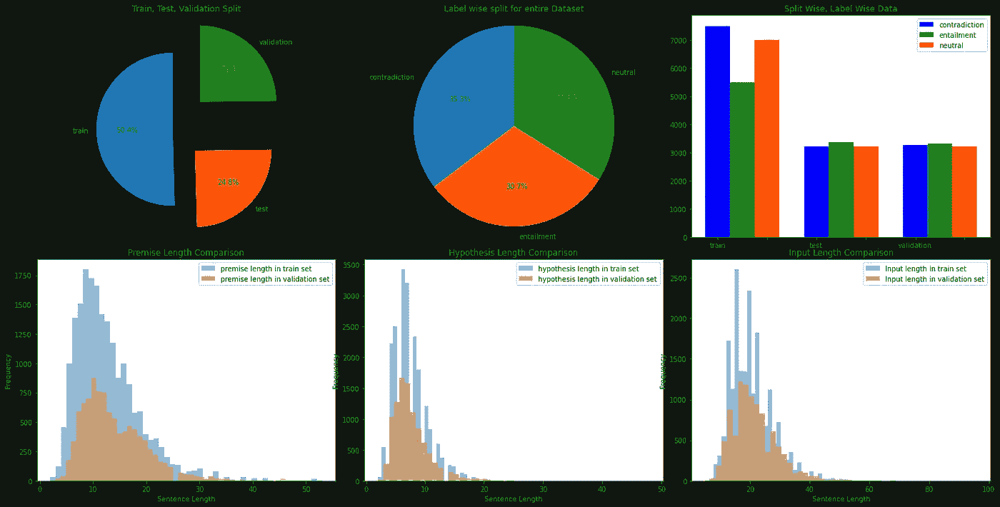

数据集分析(图片由作者提供)

我们可以从上图中观察到数据集是平衡的。将前提与假设串联后，最大句子长度可估计为 **64 个单词**。

## 模型

为此，我们将使用两种型号。第一个是暹罗建筑微调罗伯塔。第二个模型将有一个分类头来预测句子之间是包含、矛盾还是中立。

**句子变压器型号:**

为 RoBERTa 创建句子转换器模型的代码片段(作者)

该模型的输出是 768 特征或上下文向量。我们将同时计算前提和假设的嵌入，并使用**余弦相似性损失**来微调模型。

*   -1 表示矛盾
*   0 代表空档
*   1 用于限定

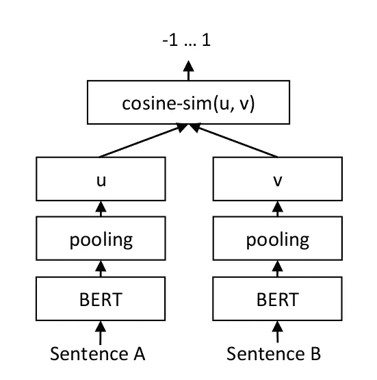

暹罗建筑(图片来自[sbert.net](https://sbert.net/examples/training/sts/README.html)

上图代表了架构。微调完成后，RoBERTa 模型的权重将被保存以供后续任务使用。

**序列分类自动模型:**

为**序列分类**加载微调过的 RoBERTa 的代码片段(作者)

在用 same 体系结构微调模型后，我们将使用相同的 RoBERTa 权重来定义序列分类模型。在这个模型中，新的权重将只分配给最后一个“分类器”层。这将在具有循环学习率和 Adam 优化器的训练数据上进一步训练。

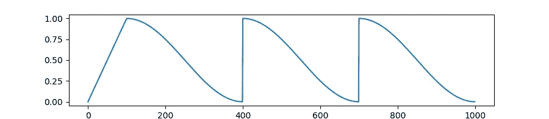

**学习率余弦调度器**(图片来自[拥抱脸](https://huggingface.co/docs/transformers/main_classes/optimizer_schedules#transformers.get_cosine_with_hard_restarts_schedule_with_warmup))

具有 2 个周期的余弦调度器的学习速率 2e-5 用于训练。这是为了避免过度拟合。

损失图(**左**)和准确度图(**右**)(图片由作者提供)

上图显示了序列分类的损失和准确度曲线。达到了 87%的测试精度。

> 训练结束后，我们会节省重量。这些权重可以再次加载到句子转换器模型中，并训练几个时期以获得更好的句子嵌入。

## 句子嵌入分析

我们已经对模型进行了三次训练:

*   将原来的罗伯塔重量加载到句子转换器中，以使用暹罗架构进行训练。我们可以保存这些微调过的权重。
*   使用 RoBERTa 将上述训练中微调的权重加载到序列分类模型中。训练后，我们保存这些重量。
*   将上述步骤中的权重加载到句子转换器中，用连体结构训练几个时期，然后保存权重。

训练集中所有句子对的句子嵌入被保存 3 次:

*   原始罗伯塔重量。
*   用连体建筑微调后。
*   经过序列分类和微调再次与暹罗架构。

对于这 3 个版本的句子嵌入，我们将运行主成分分析和 TSNE 拟合来分析数据集微调的效果。下图显示了分析结果:

**图 1:** 我们对句子嵌入的所有 3 个实例运行 n_components = 3 的 PCA，并绘制二维图。

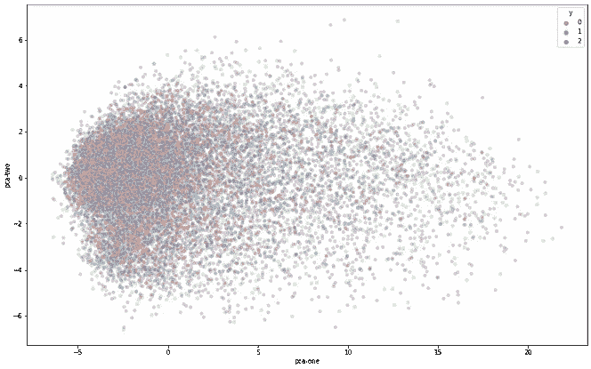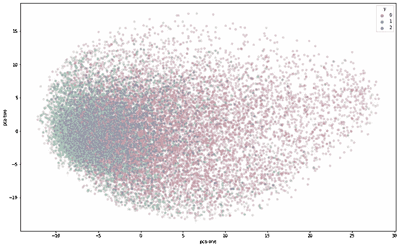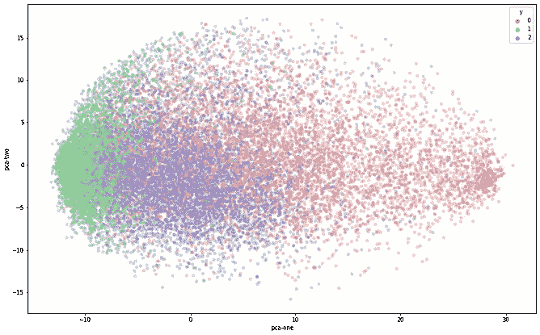

PCA (n = 3)，图为 **PCA-x，PCA-y** :原罗伯塔(**左**)，微调用暹罗(**中心**，NLI 分类后(**右**)。(图片由作者提供)

**图 2:** 我们对句子嵌入的所有 3 个实例运行 n_components = 3 的 PCA，并为所有数据点绘制 3D 图。

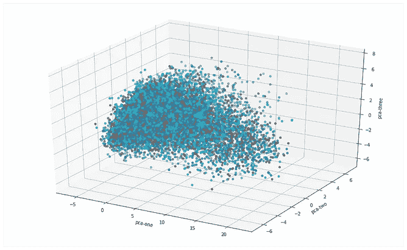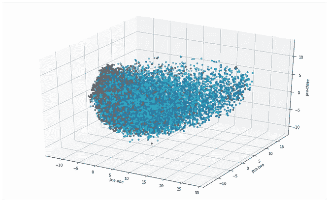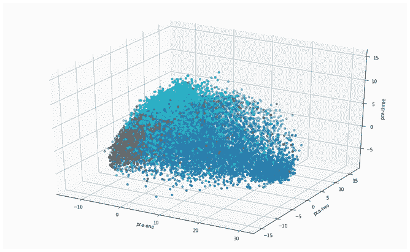

PCA (n = 3)，图形为 **PCA-x，PCA-y，PCA-z** :原罗伯塔(**左**，微调为连体(**居中**，NLI 分类后(**右**)。(图片由作者提供)

**图表 3:** 我们对所有 3 个句子嵌入实例运行 n_components = 2 的 TSNE 拟合，并绘制图表。

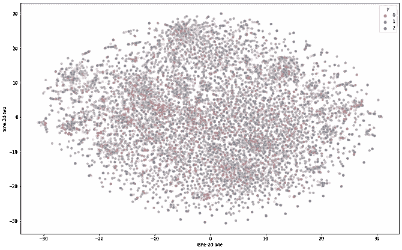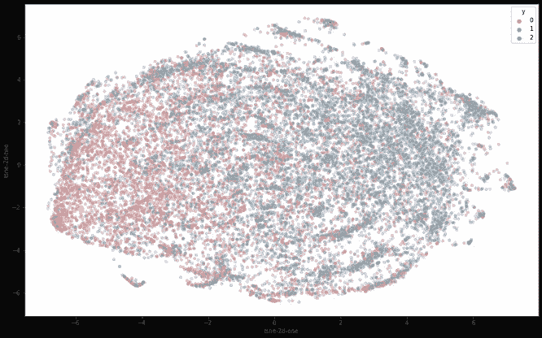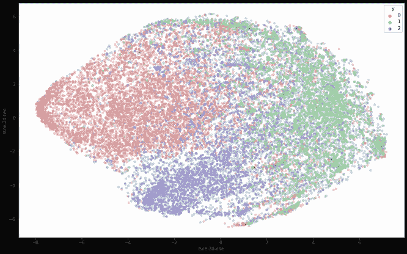

TSNE (n = 2)，图形为 **X，Y** :原罗伯塔(**左**)，微调为连体(**居中**)，NLI 分类后(**右**)。(图片由作者提供)

**图 4:** 我们运行 n_components = 50 的 PCA，并在所有 3 个句子嵌入实例上运行 n_component = 2 的 TSNE 拟合。在此图中，我们比较了前两个图和当前图。

**图表 4.1:** 为原始 RoBERTa 权重。对此的观察是，所有的数据点是分散的，并且没有逻辑足以基于它们的标签显示句子对嵌入之间的清楚区别。

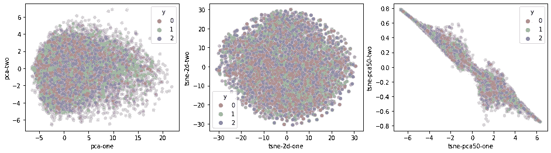

**PCA[**n = 3**]【X，Y】**(**左**)**TSNE[**n = 2**]【X，Y】**(**中心**)**TSNE[**n = 2，PCA[n = 50]**]【X，Y】**(**右【T41**

**图 4.2:** 微调连体结构后，我们可以观察到基于标签的句子对嵌入之间的一些区别。

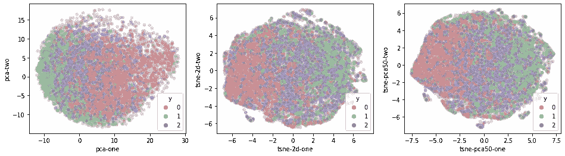

**PCA[**n = 3**]【X，Y】**(**左**)**TSNE[**n = 2**]【X，Y】**(**中心**)**TSNE[**n = 2，PCA【n = 50】**【X，Y】**(**右**

**图 4.3:** 在对暹罗架构进行序列分类和微调之后，我们可以观察到，基于标签的句子对嵌入之间存在明显的区别。

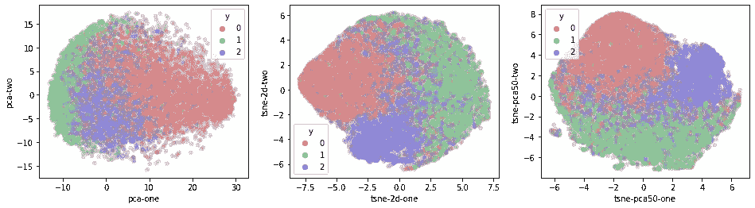

**PCA[**n = 3**]【X，Y】**(**左**)**TSNE[**n = 2**]【X，Y】**(**中心**)**TSNE[**n = 2，PCA[n = 50]**]【X，Y】**(**右**)对于**罗伯**

我已经介绍了用半监督方法训练一个 transformers 模型的影响，这种方法总是会产生一个健壮的模型。这个实验是在 20，000 个数据点的小集合上完成的。在实际数据集上这样做会有更大的影响。在 huggingface 上已经有可以直接使用的带有连体结构的微调模型。

可以使用其他技术来更好地聚类或可视化句子对嵌入。这些可视化也可以用于任何其他 NLP 任务。

## 参考资料:

1.  [句子伯特](https://arxiv.org/abs/1908.10084)
2.  你所需要的只是注意力
3.  [用于语义文本相似性的句子转换器](https://sbert.net/examples/training/sts/README.html)
4.  [为自然语言推理微调 BERT](https://hamedhelali.github.io/project/Fine-tuning-BERT-For-NLI/)
5.  [在 Python 中使用 PCA 和 t-SNE 可视化高维数据集](/visualising-high-dimensional-datasets-using-pca-and-t-sne-in-python-8ef87e7915b)