# 用旋转 iPhone 解释传感器融合

> 原文：<https://towardsdatascience.com/sensor-fusion-explained-with-rotating-iphone-fecbcd0df144>

传感器融合是利用多个传感器来降低预测的不确定性。更正式的定义来自 IEEE 地球科学与遥感学会数据融合技术委员会[1]:

> 组合由不同仪器和来源提供的空间和时间索引数据
> 的过程，以改进这些数据的
> 处理和解释。

传感器融合广泛用于多种工程应用，从 GPS 定位检测到自动驾驶。传感器融合是被称为信息融合的更一般术语的特例。有两种不同类型的传感器融合:直接和间接。

间接融合来自先验知识和人类或环境输入。例如，如果一个人想确定食物是否新鲜，使用人类的视觉传感器可能是不够的。嗅觉、触觉以及我们对食物储存地点和生产时间的先验知识相结合，可能会让我们对自己是否食用食物有一个全面的了解。

直接融合可以来自异类和同类传感器。它也可以来自软传感器或芯片。让我们看看这些融合类型的例子。

同类传感器是测量相同信息的相似传感器。例如，你可以想象几个温度计，每个都有一定程度的内部误差，放在房间的中央。通过合并这两个温度计的测量值，可以更好地估计室内的平均温度，减少温度计测量的不确定性。

[塞莫普罗](https://unsplash.com/@thermopro?utm_source=medium&utm_medium=referral)在 [Unsplash](https://unsplash.com?utm_source=medium&utm_medium=referral) 上拍照

异质传感器可以是房间中不同位置的相同温度计。然而，他们都测量温度，房间内的温度可能会因位置不同而不同。考虑到温度计的位置和温度计的内部误差，人们可以从这些局部测量中得出室内的平均温度。

软传感器或软件传感器是虚拟传感器，其中几个测量一起处理以给出系统状态的一个估计。人们可以想到手机如何根据 GPS 坐标和 Wi-Fi 信号来估计位置，这提高了位置检测的速度和精度。可以将 iPhone 中的这个传感器视为一个传感器，但是，它是几个数据源的组合，是一个软传感器。

让我们自己建立一个简单的软传感器。假设我们要测量 iPhone 方位的角度 *α(t)* ，如图所示:

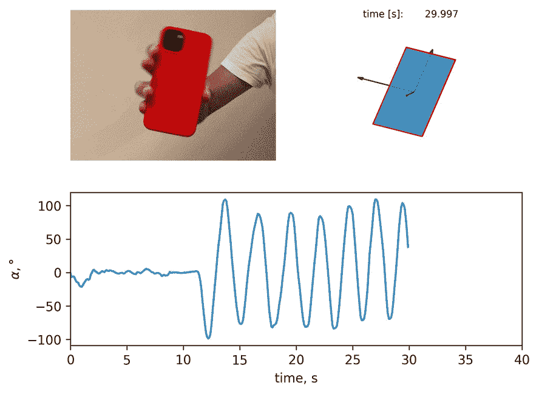

*作者图片。左上:旋转视频。右上:根据传感器数据计算的相同旋转。下图代表从传感器数据计算出的α值。*

为了简单和可再现性的目的，我们记录 iPhone 旋转的数据，然而，通过小的额外努力，这种方法可以被修改为在线工作。

**数据收集**

为了简化实验设置，人们可以将 iPhone 握在手中，并围绕一个轴旋转。以下是这篇博文的数据收集方式的更多细节:

在开始记录一个测量传感器数据的应用程序后，我一手拿着 iPhone，让它的屏幕指向我，并左右旋转它。我以不同的速度旋转 iPhone 次。在两次旋转之间，我将 iPhone 返回到初始位置，并保持在初始状态大约 5 秒钟。

收集的数据包括投影在 iPhone 和时间对应轴上的加速度(a0，a1，a2)和转速(o0，o1，o2)。数据看起来是这样的:

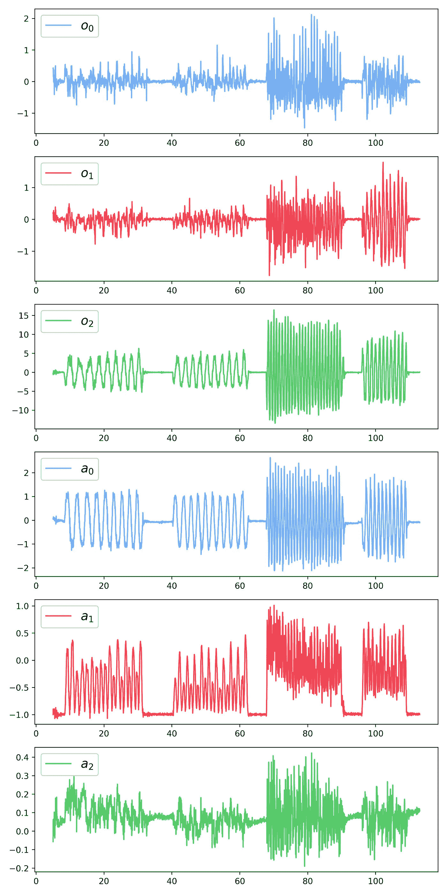

*作者图片*

**旋转物理学**

方便考虑 iPhone 附带的坐标系 *e0e1e2* 在静止坐标系中的旋转 *XYZ:*

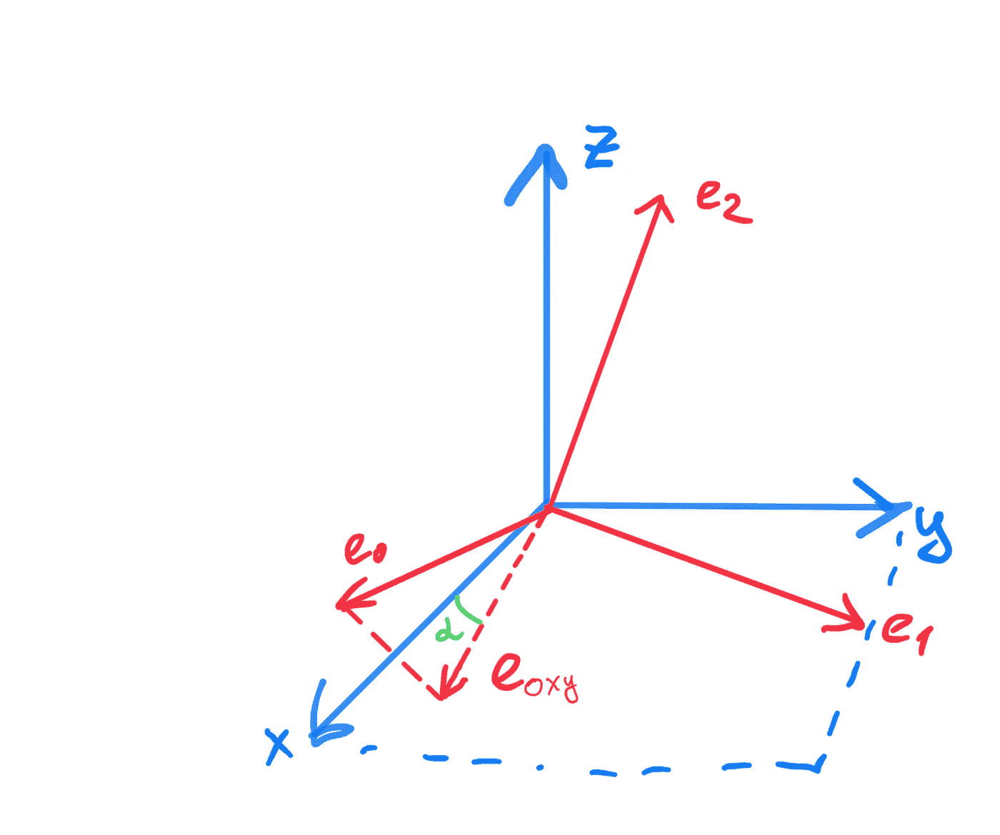

*图片作者。*iPhone 附带的坐标系 e0e1e2。XYZ 坐标系处于静止状态。

如果我们将 iPhone 屏幕垂直放在手边，那么 e0 轴指向右侧，e1 轴指向上方，e2 轴从 iPhone 屏幕指向我们。在这种情况下，总旋转矢量*ω*为:

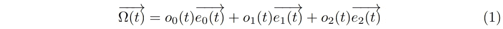

我们可以通过对相应向量与*ω*的叉积求积分，找到 *e0、e1 和 e2* 中每个向量的相应坐标:

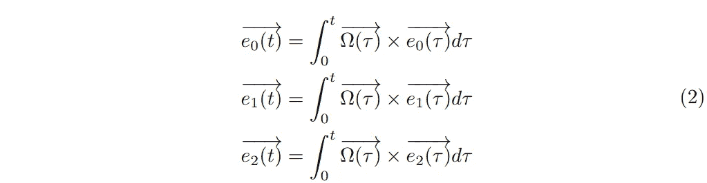

目标是测量 *X* 轴和矢量 *e0* 在 *XY* 平面上的投影之间的角度 *α* 。可以用下面的公式来计算:

如果 *e0* 的投影更靠近 *Y* 轴，我们就认为 *α* 为正。如果投影与 *αx* 之间的角度大于 *pi/2* 则为负:

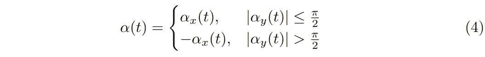

## 无传感器融合的软传感器

首先，我们尝试只使用来自 iPhone 陀螺仪的数据。使用等式(1)-(4)，我们可以构建测量 *α(t)* 的软传感器。然而，由于测量误差和数值误差，iPhone 附带的坐标系在一段时间后变得不正交。为了实现正交性，可以使用格拉姆-施密特变换。

完整的算法导致以下步骤:

1.  计算 iPhone 坐标中的总转速(方程式。1)
2.  基于总旋转(等式)更新 iPhone 坐标。2)
3.  新 iPhone 坐标上的格拉姆-施密特变换
4.  计算 *α* (等式。3–4)

用于评估 iPhone 方向的 python 脚本可能如下所示:

这将导致下面的 *α(t):*

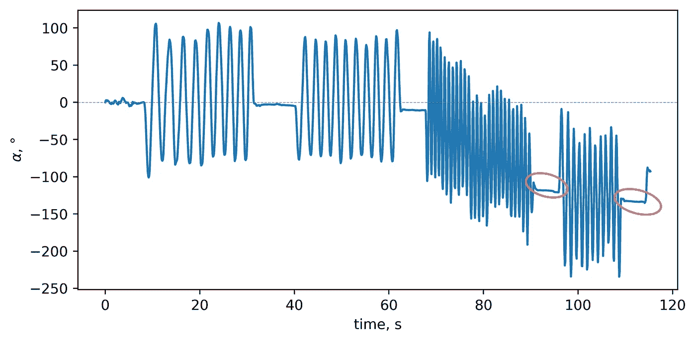

*作者图片*

数据收集以这样一种方式进行，即在旋转之间 iPhone 返回到初始位置。尽管在旋转周期之间有重要的值 *α(t)* (标记为红色)。问题出在不连续的测量上。在积分过程中，我们在测量值之间近似未知值，这些近似会导致漂移。

第 80 秒和第 85 秒之间的再现旋转将如下所示:

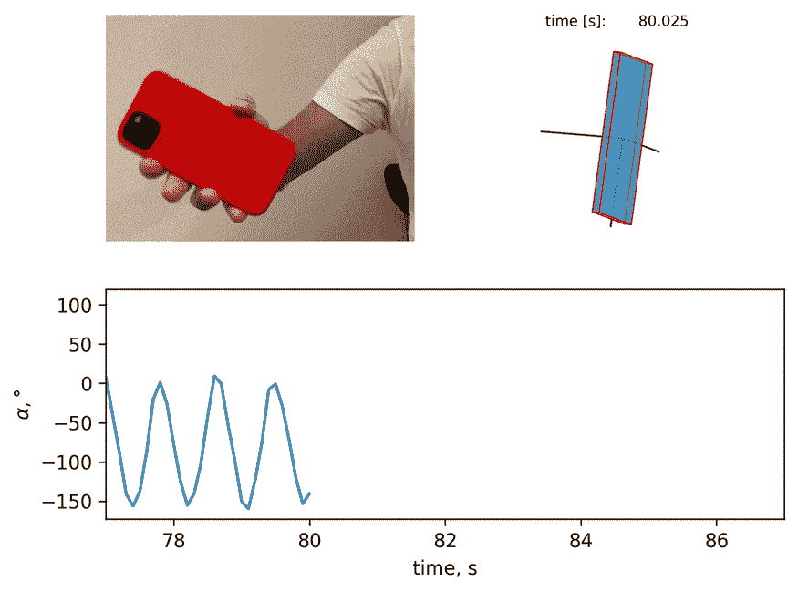

*图片作者。无校正旋转。左上:旋转视频。右上:根据传感器数据计算的相同旋转。下图代表从传感器数据计算出的α值。*

注意，轴线 e2 不再指向我们(不与轴线 Z 对齐)。此外，旋转发生在-75 grad 值附近，这与旋转的视频记录不一致。

## 传感器融合软测量

改善这种情况的一种方法是将转速数据与加速度数据融合。有了加速度数据，就很容易判断出重力的方向。iPhone 的初始 *e1* 轴与重力方向相反。旋转之间的静止状态也是如此: *e1* 与重力相反。有可能在总转动矢量中加入一个松弛项，这将说明静止状态下的 e1 与重力方向相反。当轴线 e1 偏离，并且不指向重力的相反方向时，这个松弛项会使它向后移动。Berkley [2]的一项“被扔的 iPhone”研究中使用了类似的修正。

关于我们的系统，我们知道的另一个事实是，一般来说，我们围绕手机的 e2 轴旋转手机，在实验过程中，该轴不会发生剧烈变化。所以 e2 通常与静止系统的 Z 轴方向相同。为了说明这一事实，我们可以添加另一个松弛项，如果 e2 轴由于数字或测量误差而漂移，它将返回到 Z 轴。

这种松弛项的公式是:

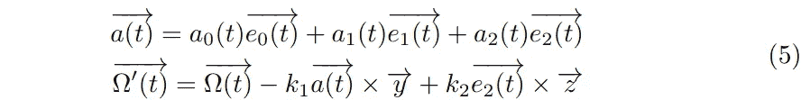

其中 *kf* 是融合系数，可以根据经验得出(发现等于 1 就足够了)。注意，在 e2 校正的情况下，由于 e2 和 Z 轴之间的角度不影响 *α的测量，因此 Z 轴的松弛将会起作用。*然而，如果我们选择松弛到 e1 而不是加速度矢量，这将影响 *α* 的测量。融合算法如上所述，但是增加了额外的步骤 1b:

在 *α(t)* 的曲线上不再观察到漂移；

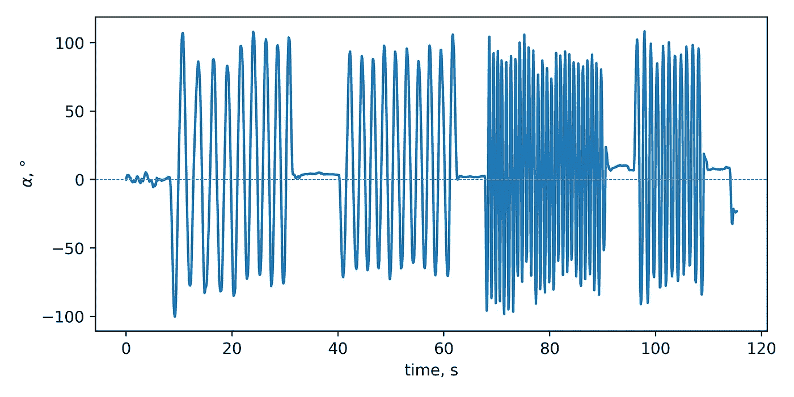

*作者图片*

iPhone 数据的重建与视频记录非常吻合:

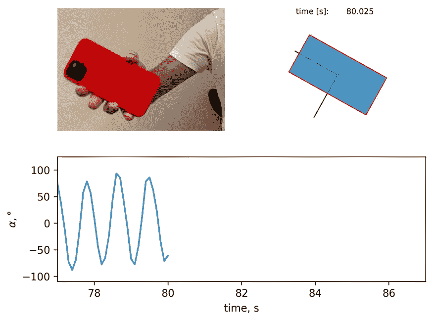

*作者图片。传感器融合旋转。左上:旋转视频。右上:根据传感器数据计算的相同旋转。下图代表从传感器数据计算出的α值。*

完整的代码可在[这里](https://github.com/azarnyx/iPhone_rotation)。传感器融合快乐！

附注:我要感谢谢尔盖·利特维诺夫对邮报的帮助。

P.P.S:在第二部分，我比较了这篇博文和视频中的定位。这里是[环节](https://pub.towardsai.net/image-segmentation-of-rotating-iphone-with-scikit-image-3e27e5fad7a8)。

[1]用于交通管理和互联车辆的 ITS 传感器和架构，Lawrence A. Klein，2017 年

[2][https://rotations . Berkeley . edu/re constructing-of-motion-of-a-throwed-iphone/](https://rotations.berkeley.edu/reconstructing-the-motion-of-a-tossed-iphone/)