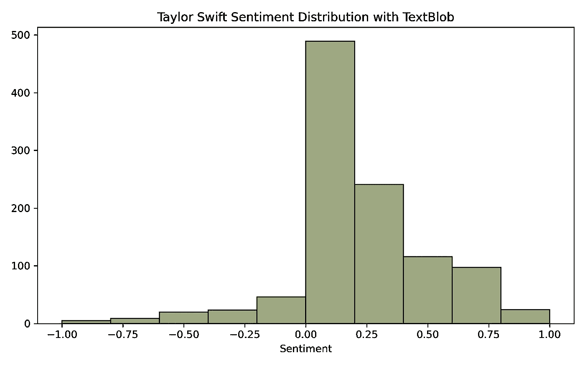
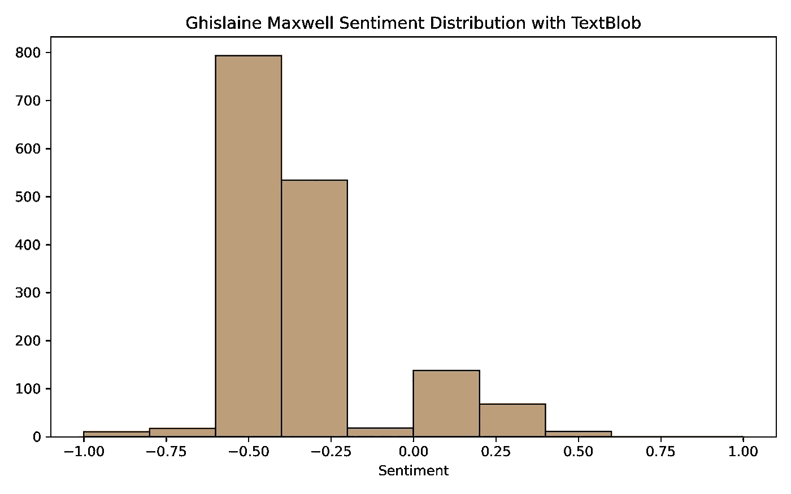

# 在社交媒体情绪分析中提升自己的水平

> 原文：<https://towardsdatascience.com/sentiment-analysis-74624b075842>

# 在社交媒体情绪分析中提升自己的水平

## 了解客户对你的产品和服务的感受


在 [Unsplash](https://unsplash.com?utm_source=medium&utm_medium=referral) 上由 [Belinda Fewings](https://unsplash.com/@bel2000a?utm_source=medium&utm_medium=referral) 拍摄的照片

# 什么是情感分析？

情感分析有助于理解文本数据的语气，积极的、消极的或中性的。捕捉情感可以帮助组织更好地理解**客户的声音(VOC)** 甚至指导产品开发以改进功能。通常，情感分析是基于词汇和规则的，这意味着它对被人类标记为积极、消极或中性的词进行查找。还有更先进的模型可用，如 2018 年由谷歌开源的 BERT。这篇文章将涵盖更传统的基于词典的方法；我们稍后将了解深度学习模型。

你需要熟悉新的术语来解释结果。它们是简单的概念，但是提前理解它们将有助于你更好地理解。

*   **极性**:表示一个句子从否定到肯定的情感程度的数值。[-1.0，1.0]范围内的值(负面情绪= > -1.0，中性= > 0.0，正面情绪= > 1.0)
*   **主观性**:主观性句子表达个人的感受、观点或信仰。主观性是范围[0.0，1.0]内的值，其中 0.0 非常客观，1.0 非常主观。

# 推特数据

对于这个例子，我们将使用从 Twitter 中提取的数据。Twitter 是 VOC 分析的绝佳来源。您可以搜索产品名称、标签、提及或公司名称。对于 Python，我们可以使用 [Twitter API](https://developer.twitter.com/en) 的 [Tweepy](https://docs.tweepy.org/en/stable/) 包装器。

在寻找非常积极**或非常消极**的数据的伟大例子的过程中，我碰巧在宣读 [Ghislaine Maxwell](https://www.nytimes.com/2021/12/29/nyregion/ghislaine-maxwell-guilty-verdict.html) 审判裁决的时候写下了这篇文章并下载了数据，并认为这将是一个非常好的开始否定的地方。谁会相反，几乎所有的推文都是正面的？我选择了[泰勒斯威夫特](https://www.youtube.com/watch?v=FuXNumBwDOM)。****

我不会覆盖我用来提取推文的实际代码，但如果你想自己尝试，所有代码都可以在这里找到:[推文提取笔记本](https://github.com/broepke/SentimentAnalysis/blob/main/twitter.ipynb)

像往常一样，让我们导入将要使用的库并导入我们的数据来开始。

```
import pandas as pd
from textblob import TextBlob
from vaderSentiment.vaderSentiment import SentimentIntensityAnalyzer
import seaborn as sns
import matplotlib.pyplot as plt
```

```
swift = pd.read_pickle('swift.pkl')
maxwell = pd.read_pickle('maxwell.pkl')
```

# 基于纹理块的情感分析

TexBlob 是一个我喜欢用于快速 NLP 项目的包。这是一个简单的 Python API，支持情感分析等常见任务。它包含两个不同的情感分析器。第一个叫`[PatternAnalyzer](https://github.com/clips/pattern)`，另一个叫 NLTKs `NaiveBayesAnalyzer`，在一个影评语料库上训练。

从 TextBlob 中获取**极性**(或**主观性**)分数很简单。我们可以使用熊猫的`apply`方法来获取每条推文的“情绪”。

```
# Apply the Polarity Scoring from TextBlob
swift['blob'] = swift['text'].apply(lambda x: TextBlob(x).sentiment.polarity)
swift.head()
```

```
TWEET POLARITY
0 RT @TSwiftFTC: 🥇 According to @HITSDD, Taylor ... 1.000000
1 RT @taylorr_media: Taylor Swift - All Too Well...  0.000000
2 Taylor Swift and Ed Sheeran music mainly. And ...  0.166667
3 RT @soitgoes: Taylor Swift didn't write:...        0.200000
4 Suporte list: Nial Horan, Demi Lovato, Taylor ...  0.000000
```

就这么简单，我们有我们的极性分数。我们可以在上面的例子中看到，我们有一些从中性到最大正值的`1.0`。通常，你的文字会有一种中性的情绪。由于中立的推文不会为分析添加任何信息，我们可以删除它们，只留下那些积极和消极的信息。

```
# Get rid of neutral sentiment
filter = swift['blob'] != 0
swift = swift[filter]
```

接下来画出我们结果。我用的是 Seaborn[的`histplot`。直方图非常适合可视化极性得分，因为它们可以很好地归入-1.0 到 1.0 的范围内。](https://seaborn.pydata.org/generated/seaborn.histplot.html)

```
sns.histplot(swift, x='blob', color="#7C8C58", bins=10)
plt.title("Taylor Swift Sentiment Distribution with TextBlob")
plt.xlabel("Sentiment")
plt.ylabel("")
```

下面，你可以看到泰勒斯威夫特的推文大多是正面的，而麦克斯韦尔的推文大多是负面的。



作者图片



作者图片

# 使用 Vader 进行社交媒体情感分析

TextBlob 不适用于较短的文本或社交媒体帖子。它更适合用通用语言模式编写的更长、更简洁的字符串。然而，专门针对社交媒体的工具已经出现，这些工具能够理解如何处理社交媒体中使用的语言模式。其中一个就是 VADER 库。VADER 专门为社交媒体处理的一些事情有:

*   **助推词**:增加感情的词，如**伟大**或**爱情**
*   全大写:全大写的单词经常被用来放大情感
*   **标点符号**:标记如**！**或者**！！！**会增加人气
*   **俚语**:正确解释 **SUX** 或 **BFF** 等词语
*   **表情符号** : **UTF-8** 编码表情符号被正确处理

**注意:** *字符串不能像其他 NLP 方法一样被* [*清理*](https://www.dataknowsall.com/textcleaning.html) *。VADER 将从未经加工的文本中提取许多上下文。*

在我们进入 Twitter 数据之前，让我们先来看看只包含表情符号的几个字符串是如何处理的。

```
positive = "💕 😁 🎉"
negative = "💔 😬 🙁"
```

```
{'neg': 0.0, 'neu': 0.375, 'pos': 0.625, 'compound': 0.875}
{'neg': 0.514, 'neu': 0.203, 'pos': 0.284, 'compound': -0.3415}
```

这两个字符串将返回带有文本块的`0.0`，带有 **VADER 的**，它们显示的`compound`分数似乎与表情符号所代表的情绪一致。

让我们做与上面相同的过程，但是利用 VADER 图书馆。我们将在数据帧上使用相同的`apply`方法。

```
# Add the polarity scores
swift['vader'] = swift['text'].apply(lambda x: sid.polarity_scores(x))
```

```
{'neg': 0.0, 'neu': 0.793, 'pos': 0.207, 'compound': 0.7184}
```

结果列实际上是不同的**键值对**的**字典**。代表文本块`sentiment`的键值是一个叫做`compound`的键值。我们可以通过对数据帧应用以下函数来提取它:

```
# Extract only the compound score value
swift['compound'] = swift['vader'].apply(lambda score_dict: score_dict['compound'])
```

再次绘制我们的结果后，我们可以看到 VADER 更好地代表了情绪。斯威夫特的得分更偏向于正面，麦克斯韦尔的得分更偏向于负面。无论是表情符号还是人们强调自己感受的其他常见方式，VADER 在推文中捕捉的情感都比文本 Blob 更多。


作者图片


作者图片

# 结论

你有它！客户之声对社交媒体数据的情感分析。这篇文章只是你能做什么以及如何利用这些信息的开始；然而，它是你工具箱中的一个强有力的工具，可以更好地理解你的客户和他们的情绪。Twitter 数据提取和情感分析的完整代码可以在 [GitHub](https://github.com/broepke/SentimentAnalysis) 上获得。

如果你喜欢阅读这样的故事，并想支持我成为一名作家，可以考虑报名成为一名媒体成员。一个月 5 美元，让你可以无限制地访问成千上万篇文章。如果你用我的链接注册，我会给你一点佣金，不会增加你的额外费用。