# 情感分析—简介和实施

> 原文：<https://towardsdatascience.com/sentiment-analysis-intro-and-implementation-ddf648f79327>

## 使用 NLTK、scikit-learn 和 TextBlob 进行情感分析


分析文本理解感受。E 2

你有没有在网上留下过对某个产品、服务或者某部电影的评论？或者也许你是那些不留下评论的人之一——那么，在推特、脸书或 Instagram 上发表任何文字帖子或评论怎么样？如果答案是肯定的，那么很有可能算法已经审查了你的文本数据，以便从中提取一些有价值的信息。

品牌和企业根据从这些文本中提取的信息做出决策。例如，如果一部电影在网飞或 Prime Video 上不成功，每个公司的科学家都会深入研究电影评论，了解这部不成功电影背后的原因，以避免未来犯同样的错误。投资公司将推文(和其他文本数据)作为其投资模型的变量之一进行监控——众所周知，埃隆·马斯克每隔一段时间就会发布如此具有财务影响力的推文！如果你很想了解这些公司是如何从这些文本输入中提取信息的，那么这篇文章就是为你准备的。

在这篇文章中，我们将通过仔细观察情感分析来了解更多关于成为数据科学家的[技术要求。在自然语言处理领域，情感分析是从文本数据中识别、量化、提取和研究主观信息的工具。比如“我喜欢看电视剧。”带有积极的情绪。但是，如果一个人说“我真的很喜欢看电视节目”，这种情绪甚至可能“相对更”积极。情感分析试图量化文本数据中传达的情感。情感分析的一个最常见的用例是让品牌和企业能够查看客户的反馈并监控他们的满意度。可以想象，让员工阅读客户评论来确定客户对业务、服务或产品是否满意是非常昂贵的。在这种情况下，品牌和企业使用情感分析等机器学习技术来大规模实现类似的结果。](https://medium.com/@fmnobar/data-scientist-role-requirements-bbae1f85d4d5)

和我的其他帖子类似，学习会通过练习问答来实现。我将根据需要在问题中包含提示和解释，以使旅程更容易。最后，我用来创建这个练习的笔记本也链接在文章的底部，你可以下载，运行和跟随。

我们开始吧！

<https://medium.com/@fmnobar/membership>  

# 数据集

为了练习情感分析，我们将使用来自 [UCI 机器学习库](https://archive.ics.uci.edu/ml/datasets/sentiment+labelled+sentences)的测试集，该测试集基于论文“使用深度特征从组到个体标签”([Kotzias et al .al，2015](http://www.datalab.uci.edu/papers/kdd2015_dimitris.pdf) )并且可以从[这个链接](https://gist.github.com/fmnobar/88703ec6a1f37b3eabf126ad38c392b8)下载(CC BY 4.0)。

让我们从导入我们今天将使用的库开始，然后将数据集读入数据帧，并查看数据帧的前五行来熟悉数据。

```
# Import required packages
import numpy as np
import pandas as pd
import nltk

# Making width of the column viewable
pd.set_option('display.max_colwidth', None)

# Read the data into a dataframe
df = pd.read_csv('movie_reduced.csv')

# look at the top five rows of the dataframe
df.head()
```

结果:

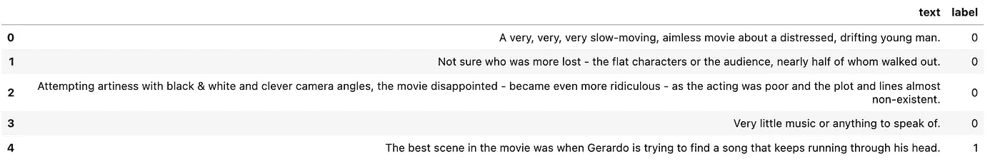

只有两列。“文本”包含评论本身，“标签”表示评论的情绪。在这个数据集中，标签 1 表示积极情绪，而标签 0 表示消极情绪。既然只有两类标签，那我们就来看看这两类是平衡的还是不平衡的。当类(粗略地)占总观测值的相同部分时，类被认为是平衡的。让我们看看数据，这样更容易理解。

```
df['label'].value_counts()
```

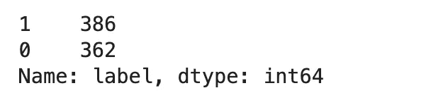

该数据在积极情绪和消极情绪之间几乎平分秋色，因此我们认为该数据具有平衡的类别。

接下来，我们将创建一个示例字符串，它包括数据帧的“text”列中的第一个条目。在一些问题中，我们将对这个样本应用各种技术来更好地理解概念。让我们继续创建我们的样本字符串。

```
# Take the very first text entry of the dataframe
sample = df.text[0]
sample
```

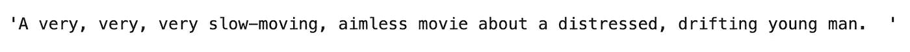

# 教程+问答

## 令牌和二元模型

为了让程序和计算机理解/使用文本数据，我们首先将较大的文本数据片段分解成较小的片段。将一个字符序列(如一个字符串)分解成更小的部分(或子字符串)称为记号化，执行记号化的函数称为记号化器。记号赋予器可以将给定的字符串分解成一系列子字符串。让我们看一个例子。

输入:“什么是句子？”

如果我们对上面的“输入”应用一个记号化器，我们将得到下面的“输出”:

输出:`[‘What’, ‘is’, ‘a’, ‘sentence’, ‘?’]`

正如所料，输出是输入句子的标记化子字符串序列。

我们可以用`nltk.word_tokenize`包来实现这个概念。让我们看看这是如何在一个例子中实现的。

**问题 1:**

对生成的样本进行标记化，并返回前 10 个标记。

**回答:**

```
# Import the package
from nltk import word_tokenize

# Tokenize the sample
sample_tokens = word_tokenize(sample)

# Return the first 10 tokens
sample_tokens[:10]
```

结果:

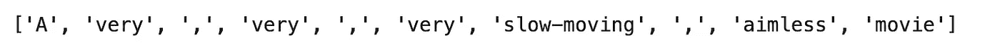

令牌也称为一元语法。如果我们把两个一元词组合起来，我们就得到一个二元词(这个过程可以继续)。形式上，二元模型是一个 n 元模型，其中 n 等于 2。n 元语法是来自给定文本样本的 n 个相邻项的序列。因此，二元模型是一串标记中两个相邻元素的序列。举个例子会更容易理解:

原句:“什么是句子？”

代币:`[‘What’, ‘is’, ‘a’, ‘sentence’, ‘?’]`

二元模型:`[(‘What’, ‘is’), (‘is’, ‘a’), (‘a’, ‘sentence’), (‘sentence’, ‘?’)]`

正如所料，现在每两个相邻的标记都在一个二元模型中表示。

我们可以用`nltk.bigrams`包来实现这个概念。

**问题二:**

从标记化的样本中创建二元模型列表，并返回前 10 个二元模型。

**回答:**

```
# Import the package
from nltk import bigrams

# Create the bigrams
sample_bitokens = list(bigrams(sample_tokens))

# Return the first 10 bigrams
sample_bitokens[:10]
```

结果:

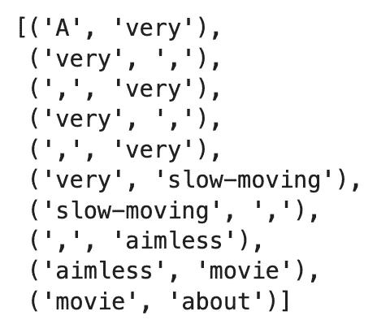

## 频数分布

让我们回到从我们的示例中创建的令牌(单字)。看到有哪些标记是很好的，但是在给定的文本输入中，知道哪些标记比其他标记具有更高的表示可能更有意义。换句话说，记号的出现频率分布将更能提供信息。更正式的说法是，频率分布记录了实验的每个结果出现的次数。

让我们使用`nltk.FreqDist`包实现一个频率分布。

**问题三:**

在我们的示例中，前 10 个最常用的令牌是什么？

**回答:**

```
# Import the package
from nltk import FreqDist

# Create the frequency distribution for all tokens
sample_freqdist = FreqDist(sample_tokens)

# Return top ten most frequent tokens
sample_freqdist.most_common(10)
```

结果:


一些结果直观上是有意义的。例如，逗号、“the”、“a”或句号在给定的文本输入中可能非常常见。现在，让我们将所有这些步骤放入一个 Python 函数中，以简化流程。如果你需要 Python 函数的复习，我有一个关于 Python 函数练习题的帖子[链接在这里](https://medium.com/@fmnobar/python-foundation-for-data-science-advanced-functions-practice-notebook-dbe4204b83d6)。

**问题 4:**

创建一个名为“top_n”的函数，它接受一个文本作为输入，并返回给定文本中前 n 个最常见的标记。使用“文本”和“n”作为函数参数。然后在我们的样本上试一试，重现上一个问题的结果。

**回答:**

```
# Create a function to accept a text and n and returns top n most common tokens
def top_n(text, n):
    # Create tokens
    tokens = word_tokenize(text)

    # Create the frequency distribution
    freqdist = FreqDist(tokens)

    # Return the top n most common ones
    return freqdist.most_common(n)

# Try it on the sample
top_n(df.text[1], 10)
```

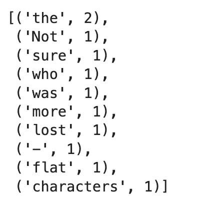

我们能够使用函数再现相同的输出。

文档术语矩阵(DTM)是表示术语在文档集合中出现的频率的矩阵。让我们看两个句子来理解 DTM 是什么。

假设我们有以下两句话:

```
sentence_1 = 'He is walking down the street.'

sentence_2 = 'She walked up then walked down the street yesterday.'
```

DTM 的上述两句话将会是:

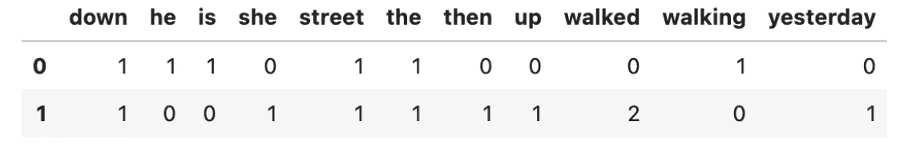

在上面的 DTM 中，数字表示该特定术语(或标记)在给定的句子中出现了多少次。例如，“down”在两个句子中都出现了一次，而“walked”出现了两次，但只出现在第二个句子中。

现在让我们看看如何使用 scikit-learn 的`CountVectorizer`实现 DTM 概念。注意，最初使用 scikit-learn 创建的 DTM 是稀疏矩阵/阵列的形式(即大多数条目为零)。这样做是为了提高效率，但我们需要将稀疏数组转换为密集数组(即大多数值都是非零的)。因为理解稀疏阵列和密集阵列之间的区别不是这篇文章的目的，所以我们不会深入讨论这个话题。

**问题 5:**

定义一个名为“create_dtm”的函数，为给定的一系列字符串创建一个数据帧形式的文档术语矩阵。然后在我们数据集的前五行上测试它。

**回答:**

```
# Import the package
from sklearn.feature_extraction.text import CountVectorizer

def create_dtm(series):
    # Create an instance of the class
    cv = CountVectorizer()

    # Create a document term matrix from the provided series
    dtm = cv.fit_transform(series)

    # Convert the sparse array to a dense array
    dtm = dtm.todense()

    # Get column names
    features = cv.get_feature_names_out()

    # Create a dataframe
    dtm_df = pd.DataFrame(dtm, columns = features)

    # Return the dataframe
    return dtm_df

# Try the function on the top 5 rows of the df['text']
create_dtm(df.text.head())
```

结果:

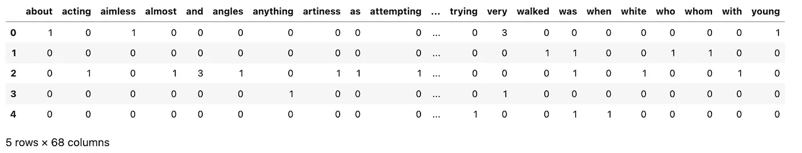

## 特征重要性

现在我们想把情感分析当做一个机器学习模型。在这样的机器学习模型中，我们希望模型接受文本输入，并对每个文本条目的情感做出预测。换句话说，文本输入是自变量，情感是因变量。我们还了解到，我们可以将文本分解成更小的称为标记的片段，因此，我们可以将文本输入中的每个标记视为“特征”，帮助预测作为机器学习模型输出的情感。总而言之，我们从一个接受大量文本数据和预测情感的机器学习模型开始，但现在我们已经将我们的任务转换为一个接受多个“标记”(而不是大量文本)并基于给定标记预测情感的模型。那么下一个逻辑步骤将是尝试量化哪些表征(即特征)在预测情感中更重要。这个任务被称为特征重要性。

幸运的是，在 scikit-learn 中可以很容易地实现特性重要性。我们一起来看一个例子。

**问题 6:**

定义一个名为“top_n_tokens”的函数，该函数接受三个参数:(1)“text”，它是数据框列格式的文本输入，(2)“impression”，它是数据框列格式的给定文本的情感标签，以及(3)“n”，它是一个正数。该函数将返回前“n”个最重要的表征(即特征)来预测“文本”的“情感”。请使用`sklearn.linear_model`中的`LogisticRegression`和以下参数:`solver = 'lbfgs'`、`max_iter = 2500`和`random_state = 1234`。最后，使用函数返回 dataframe 的“text”列中前 10 个最重要的标记。

***注:*** *由于这篇文章的目标是探索情绪分析，我们假设读者熟悉逻辑回归。如果你想更深入地了解逻辑回归，请查看* [*这篇文章*](https://medium.com/@fmnobar/logistic-regression-overview-through-11-practice-questions-practice-notebook-64e94cb8d09d) *。*

**回答:**

```
# Import logistic regression
from sklearn.linear_model import LogisticRegression

def top_n_tokens(text, sentiment, n):
    # Create an instance of the class
    lgr = LogisticRegression(solver = 'lbfgs', max_iter = 2500, random_state = 1234)
    cv = CountVectorizer()

    # create the DTM
    dtm = cv.fit_transform(text)

    # Fit the logistic regression model
    lgr.fit(dtm, sentiment)

    # Get the coefficients
    coefs = lgr.coef_[0]

    # Create the features / column names
    features = cv.get_feature_names_out()

    # create the dataframe
    df = pd.DataFrame({'Tokens' : features, 'Coefficients' : coefs})

    # Return the largest n
    return df.nlargest(n, 'Coefficients')

# Test it on the df['text']
top_n_tokens(df.text, df.label, 10)
```

结果:

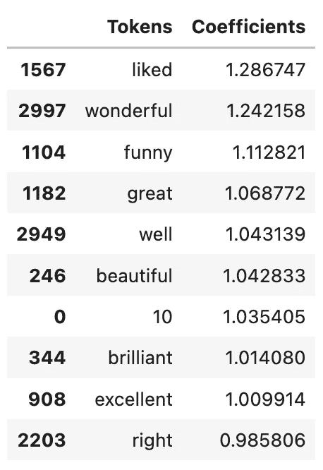

结果相当有趣。我们在寻找最重要的特征，正如我们所知，标签 1 表示数据集中的积极情绪。换句话说，最重要的特征(即，具有最高系数的特征)将是指示强烈积极情绪的特征。这在结果中得到了体现，这些结果听起来都非常积极。

为了验证这一假设，让我们看看 10 个最小的系数(即最不重要的特征)。我们预计这些会传达出强烈的负面情绪。

```
# Import logistic regression
from sklearn.linear_model import LogisticRegression

def bottom_n_tokens(text, sentiment, n):
    # Create an instance of the class
    lgr = LogisticRegression(solver = 'lbfgs', max_iter = 2500, random_state = 1234)
    cv = CountVectorizer()

    # create the DTM
    dtm = cv.fit_transform(text)

    # Fit the logistic regression model
    lgr.fit(dtm, sentiment)

    # Get the coefficients
    coefs = lgr.coef_[0]

    # Create the features / column names
    features = cv.get_feature_names_out()

    # create the dataframe
    df = pd.DataFrame({'Tokens' : features, 'Coefficients' : coefs})

    # Return the largest n
    return df.nsmallest(n, 'Coefficients')

# Test it on the df['text']
bottom_n_tokens(df.text, df.label, 10)
```

结果:

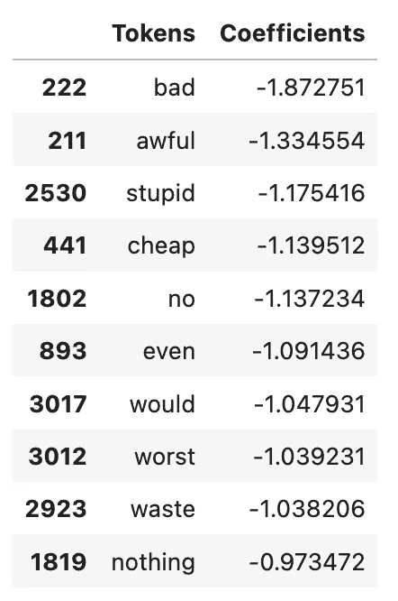

不出所料，这些话传达出强烈的负面情绪。

在前面的示例中，我们对现有的标记数据训练了一个逻辑回归模型。但是，如果我们没有标记的数据，并希望确定一个给定数据集的情绪呢？在这种情况下，我们可以利用预先训练的模型，如 TextBlob，我们将在接下来讨论它。

## 预训练模型—文本块

TextBlob 是一个用于处理文本数据的库，其功能之一是以命名元组的格式返回给定数据的情感，如下所示:“(极性，主观性)”。极性得分是[-1.0，1.0]范围内的浮动值，旨在区分文本是正面还是负面。主观性是在[0.0，1.0]范围内的浮动，其中 0.0 非常客观，1.0 非常主观。例如，一个事实被认为是客观的，而一个人的观点被认为是主观的。极性和主观性检测是情感分析中最常见的两项任务，我们将在下一个问题中探讨。

**问题 7:**

定义一个名为“polarity_subjectivity”的函数，它接受两个参数。该函数将“TextBlob”应用于所提供的“text”(默认为“sample”)，如果“print_results = True ”,则使用“TextBlob”打印“text”的极性和主观性，否则返回一组浮点值，其中第一个值为极性，第二个值为主观性，例如“(polarity，subjectivity)”。返回元组应该是函数的默认设置(即 set `print_results = False`)。最后，对我们的示例使用该函数并打印结果。

***提示:*** *如果你需要安装 TextBlob，你可以使用下面的命令:* `*!pip install textblob*`

**回答:**

```
# Import TextBlob
from textblob import TextBlob

def polarity_subjectivity(text = sample, print_results = False):
    # Create an instance of TextBlob
    tb = TextBlob(text)

    # If the condition is met, print the results, otherwise, return the tuple
    if print_results:
        print(f"Polarity is {round(tb.sentiment[0], 2)} and subjectivity is {round(tb.sentiment[1], 2)}.")
    else:
        return(tb.sentiment[0], tb.sentiment[1])

# Test the function on our sample
polarity_subjectivity(sample, print_results = True)
```

结果:

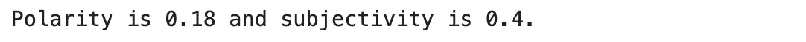

让我们看看这个例子，并尝试解释这些值。

```
sample
```

结果:

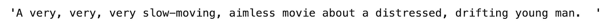

与其他字符串相比，解释这些结果更有意义，但是在没有这种比较的情况下，纯粹基于数字，让我们尝试解释这些结果。结果表明，我们的样本具有轻微的正极性(记住极性范围从-1 到 1，因此 0.18 将表示轻微的正极性)，并且相对主观，这具有直观的意义，因为这是某人描述他们对电影的主观体验的评论。

**问题 8:**

首先定义一个名为“token_count”的函数，该函数接受一个字符串，并使用“nltk”的单词标记器返回给定字符串中整数个标记。然后定义第二个名为“series_tokens”的函数，该函数接受 Pandas 系列对象作为参数，并将之前定义的“token_count”函数应用于给定的系列，返回给定系列的每行的整数个令牌。最后，在数据帧的前 10 行使用第二个函数并返回结果。

**回答:**

```
# Import libraries
from nltk import word_tokenize

# Define the first function that counts the number of tokens in a given string
def token_count(string):
    return len(word_tokenize(string))

# Define the second function that applies the token_count function to a given Pandas Series
def series_tokens(series):
    return series.apply(token_count)

# Apply the function to the top 10 rows of the dataframe
series_tokens(df.text.head(10))
```

结果:

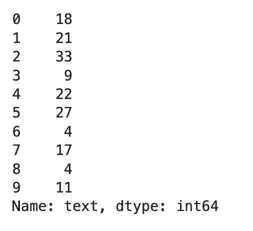

**问题 9:**

定义一个名为“series_polarity_subjectivity”的函数，该函数将问题 7 中定义的“polarity_subjectivity”函数应用于 Pandas 系列(以 dataframe 列的形式)并返回结果。然后使用数据帧前 10 行的函数来查看结果。

**回答:**

```
# Define the function
def series_polarity_subjectivity(series):
    return series.apply(polarity_subjectivity)

# Apply to the top 10 rows of the df['text']
series_polarity_subjectivity(df['text'].head(10))
```

结果:

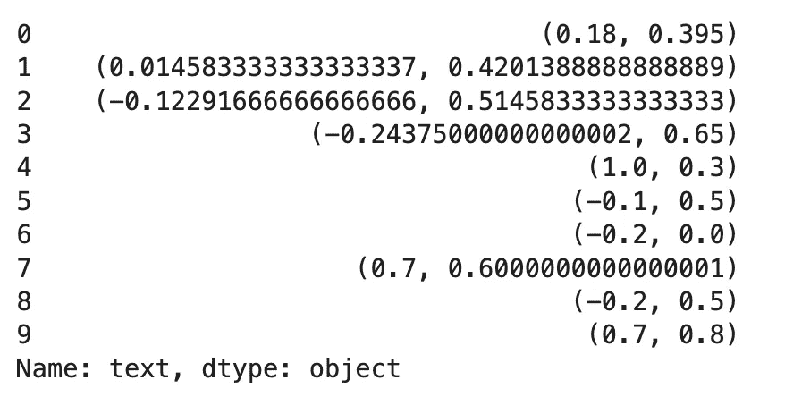

## 复杂性的度量——词汇多样性

顾名思义，词汇多样性是对给定文本中有多少不同词汇的度量，并被公式化地定义为唯一标记的数量占标记总数的比例。其思想是，文本中的词汇标记越多样化，文本就越复杂。让我们看一个例子。

问题 10:

定义一个“complexity”函数，该函数接受一个字符串作为参数，并返回词法复杂性得分，该得分定义为所有标记中唯一标记的数量。然后将该函数应用于数据帧的前 10 行。

**回答:**

```
def complexity(string):
    # Create a list of all tokens
    total_tokens = word_tokenize(string)

    # Create a set of all tokens (which only keeps unique values)
    unique_tokens = set(word_tokenize(string))

    # Return the complexity measure
    return len(unique_tokens) / len(total_tokens)

# Apply to the top 10 rows of the dataframe
df.text.head(10).apply(complexity)
```

结果:

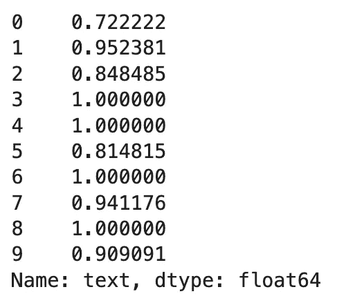

## 文本清理—停用词和非字母

如果你记得在问题 3 中，我们进行了频率分布，得到的 10 个最常见的表征如下:[('，'，4)，('非常'，3)，(' A '，1)，('缓慢移动'，1)，('漫无目的'，1)，('电影'，1)，('关于'，1)，(' A '，1)，('苦恼'，1)，('漂泊'，1)]

其中一些不是很有帮助，与其他标记相比被认为不太重要。例如，知道句号在给定的文本中很常见，可以获得多少信息？试图过滤掉这些不太重要的单词，以便将注意力集中在更重要的单词上，这种尝试被称为去除停用词。请注意，这些停用词没有统一的定义，这种指定纯粹是主观的。

让我们来看一些由`nltk`定义的英语停用词的例子:

```
# Import library
from nltk.corpus import stopwords

# Select only English stopwords
english_stop_words = stopwords.words('english')

# Print the first 20
print(english_stop_words[:20])
```

结果:

```
['i', 'me', 'my', 'myself', 'we', 'our', 'ours', 'ourselves', 'you', "you're", "you've", "you'll", "you'd", 'your', 'yours', 'yourself', 'yourselves', 'he', 'him', 'his']
```

**问题 11:**

定义一个名为" stopword_remover "的函数，该函数接受一个字符串作为参数，对输入字符串进行标记，删除英文的停用词(由`nltk`定义)，并返回不带停用词的标记。然后将该函数应用于数据帧的前 5 行。

**回答:**

```
def stopword_remover(string):
    # Tokenize the string
    tokens = word_tokenize(string)

    # Create a list of English stopwords
    english_stopwords = stopwords.words('english')

    # Return non-stopwords
    return [w for w in tokens if w.lower() not in english_stopwords]

# Apply to the top 5 rows of our df['text']
df.text.head(5).apply(stopword_remover)
```

结果:

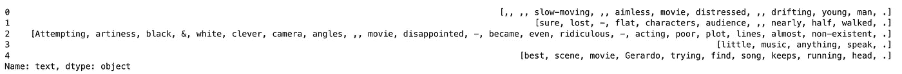

我们可以考虑过滤掉的另一组标记，类似于停用词，是非字母标记。顾名思义，非字母的例子有:`! % & # * $`(注意空格也被认为是非字母)。为了帮助识别什么被认为是字母，我们可以使用`isalpha()`，这是一个内置的 Python 函数，它检查给定字符串中的所有字符是否都是字母。让我们看几个例子来更好地理解这个概念:

```
string_1 = "TomAndJerryAreFun"
string_2 = "Tom&JerryAreFun"
string_3 = "TomAndJerryAreFun!"

print(f"String_1: {string_1.isalpha()}\n")
print(f"String_2: {string_2.isalpha()}\n")
print(f"String_3: {string_3.isalpha()}")
```

结果:

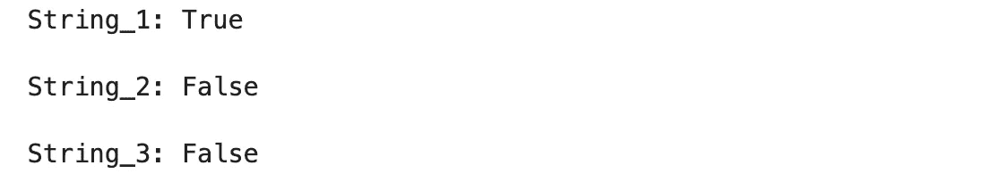

让我们来看看每一个，以便更好地理解发生了什么。第一个返回“True ”,表明该字符串只包含 alpabeticals。第二个返回“False”，这是因为“&”，第三个也返回“False”，由“！”驱动。

现在我们已经熟悉了`isalpha()`的工作方式，让我们在例子中使用它来进一步清理我们的数据。

**问题 12:**

定义一个名为“stopword_nonalpha_remover”的函数，该函数接受一个字符串作为参数，删除停用词(使用我们在上一个问题中定义的“stopword_remover”函数)和非字母字符，然后返回余数。将此函数应用于我们的数据帧的前 5 行，并与上一个问题的结果(仍包括非字母)进行视觉比较。

**答案:**

```
def stopword_nonalpha_remover(string):
    return [x for x in stopword_remover(string) if x.isalpha()]

df.text.head().apply(stopword_nonalpha_remover)
```

结果:

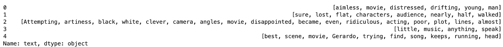

不出所料，除了停用词之外，非字母符号也被删除了。因此，与被移除的记号相比，预期具有更高重要性的记号。

在下一步中，我们将把我们到目前为止学到的所有东西放在一起，找出哪些评论具有最高的复杂性分数。

**问题 13:**

定义一个名为“complexity_cleaned”的函数，该函数接受一个序列并删除停用词和非字母(使用问题 12 中定义的函数)。然后在我们的 dataframe 中创建一个名为“complexity”的列，使用“complexity_cleaned”函数来计算复杂度。最后，返回数据帧中 10 个最大复杂度得分的行。

**回答:**

```
# Define the complexity_cleaned function
def complexity_cleaned(series):
    return series.apply(lambda x: complexity(' '.join(stopword_nonalpha_remover(x))))

# Add 'complexity' column to the dataframe
df['complexity'] = complexity_cleaned(df.text)

# Return top 10 highest complexity scores
df.sort_values('complexity', ascending = False).head(10)
```

结果:

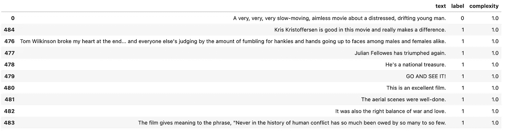

# 带练习题的笔记本

下面是带问题和答案的笔记本，您可以下载并练习。

# 结论

在这篇文章中，我们讨论了 once 如何利用机器学习模型从文本数据中提取信息，这些信息可用于在业务层面上做出决策，如业务方向甚至投资策略。然后，我们实施了情感分析技术，以了解这些机器学习模型如何工作，以及可以从这些文本数据中提取哪些信息。

# 感谢阅读！

如果你觉得这篇文章有帮助，请[在媒体](https://medium.com/@fmnobar)上关注我，订阅接收我的最新文章！