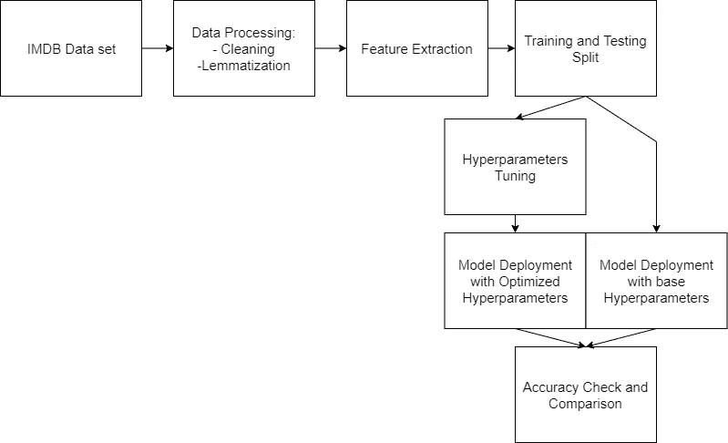
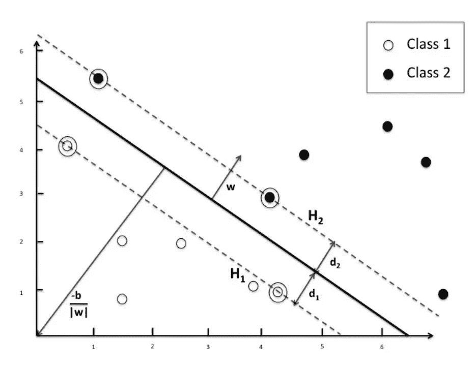

# 基于 Python 支持向量机模型的 IMDB 电影评论数据集的文本清洗和超参数优化

> 原文：<https://towardsdatascience.com/sentiment-analysis-on-a-imdb-movie-review-dataset-with-a-support-vector-machines-model-in-python-50c1d487327e>

## 基于文本处理技术和超参数优化的电影评论情感分析。


来自 Freepik.com[的免费矢量积分](https://www.freepik.com/free-vector/sentiment-analysis-concept-illustration_12832600.htm?query=sentiment%20analysis)

# 介绍

本文旨在部署一种称为“支持向量机”的机器学习模型，特别关注文本清理部分和超参数优化，这两种技术将最有可能提高模型的准确性。

在之前的一篇文章中，我们看到了如何通过使用两种特征提取器方法(如词袋和 Tf-idf)和朴素贝叶斯分类器对 [IMDB](https://www.kaggle.com/lakshmi25npathi/imdb-dataset-of-50k-movie-reviews) 电影评论数据集执行情感分析。虽然结果很有希望，但总有改进的余地，这是当前项目的最终目标。

在开始之前，我欠你一些有助于理解这个主题的基本定义。首先，理解什么是文本清理，或者定义为文本处理或文本操作是很重要的:

> *句子*通常表示为文本(字符串),而*文档*可以描述为句子的集合。在计算中，术语文本处理指的是自动创建或处理电子文本的理论和实践。

文本处理的目标是在实现机器学习模型之前消除文本中包含的所有多余信息，这有助于减少“噪声”,使算法更容易识别模式并提高其泛化能力。因此，正确应用的文本操作允许从业者提高计算效率。这一步最终将有助于支持向量机模型的部署及其超参数优化。



作者设计的系统由[图形编辑器](https://www.diagrameditor.com/)提供支持

# 数据

我们将要使用的数据是 50，000 行电影评论，您可以在这个[链接](https://www.kaggle.com/lakshmi25npathi/imdb-dataset-of-50k-movie-reviews)中找到。目标是通过在可用的行上训练它来产生一个高性能的情感分析器。如果你想回顾什么是情绪分析，我可以建议快速阅读[这篇文章](https://giovanni-valdata.medium.com/what-is-sentiment-analysis-and-what-are-the-top-two-tools-to-perform-it-in-python-da21e0c3cd3)，它涵盖了所有的基础知识。csv 文件的结构非常简单，它有两列，一列包含评论，另一列包含情感。一旦该模型将对测试部分的部分评论进行重新分类，我们将能够计算出有多少评论被正确分类，这表明了 SVM 模型的整体准确性。下面显示了一个示例评论的样子:

```
I thought this was a wonderful way to spend time on a too hot summer weekend, sitting in the air conditioned theater and watching a light-hearted comedy. The plot is simplistic, but the dialogue is witty and the characters are likable (even the well bread suspected serial killer). While some may be disappointed when they realize this is not Match Point 2: Risk Addiction, I thought it was proof that Woody Allen is still fully in control of the style many of us have grown to love.<br /><br />This was the most I'd laughed at one of Woody's comedies in years (dare I say a decade?). While I've never been impressed with Scarlet Johanson, in this she managed to tone down her "sexy" image and jumped right into a average, but spirited young woman.<br /><br />This may not be the crown jewel of his career, but it was wittier than "Devil Wears Prada" and more interesting than "Superman" a great comedy to go see with friends.
```

截至目前，一个算法要在所有评论中找到一条共同的路径是非常复杂的。这是由于三个主要因素:字符数、单词范围和特殊字符。前两个是直观的。关于第三个，如果你仔细观察，你可以发现 HTML 换行符“

”。这些以及括号、问号、逗号和句号都需要删除，因为它们没有添加任何关于情感的有趣信息。

# 文本处理

## 标记化

标记化将整个文档或句子分解成一串字符，以确保更有效的操作。例如，算法对空格、黑线或换行符不感兴趣。标记化过程的结果只有单词和标点。

## 词汇化和停用词

词汇化是将单词简化为它们的规范和基本形式。例如，动词 writing、writes、written 和 written 可以用单词 write 来表示，即相关的词条。变元化允许简化过程，算法可以引用单个单词而不是它的所有形式。另一方面，停用词指的是删除一些在情感计算中几乎没有价值的词。冠词“a”或“an”不表示任何积极或消极的情绪。

# 支持向量机

支持向量机算法是一种监督学习模型，具有分析数据以进行分类和回归分析的组合算法。它是由弗拉基米尔·瓦普尼克开发的，最初的想法可以追溯到 1979 年，就在自 1973 年以来持续时间相对较短的人工智能冬季结束之前。SVM 分类器是基于统计学习的非概率分类器。与每一个监督学习模型一样，SVM 需要标记数据来识别相关模式，只有这样，它才能部署在新记录上。SVM 的基础概念是线性可分二元分类。这意味着类别 1 和类别 2 之间的数据可以用一条直线来划分，这条直线称为超平面。最重要的是，支持向量机的特点是最大化第 1 类和第 2 类样本之间的空间，这是通过定义为向量的两条以上的线来识别的。



通过两个线性可分类的超平面(Appel，Chiclana，Carter 和 Fujita，2016)

支持向量机的潜在应用范围包括手写识别、入侵检测、人脸检测、电子邮件分类、基因分类和网页。支持向量机可以处理线性和非线性数据的分类和回归问题，这使得一个通用的 ml 算法。与其他算法相比，在处理具有大量特征的小数据集时，支持向量机的性能更好。

## 超参数

在定义超参数之前，定义一个“标准”参数是很重要的。当一个模型收敛时，我们可以说它找到了描述它所训练的数据的一般行为的最佳参数组合。在 SVM 模型的情况下，如果以下公式为真，我们可以将记录分类为阳性:

在负记录的情况下会发生相反的情况:

参数 **w、**和 **b** 确定新记录 **X** 将被分类为正还是负。 **X** 又称输入向量， **w** 为权重向量， **b** 为偏置。另一方面，超参数是从业者给予模型的外部配置，其值不能通过训练来估计。因此，可以修改超参数，以发现哪些组合导致更高的性能。

SVM 模型也不例外，它有两个主要的超参数，我们将用它们来优化预测过程:

*   c:逆正则化强度。正则化的强度与 C 成反比，它随着参数的增加而应用惩罚。它的作用是减少过度拟合。
*   内核:指定算法中使用的内核类型。有五个可能的选项:“线性”、“多边形”、“rbf”、“sigmoid”和“预计算”。每一种都有独特的特征。

# 代码部署

## 文本清洗和预处理

代码部署的第一部分将集中在文本清理过程的表面使用，事实上，有许多不同的技术可以应用。在这篇文章中，我们将指出对最有效的方法的更广泛的理解，例如词汇化和停用词消除:

*   导入库，如 pandas、re、nltk 和 bs4。请记住，在导入之前，请确保安装了所有这些软件包。
*   在 nltk.corpus 可以使用它们之前，需要下载停用词。因此，在运行整个脚本之前，请确保您运行了命令“***【nltk . download(' stop words ')***”和“***【nltk . download(' wordnet ')***”。
*   多亏了 pandas，csv 文件可以被导入并分配给 df 变量。编码必须是“Latin-1”以避免抛出错误。
*   此时，我们可以将情感列中包含的两个值映射为 1 和 0，而不是正数和负数
*   因此，我们可以设置停用词并将 WordNetLemmatizer()对象赋给 Lemmatizer 变量。
*   可以定义这个阶段的 clean_text 函数。库 *re* 提供了正则表达式匹配操作。总而言之，代码消除了 HTML 换行符和所有特殊字符。然后，文本只被转换成小写字母。词汇化过程应用于每个单词。作为最后一步，停用词被删除。
*   clean_text 函数最终应用于“review”列下的每一行，因为创建了一个名为“Processed Reviews”的新列。

每个评论最终都准备好接受 SVM 算法的处理。第一个主要部分的结果如下:

```
think wa wonderful way spend time hot summer weekend sit air condition theater watch light hearted comedy plot simplistic dialogue witty character likable even well bread suspect serial killer may disappoint realize match point 2 risk addiction think wa proof woody allen still fully control style many u grow love wa laugh one woody comedy year dare say decade never impress scarlet johanson manage tone sexy image jump right average spirit young woman may crown jewel career wa wittier devil wear prada interest superman great comedy go see friend
```

你可能会注意到，每个句号、逗号、问号或括号都被过滤掉了。没有代词，也没有换行符。通过完成文本处理的第一个主要步骤，我们降低了数据的复杂性。该模型现在需要处理的符号和不同的单词少了很多，这可能会在保持高精度的同时提高其泛化能力。

## 模型部署

以下代码显示了 SVM 模型的简单模型部署，用于计算模型的准确性，而无需进行超参数优化。

*   导入 sklearn 库及其子函数后，我们可以定义输入和目标变量。
*   在每个 ml 过程中，训练和测试拆分方法遵循第一步，在这种情况下，测试大小是数据集中记录的 20%，训练是剩余的 80%。
*   对于这个项目，我决定使用弓特征提取器及其基本参数。因此，计数矢量器创建一个字典，并根据字典准则转换 X_train 和 X_test 数据子集。
*   SVC()对象被分配给 SVM 变量以实例化该模型，然后该模型适合由脚本的训练部分的数据集提供的记录。
*   最后，我们可以运行命令 SVM.predict()，为测试部分在新记录上部署模型。分类报告通过在实际情感和预测情感之间进行比较，向用户提供关于准确性的信息。

最初的结果相当令人欣慰，通过在 5035 条负面评论和 4965 条正面评论上测试该算法，整体准确率达到 87%。与我们在[上一篇文章](https://medium.com/mlearning-ai/a-bow-vs-a-tfidf-feature-extractor-a-practical-application-on-a-na%C3%AFve-bayes-classifier-in-python-a68e8fb2248c)中采用的朴素贝叶斯方法相比，SVM 算法表现得更好。

```
precision    recall  f1-score   support

           0       0.89      0.86      0.87      5035
           1       0.86      0.89      0.87      4965

    accuracy                           0.87     10000
   macro avg       0.87      0.87      0.87     10000
weighted avg       0.87      0.87      0.87     10000
```

## 超参数优化

我们现在知道了矢量器和 SVM 模型的默认设置的整体精度。以下代码的目的是计算超参数的最佳组合，以提高模型性能:

*   我们可以从导入 sklearn 库的不同函数开始，比如 RepeatedStratifiedKfold、GridSearchCV、SVC、Pipeline 和 CountVectorizer。
*   然后我们可以创建一个管道。计算中的管道概念大多数时候指的是数据管道，它是一组数据处理元素，其中一个元素的输出是下一个元素的输入。管道的第一个元素是*计数矢量器()*，我们将其重命名为“vect”，而第二个元素是 *SVC()* 。非正式地说，我们需要一个管道来允许交叉验证过程。
*   构建参数列表，使得每个管道名称都与参数名称及其值相关联。例如，CountVectorizer 函数包括参数 max_df 和 ngram_range。vect__max_df 这个名称告诉我们，参数 max_df 与先前在管道部分中定义的“vect”相关联。
*   网格搜索结合了在管道和参数网格中找到的信息，以计算最大化 SVM 性能的超参数的最佳组合。当然，这个概念要复杂得多，将在以后的文章中讨论。到目前为止，我们只对代码的机制感兴趣。网格搜索计算我们数据中的每个超参数组合。当然，每次执行 50，000 次计算是很大的工作量，这就是为什么我在这个特定的场景中将行数减少到只有 5000。
*   最后一节通过报告平均精度和实现平均精度的超参数来组织和总结所有发现的结果。

代码运行了一个多小时，结果如下:

```
Best: 0.845663 using {'SVM__C': 50, 'SVM__kernel': 'rbf', 'vect__max_df': 0.5, 'vect__ngram_range': (1, 2)}
0.597360 (0.017354) with: {'SVM__C': 50, 'SVM__kernel': 'poly', 'vect__max_df': 0.1, 'vect__ngram_range': (1, 1)}
0.509796 (0.001329) with: {'SVM__C': 50, 'SVM__kernel': 'poly', 'vect__max_df': 0.1, 'vect__ngram_range': (1, 2)}
0.506197 (0.001325) with: {'SVM__C': 50, 'SVM__kernel': 'poly', 'vect__max_df': 0.1, 'vect__ngram_range': (1, 3)}
0.614556 (0.013541) with: {'SVM__C': 50, 'SVM__kernel': 'poly', 'vect__max_df': 0.2, 'vect__ngram_range': (1, 1)}
```

似乎最好的超参数是:

*   C=50
*   内核是 rbf 类型的
*   max_df = 0.5
*   ngram 的范围是(1，2)

仅在 5000 条记录上计算的准确率分数为 84.5%。当然，它比我们最初得到的要低。不过，这一次，与我们之前使用的 40，000 条记录相比，该模型的训练记录要少得多。因此解释了性能上的差异。现在是使用超参数调整在完整数据集上实施模型并重新检查最终得分的时候了。为了使用新的超参数运行模型，有必要进行代码实现:

*   "*count vect = count vector izer()*"将变成"*count vect = count vector izer(ngram _ range =(1，2)，max_df=0.5)* "因为我们告诉工具一次考虑两个单词的组(ngram)，并忽略出现在超过 50%的文档中的术语(max_df)
*   "*【SVM = SVC()*"将变成" *SVM = SVC(C = 50，内核= 'rbf')* "因为我们告诉 SVM 使用 50 作为 C 参数，rbf 作为内核。

代码运行了大约 1 小时 30 分钟后，结果如下:

```
precision    recall  f1-score   support

           0       0.90      0.87      0.88      5035
           1       0.87      0.90      0.89      4965

    accuracy                           0.88     10000
   macro avg       0.88      0.88      0.88     10000
weighted avg       0.88      0.88      0.88     10000
```

如您所见，精度仅提高了 0.01，从 0.87 提高到 0.88。值得计算吗？答案是:“看情况”。在这种情况下，该模型试图预测电影评论的情绪，88%的准确率和 87%的准确率非常接近。如果我们根据医疗条件来预测患者患糖尿病的概率，那么 88%的精确度是不够的。在之前的一篇文章中，我们使用相同的 IMDB 数据但不同的算法达到了 65%的准确率。仅仅通过改变分类器、执行文本清理和优化超参数，我们就看到了显著的提高。

最后一个测试告诉我们，一个潜在的评论说“这部电影真的很好，我想象不出更好的结局”，被算法正确地分类为[1](正面评论)，而一个负面的评论说“这部电影总体上很差，情节很无聊，人物诠释得很差”，得分为[0](负面评论)。一般来说，在从业者直接产生的数据上部署 ml 模型是一个好的实践，检查将立即暴露任何问题。

```
##Testing Algorithm on single sentences#Defining test sentences
test = ['The movie was really good, I could have not imagined a better ending']
test_1 = ['The movie was generally bad, the plot was boring and the characters badly interpreted']test = count_vect.transform(test).toarray()
test_1 = count_vect.transform(test_1).toarray()#Printing prediction
print(SVM.predict(test))
print(SVM.predict(test_1))output:
[1]
[0]
```

在我们结束之前，简单提醒一下。如果你已经读到这里，并且你觉得你理解了内容，试着把这作为你开始开发你自己的项目的一个信号。Kaggle 是一个惊人的平台，充满了等待探索和部署的大量数据集。怎么推荐都不为过。

# 结论

即使基本特征提取器和基本模型配置的准确度分数已经很高，超参数优化过程已经能够进一步提高它。和往常一样，机器学习让我惊讶的是，它可以比人类更快更有效地“学习”和分类记录。一个“简单”的统计算法在速度和准确性方面有可能取代人类，这确实令人惊讶。当然，也有局限性，但是技术最终可以让几乎每个人开发他们自己的模型并研究这个非凡的领域。

最后，如果您喜欢该内容，请考虑添加一个关注，以便在新文章发表时得到通知。如果你对这篇文章有什么要考虑的，写在评论里吧！我很想读读它们:)谢谢你的阅读！

*PS:如果你喜欢我写的东西，如果你能通过* [*这个链接*](https://giovanni-valdata.medium.com/membership) *订阅一个中等会员，那对我来说就是全世界。这是一种间接的支持我的方式，你会得到媒体文章提供的惊人价值！*

参考

[1]维基百科贡献者。(2022 年 3 月 9 日)。文本处理。检索于 2022 年 3 月 14 日，来自维基百科网站:[https://en.wikipedia.org/wiki/Text_processing](https://en.wikipedia.org/wiki/Text_processing)

[2]维基百科贡献者。(2022 年 3 月 12 日)。支持向量机。2022 年 3 月 20 日，从维基百科网站检索:[https://en.wikipedia.org/wiki/Support-vector_machine](https://en.wikipedia.org/wiki/Support-vector_machine)

[3]俄瑞斯忒斯·阿佩尔等人，“一种在句子层次上解决情感分析问题的混合方法”*基于知识的系统*108(2016):110–124。