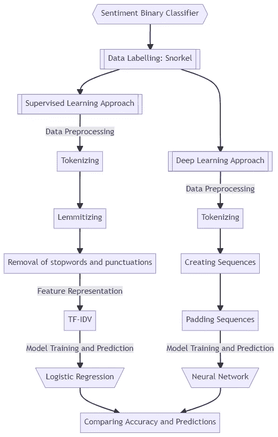
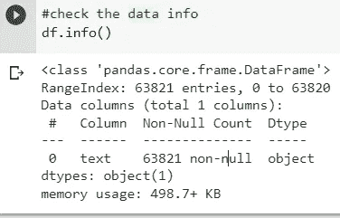
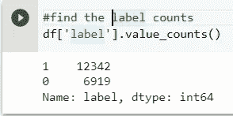
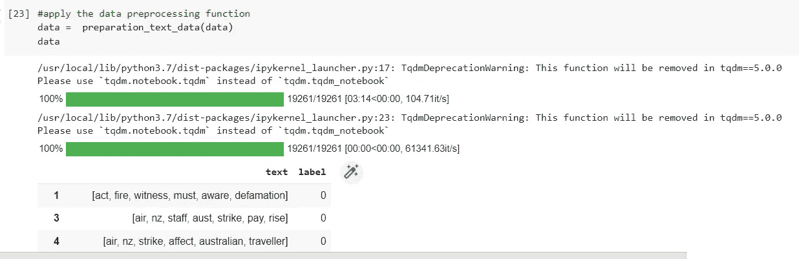
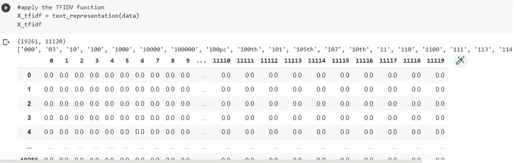
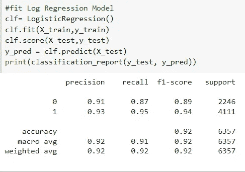
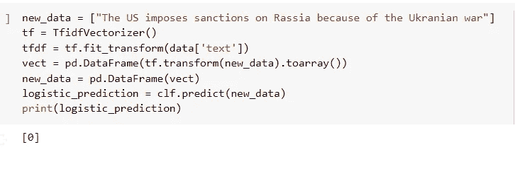
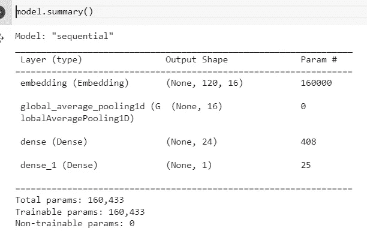
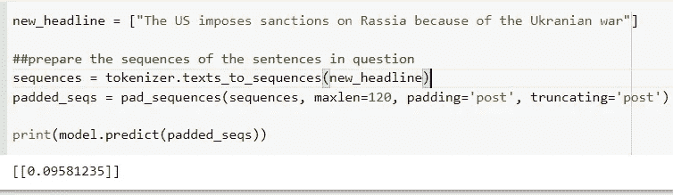

# 新闻标题的情感分析:经典监督学习与深度学习方法

> 原文：<https://towardsdatascience.com/sentiment-analysis-on-news-headlines-classic-supervised-learning-vs-deep-learning-approach-831ac698e276>

## 使用经典机器学习和深度学习技术开发二元分类器以检测正面和负面新闻标题的解释性指南


**图片取自** [**Unsplash**](https://unsplash.com/photos/Mwuod2cm8g4)

# 介绍

> 本文将使您能够构建一个二元分类器，使用两种不同的方法对**未标记的数据**执行情感分析:
> 
> 1-通过 **scikit-learn 库和 nlp 包进行监督学习**
> 
> 2-使用 **TensorFlow 和 Keras 框架的深度学习**

然而，挑战在于我们正在处理未标记的数据，因此我们将利用一种 ***弱监督技术*** 即 ***通气管*** 为我们的训练数据点创建标记 0(负)或 1(正)。

项目的视觉计划如下图所示:



**项目概述**

该项目中使用的数据集被称为“百万新闻标题”数据集，可在 [Kaggle](https://www.kaggle.com/therohk/million-headlines) 上获得。我也将使用谷歌 Colab，随时设置您的笔记本，复制和运行自己的代码。

```
#install needed packages
!pip install snorkel
!pip install textblob
#import libraries and modules
from google.colab import files
import io
import pandas as pd
#Snorkel
from snorkel.labeling import LabelingFunction
import re
from snorkel.preprocess import preprocessor
from textblob import TextBlob
from snorkel.labeling import PandasLFApplier
from snorkel.labeling.model import LabelModel
from snorkel.labeling import LFAnalysis
from snorkel.labeling import filter_unlabeled_dataframe
from snorkel.labeling import labeling_function
#NLP packages
import spacy
from nltk.corpus import stopwords
import string
import nltk
import nltk.tokenize
punc = string.punctuation
nltk.download('stopwords')
stop_words = set(stopwords.words('english'))
#Supervised learning
from tqdm import tqdm_notebook as tqdm
from sklearn.feature_extraction.text import TfidfVectorizer
from sklearn.model_selection import train_test_split
from sklearn.metrics import accuracy_score
from sklearn.linear_model import LogisticRegression
from sklearn.metrics import classification_report
##Deep learning libraries and APIs
import numpy as np
import tensorflow as tf
from tensorflow.keras.preprocessing.text import Tokenizer
from tensorflow.keras.preprocessing.sequence import pad_sequences
```

# 1.加载数据

```
#uplaod the data from your local directory
uploaded = files.upload()# store the dataset as a Pandas Dataframe
df = pd.read_csv(io.BytesIO(uploaded['data.csv']))#conduct some data cleaning
df = df.drop(['publish_date', 'Unnamed: 2'], axis=1)
df = df.rename(columns = {'headline_text': 'text'})
df['text'] = df['text'].astype(str)#check the data info
df.info()
```

在这里，我们可以检查我们的数据集有 63821 个实例。



**数据集信息**

# 2.创建标签:浮潜技术

> 因为数据集是无标签的，所以我们将使用 sluck，使用分配两类标签的函数来提出启发式和编程规则，这两类标签区分标题是正面的(1)还是负面的(0)。有关通气管标签的更多详情，请访问此[链接](https://www.snorkel.org/use-cases/01-spam-tutorial#3-writing-more-labeling-functions)。

下面，您可以找到生成的标签函数。第一个函数查看标题中的输入单词，第二个函数根据正面和负面列表中的预定义单词分配适当的标签。例如，如果“有前途”一词出现在标题中，那么它将被分配一个积极的标签，而“咄咄逼人”一词则导致一个消极的标签。

```
#define constants to represent the class labels :positive, negative, and abstain
POSITIVE = 1
NEGATIVE = 0
ABSTAIN = -1
#define function which looks into the input words to represent a proper label
def keyword_lookup(x, keywords, label):  
    if any(word in x.text.lower() for word in keywords):
        return label
    return ABSTAIN
#define function which assigns a correct label
def make_keyword_lf(keywords, label=POSITIVE):
    return LabelingFunction(
        name=f"keyword_{keywords[0]}",
        f=keyword_lookup,
        resources=dict(keywords=keywords, label=label))
#resource: [https://www.snorkel.org/use-cases/01-spam-tutorial#3-writing-more-labeling-functions](https://www.snorkel.org/use-cases/01-spam-tutorial#3-writing-more-labeling-functions)#these two lists can be further extended 
"""positive news might contain the following words' """
keyword_positive = make_keyword_lf(keywords=['boosts', 'great', 'develops', 'promising', 'ambitious', 'delighted', 'record', 'win', 'breakthrough', 'recover', 'achievement', 'peace', 'party', 'hope', 'flourish', 'respect', 'partnership', 'champion', 'positive', 'happy', 'bright', 'confident', 'encouraged', 'perfect', 'complete', 'assured' ])"""negative news might contain the following words"""
keyword_negative = make_keyword_lf(keywords=['war','solidiers', 'turmoil', 'injur','trouble', 'aggressive', 'killed', 'coup', 'evasion', 'strike', 'troops', 'dismisses', 'attacks', 'defeat', 'damage', 'dishonest', 'dead', 'fear', 'foul', 'fails', 'hostile', 'cuts', 'accusations', 'victims',  'death', 'unrest', 'fraud', 'dispute', 'destruction', 'battle', 'unhappy', 'bad', 'alarming', 'angry', 'anxious', 'dirty', 'pain', 'poison', 'unfair', 'unhealthy'
                                              ], label=NEGATIVE)
```

另一组标记功能通过 TextBlob 工具实现，这是一个预训练的情感分析器。我们将创建一个预处理程序，在我们的标题上运行 TextBlob，然后提取极性和主观性得分。

```
#set up a preprocessor function to determine polarity & subjectivity using textlob pretrained classifier 
[@preprocessor](http://twitter.com/preprocessor)(memoize=True)
def textblob_sentiment(x):
    scores = TextBlob(x.text)
    x.polarity = scores.sentiment.polarity
    x.subjectivity = scores.sentiment.subjectivity
    return x#find polarity
[@labeling_function](http://twitter.com/labeling_function)(pre=[textblob_sentiment])
def textblob_polarity(x):
    return POSITIVE if x.polarity > 0.6 else ABSTAIN#find subjectivity 
[@labeling_function](http://twitter.com/labeling_function)(pre=[textblob_sentiment])
def textblob_subjectivity(x):
    return POSITIVE if x.subjectivity >= 0.5 else ABSTAIN
```

下一步是组合所有的标记函数，并将其应用于我们的数据集。然后，我们拟合 label_model 来预测和生成正类和负类。

```
#combine all the labeling functions 
lfs = [keyword_positive, keyword_negative, textblob_polarity, textblob_subjectivity ]#apply the lfs on the dataframe
applier = PandasLFApplier(lfs=lfs)
L_snorkel = applier.apply(df=df)#apply the label model
label_model = LabelModel(cardinality=2, verbose=True)
#fit on the data
label_model.fit(L_snorkel)
#predict and create the labels
df["label"] = label_model.predict(L=L_snorkel)
```

我们可以注意到，在去掉未标记的数据点之后(如下所示)，我们有大约 12300 个正面标签和 6900 个负面标签，这将足以构建我们的情感分类器。

```
#Filtering out unlabeled data points
df= df.loc[df.label.isin([0,1]), :]#find the label counts 
df['label'].value_counts()
```



**正负标签**

# 3.应用监督学习方法:逻辑回归

> 我们将用来构建情感分类器的第一种方法是经典的监督方法，即**逻辑回归**，它被认为是一种强大的二元分类器，可以估计某个实例属于某个类别的概率，并相应地做出预测。但是，在训练模型之前，我们应该首先预处理数据并创建矢量表示。

## 3.1 文本预处理

预处理是自然语言处理中为训练准备文本数据的基本任务。它将原始文本的输入转换成作为单个单词或字符的净化标记。主要的预处理方法总结如下:

1- **标记化**:将单词拆分成标记

2- **词汇化**:将单词分解成它们的根格式

3- **去掉停用词:**去掉不必要的词，如 the、he、she 等。

4- **去掉标点符号**:去掉不重要的单词元素，如逗号、句号、括号、圆括号等。

```
#make a copy of the dataframe
data = df.copy()#define a function which handles the text preprocessing 
def preparation_text_data(data):
    """
    This pipeline prepares the text data, conducting the following steps:
    1) Tokenization
    2) Lemmatization
    4) Removal of stopwords
    5) Removal of punctuation
    """
    # initialize spacy object
    nlp = spacy.load('en_core_web_sm')
    # select raw text
    raw_text = data.text.values.tolist()
    # tokenize
    tokenized_text = [[nlp(i.lower().strip())] for i in tqdm(raw_text)]
    #define the punctuations and stop words
    punc = string.punctuation 
    stop_words = set(stopwords.words('english'))
    #lemmatize, remove stopwords and punctuationd
    corpus = []
    for doc in tqdm(tokenized_text):
        corpus.append([word.lemma_ for word in doc[0] if (word.lemma_ not in stop_words and word.lemma_ not in punc)])
    # add prepared data to df
    data["text"] = corpus
    return data#apply the data preprocessing function
data =  preparation_text_data(data)
```

我们可以在下图中注意到，数据已经被适当地清理，显示为单独的标记，每个标记都位于其原始词根，没有停用词和标点符号。



**文本准备结果**

## 3.2 文本表示

第二步包括将文本数据转换成 ML 模型可以理解的有意义的向量。我应用了 **TF-IDF(术语频率(TF) —逆密集频率(IDF))** ，它基于整个语料库中的单词出现次数为输入数据创建计数权重。

```
def text_representation(data):
  tfidf_vect = TfidfVectorizer()
  data['text'] = data['text'].apply(lambda text: " ".join(set(text)))
  X_tfidf = tfidf_vect.fit_transform(data['text'])
  print(X_tfidf.shape)
  print(tfidf_vect.get_feature_names())
  X_tfidf = pd.DataFrame(X_tfidf.toarray())
  return X_tfidf#apply the TFIDV function
X_tfidf = text_representation(data)
```

下面，我们可以找到 text_representation 函数的结果，由此我们可以看到单词已经被转换为有意义的向量。



**文本表示 TFIDV 结果**

## 3.3 模型培训

在这个阶段，我们准备建立和训练 ML 逻辑回归模型。我们将数据集分为训练和测试，我们拟合模型并根据数据点进行预测。我们可以发现该模型的**准确率为 92%。**

```
X= X_tfidf
y = data['label']
X_train, X_test, y_train, y_test = train_test_split(X, y, test_size=0.33, random_state=42)#fit Log Regression Model
clf= LogisticRegression()
clf.fit(X_train,y_train)
clf.score(X_test,y_test)
y_pred = clf.predict(X_test)
print(classification_report(y_test, y_pred))
```



**Logistic 回归分类报告**

## 3.4 预测新实例

> 我们可以预测如下所示的新实例，我们用新标题填充模型，我们预测标签在我们的示例中是负面的，因为我们传达的是战争和制裁。

```
new_data = ["The US imposes sanctions on Rassia because of the Ukranian war"]
tf = TfidfVectorizer()
tfdf = tf.fit_transform(data['text'])
vect = pd.DataFrame(tf.transform(new_data).toarray())
new_data = pd.DataFrame(vect)
logistic_prediction = clf.predict(new_data)
print(logistic_prediction)
```



**方法一:对新实例的预测**

# 4.深度学习方法:张量流和 Keras

> **神经网络**是一种深度学习算法，由多层互连的神经元组成，由激活函数提供动力。它考虑每个输入的加权和，然后对该和应用阶跃函数，并输出显示实例类的结果。

事实上，就深度学习而言， **Keras 和 TensorFlow** 是最受欢迎的框架之一。具体来说，Keras 是一个运行在 TensorFlow 之上的高级神经网络库，而 TensorFlow 是一个用于机器学习的端到端开源平台，由工具、库和其他资源组成，为工作流提供高级 API。

> 在我们的项目中，我们将利用 TensorFlow 来预处理数据，并使用**标记器类**填充数据，我们将使用 Keras 来加载和训练**顺序模型(神经网络)**，它适用于各层的简单堆叠，其中每层都有一个输入张量和一个输出张量。要了解更多关于顺序模型的信息，请访问此[链接](https://www.tensorflow.org/guide/keras/sequential_model)。

## 4.1 训练和测试分割

```
##store headlines and labels in respective lists
text = list(data['text'])
labels = list(data['label'])##sentences
training_text = text[0:15000]
testing_text = text[15000:]##labels
training_labels = labels[0:15000]
testing_labels = labels[15000:]
```

## 4.2 从张量设置记号化器，对数据进行预处理。

在这一步中，我们使用 tensorflow.keras 中的**单词标记器，使用 texs_to_sequences 实例**创建*单词编码*(具有键值对的字典)和*序列* **，然后我们*使用 **pad_sequences 实例填充这些序列***，使其长度相等。**

```
#preprocess 
tokenizer = Tokenizer(num_words=10000, oov_token= "<OOV>")
tokenizer.fit_on_texts(training_text)word_index = tokenizer.word_indextraining_sequences = tokenizer.texts_to_sequences(training_text)
training_padded = pad_sequences(training_sequences, maxlen=120, padding='post', truncating='post')testing_sequences = tokenizer.texts_to_sequences(testing_text)
testing_padded = pad_sequences(testing_sequences, maxlen=120, padding='post', truncating='post')# convert lists into numpy arrays to make it work with TensorFlow 
training_padded = np.array(training_padded)
training_labels = np.array(training_labels)
testing_padded = np.array(testing_padded)
testing_labels = np.array(testing_labels)
```

## 4.3 定义并训练**顺序模型**

我们使用 vocab 大小、嵌入维度和输入长度的**嵌入层**来构建模型。我们还添加了一个**密集层 RelU** ，它要求模型将实例分为正面或负面两类，以及另一个最终的 **sigmoid 层**，它输出 0 或 1 之间的概率。您可以简单地使用每一层中的超参数来提高模型性能。然后，我们用优化器和度量性能编译该模型，并在我们的数据集上训练它。

```
model = tf.keras.Sequential([
    tf.keras.layers.Embedding(10000, 16, input_length=120),
    tf.keras.layers.GlobalAveragePooling1D(),
    tf.keras.layers.Dense(24, activation='relu'),
    tf.keras.layers.Dense(1, activation='sigmoid')
])##compile the model
model.compile(loss='binary_crossentropy',optimizer='adam',metrics=['accuracy'])

model.summary()
```

我们可以在下图中看到，我们有 4 层，max_length 为 120，密集层节点为 16 和 24，以及 160，433 个可训练参数。



**顺序模型总结**

```
num_epochs = 10
history = model.fit(training_padded, 
                    training_labels, 
                    epochs=num_epochs, 
                    validation_data=(testing_padded, testing_labels), 
                    verbose=2)
```

我们可以进一步检查我们建立的具有 10 个运行时期的神经网络模型具有 99%的******非常好的准确性，减少验证损失并增加验证准确性**，这确保了强大的预测性能和泛化(过拟合)错误的低风险。****

********

******神经网络训练结果******

## ****4.4 预测新实例****

> ****现在，我们将使用这个特定的模型来预测同一个标题。同样，输出接近于零，这也表明这个标题是负面的。****

```
**new_headline = ["The US imposes sanctions on Rassia because of the Ukranian war"]##prepare the sequences of the sentences in question
sequences = tokenizer.texts_to_sequences(new_headline)
padded_seqs = pad_sequences(sequences, maxlen=120, padding='post', truncating='post')print(model.predict(padded_seqs))**
```

********

******方法二:对新实例的预测******

# ****5.结论****

****在本文中，我们建立了一个二元分类器来检测新闻标题的情感。然而，我们首先使用了一些启发式规则，使用 sluck 方法来创建分类负面和正面标题的标签。我们使用监督 ML 和深度学习方法创建了情感预测。这两种方法都成功地预测了新给定实例上的正确标题，并且对于逻辑回归和深度神经网络，它们都分别具有合理的 92%和 96%的高准确度分数。****

****你可能会问自己，在我的下一个数据科学预测任务中，哪种方法更好或更容易使用；然而，答案完全取决于项目的范围和复杂性以及数据的可用性，有时我们可能会选择使用 scikit-learn 中众所周知的算法的简单解决方案，预测系统利用数学直觉为给定的输入分配所需的输出值。另一方面，深度学习试图模仿人脑的功能，从给定的输入中执行规则(作为输出)。我们应该记住，神经网络通常需要大量的数据和高计算能力来完成任务。****

> ****我希望你喜欢阅读这篇文章，并期待更多丰富的文章，这些文章串联了我关于数据科学和机器学习主题的知识。****

# ****参考****

****[1]100 万条新闻标题，18 年间发布的新闻标题，许可 CCO: Public Domain， [Kaggle](https://www.kaggle.com/therohk/million-headlines)****