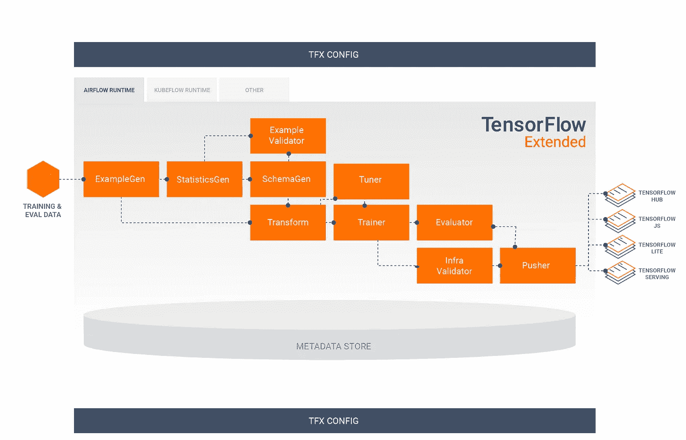
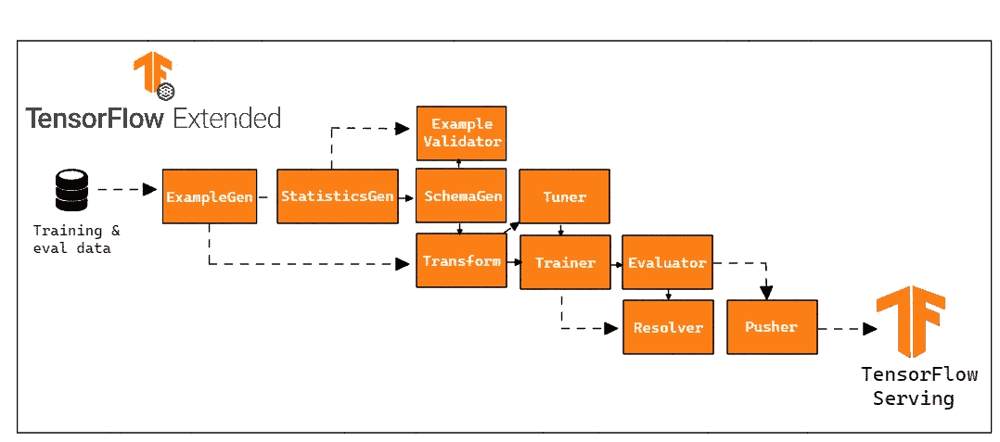
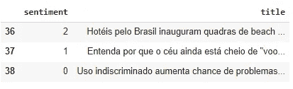
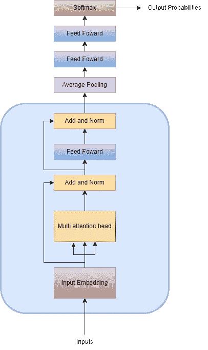
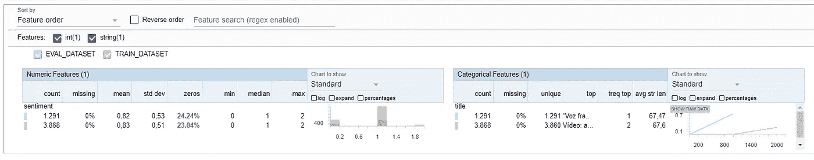

# TFX 管道的情感分析—本地部署

> 原文：<https://towardsdatascience.com/sentiment-analysis-with-tfx-pipelines-local-deploy-e9daa4cbde2a>

## **建立一个本地 TFX 管道，使用 Transformer 架构创建一个情感分析模型，并使用 TF 为该模型提供服务**


[西格蒙德](https://unsplash.com/@sigmund?utm_source=unsplash&utm_medium=referral&utm_content=creditCopyText)在 [Unsplash](https://unsplash.com/s/photos/pipelines?utm_source=unsplash&utm_medium=referral&utm_content=creditCopyText) 上拍照

# **1。简介**

在本文中，我们将介绍**构建管道来部署情感分析模型的过程。**

本文是两部分中的第一部分。在这一部分中，我们将讨论如何在本地运行我们的管道。在第二部分中，[使用 Vertex 和 AI 平台的 TFX 管道的 CI/CD](https://arturlunardi.medium.com/ci-cd-for-tfx-pipelines-with-vertex-and-ai-platform-c562452fba1)，我们将介绍如何使我们的模型在 [Google 云平台](https://cloud.google.com/) (GCP)上可用，以及如何开发我们的 CI/CD 管道。

完成本文后，您将能够:

*   创建情感分析模型
*   创建集成所有组件的管道
*   通过 REST API 在本地服务您的模型
*   分析您的管道元数据

整个应用程序的代码可以在这个 GitHub 存储库中找到[。](https://github.com/arturlunardi/sentiment-analysis-tfx)

# **2。TFX(张量流扩展)+ MLOps**

为了建立我们的管道，我们将使用 [TFX](https://www.tensorflow.org/tfx) 。

> 根据 TFX 用户指南，“TFX 是一个基于 TensorFlow 的谷歌生产规模的机器学习(ML)平台。它提供了一个配置框架和共享库，以集成定义、启动和监控您的机器学习系统所需的通用组件。”

根据迪·fante⁵的说法，mlops 中有三个非常重要的概念:

*   数据来源:你的数据来自哪里，它是如何产生的，提交了什么方法和过程。
*   **数据谱系**:到达流水线末端之前的步骤顺序。
*   **元数据:**描述数据的数据。它们用来解释我们所观察的物体的特征。

**这 3 个是生产模型中的关键部分，因为它们可以帮助你跟踪模型生命周期中发生的变化。生产模型有几个版本、文件和涉及的人员，所以使用能够轻松再现我们管道所处环境的框架是很重要的，比如 TFX。**

# **3。管道**

TFX 流水线是实现 ML 流水线的一系列组件，ML 流水线是专门为可扩展的高性能机器学习任务设计的。



**图一。** TFX 管道。这张图片复制自谷歌创作和分享的[作品，并根据](https://developers.google.com/readme/policies)[知识共享 4.0 归属许可](https://creativecommons.org/licenses/by/4.0/)中描述的条款使用。来源:[https://www.tensorflow.org/tfx/guide](https://www.tensorflow.org/tfx/guide)

每个组件负责 TFX 管道中的一项任务，很多时候，一个组件依赖于另一个组件的输出。TFX 有几个[教程](https://www.tensorflow.org/tfx/tutorials)解释如何使用[组件](https://www.tensorflow.org/tfx/guide?#tfx_standard_components)。

## **3.1 组件**

在我们的例子中，我们选择不使用 InfraValidator 组件。然而，我们选择在管道中增加一个节点， [Resolver](https://www.tensorflow.org/tfx/api_docs/python/tfx/v1/dsl/Resolver) 。Resolver 是一个特殊的 TFX 节点，它处理特殊工件的解析，在我们的例子中，它被用来指定 Evaluator 组件中的最后一个基本模型。



**图二。** TFX 地方管道(图片由作者提供)。这张图片是从谷歌创作和分享的[作品中复制的，并根据](https://developers.google.com/readme/policies)[知识共享 4.0 归属许可](https://creativecommons.org/licenses/by/4.0/)中描述的条款使用。来源:[https://www.tensorflow.org/tfx/guide](https://www.tensorflow.org/tfx/guide)

在 *run_pipeline.py* 中，我们定义了 TFX 管道。所有组件和参数都将位于该文件中。

## **3.1.1 示例生成**

它是管道的初始输入组件，处理并选择性地拆分输入数据集。使用外部来源的文件，如 CSV、TFRecord、Avro、Parquet 和 BigQuery。

## 统计数据生成

计算数据集统计数据。

## 3.1.3 方案

检查统计数据并创建数据模式。

## 示例验证器

在数据的训练和传递中查找异常和缺失值，例如检测数据偏差。

## **3.1.5 转换**

对数据集执行要素工程。在这个组件中，我们执行模型变量的所有转换/创建。该组件的一个重要之处在于，它生成一个存储数据全局属性的图表，这些属性将用于训练和推理，从而提供可靠性。

## **3.1.6 调谐器**

调整模型的超参数。调谐器可以在所有管道运行中运行，如果您只想不时地执行超参数调谐，也可以导入调谐器。

## **3.1.7 培训师**

训练模型。在这个组件中，除了定义它的整个架构之外，我们还指定了它将在哪里以及如何被训练。

## **3.1.8 分解器**

一个特殊的 TFX 节点，处理特殊工件的解析，在我们的例子中，它用于指定评估器组件中的最后一个基本模型。

## **3.1.9 评估员**

对培训结果进行深入分析，并帮助验证导出的模型，确保它们足够好，可以投入生产。在这个组件中，可以指定度量验证阈值，如果没有达到限制，就阻止模型投入生产。

## **3.1.10 推杆**

将模型部署到显示基础结构。这是我们指定模型将被服务的地方。

因此，我们的应用程序的结构是这样的:

```
│   run_local_pipe.ipynb
│
├───modules
│   │   label_encoder.pkl
│   │   model.py
│   │   preprocessing.py
│   │
│   ├───best_hyperparameters
│   │       best_hyperparameter.txt
│   │
│   └───data
│           data.csv
│
└───tfx-pipeline
    │   kubeflow_v2_runner.py
    │   local_runner.py
    │
    └───pipeline
        │   configs.py
        │   run_pipeline.py
```

在 ***tfx-pipeline*** 目录中，我们有引用编排器设置的文件。

*   *local _ runner . py*-定义本地运行管道的参数和变量
*   *kubeflow _ v2 _ runner . py*—定义参数和变量，使用 kube flow 作为编排器在本地/云运行管道

在***tfx-pipeline/pipeline***中我们有引用管道设置的文件

*   *configs.py* —定义全局应用程序设置，如管道名称和文件路径
*   *run _ pipeline . py*—TFX 管道的定义，所有组件和参数的定义

在 ***模块*** 中我们有参考模型构造的文件。

*   *label_encoder.pkl* —来自 sci-kit 的 LabelEncoder 对象学习编码/解码目标变量
*   *model.py* —构建分类模型(训练器组件)
*   *预处理. py* —变量的转换和预处理(转换组件)
*   *best _ hyperparameter . txt*-来自调谐器组件的文件，包含模型的超参数

最后，使用 *run_local_pipe.ipynb* ,除了分析生成的工件之外，我们还可以在本地创建和运行管道。

## **3.2 —模型建筑**

我们的模型是对[变压器](https://arxiv.org/abs/1706.03762)架构的改编。这种架构的最大区别是引入了*注意机制*，它分析输入序列并提供序列每个部分重要性的上下文。因此，与递归神经网络(RNN)不同，**这种架构允许数据并行化，减少了训练时间。**

该模型是用 TensorFlow 构建的，目标是将句子分类为肯定、否定或中性，因此**它是一个分类模型。**

在管道构建过程中，有两个非常重要的组件:Transform 和 Trainer。在我们的架构中，这些组件分别由文件 *preprocessing.py* 和 *model.py* 表示。让我们逐一解决这些问题，以理解变量的处理和模型的构建。

## **3.2.1 数据**

**我们的训练数据是葡萄牙语(PT-BR)** 的新闻标题，分类为:正面、负面或中性，已经通过 LabelEncoder 以数字格式表示。



**图三。**训练数据(图片由作者提供)。

## **3.2.2 预处理**

我们选择对输入数据执行一些转换。下面的函数说明了输入数据的变换。

重点是从输入字符串中删除重音符号、特殊字符、数字和停用词。

## **3.2.3 型号**

我们不会深入所有数据加载/训练函数的细节，因为它们已经在 TFX 教程中广泛演示过了。

我只想讨论定义模型的两个要点:架构和签名。

## **建筑**



**图 4。**模型建筑(图片由作者提供)。

由于**我们的模型是对原始架构**的改编，我们选择让它更简单。

我们的模型接受输入并将它们转换成嵌入，嵌入是句子的向量表示。之后，嵌入内容被传递到多头注意力层，多头注意力层将为句子中的每个单词创建向量，表示单词之间的重要性和上下文关系。归一化层用于帮助稳定梯度下降并帮助模型收敛。

最后，我们将输出传递给前馈网络(FFN)，这是一个简单的层，有助于将注意力向量转换为块之间可消化的形式。我们添加了几个类似的层，直到我们定义了输出层，由 softmax 函数激活，它输出一个概率向量，涉及目标变量的 3 个类别。

这样，我们的模型构造如下:

## **签名**

当使机器学习模型可用时，我们需要考虑我们的模型将如何接收数据进行预测。TensorFlow 模型具有 [SavedModel](https://www.tensorflow.org/guide/saved_model) 格式，它允许我们创建几个签名来定义我们的模型将如何接收数据并做出可用的预测。

因此，我们**创建了一个签名，它接受字符串形式的输入**，而不是最初的 TFX 示例，它期望数据为 [tf.train.Example](https://www.tensorflow.org/api_docs/python/tf/train/Example) 格式。我们的**签名的输出返回每个类的概率，具有最高概率的类，以及最高预测概率的值。**

然后，我们定义模型的签名。在预测时，我们可以选择我们想要的签名，因此我们的模型可以接受几种数据格式。

# **4。本地部署**

最后，我们可以运行我们的管道。 *run_local_pipe.ipynb* 笔记本是为我们创建、运行和分析我们的管道而制作的。

我们使用 TFX-cli 创建管道，将本地引擎和所需文件的路径作为参数传递，在这个文件中是 *local_runner.py* 。

最后，我们可以运行它。

现在，我们的所有组件都将运行，我们的模型可用于预测。

# **5。为模型提供 TensorFlow 服务**

有几种方法可以为预测模型提供服务，其中一种是 TensorFlow 服务。

> TensorFlow Serving 是一个灵活、高性能的机器学习模型服务系统，专为生产环境而设计。TensorFlow 服务可以轻松部署新的算法和实验，同时保持相同的服务器架构和 API。TensorFlow 服务提供了与 TensorFlow 模型的现成集成，但可以轻松扩展为服务于其他类型的模型和数据。⁴

首先，我们定义模型的位置，并下载 TF 服务包。

然后我们开始 TensorFlow 服务。这里我们定义一些重要的参数:

-***rest _ API _ port***:将用于 REST 请求的端口。

- ***model_name*** :您将在 REST 请求的 URL 中使用这个。什么都有可能。

-***model _ base _ path***:这是你保存模型的目录路径。

## **5.1 提出休息请求**

我们现在准备提出请求。我们加载我们的编码器来根据训练转换我们的目标变量，我们定义 url、我们的签名和我们想要预测的数据。然后，我们向我们的服务器发出一个 POST 预测请求，它会返回每个实例参与目标类的概率、预测的类以及最高预测概率的值。

# **6。评估管道工件**

TFX 管道组件的输出被称为工件。这些工件注册在元数据存储库中，我们在设置中定义它。这些工件中的一些可以用图形可视化，它们为我们的数据提供了有价值的见解。

**我们可以通过我们的元数据存储库访问由我们的管道产生的工件。**我们还可以过滤特定类型的赝像，以可视化和定义这些赝像的输出路径。

从这些人工制品中，我们可以形象地展示它们。例如，让我们来看看统计结果。

然后，我们可以并排查看训练和验证数据统计。



**图 5。** StatisticsGen(图片由作者提供)。

# **7。结论**

开发本地管道是集成我们的应用程序并能够标准化我们模型的训练和推理的第一步。为了改进我们的管道，在本文的第 2 部分中，除了应用 CI/CD 实践之外，我们将在云环境中开发和部署它，使它可扩展并且更易于维护。

# **8。参考文献**

[1][**《TFX 用户指南》**](https://www.tensorflow.org/tfx/guide)(2021 年 9 月 01 日)，TensorFlow。

[2]瓦斯瓦尼，a；新泽西州沙泽尔、新泽西州帕尔马；Uszkoreit，j；琼斯湖；戈麦斯。凯泽湖；Polosukhin，I. [**注意力是你所需要的全部。**](https://arxiv.org/abs/1706.03762v5)(2017 年 6 月 12 日)，arXiv 预印本 arXiv:1706.03762。

[3]南丹，A. [**文字分类用变压器**](https://keras.io/examples/nlp/text_classification_with_transformer/)(2020 年 5 月 10 日)，Keras。

【4】[**TF 服役**](https://www.tensorflow.org/tfx/guide/serving)(2021 年 1 月 28 日)，TensorFlow。

[5]迪凡特，A. L. [**我如何部署我的第一个机器学习模型**](/how-i-deployed-my-first-machine-learning-model-1147c04c449b)(2021 年 12 月 15 日)，中。

[6] Amoateng，D. [**文本分类管道 tfx local**](https://github.com/amoat7/Text_classification_pipeline_tfx_local)(2022 年 1 月 1 日)，GitHub。