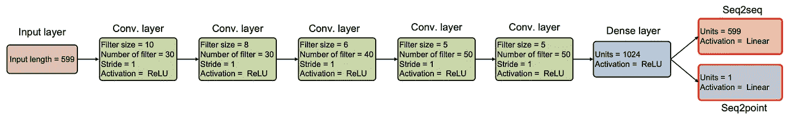
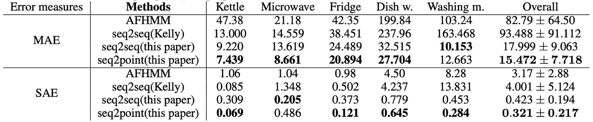
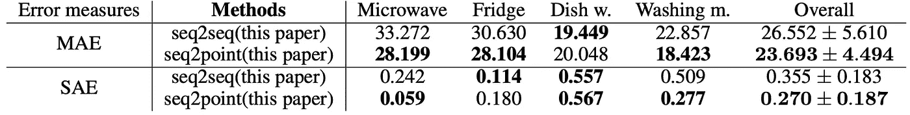

# NILM 的序列点到点神经网络

> 原文：<https://towardsdatascience.com/sequence-to-point-neural-network-for-nilm-6719584fa21f>

## NILM 的深度学习

## 用于序列建模的 CNN？让我们看看它进展如何

里卡多·安南达尔在 [Unsplash](https://unsplash.com/s/photos/energy?utm_source=unsplash&utm_medium=referral&utm_content=creditCopyText) 上拍摄的照片

## 介绍

N ILM(非侵入式负载监控)是了解客户行为和构建可扩展基础设施解决方案的重要流程之一。NILM 最基本的使用案例是让最终用户更好地了解他们自己家庭的能源消耗。这反过来有助于用户养成更好的消费习惯，从而减少 5-10%的消费。到目前为止，我们已经看到了许多深度学习方法，包括 hmm、RNNs、LSTMs、GRUs 和 Transformers，它们属于序列建模领域，主要依赖于移动滑动窗口来捕获模式以获得分解结果。

## NILM 的主要应用

1.  识别节能机会:通过提供单个设备的电力消耗的详细信息，NILM 可以帮助识别减少能源使用的机会。例如，如果某个特定设备使用的能源超出预期，则可能会切换到更节能的型号，或者减少该设备的使用频率
2.  支持需求侧管理:NILM 可用于支持需求侧管理，这涉及控制电力需求，以提高电网的效率。通过提供关于单个电器的电力消耗的实时信息，NILM 可以帮助公用事业公司更好地管理需求，避免电网过载
3.  加强能源审计:能源审计用于评估建筑物或其他设施的能源效率。通过纳入 NILM 数据，能源审计可以提供更详细和准确的能源使用分析，这有助于确定可以改进的具体领域。

## 背景

一个流行的序列建模体系结构 Seq2Seq [1]主导了该领域的大部分任务。在用于 NILM 的 Seq2Seq 型架构中，输入功率序列的滑动窗口将学习对应于电器的输出功率的滑动窗口。这里的问题有三个方面，

1.  作为滑动窗口过程的一部分，输出窗口元素被计算多次
2.  特定的几个滑动窗口可能接近更好的结果
3.  计算成本高

Seq2Point [2]提出通过从序列输入窗口输出单个值(输出窗口的中点)来解决主要瓶颈。让我们深入了解一下 Seq2Point 架构是如何将之前工作的错误率降低了大约 83%的。

## 理念与建筑

Seq2Point 架构蓝图。图片致谢— Seq2Point [论文](https://arxiv.org/abs/1612.09106)

Seq2Point 的想法是，对于输入窗口，输出将是目标设备窗口的相应中点元素。然而，有一个重要的潜在假设:“中点元素被表示为电源输入窗口的非线性回归”。此假设基于设备窗口的中点元素(输出),并应考虑周围信息，即设备活动之前和之后的信息。

为了训练它，输出序列的两端都用零填充，以处理序列的端点。Seq2Point 的主要区别在于，将有一个单一的绝对输出 x(t ),而不是来自窗口的平滑(平均)预测。

## 成果和基准

UK-DALE [3]和 REDD [4]是为培训选择的数据集，Seq2Point 与 Seq2Seq 进行了比较，以进行基准测试和分析。

在基于 NILM 的神经网络中，数据必须仔细准备。基于序列长度(599 个时间戳)选择输入电源序列，输出是目标序列中的中点元素。序列窗口内的值被归一化。

关于评估指标，MAE(平均绝对误差)用于计算每个时间戳 t 的误差，归一化 SAE(信号绝对误差)用于计算较长时间内的总能量误差。

各种器械的 MAE 和 SAE 错误率的比较。图片致谢— Seq2Point [论文](https://arxiv.org/abs/1612.09106)

类似的比较，但侧重于 Seq2Point 和 Seq2Seq，使用 Seq2Point 论文中的方法。图片致谢— Seq2Point [论文](https://arxiv.org/abs/1612.09106)

从上表中可以看出，在大多数选定的设备上，Seq2Point 的性能远远优于 Seq2Seq 和 AFHMM。

## 我的想法

当我浏览特征图和为观察对网络如何学习特征的理解而进行的消融研究时，我对网络学习特征的程度感到吃惊。卷积神经网络再次表明它是最好的特征提取器/模式发现器之一。有几组滤波器拾取振幅变化，还有几组滤波器专注于状态变化。令人惊讶的是，它能够了解每个设备状态变化的持续时间！

请阅读 Seq2Point 白皮书的潜在特征可视化部分。

## NILM 的真实例子

Open Energy Monitor 是一个开源的 NILM 系统，设计用于住宅和商业环境。它使用传感器来监控单个设备的电力消耗，并为用户提供有关其能源使用的详细信息。这使得用户能够找到降低能耗的方法，并随时监控他们的进度。

能源检测(TED)是一个为住宅设计的 NILM 系统。它使用传感器来监控单个设备的电力消耗，并为用户提供有关其能源使用情况的实时信息。这使得用户可以确定哪些电器使用最多的能源，并采取措施减少其能源消耗。

## 结论

Seq2Point 是 NILM 研究领域的一大亮点，因为其简化的架构带来了巨大的成果。使用的数据集是真实的，暗示了在真实场景中的可能部署，并创造了商业价值。它优于 Seq2Seq(序列建模中事实上的 boss ),也解释了网络的特征和行为。

***加成*** :这里是 Seq2Point 在 TensorFlow 中的实现——【https://github.com/MingjunZhong/seq2point-nilm】T4

## 参考

[1]seq 2 seq:[https://arxiv.org/abs/1409.3215](https://arxiv.org/abs/1409.3215)

[2]seq 2 point:[https://arxiv.org/abs/1612.09106](https://arxiv.org/pdf/1612.09106.pdf)

[3]英国-戴尔:[https://jack-kelly.com/data/](https://jack-kelly.com/data/)

[4]REDD:[https://energy . duke . edu/content/reference-energy-disaggregation-data-set-REDD](https://energy.duke.edu/content/reference-energy-disaggregation-data-set-redd)

*原载于*[*https://blog.plexflo.com*](https://blog.plexflo.com/sequence-to-point-neural-networks-for-nilm)*。*