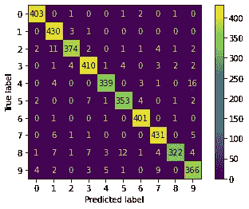
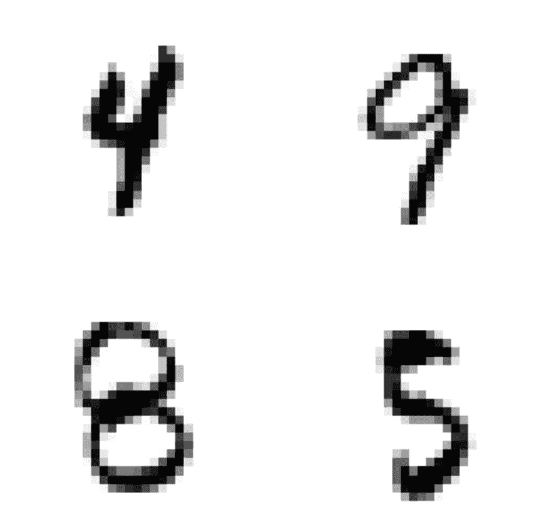
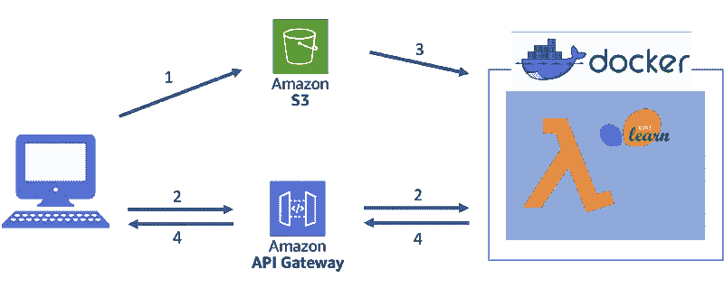
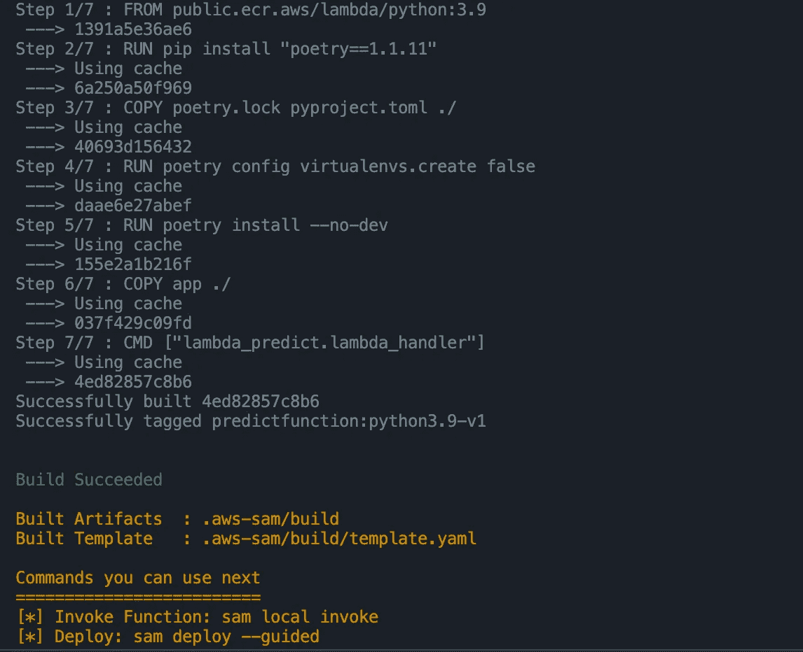
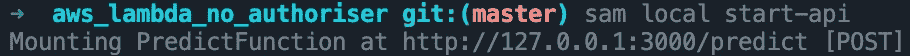
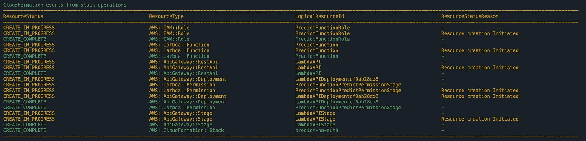
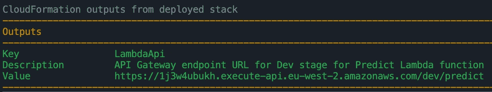

# AWS Lambda 上机器学习模型的无服务器部署

> 原文：<https://towardsdatascience.com/serverless-deployment-of-machine-learning-models-on-aws-lambda-5bd1ca9b5c42>

## 在 AWS Lambda 上部署 dockerised ML 模型的指南


[钳工](https://unsplash.com/@benchaccounting?utm_source=medium&utm_medium=referral)在 [Unsplash](https://unsplash.com?utm_source=medium&utm_medium=referral) 上拍照

# 介绍

在我之前的[指南](/deploying-docker-containerised-ml-models-on-aws-elastic-beanstalk-67cbfbb2def4)中，我们探讨了在 AWS Elastic Beanstalk 上部署机器学习模型的概念和方法。尽管在很大程度上是自动化的，但像 AWS Elastic Beanstalk 这样的服务仍然需要部署 EC2 实例和弹性负载平衡器这样的关键服务。AWS Elastic Beanstalk 上提供的资源总是活动的，即使不需要。

通过消除基础设施管理任务，无服务器代码编排的概念脱离了云计算资源的传统实现。无服务器云计算是在 Elastic Beanstalk 上提供的免手动基础设施管理方法的演变，但没有服务器的供应或管理。

无服务器计算是一种事件驱动的计算服务，可以为几乎任何应用程序运行代码。由于开发人员不需要管理基础设施，代码的无服务器实现具有提高生产率的好处，因为开发人员可以花更多的时间编写代码。最终，无服务器功能是无状态的，只在你需要的时候执行。这使得它们成为许多应用的高性价比解决方案。

在本指南中，我们将学习如何将机器学习模型部署为 lambda 函数，即 AWS 提供的无服务器产品。我们将首先通过在我们的机器上集成 AWS CLI 来设置工作环境。接下来，我们将训练一个 K 近邻分类器，我们将把它部署为 docker 容器。本指南将带您浏览您需要的工具，使您能够在将应用程序部署为 AWS 上的 lambda 函数之前，在本地测试您的应用程序。

我们开始吧。

# 内容

*   先决条件
*   MNIST 数据集简介
*   训练 K-最近邻(KNN)分类器
*   初始化 AWS S3 存储桶
*   使用 SAM 部署和测试 AWS lambda 函数
*   AWS 资源终止
*   摘要

# 先决条件

在继续之前，您需要满足几个先决条件。本指南将要求您与许多工具进行交互，因此请花一些时间来满足这些先决条件。

1.  你需要一个 [AWS](https://aws.amazon.com/free) 账户。您可以注册免费层，该层将在注册时自动应用。
2.  导航命令行的一些技术知识。
3.  安装 [AWS CLI](https://docs.aws.amazon.com/cli/latest/userguide/getting-started-install.html)
4.  [设置 AWS CLI](https://medium.com/@lloyd.hamilton/setting-up-aws-cli-credentials-65d0a5fc0c4e)
5.  安装 [AWS 无服务器应用模型 CLI](https://docs.aws.amazon.com/serverless-application-model/latest/developerguide/serverless-sam-cli-install.html)
6.  安装[码头工人](https://docs.docker.com/get-docker/)
7.  [Python 3.9.7](https://www.python.org/downloads/release/python-397/)
8.  [VS 代码](https://code.visualstudio.com)与 [Jupyter 扩展](https://marketplace.visualstudio.com/items?itemName=ms-toolsai.jupyter)或任何你喜欢的 IDE。
9.  诗歌——Python 包管理工具(阅读我的[上一篇关于如何使用诗歌的文章](https://python.plainenglish.io/poetic-simplification-of-python-virtual-environments-dc2ebf12b1a4)
10.  Python 库:scikit-learn、numpy、requests、pandas、joblib、boto3、matplotlib、py toolter、jupyter、ipykernel。您可以使用 poem 安装我当前的 python 版本，或者将`requirements.txt`文件包含在 Git 存储库中。
11.  这个项目的项目存储库在这里被链接[。代码的主体可以在 Jupyter 笔记本中找到，链接](https://github.com/lloydhamilton/aws_lambda_no_authoriser)[这里](https://github.com/lloydhamilton/aws_lambda_no_authoriser/blob/master/deploying_lambda.ipynb)。

# 概观

本指南的目的是向您介绍在 AWS 上将机器学习模型部署为 lambda 函数所需的步骤。本指南记录了部署 lambda 函数所需的关键工具。这是我们将在这个项目中涵盖的内容的概述。

*   在用于部署的 MNIST 数据集上训练 K-最近邻分类器。
*   将 S3 存储桶初始化为数据存储。
*   使用 AWS 无服务器应用程序模型(SAM)对 dockerised lambda 函数进行本地测试。
*   使用 AWS SAM 部署云形成堆栈。

# 1.MNIST 数据简介

对于这个分类项目，我们将使用包含 70，000 张手写数字图像的 [MNIST](https://en.wikipedia.org/wiki/MNIST_database) 数据集。在该数据集中，每行代表一幅图像，每列代表 28×28 像素图像中的一个像素。MNIST 数据集被广泛用于训练分类器，并且可以使用辅助函数`[sklearn.datasets.fetch_openml](http://scikit-learn.org/stable/modules/generated/sklearn.datasets.fetch_openml.html)`来获取。来自 OpenML 的所有数据都是免费使用的，包括所有的经验数据和元数据，在[CC-BY license](http://creativecommons.org/licenses/by/4.0/)下许可使用。

这个项目的所有代码都可以在 Jupyter 笔记本中找到，`deploying_models.ipynb`，从 github repo 链接[这里](https://github.com/lloydhamilton/aws_lambda_no_authoriser)。

```
aws_lambda_no_authoriser
├── app
│   ├── lambda_predict.py
│   └── knnclf.joblib
├── .gitignore
├── Dockerfile
├── LICENSE
├── deploying_lambda.html
├── deploying_lambda.ipynb
├── overview.png
├── poetry.lock
├── pyproject.toml
├── requirements.txt
└── template_no_auth.yaml
```

下面的代码将下载 MNIST 数据，并对 20，000 行进行采样。该数据集已经过缩减，以减少该项目的模型大小和构建时间。下面的代码还将绘制数据集中的第一幅图像，我们可以看到它是数字 8。


绘图输出显示第一个图像是手写的数字 8。(图片由作者提供)

# 2.训练 K-最近邻分类器

首先，我们将把数据分成训练集和测试集，然后使用`scikit-learn`库训练一个 K 近邻分类器。

通过交叉验证，该模型达到了相当不错的 96%的平均准确率。让我们在`test_features`数据集上评估模型的性能，并使用`show_cm`函数绘制一个混淆矩阵，如下所示。



准确度:0.95725(图片由作者提供)

基于测试数据集的准确性，我们可以看到我们的模型符合数据。当比较训练集和测试集之间的准确性时，我们得到了非常相似的预测准确性。

此外，如上图所示的混淆矩阵非常有助于可视化模型性能的差距。这将有助于我们理解分类器所犯的错误。

该矩阵表明，在 16 个例子中，数字 4 被误认为数字 9，在 12 个例子中，数字 8 被误认为数字 5。

看下面的图片，可能会明白为什么会出现这些错误，因为数字 4 和 9 确实有一些相似的特征。数字 8 和 5 也是如此。



作者图片

这一见解不会影响 AWS 上的模型部署，但将有助于指导进一步改进模型的策略。

现在，我们将使用 Docker 将模型保存在本地，作为 lambda 函数的一部分进行封装。

# 3.初始化 AWS S3 存储桶

下图展示了支持 lambda 函数所需部署的整体资源基础设施。我们的应用程序有三个关键的资源要求:

1.  **S3 桶**用来存储数据。
2.  **API 网关**管理 HTTP 请求。
3.  **λ函数**包含预测逻辑。



ML 模型的无服务器部署——1)测试数据上传到 S3 桶。2)为了启动 lambda 函数，通过 Amazon API 网关发送一个 POST HTTP 请求。lambda 函数的初始化执行从 S3 桶下载数据并执行预测的代码。4)HTTP 响应返回给客户端，预测作为数据有效载荷。(图片由作者提供)

Lambda 函数将包含基于存储在 S3 存储桶中的`test_features`数据集执行预测的 Python 代码。因此，我们将首先需要初始化一个 S3 桶，在那里我们可以托管我们的数据。

为此，我们将使用 AWS Python SDK `boto3`与 AWS 进行交互。这个包包含了我们集成 Python 项目和 AWS 所需的所有依赖项。

让我们用下面的代码初始化一个 S3 桶。

***注意:****`*bucket_name*`*必须是唯一的，因此您必须用一个未被采用的名称替换* `*bucket_name*` *。**

*S3 存储桶将托管我们的`test_features`数据集，我们可以在 lambda 函数中调用该数据集来执行预测。*

*为了保存当前在我们工作区中的对象，我们将使用来自`io`库的`BytesIO`函数。这将使我们能够在文件对象中临时存储`test_features`数据集。这个文件对象可以通过调用`.upload_fileobj`函数上传到 S3 桶。*

*`bucket`变量定义目标 S3 桶，而`key`变量将定义桶中的文件路径。`bucket`和`key`变量将构成对 lambda 函数的 POST HTTP 请求中的数据有效载荷的一部分。*

*我们可以用下面的帮助函数检查对象是否已经上传。`list_s3_objects`将列出定义的桶中的所有对象。*

*输出:`[‘validation/test_features.joblib’]`*

*我们现在已经成功初始化了一个 S3 存储桶来存储`test_feature`数据。接下来的两个关键资源，API 网关和 lambda 函数，将使用 AWS 无服务器应用模型(SAM)进行部署。*

# *4.使用 SAM 部署和测试 AWS Lambda 函数*

*[AWS SAM](https://aws.amazon.com/serverless/sam/) 是一个用于构建无服务器应用的开源框架。它是一个工具，通过提供简单的语法在 AWS 上部署功能、API 或数据库，简化了无服务器架构的构建过程。SAM 是一个平台，它将快速部署无服务器应用程序所需的所有工具统一在一个 YAML 配置文件中。*

*还有其他选项，例如[无服务器](https://www.serverless.com)，这是一个很好的选项。无服务器具有作为通用云接口(AWS、Azure、Google Cloud)的额外优势，以增加多功能性。然而，我个人发现在 AWS SAM 上本地集成和测试 docker 容器比在无服务器上更好。我很好奇是否有人有不同的意见！一定要留个便条。*

*这是当前项目的整体文件夹结构，可以在 github [这里](https://github.com/lloydhamilton/aws_lambda_no_authoriser)找到。*

```
*aws_lambda_no_authoriser
├── app
│   ├── lambda_predict.py
│   └── knnclf.joblib
├── .gitignore
├── Dockerfile
├── LICENSE
├── deploying_lambda.html
├── deploying_lambda.ipynb
├── overview.png
├── poetry.lock
├── pyproject.toml
├── requirements.txt
└── template_no_auth.yaml*
```

*在下面的部分中，我将专门讨论三个重要的文件。*

1.  *详细说明 SAM 配置的`.yaml`文件。(`template_no_auth.yaml`)*
2.  *一个包含 lambda 函数代码的`.py`文件。(`lambda_predict.py`)*
3.  *一个`Dockerfile`详细描述了封装我们的 lambda 函数的代码。(`Dockerfile`)*

## *`4.1\. template_no_auth.yaml`*

*`template_no_auth.yaml`定义了构建无服务器应用程序所需的所有代码。你可以在这里找到模板规范[的官方文档。](https://docs.aws.amazon.com/serverless-application-model/latest/developerguide/sam-specification.html)*

****注:*** *该当前模板不包括执行 API 请求的服务器端认证的资源。因此，在当前状态下部署我们的 lambda 函数将允许任何人使用 URL 向您的函数发出请求。**

*让我们仔细看看模板文件，以便更好地理解正在定义的配置。我将它分成三个部分，并在标题中链接了每个声明的相应文档。*

```
*AWSTemplateFormatVersion: "2010-09-09"
Transform: AWS::Serverless-2016-10-31
Globals:
   Function:
      Timeout: 50
      MemorySize: 5000
   Api:
      OpenApiVersion: 3.0.1
Parameters:
   Stage:
      Type: String
      Default: dev*
```

*`AWSTemplateFormatVersion`*

*最新的模板格式版本是`2010-09-09`，是目前唯一的有效值。*

*`[Transform](https://docs.aws.amazon.com/AWSCloudFormation/latest/UserGuide/transform-section-structure.html)`*

*`AWS::Serverless-2016–10–31`声明将 AWS CloudFormation 模板文件标识为 AWS SAM 模板文件，并且是 SAM 模板文件的要求。*

*`[Globals](https://docs.aws.amazon.com/serverless-application-model/latest/developerguide/sam-specification-template-anatomy-globals.html)`*

*特定资源使用的全局变量可以在这里定义。功能超时，内存大小分别设置为 50 和 5000 MB。当达到指定的超时时间时，函数将停止执行。您应该将超时值设置为预期的执行时间，以防止函数运行时间超出预期。最后，在我们的模板中，我们已经将 open API 版本设置为 3.0.1。*

*`[Parameters](https://docs.aws.amazon.com/AWSCloudFormation/latest/UserGuide/parameters-section-structure.html)`*

*将默认分段值设置为`dev`。您可以定义可在 yaml 文件中引用的参数值。*

```
*Resources:
   LambdaAPI:
      Type: AWS::Serverless::Api
      Properties:
         StageName: !Ref Stage
   PredictFunction:
      Type: AWS::Serverless::Function
      Properties:
         PackageType: Image
         Architectures:
             - x86_64
         Events:
            Predict:
               Type: Api
               Properties:
                  RestApiId: !Ref LambdaAPI
                  Path: /predict
                  Method: POST
         Policies:
            - AmazonS3FullAccess
      Metadata:
         Dockerfile: Dockerfile
         DockerContext: ./
         DockerTag: python3.9-v1*
```

*`[Resources](https://docs.aws.amazon.com/AWSCloudFormation/latest/UserGuide/resources-section-structure.html)`*

*在参考资料部分，我们将声明应用程序所需的特定 AWS 资源。这个[列表](https://docs.aws.amazon.com/serverless-application-model/latest/developerguide/sam-specification-resources-and-properties.html)详细列出了您可以在 SAM 中声明的可用资源的数量。*

*对于我们的项目，我们将声明 [API 网关](https://docs.aws.amazon.com/serverless-application-model/latest/developerguide/sam-resource-api.html)和 [lambda 函数](https://docs.aws.amazon.com/serverless-application-model/latest/developerguide/sam-resource-function.html)为资源。我们不需要声明 S3 存储桶，因为我们已经为我们的项目创建了一个存储桶。*

**

*ML 模型的无服务器部署——1)测试数据上传到 S3 桶。2)为了启动 Lambda 函数，通过 Amazon API 网关发送一个 POST HTTP 请求。Lambda 函数的初始化执行从 S3 桶下载数据并执行预测的代码。4)HTTP 响应返回给客户端，预测作为数据有效载荷。(图片由作者提供)*

*在参考资料部分，声明了一个名为`LambdaAPI`的 API。`LambdaAPI`具有属性`StageName`，该属性具有参数 stage。*

```
*LambdaAPI:
      Type: AWS::Serverless::Api
      Properties:
         StageName: !Ref Stage*
```

*参考资料部分还声明了一个名为`PredictFunction`的 lambda 函数。要将 lambda 函数声明为 docker 映像，需要将`[PackageType](https://docs.aws.amazon.com/serverless-application-model/latest/developerguide/sam-resource-function.html#sam-function-packagetype)`变量定义为`Image`，并且必须在 yaml 文件的`[Metadata](https://docs.aws.amazon.com/serverless-application-model/latest/developerguide/serverless-sam-cli-using-build.html)`部分声明指向 docker 文件的链接。*

```
*PredictFunction:
      Type: AWS::Serverless::Function
      Properties:
         PackageType: Image
         Architectures:
             - x86_64
         Events:
            Predict:
               Type: Api
               Properties:
                  RestApiId: !Ref LambdaAPI
                  Path: /predict
                  Method: POST
         Policies:
            - AmazonS3FullAccess
      Metadata:
         Dockerfile: Dockerfile
         DockerContext: ./
         DockerTag: python3.9-v1*
```

*我们还指定了一个`[event](https://docs.aws.amazon.com/serverless-application-model/latest/developerguide/sam-property-function-eventsource.html)`，它将触发 lambda 函数。在这种情况下，`LambdaAPI`对`/predict`端点的 POST HTTP 请求将触发 lambda 函数。最后，为了让 lambda 函数能够访问 S3 存储桶，我们附加了 AWS manage [策略](https://docs.aws.amazon.com/serverless-application-model/latest/developerguide/sam-resource-function.html#sam-function-policies) `AmazonS3FullAccess`。*

```
*Outputs:
   LambdaApi:
      Description: "API Gateway endpoint URL for Dev stage for  Predict Lambda function"
      Value: !Sub "https://${MyApi}.execute-api.${AWS::Region}.amazonaws.com/${Stage}/predict"*
```

*在`[outputs](https://docs.aws.amazon.com/AWSCloudFormation/latest/UserGuide/outputs-section-structure.html)`部分，我们声明了一组在使用 SAM 部署应用程序后返回的输出。我已经定义了输出来返回 API 端点的 URL 以调用 lambda 函数。*

## *4.2.λ_ predict . py*

*`lambda_predict.py`文件包含与我们应用的预测逻辑相关的代码。一般而言，该功能将:*

1.  *加载模型。*
2.  *下载由`bucket`和`key`变量引用的`test_features`数据集。*
3.  *对下载的数据集执行预测。*
4.  *以 numpy 数组的形式返回预测的 JSON 对象。*

*python 文件还包含一个记录脚本进度的`logger`类，这对调试非常有帮助。*

*此外，在优化 lambda 函数时，这是一个很好的时机来说明冷启动的概念以及它如何影响延迟。我已经[链接了](https://aws.amazon.com/blogs/compute/operating-lambda-performance-optimization-part-1/)一篇文章，很好地解释了这个概念。*

## *4.3.Dockerfile 文件*

*`Dockerfile`详述了将我们的 lambda 函数封装成 docker 映像所需的指令。我将使用 Python 3.9 并使用诗歌安装 Python 依赖项。*

*需要注意的关键点是，docker 映像的入口点被设置为在`lambda_predict.py`文件中声明的`lamba_handler`函数。这个入口点定义了在一个`event`触发器(比如 HTTP POST 请求)期间要执行的函数。初始化容器映像时，将执行同一脚本中的`lambda_handler`函数之外的任何代码。*

## *4.4.在本地构建和测试应用程序。*

*AWS SAM 提供了在部署之前构建和本地测试应用程序的功能。*

1.  *确保 docker 正在运行。在终端窗口中，导航到项目目录并在 SAM 中构建应用程序。*

```
*sam build -t template_no_auth.yaml*
```

**

*作者图片*

*2.在本地部署 dockerised lambda 函数。*

```
*sam local start-api*
```

**

*作者图片*

*3.在`[http://127.0.0.1:3000](http://127.0.0.1:3000.)/predict`本地调用该功能。您的 URL 可能有所不同。*

****注意:*** *引用 S3 上* `*test_feature*` *数据集的* `*bucket*` *和* `*key*` *变量需要作为 POST HTTP 请求中数据有效载荷的一部分进行传递。**

**

*准确度:0.95725(图片由作者提供)*

*与之前的`test_feature`预测相比，本地调用的 lambda 函数如我们预期的那样执行，因为我们获得了相同的结果。*

## *4.5.在 AWS Lambda 上部署*

*就像在本地部署一样容易，SAM 也将处理在 AWS Lambda 上部署的所有繁重工作。*

*a)在 SAM 中构建应用程序。*

```
*sam build -t template_no_auth.yaml*
```

*b)部署应用程序。*

```
*sam deploy --guided*
```

*遵循指导您完成部署配置的提示。除了少数例外，我使用的大多数设置都是默认值。*

```
*Stack Name [sam-app]: predict-no-auth
AWS Region [eu-west-2]:
Parameter Stage [dev]: 
Confirm changes before deploy [y/N]: 
Allow SAM CLI IAM role creation [Y/n]: 
Disable rollback [y/N]: y
PredictFunction may not have authorization defined, Is this okay? [y/N]: y
Save arguments to configuration file [Y/n]: 
SAM configuration file [samconfig.toml]: 
SAM configuration environment [default]:
Create managed ECR repositories for all functions? [Y/n]:*
```

*在部署阶段，SAM 将把应用程序的最新版本上传到一个托管的 Amazon 弹性容器注册中心(Amazon ECR)上。*

*SAM 还将输出 CloudFormation 事件的列表，详细说明为您的应用程序部署所请求的 AWS 资源。*

**

*来自堆栈操作的云形成事件(图片由作者提供)*

*最终输出将详细说明调用 lambda 函数的 API 网关 URL。*

**

*作者图片*

*c)通过用上面输出的 URL 替换下面代码中的 URL 来调用您的函数。*

**

*准确度:0.95725(图片由作者提供)*

*恭喜你！🎉🎉如果您已经达到了这个里程碑，那么我们已经成功地在 AWS 上部署了一个 KNN 分类器作为 lambda 函数。*

*然而，如前所述，公开的 API 目前并不安全，任何拥有该 URL 的人都可以执行您的函数。有许多[方法](https://docs.aws.amazon.com/serverless-application-model/latest/developerguide/serverless-controlling-access-to-apis.html)来保护 API gateway 的 lambda 函数，但是这不在本指南的范围之内。*

*d)使用以下命令终止和删除 AWS lambda 函数。用应用程序的名称替换`[NAME_OF_STACK]`。文档可以在这里找到[。](https://docs.aws.amazon.com/serverless-application-model/latest/developerguide/sam-cli-command-reference-sam-delete.html)*

```
*sam delete --stack-name [NAME_OF_STACK]*
```

# *摘要*

*lambda 函数在生产中的多功能性不容低估。API 驱动的 lambda 函数的执行，正如在这个项目中演示的，是众多[事件](https://docs.aws.amazon.com/serverless-application-model/latest/developerguide/sam-property-function-eventsource.html)驱动的 lambda 函数被激活的方式之一。除了作为一个经济高效的解决方案，lambda functions 需要更少的维护，因为 AWS 处理大量的资源和基础设施管理。因此，这让开发者有更多的时间将注意力集中到其他地方。*

*在本指南中，我们在 AWS lambda 上训练、测试和部署了一个机器学习模型。首先，在 MNIST 数据集上训练一个 K-最近邻分类器。这个经过训练的模型使用 Docker 与包含预测逻辑的 lambda 函数打包在一起。借助 SAM，dockerised 容器在 AWS 上部署为 cloudformation 堆栈之前在本地进行了测试，其中模型用作 API 端点。*

*如果你已经读完了这篇指南，我希望你已经学到了一些新的东西。如果有任何问题，请留下您的评论，我将非常乐意帮助您。*

*更多数据科学相关内容请务必在 [LinkedIn](https://www.linkedin.com/in/illoydhamilton/) 、Medium 或 Twitter([@ illoyd Hamilton](https://twitter.com/iLloydHamilton))关注我。*

*来 [CodeClan](https://codeclan.com) 跟我学吧。*

*注意这个空间。*