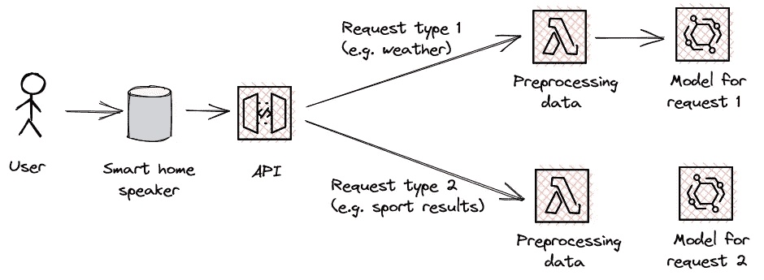

# 通过 AWS 上的 HTTP API 进行无服务器 NLP 推理

> 原文：<https://towardsdatascience.com/serverless-nlp-inference-via-http-api-on-aws-e27ea41d122b>

## 如何使用 Boto3 为您的无服务器端点设置 API

照片由[天舒刘](https://unsplash.com/@tianshu?utm_source=medium&utm_medium=referral)在 [Unsplash](https://unsplash.com?utm_source=medium&utm_medium=referral)

# 这是怎么回事？

在之前的一篇博文中，我描述了我们如何在 Amazon SageMaker 上部署 NLP 模型进行无服务器推理。下一步，我们将测量这个无服务器端点的性能。为此，我们需要用一些测试数据调用端点。这可以使用 Boto3 *sagemaker-runtime* 客户端轻松完成:

但是这通常不是应用程序和服务与我们的模型交互的方式。实际上，我们希望有一个 API 来路由我们的请求，这样我们就可以监视和控制对模型的访问。

在本教程中，我们将做到这一点:我们将设置一个允许我们访问无服务器端点的 API，这样，作为下一步，我们可以测量端点在现实条件下的性能。和往常一样，本教程的代码在这个 [Github repo](https://github.com/marshmellow77/nlp-serverless) 中公开。repo 由两个笔记本组成:第一个用来创建无服务器端点，第二个用来创建 API 的基础设施。

# 为什么这很重要？

如上所述，建议公开使用 API 来服务 NLP 模型。这种方法确保了对模型的请求可以被监控和检查。API 还决定哪个模型用于哪个请求，并确保在无效请求的情况下进行适当的异常处理。智能扬声器是这种设置的一个很好的例子:

作者图片

在这个场景中，API 根据请求的类型决定应该使用哪个模型，并相应地路由请求。

在本教程中，我们将学习如何通过创建 API 和 Lambda 函数来建立这样一个路由，该函数将处理我们的请求并将其发送到无服务器端点上的 NLP 模型。我将假设已经存在一个 SageMaker 端点来开始本教程。如果你还没有设置，你可以用这个[笔记本](https://github.com/marshmellow77/nlp-serverless/blob/main/1_model_train_deploy.ipynb)中的代码轻松设置。

# 创建 Lambda 函数

完成上述架构设置的最佳方式是从右到左，即从创建 Lambda 函数开始。

第一步是编写函数应该执行的代码。Lambda 函数需要提取将通过 API 发送的文本，调用端点，并在将结果发送回 API 之前解析结果。下面是如何做到这一点的示例:

> 我们如何知道来自 API 的请求的结构，即我们如何知道我们可以通过*事件[‘body’]*提取模型的文本？我们可以在 HTTP API 的[文档中找到有效载荷格式，我们将在下面设置 API 时进一步研究它。](https://docs.aws.amazon.com/apigateway/latest/developerguide/http-api-develop-integrations-lambda.html)

我们可以将 Lambda 函数的代码存储在本地的一个文本文件中。要创建函数，我们需要压缩这个文件，然后通过 Boto3 创建 Lambda 函数:

记住，要选择一个 IAM 执行角色，该角色包含一个策略，该策略允许您函数调用 SageMaker 端点！

# 创建 HTTP API

> **HTTP API vs REST API:选哪个？**
> 
> AWS 在 2019 年推出了 HTTP APIs，试图为使用 API Gateway 构建的客户提供增强的功能、改进的性能和更轻松的开发人员体验。HTTP APIs 的缺点是它们不像 REST APIs 那样功能齐全。然而，对于我们相对简单的用例来说，HTTP APIs 工作得很好，设置起来也很容易:)
> 
> 要了解更多信息，我建议查看官方的 AWS 文档和博客文章。

使用 Boto3 创建 HTTP API 非常简单。我们只需要一行代码来创建 API，其中我们提供 Lambda 函数作为目标:

在测试我们的设置之前，我们需要做的最后一件事是允许 API 调用 Lambda 函数。这是在 Lambda 函数的配置中完成的:

# 测试

我们终于有了所有的东西，现在可以测试我们的设置。为此，我们可以使用标准 Python 库*请求:*向 API 发送一个常规的 POST 请求

# 结论和后续步骤

我们已经建立了一个架构，允许我们通过 API 访问无服务器 NLP 端点。这类似于真实场景，现在我们可以开始测试端点的性能，并调查端点的延迟和冷启动。

我希望这是有帮助的，请随时提出问题和意见！