# 使用 Apache Spark 服务 ML 模型

> 原文：<https://towardsdatascience.com/serving-ml-models-with-apache-spark-3adc278f7a78>

## 关于如何使用 PySpark 为模型提供服务的端到端指南


[**来源**](https://pixabay.com/illustrations/technology-developer-touch-finger-3389917/)

处理大型数据集伴随着由技术和编程语言设置的限制的困难。一个有效的步骤是了解分布式处理技术及其支持库。对于希望利用数据处理、 [MLlib](https://spark.apache.org/mllib/) 和 [Apache Spark](https://spark.apache.org/) 的模型服务功能的机器学习工程师和数据科学家来说，这篇文章非常重要。

# 什么是阿帕奇火花？

[Apache Spark](https://spark.apache.org/) 是一个借助其广泛的软件包提供基于集群的分布式计算环境的系统，包括:

*   SQL 查询，
*   流式数据处理，以及
*   机器学习。

Apache Spark 支持 [Python](https://www.python.org/) 、 [Scala](https://www.scala-lang.org/) 、 [Java](https://www.java.com/) 和 [R](https://cran.r-project.org/) 编程语言。

Apache Spark 服务于内存计算环境。根据 Kashif Munir 撰写的《绿色企业的云计算技术》一书，该平台支持一个正在运行的作业在内存中执行 100 倍的速度，在磁盘上执行 10 倍的性能。

## PySpark 是什么？

最初，Apache Spark 是用 Scala 语言实现的。由于大多数机器学习库和高级数据处理包都是用 Python 编写的，因此与 Spark 集成的需求是显而易见的。为了满足这种需求，为 Spark 开发了一个 Python API。它被命名为 PySpark。它是在名为 [Py4J](https://www.py4j.org/) 的 Python 解释器的帮助下建立的，该解释器同步到 [Java 虚拟机(JVM)](https://www.javatpoint.com/jvm-java-virtual-machine) 的连接。

## Spark 是如何工作的？

Apache Spark 支持作业的横向处理。它通过允许使用内存中的属性和增强的 SQL 熟练度来推进这项任务。Spark 的功能包括但不限于:

*   操作许多分布式脚本，
*   启用数据处理，
*   生成数据工作流，以及
*   使用 MLlib 函数执行分析方法

# 火花部件

Spark 项目由各种紧密结合的部分组成。在中心，Spark 包含一个计算执行机制，可以规划、并行化和筛选众多应用程序。同时使用所有的火花部件不是强制性的。根据现有的情况和要求，它们中的一些可以与火花芯一起使用。然而，Spark 核心的使用是必须的，因为它是 Spark 架构的核心。

## 火花核心

Spark Core 是通用实现组件的中心，它支持平台中的其他功能。

## [火花流](https://spark.apache.org/docs/latest/streaming-programming-guide.html#:~:text=Spark%20Streaming%20is%20an%20extension,processing%20of%20live%20data%20streams.&text=Spark%20Streaming%20provides%20a%20high,a%20continuous%20stream%20of%20data.)

Spark Streaming 允许 Spark 处理从各种系统消耗的在线流数据，包括 [HDFS](https://hadoop.apache.org/docs/r1.2.1/hdfs_design.html) 、 [S3](https://aws.amazon.com/s3/) 、[卡夫卡](https://kafka.apache.org/)、[水槽](https://flume.apache.org/)等。，并输出到不同的数据库系统。

## [火花开关](https://spark.apache.org/sql/) L

Spark SQL 是利用其查询功能提取结构化数据的主要模块。使用 Spark SQL 可以读取各种数据格式。其中包括[拼花](https://parquet.apache.org/)、 [JSON](https://www.json.org/json-en.html) 、 [Avro](http://avro.apache.org/docs/current/spec.html) 等等。此外，它允许用户定义的函数生成和 HiveQL 的使用。

## [GraphX](https://spark.apache.org/docs/latest/graphx-programming-guide.html)

GraphX 可以表示为具有并行分布式执行的图形数据库系统的火花。抽象地说，它是由顶点和边组成的。GraphX 在其系统内部关联图形计算。

## [MLlib(机器学习)](https://spark.apache.org/mllib/)

MLlib 是 Spark 的核心机器学习库。它使分布式方法能够记录和处理数据。它由各种算法组成，包括回归、决策树、k-means 聚类等。

# 火花建筑

Spark 架构由驱动程序和工作节点组成。这些节点在集群管理器的帮助下连接在一起。

## 驱动节点

驱动程序节点是负责执行“main()”方法的主节点。其主要目的是成功创建所需的 Spark 会话。

## 集群管理器

集群管理器充当在请求的作业之间分配资源的结构。您可以选择 [Hadoop Yarn](https://hadoop.apache.org/docs/current/hadoop-yarn/hadoop-yarn-site/YARN.html) 、 [Mesos、](https://spark.apache.org/docs/latest/running-on-mesos.html)或 [Kubernetes](https://spark.apache.org/docs/latest/running-on-kubernetes.html) 作为集群管理器。

## 工作节点

worker 节点包含处理相关代码块的任务。在它内部，执行器在执行完调度的作业后维护内存中的数据。执行器架构中的最小单元被称为任务。

# 为什么使用 Apache Spark

选择 Spark 有无数的理由。最重要的是它的易用性、快速性和支持。

## 易用性

Spark 的能力通过众多 API 开放。它们都是为大规模信息的快速有效交流而设计的。凭借其易于理解的结构，用户可以在短时间内使用 Spark 快速产生结果。

## 迅速

Spark 旨在实现快速性能。它在内存和本地存储中都有效。Spark 的执行速度与 Hadoop 的 [MapReduce](https://hadoop.apache.org/docs/r1.2.1/mapred_tutorial.html) 相比有着高达百倍的显著差异。

## 支持

Spark 支持多种编程语言，包括 Python、R、Java 和 Scala。它集成了对 Hadoop 环境中各种内存应用的支持。此外，Apache Spark 开发人员社区是巨大的、动态的和全球性的。Hadoop 的商业供应商也为 Spark 应用提供广泛的服务。

# 火花装置

Spark 可以根据平台以不同的方式安装。在本节中，让我们介绍两种不同的安装选项:

*   在 Google Colab 上设置它，然后
*   在您的本地机器上安装它。

## 在 Google Colab 上设置 Spark

Google Colab 是一个用户在浏览器中有效实现 Python 脚本的环境。要在 Google Colab 上执行 Spark with Python，您必须安装适当的 Spark、Hadoop 和 Java 版本。在 Google Colab 上安装 Spark 可以如下图所示:

```
!apt-get install openjdk-8-jdk-headless -qq > /dev/null
 !wget -q [https://downloads.apache.org/spark/spark-2.4.8/spark-2.4.8-bin-hadoop2.7.tgz](https://downloads.apache.org/spark/spark-2.4.8/spark-2.4.8-bin-hadoop2.7.tgz)
 !tar xf spark-2.4.8-bin-hadoop2.7.tgz
```

在 Google Colab 上成功安装相应版本后，就可以为 Spark 和 Java 设置环境变量了。

```
import os
 os.environ[“JAVA_HOME”] = “/usr/lib/jvm/java-8-openjdk-amd64”
 os.environ[“SPARK_HOME”] = “/content/spark-2.4.8-bin-hadoop2.7”
```

“ *findspark* ”有助于找到以前安装的 PySpark 版本。然后，在` *findspark.init()* 的帮助下，使 PySpark 可以作为库导入。

```
import findsparkfindspark.init()
```

## 在本地机器上安装 Apache Spark

Apache Spark 可以在任何安装了 Python、Scala 或 Java 的环境中运行。本文将关注 Python 语言。紧凑快速地安装所需的 Python 包和 Jupyter Notebook 的最简单方法是使用 [Anaconda](https://www.anaconda.com/products/individual#Downloads) 。

在 Anaconda 提示符下使用下面的命令安装 Spark:

```
conda install pyspark
```

# Apache Spark 基础知识

Spark 支持弹性分布式数据集(RDD)结构。使用此结构可以读取外部数据源。使用 RDD 将方法传递给 Spark 是可能的。这些函数可应用于现有数据集或新数据集。

在接下来的章节中，您将了解更多关于 RDD 结构、Spark 转换和操作的内容。

## 弹性分布式数据集

弹性分布式数据集是 Spark 中面向客户端的基本编程接口，用于内存计算。它是数据组件的组合。

## RDD 创作

在创建 RDD 之前，您需要创建一个 Spark 会话。这是在“ *SparkContext* 的帮助下完成的。“ *SparkConf* ”用于设置其他火花配置。

```
from pyspark import SparkContext, SparkConf
```

下一步是定义我们想要的火花配置。在这种情况下，我们将使用本地集群，因为我们是在本地机器上工作。您还可以选择在[集群模式](https://spark.apache.org/docs/latest/cluster-overview.html)下设置 Spark。

指定`*local[*]【T13]`意味着 Spark 将使用本地机器中的所有内核。这通常是独立模式下的默认设置。*

```
spark_configurations = (SparkConf().setMaster(“local[*]”).\setAppName(“firstSparkSession”).\set(“spark.executor.memory”, “2g”))
```

有了这个配置，我们就可以创建 Spark 会话了。

```
spark_context = SparkContext(conf = spark_configurations)
```

有一些用于查看 spark 配置的内置函数。

Spark 版本可以使用`*版本*'属性进行检索。

```
spark_context.version
```

Python 版本可以使用` *pythonVer* `属性来显示。

```
spark_context.pythonVer
```

要查看分配给独立模式的内核数量，您可以向 spark 会话变量添加一个“*主*”参数。在下面的例子中，Spark 会话的名称叫做` *spark_context* 。'

```
spark_context = SparkContext(conf = spark_configurations)spark_context.master
```

每个 Spark 会话都有一个唯一的名称。` *setAppName* 属性可用于设置会话的名称。

```
spark_configurations = (SparkConf().setAppName(“firstSparkSession”))spark_context = SparkContext(conf = spark_configurations)
```

分配应用程序名称后，可以使用` *appName* '属性查看它。

```
spark_context.appName
```

Spark 为每个会话创建一个惟一的应用程序 id。可以使用` *applicationId* '属性来检索 id。

```
spark_context.applicationId
```

Spark 通过并行性在每个 Spark 会话中分配任务。您可以手动设置或使用默认选项。

可以使用`*默认并行度*'属性查看默认设置。

```
spark_context.defaultParallelism
```

您可以在 Spark 上下文的配置阶段设置默认并行度。这是通过使用`*spark . default . parallelism*参数来完成的。

```
spark_context.setConf(”spark.default.parallelism”, “50”)
```

此外，Spark 允许为作业分配不同数量的分区。可以通过在“spark.default.partitions”配置参数中添加数字来设置所需的分区数量。在下面的例子中，“50”是确定分区的数量。

```
spark_context.setConf(“spark.default.partitions”, “50”)
```

若要打印 RDD 的最小分区数的默认设置，请使用“defaultMinPartitions”属性。

```
spark_context.defaultMinPartitions
```

## RDD 行动

在 Spark 中，RDD 操作由`*变换*和`*动作*组成。`*转换*`是可以通过使用旧的 RDD 创建一个不存在的操作。

## 火花变换

在激活的 Spark 会话中，有几种 Spark 转换可用。在这一节，我们来介绍最常见的。

**地图**

“ *Map* ”方法返回一个新的分布式数据集，该数据集是通过函数传递每个元素而得到的。在下面的示例中,“ *collect* ”操作负责检索现有 RDD 中的所有项目。

```
items = spark_context.parallelize ([4,13,13,28,36,47,56])
mapped_list = items.map(lambda x: x+2).collect()print (“Printing mapped items for map operation of RDD: “, (mapped_list))
```

**平面地图**

flatMap 方法通过对 RDD 的每个项目执行计算，然后执行拼合操作来进行操作。

```
items = spark_context.parallelize ([2,4,13])
 items.flatMap(lambda x: range(1, x)).collect()
```

**地图分区**

在` *mapPartitions* 的帮助下，一个方法可以应用到指定 RDD 的每个分区。

```
partitioned = spark_context.parallelize ([4,13,13,28,36,47,56], 2)def mapPartitionFunc(ind): yield sum(ind)
partitioned.mapPartitions(mapPartitionFunc).collect()
```

**MapPartitionsByIndex**

“mapPartitionsWithIndex”方法通过不丢失核心分区的索引，使函数能够在 RDD 的每个分区上执行。

```
partitioned = spark_context.parallelize ([4,13,13,28,36,47,56], 4)def mapPartitionByIndexFunc(indSlicer, ind): yield indSlicer
partitioned.mapPartitionsWithIndex(mapPartitionByIndexFunc).sum()
```

**过滤器**

filter 方法在选择在特定条件下返回“ *true* ”的项目后，返回一个新的数据集。

```
items = spark_context.parallelize ([4,13,13,28,36,47,56])filtered_list = items.filter(lambda x: x % 2 == 0).collect()print (“Printing filtered list items for filter operation of RDD: “, (filtered_list))
```

**样品**

采样可用于数据处理的任何阶段。对于 RDD 数据集，可以通过在“样本”函数中指定一个百分比值来进行采样。当请求相同的子集时，可以将种子 id 添加到方法中。

```
sampling_items = spark_context.parallelize(range(20), 4)
sampling_items.sample(True, 0.3, 1234).collect()
```

**加入**

可以使用“连接”方法将 RDD 数据集连接到一对匹配的键上。

```
list1 = spark_context.parallelize([(“k”, 98), (“m”, 65)])
list2 = spark_context.parallelize([(“k”, 120), (“k”, 43)])
sorted(list1.join(list2).collect())
```

**工会**

`*联合*'操作有助于联合指定的 rdd。它一个接一个地添加。此操作不会搜索它们之间的匹配密钥。

```
union_items = spark_context.parallelize(range(5), 2)
union_items.union(union_items).collect()
```

**路口**

“*交集*”方法负责在 RDD 数据集中查找元素的交集。

```
group1 = spark_context.parallelize([2, 10, 17, 3, 14, 5])
group2 = spark_context.parallelize([2, 8, 5, 34, 42, 14])group1.intersection(group2).collect()
```

**截然不同的**

` *distinct* '函数用于从 RDD 中获取一组唯一的元素。

```
items = spark_context.parallelize ([4, 13, 13, 28, 36, 47, 56])
 unique_element_list = items.distinct().collect()print (“Printing distinct items for distinct operation of RDD: “, (unique_element_list))
```

**GroupByKey**

使用“ *groupByKey* ”函数需要将每个键的元素分组在一行中。在此操作之后，RDD 的输出将具有哈希分区。

```
groupedKeys = spark_context.parallelize([(“first_num”, 300),(“second_num”, 500), (“third_num”, 900)])print(sorted(groupedKeys.groupByKey().mapValues(len).collect()))
 print(sorted(groupedKeys.groupByKey().mapValues(list).collect()))
```

**减速键**

“ *reduceByKey* ”方法对 RDD 元素的值执行合并操作。

```
from operator import sub
 reducedKeys = spark_context.parallelize([(“first_num”, 300),(“second_num”, 500),(“third_num”, 900),(“second_num”, 500)])print(sorted(reducedKeys.reduceByKey(sub).collect()))
```

**AggregateByKey**

在公共键的结构中需要两个独立的 rdd 来执行聚合操作。首先，实现了每个项目的聚合。在此步骤之后，操作应用于输出。

```
item_group1 = spark_context.parallelize([(‘first’,5),(‘first’,3),(‘second’,3)])item_group2 = spark_context.parallelize(range(20))

 firstGroup = (lambda x,y: (x[0]+y,x[1]+1))
 aggregatedGroup = (lambda x,y:(x[0]+y[0],x[1]+y[1]))

 print(item_group2.aggregate((0,0),firstGroup,aggregatedGroup))
 print(item_group1.aggregateByKey((0,0),firstGroup,aggregatedGroup))
```

**排序键**

` *sortByKey* `方法负责以升序方式对元素对进行排序。

```
item_list = [(‘first’, 7), (‘second’, 9),(‘third’, 11), (‘fourth’, 34), (‘fifth’, 58)]spark_context.parallelize(item_list).sortByKey().first()
```

## 火花动作

现在让我们来看看一些 Spark 操作。

**收藏**

` *collect* '函数将数据集的所有元素作为数组返回。

```
items = spark_context.parallelize ([4,13,13,28,36,47,56])
 number_list = items.collect()print (“Printing elements for collect: %s” % (number_list))
```

**第一部**

“first”方法用于从 RDD 中获取第一项。

```
items = spark_context.parallelize ([4,13,13,28,36,47,56])
 first_element = items.first()print (“Printing first element with first operation of RDD: %s” % (first_element))
```

**取**

“take(n)”方法返回数据集的前 n 个元素。

```
items = spark_context.parallelize ([4,13,13,28,36,47,56])
 take_element = items.take(3)print (“Printing specified number of elements with take operation of RDD: %s” % (take_element))
```

**取样品**

` *takeSample* `方法返回指定长度的 RDD。在该方法中，第一个参数是“替换为的*”。它指示是否需要用旧结果替换新结果。如果是，则设置为`*真*，否则设置为`*假*`。*

第二个参数是要采样的数字。第三个参数是“种子”数。当设置为任意数字时，它是该特定样本的标识符 ID。每当您在当前 Spark 会话中使用相同的 ID 运行这个采样函数时，它都会返回相同的样本子集。

```
items = spark_context.parallelize ([5,13,13,28,36,47,56])
items.takeSample(True, 5, 1)
```

**已订购**

“已订购”功能以升序方式从 RDD 中取出确定数量的商品。

```
items = spark_context.parallelize ([44,131,836,147,56]).takeOrdered(6)print (items)
```

**计数**

“计数”函数返回元素的数量，而不考虑在 RDD 中找到的重复记录或非重复记录。

```
element_count = items.count()print (“Printing number of instances for count operation of RDD: %i” % (element_count))
```

**计数键**

“ *countByKey* ”功能与“ *count* ”功能的不同之处在于通过相应的键对项目进行计数。

```
countKey = spark_context.parallelize([(“first_num”, 300), (“second_num”, 500), (“third_num”, 900), (“second_num”, 500), ])
 sorted(countKey.countByKey().items())
```

**保存文本文件**

借助` *saveasTextFile* `功能，可以将 RDD 数据集保存为文本格式。

```
items = spark_context.parallelize ([4,13,13,28,36,47,56])saved_list = items.saveAsTextFile(“items.txt”)
```

## [RDD 的坚持](https://spark.apache.org/docs/latest/rdd-programming-guide.html#rdd-persistence)

Spark 的主要优势是能够跨分区将数据集保存在内存中。持久性是通过缓存实现的。分区在内存中进行处理，以便将 RDD 存储在缓存中。之后，它们可以在该数据集的不同操作中重用。这使得未来的行动要快得多。

RDD 可以第一次在活动中注册。之后，它将被分区保存在内存中。但是，这些 RDD 分区有丢失的风险。Spark 可以重新计算最初所做的更改。

通过缓存 rdd，用户可以继续将数据集保存在硬盘上，并在其他作业中重用它。有些 rdd 可以多次使用。在这些 rdd 上使用“持久”操作可能是有利的。

使用“持久”方法的存储级别，当选择“内存和磁盘”时，RDD 分区将仅缓存到内存和磁盘一次。

```
item_list = spark_context.parallelize([(‘first’,5), (‘first’,3), (‘second’,3)])item_list.persist(pyspark.StorageLevel.MEMORY_AND_DISK )item_list.getStorageLevel()print(item_list.getStorageLevel())
```

另一方面，当选择“内存和磁盘 2”时，RDD 分区将在内存和磁盘上有两个副本。

```
item_list = spark_context.parallelize([(‘first’,5), (‘first’,3), (‘second’,3)])item_list.persist(pyspark.StorageLevel.MEMORY_AND_DISK_2 )item_list.getStorageLevel()print(item_list.getStorageLevel())
```

# 使用 PySpark 创建 Spark 会话

运行 PySpark 函数需要 Spark 会话。首先，必须导入所需的库。

```
from pyspark.sql import SparkSession
from pyspark.context import SparkContext
```

加载相关库后，只需添加一个` *appName* '和一个` *getOrCreate* '函数，就可以启动 spark 会话。如果存在任何额外的配置要求，例如执行器的内存大小，则可以在 Spark 会话构建块中包含一个“config”参数。

```
spark = SparkSession.builder.\
 appName(“FirstSparkApplication”).\
 config (“spark.executor.memory”, “8g”).\
 getOrCreate()
```

## 通过读取不同的数据格式创建 Spark 数据帧

创建会话后，可以读取数据并将其作为数据帧加载到支持数据结构中。数据帧可以描述为基于列的表格格式的集合。

下面，使用相应的文件名函数读取不同格式的文件。

```
json_df = spark.read.json(“dataset.json”)
 text_df = spark.read.text(“dataset.txt”)
 csv_df = spark.read.csv(“dataset.csv”)
 parquet_df = spark.read.parquet(“dataset.parquet”)
```

# Spark 中的机器学习

Spark 包含一个名为 MLlib 的独立库，支持几种机器学习算法。MLlib 增强的核心字段有:

*   机器学习计算，
*   特色化，
*   生成管道结构，
*   坚持

让我们讨论使用 Spark 实现机器学习模型的步骤。

# 数据准备

在整篇文章中，将使用一个非常著名的数据集“[泰坦尼克号](https://github.com/drewszurko/kaggle-titanic/blob/master/LICENSE)”。公共数据集可以从其 [GitHub 页面](https://github.com/drewszurko/kaggle-titanic)下载。另外，你可以通过链接查看它的许可证[。](https://github.com/drewszurko/kaggle-titanic/blob/master/LICENSE)

作为第一步，我们将在 Spark 会话的帮助下读取数据集。

数据集有其格式，其基本要求是使用“ *csv* ”函数。它被指定为` *spark.read.format()* 中的参数。

```
training_dataset = spark.read.format(“csv”).\option(“inferSchema”, True). option(“header”, “true”).\load(‘dataset/titanic_train.csv’)test_dataset = spark.read.format(“csv”).\option(“inferSchema”, True).option(“header”, “true”).\load(‘dataset/titanic_test.csv’)
```

作为最初的分析步骤，让我们显示列名。这可以通过使用 PySpark 以三种不同的方式完成。

第一种方法是使用` *show* '方法，同时将您想要显示的行数作为参数进行传递。

```
training_dataset.show(5)
```

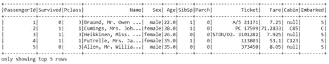

**图 1 .**‘show(5)’功能的输出。归作者所有。

第二种方法是使用` *show()* `方法，不传递任何参数。该操作将输出 20 行。其默认格式包含截断的列内容。对于“Name”列，可以观察到截断的列，因为它超过了默认长度。

```
training_dataset.show()
```

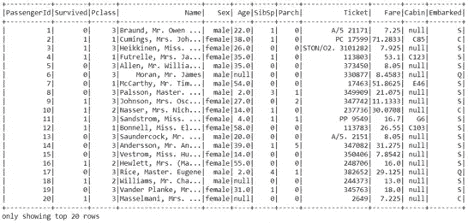

**图 2 .**‘show()’函数的输出。归作者所有。

通过在“ *show* 方法中设置“ *truncate = False* ”可以查看完整的列内容。此外，可以通过在“ *show()* ”函数中添加“ *vertical = True* ”来更改默认的水平显示。

```
The full column content can be viewed by setting `truncate = False` in the `show` method. Also, the default horizontal display can be changed by adding `vertical = True` in the `show()` function.training_dataset.show(2, truncate=False, vertical=True)
```

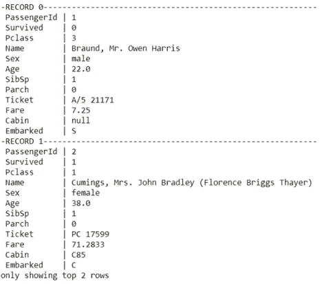

**图 3 .**` show(truncate = False，vertical=True)`函数的输出。归作者所有

## 用 Spark 进行数据预处理

查看列名及其类型后，检查数据集是否包含任何“null”或“nan”值至关重要。我们必须在建模步骤之前填写它们。

让我们在下面显示空列和非空列。

```
from pyspark.sql.functions import *
 print (“NaN values\n”)
 training_dataset.select([count(when(isnan(item), item)).alias(item) for item in training_dataset.columns]).show(5)

 print (“Null values\n”)
 training_dataset.select([count(when(col(item).isNull(), item)).alias(item) for item in training_dataset.columns]).show(5)

 print (“Not Null values\n”)
 training_dataset.select([count(when(col(item).isNotNull(), item)).alias(item) for item in training_dataset.columns]).show(5)
```

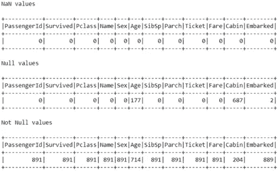

**图 4。**填充和未填充值的输出。归作者所有

一些列名可以使用“ *withColumnRenamed* ”函数重命名。使用这种方法，只需用点分隔符逐个添加多个列，就可以对它们进行重命名。该函数的第一个参数是原始值，第二个参数是新的列名。

```
print(“Renaming Column Name”)training_dataset = training_dataset.\
 withColumnRenamed(“Pclass”,”PassengerClasses”).\
 withColumnRenamed(“Sex”,”Gender”)
 training_dataset
```

“group by”SQL 操作可以通过“count”操作应用于单个列。此外，可以在函数中为多个分组操作添加多个值。

也可以在“count()”函数的末尾添加“ *sort()* ”函数。通过观察输出中各等级的计数，我们可以看到三等舱男女乘客的“幸存”计数最高。

```
print(“Counting the number of Passenger per Classes”)training_dataset.groupBy(“PassengerClasses”).\count().\sort(“PassengerClasses”).show()

 print(“Counting the number of Survivals by Classes”)
 training_dataset.groupBy(“PassengerClasses”,
 “Gender”,
 “Survived”).count().sort(“PassengerClasses”,
 “Gender”,
 “Survived”).show()
```

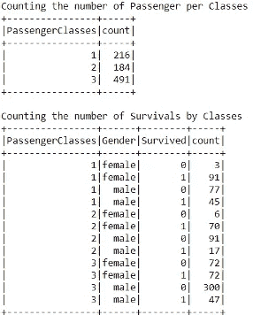

**图五。**‘group by’操作的输出。归作者所有。

# PySpark 的特征工程

在特征工程的帮助下，可以从数据集中的现有变量中提取更有见地的信息。

在 titanic 数据集中有一个“T32 姓名”列，其中也包括这个人的头衔。该信息可能对模型有益。所以我们把它生成为一个新变量。可以使用` *withColumn* '操作创建一个新的标题列。

```
training_dataset = training_dataset.withColumn(“Title”, regexp_extract(col(“Name”),”([A-Za-z]+)\.”, 1))training_dataset.select(“Name”,”Title”).show(10)
```

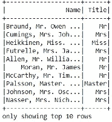

**图 6。**‘with column’标题提取操作的输出。归作者所有。

一个名为`*标题*'的新列被生成。按数量列出每个标题可以告诉我们，有些标题只出现过一次。

```
training_dataset.groupBy(“Title”).count().show()
```

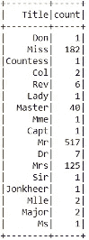

**图七。**‘group by’操作的输出。归作者所有。

有一些不同格式的重复标题。有些是可以替换的。为此，可以使用“*替换*”功能。

```
feature_df = training_dataset.\
 replace([“Mme”, 
 “Mlle”,”Ms”,
 “Major”,”Dr”, “Capt”,”Col”,”Rev”,
 “Lady”,”Dona”, “the Countess”,”Countess”, “Don”, “Sir”, “Jonkheer”,”Master”],
 [“Mrs”, 
 “Miss”, “Miss”,
 “Ranked”,”Ranked”,”Ranked”,”Ranked”,”Ranked”,
 “Royalty”,”Royalty”,”Royalty”,”Royalty”,”Royalty”, “Royalty”, “Royalty”,”Royalty”])

 feature_df.groupBy(“Title”).count().sort(desc(“count”)).show()
```

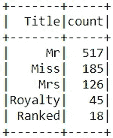

**图 8。“标题”列的“分组”操作的输出。归作者所有。**

在替换操作之后，标题的分布似乎比以前更准确。

# 用 PySpark MLlib 构建机器学习模型

在模型实现阶段之前，应该检查变量的类型。由于预测算法需要数字格式的变量，字符串格式的列可能会导致错误。

PySpark 的` *dtypes* `函数可以用来打印变量的类型。

```
feature_df.dtypes
```

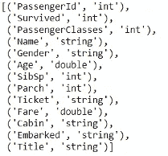

**图 9。**数据帧的“数据类型”操作的输出。归作者所有。

在打印变量类型后，可以观察到“性别”、“已装载”和“标题”列具有字符串格式。这些列需要转换成数字形式。

名为“StringIndexer”的专用 PySpark 函数将变量拟合并转换为数值类型。下面就来实现吧。

```
from pyspark.ml.feature import StringIndexerparchIndexer = StringIndexer(inputCol=”Parch”, outputCol=”Parch_Ind”).fit(df)sibspIndexer = StringIndexer(inputCol=”SibSp”, outputCol=”SibSp_Ind”).fit(df)passangerIndexer = StringIndexer(inputCol=”PassengerClasses”, outputCol=”PassengerClasses_Ind”).fit(df)survivedIndexer = StringIndexer(inputCol=”Survived”, outputCol=”Survived_Ind”).fit(df)
```

在索引和删除旧的字符串格式的操作之后，数据帧就有了所有的数字变量。因为所有的列都是非字符串格式，所以我们可以使用数据帧中的列生成一个特征向量。“VectorAssembler”可用于转换“*特征*”向量列。

```
from pyspark.ml.feature import VectorAssemblerassembler = VectorAssembler(
 inputCols = [“PassengerClasses”,”SibSp”,”Parch”],
 outputCol = “features”)The next step after creating the feature vector is to split the data into train and test sets. You can use the `randomSplit` function to achieve this.(train, test) = df.randomSplit([0.8, 0.2], seed = 345)
```

在应用预测算法之前，需要实现分类器和流水线生成阶段。

让我们一起来定义这些步骤。首先，让我们从 MLlib 库内置的 PySpark 函数中选择一个分类器。添加导入语句后，可以通过分配` *labelCol* 和`*features coll*列来创建分类器。

```
from pyspark.ml.classification import DecisionTreeClassifierclassifier = DecisionTreeClassifier(labelCol=”Survived”, featuresCol=”features”)In this step, a pipeline is created by adding parameters to `stages` accordingly.from pyspark.ml import Pipelinepipeline = Pipeline(stages=[assembler, model_identifier])When the pipeline is established, parameters of the classifier can be optimized with the help of `ParamGridBuilder`.Appropriate parameters will be produced after the grid search.from pyspark.ml.tuning import ParamGridBuilder

 paramGrid = ParamGridBuilder() \
 .addGrid(model_identifier.maxDepth, [10,20]) \
 .addGrid(model_identifier.maxBins, [50, 100]) \
 .build()
```

为此，相应的`*标签*、`*特征*和`*公制*列被填充。

```
tvs = TrainValidationSplit(
 estimator=pipeline,
 estimatorParamMaps=paramGrid,
 evaluator=MulticlassClassificationEvaluator(labelCol=”Survived”,predictionCol=”prediction”, metricName=”weightedPrecision”),
 trainRatio=0.8)
```

在“*trainivalidationsplit*”阶段完成后，我们准备好装配模型。

```
model = tvs.fit(train)
```

# 模型评估

作为一种模型评估方法，可以应用度量“T28”精度。`*精度*的数学公式如下。

> (true positive+true negative)/
> (true positive+true negative+false positive+false negative)

使用下面的代码行，我们可以通过每个参数获得准确性度量。

```
list(zip(model.validationMetrics, model.getEstimatorParamMaps()))
```

# 服务于 Apache Spark 机器学习模型

使用 PySpark 生成的机器学习模型可以使用 [MLflow](https://mlflow.org/) 来服务。在下面的部分中，将解释 MLflow 包的安装。此外，模型服务方法将在概念描述的末尾添加一些示例脚本。

# 为 Spark 模型服务安装 MLflow

MLflow 可以用作 PySpark 模型的模型服务库。在 Spark 会话中使用 MLflow 需要安装库。对于 PySpark，可以使用以下命令安装该包。

```
pip install mlflow
```

安装 MLflow 后导入` *spark* `。

```
from mlflow import spark
```

# 使用 MLflow 服务火花模型

导入 MLflow 后执行` *start_run()* `函数，在 Spark 会话中激活 MLflow。

```
import mlflowfrom mlflow import spark
with mlflow.start_run():mlflow.spark.log_model(model, “sparkML-model”)
```

执行` *log_model* 操作后，将创建 MLflow、model ` *工件*`、`*度量*`、`*参数*`、以及`*标记*`文件夹。

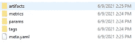

**图 10。**基于桌面的 mlflow 文件夹结构。归作者所有。

在“artifacts”文件夹中，您会找到 spark ML-model 文件夹。在“sparkML 模型”中，有“元数据”和“阶段”文件夹。“阶段”记录模型的生命周期。可以有单个阶段或多个阶段。另一方面，“元数据”代表描述和包含模型信息的数据集。


**图 11。**元数据和阶段文件夹结构。归作者所有。

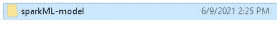

**图十二。**spark ml 文件夹结构。归作者所有。

stages 文件夹包含“最佳模型”信息。


**图十三。**阶段文件夹路径。归作者所有。

在下面的中，您可以从保存在 sparkML-model 文件下的“MLmodel”文件的示例格式中找到一个片段。

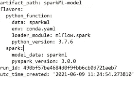

**图 14。**ml model 输出。归作者所有。

可以使用“ *mlflow.pyfunc* ”模块生成推论。首先，模型和数据集路径是分开定义的。其次，使用模型路径定义火花 UDF。第三，读取数据集并将其注册到数据帧中。最后一步，在先前定义的 Spark UDF 的帮助下，通过选择所需的列，生成一个新列。

```
import mlflow.pyfunc
 from pyspark.sql import SQLContext

 train.toPandas().to_csv(‘dataset.csv’)

 model_path = ‘/Users/ersoyp/Documents/LAYER/ServingModelsWithApacheSpark/Scripts/mlruns/1/51ef199ab3b945e8a31b47cdfbf60912/artifacts/sparkML-model’titanic_path = ‘/Users/ersoyp/Documents/LAYER/ServingModelsWithApacheSpark/Scripts/dataset.csv’titanic_udf = mlflow.pyfunc.spark_udf(spark, model_path)

 df = spark.read.format(“csv”).option(“inferSchema”, True).option(“header”, “true”).option(‘delimiter’, ‘;’).load(titanic_path)

 columns = [‘PassengerClasses’, ‘SibSp’, ‘Parch’]

 df.withColumn(‘Inferences’, titanic_udf(*columns)).show(False)
```

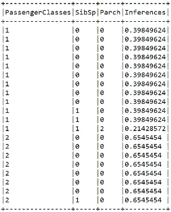

**图十五。**ml flow 输出。归作者所有。

# 元数据存储和图层实验跟踪

为了最终确定一个理想的模型，您需要反复改变各种模型参数或数据准备方法，以达到最佳解决方案。在每次迭代中，保持对参数和过程的跟踪是至关重要的。此外，您可以在每个阶段尝试不同的设置。不遵循这些指令可能会导致重复这些指令，从而浪费时间和计算资源。

[实验跟踪](https://layer.ai/)可以定义为跟踪所有这些数据的技术。

一个[元数据存储库](https://layer.ai/)——一个可以跟踪和保留上述所有信息的工具——对于成功的实验跟踪是必要的。创建机器学习模型时产生的数据保存在元数据存储中。通过存储实验元数据，ML 实验的可比性和可重复性成为可能。

与现有的[元数据存储](https://layer.ai/)相比，层还支持无缝的本地和远程开发交互。例如，在使用本地资源进行一些快速试验后，您可以利用利用[层](https://layer.ai/)基础设施的更有效的计算资源来训练模型。无论是利用本地模式还是远程模式、图层版本、元数据和日志。

使用 layer.log()、@dataset 和@model decorators，您可以随着项目的进展跟踪您的发现、数据集和模型。您的实体由[层](https://layer.ai/)自动版本化，以便您可以准确地重复实验并查看其进展。

有了数据集、ML 模型、元数据和文档的通用存储库，您可以缩小协作差距并简化新员工入职流程。记录参数、图表、指标等。快速识别 ML 实体；制作项目文件；毫不费力地转移控制权。

不稳定的生产管道是不好的。作为对生产管道的健全性检查，[层](https://layer.ai/)自动对数据集和模型进行版本化。

复杂的任务受到缺乏计算能力的限制。您可以使用 Layer 的云资源，在强大的预定义 GPU 和 CPU 上训练您的模型。Layer SDK 处理基础设施的所有难题和复杂性。如果你不需要电，你可以使用你自己的资源。

Layer 提供的一些 Python 装饰器产生了一个健壮的模型和数据注册中心。它提供了一个中心位置来管理与创建机器学习模型相关的所有数据。

为了帮助您快速入门，图层社区网站提供了各种示例项目和数据集。GitHub 库也有更多的例子。您可以通过访问 layer.ai 网站开始构建实验追踪和元数据存储包。

不稳定的生产管道以不希望的方式运行。作为对生产管道的健全性检查，[层](https://layer.ai/)自动对数据集和模型进行版本化。

复杂的任务受到缺乏计算能力的限制。您可以使用 Layer 的云资源，在强大的预定义 GPU 和 CPU 上训练您的模型。Layer SDK 处理基础设施的所有难题和复杂性。如果你不需要电，你可以使用你自己的资源。

Layer 提供的一些 Python 装饰器产生了一个健壮的模型和数据注册中心。它提供了一个中心位置来管理与创建机器学习模型相关的所有数据。

为了帮助您快速入门，图层社区网站提供了各种示例项目和数据集。GitHub 库也有更多的例子。您可以通过访问 layer.ai 网站开始构建实验追踪和元数据存储包。

# 最后的想法

在整篇文章中，在最初描述概念和用示例脚本实现解决方案的结构中出现了广泛的主题。主题包括介绍 Spark，然后在 Spark 中构建机器学习模型。主题包括但不限于:

*   火花的概念
*   Spark 组件及其独特的架构
*   Spark 和 Python 的装置
*   RDD 及其操作要点
*   通过它们不同的功能激发转变和作用
*   火花会话生成和数据帧
*   使用 Spark 进行探索性数据分析
*   PySpark 中的机器学习
*   使用 PySpark 的数据准备、预处理和特征工程
*   PySpark 中的模型构建阶段
*   使用 Apache Spark 的模型服务
*   使用 Layer SDK 进行元数据存储和实验跟踪

# 资源

*   [Spark 胜 Daytona Gray Sort 100TB 基准](https://spark.apache.org/news/spark-wins-daytona-gray-sort-100tb-benchmark.html)
*   [在 Colab 运行 py spark](https://colab.research.google.com/github/asifahmed90/pyspark-ML-in-Colab/blob/master/PySpark_Regression_Analysis.ipynb)
*   [层艾博客](https://blog.layer.ai/)
*   [Jupyter 笔记本，适用于 RDD 基础和 ML 型号，配有 PySpark](https://github.com/pinarersoy/PySpark_SparkSQL_MLib/blob/master/RDD%20Basics%20and%20PySpark%20ML%20Model%20Serving.ipynb)
*   [Jupyter 笔记本，适用于 RDD 基础和 ML 模型，配有 Colab](https://colab.research.google.com/drive/1w-RosBbdeKrc-QYTgI-5LsUDFr-RR1Ds?usp=sharing)