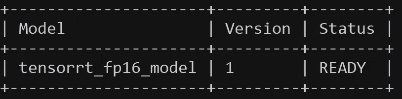

# 使用 NVIDIA Triton 推理服务器为 TensorRT 模型提供服务

> 原文：<https://towardsdatascience.com/serving-tensorrt-models-with-nvidia-triton-inference-server-5b68cc141d19>

## 通过对高客户端-服务器流量的模型推断实现最佳吞吐量和延迟


图片由[弗洛里安·克拉姆](https://unsplash.com/@floriankrumm)在 [Unsplash](https://unsplash.com/) 上拍摄

在实时 AI 模型整体部署中，模型推理和硬件/GPU 使用的效率至关重要。单个客户机-服务器推理请求的速度取决于服务器的延迟和吞吐量。这是因为深度学习模型通常安装在从公共客户端设备接收多个传入请求或数据的服务器或服务器集群上。让我在这里描述一些定义:

**延迟**:通过客户端-服务器连接的单个请求-响应循环所花费的时间。假设稳定的互联网连接，延迟将取决于模型推断的速度、数据包的传输和一些其他因素。

**吞吐量**:服务器在单个时间实例中可以处理的传入请求的数量。当传入流量超过吞吐量时，多余的请求会被排队，从而减慢请求-响应过程。

在我的上一篇文章中，我们已经讨论了在 edge (一个独立的 GPU Linux 设备)上用 TensorRT 设置和运行模型推理**。正如我们所见，这非常简单:**

[](https://medium.com/mlearning-ai/running-tensorflow-model-on-edge-with-tensorrt-for-fast-inference-4dcad300a523)  

另一方面，在本文中，我们将讨论在单个服务器(一个将通过网络接收来自其他设备的请求的 GPU 工作站)上使用 tensort 设置和运行模型推理**，即 [**NVIDIA Triton 推理服务器**](https://developer.nvidia.com/nvidia-triton-inference-server) **。****

在 Triton 服务器上运行深度学习模型有几个优点，据报道，它优于其他框架，如 TFServing 和 TorchServe。例如，它能够通过动态批量推理和多个请求的模型推理中的并发性来优化吞吐量。结合使用 TensorRT 来优化延迟，Triton server 可以同时提供极快的推理速度。

关于 Triton server 性能的更多信息可以在以下文章中找到:

  [](https://developer.nvidia.com/blog/nvidia-serves-deep-learning-inference/)  

## 先决条件

*   配备 NVIDIA GPU 的本地工作站/笔记本电脑
*   Docker 容器和 Linux 终端的基础知识
*   Python 基础和深度学习库的知识

事不宜迟，让我们开始吧！

# 1.张量流模型的一个例子

在我们在 Triton 服务器上测试的深度学习模型示例中，我们选择了一个经典的 CNN 模型——resnet 50——在 ImageNet 数据集上进行了预训练，如下面的代码片段所示。接下来，我们将这个 Tensorflow 模型优化为 TensorRT 模型。

# 2.转换到 ONNX 模型

虽然有不同的 tensort 框架，如 tensor flow-tensort 和 ONNX tensort，但 NVIDIA Triton server 采用的框架只有 ONNX tensort。因此，我们需要首先将任何 Keras 或 Tensorflow 模型转换为 ONNX 格式，如下面的代码片段所示。首先，您可能希望将`model.onnx`模型保存在以下目录中:

```
${PWD}/models/tensorrt_fp16_model/1/model.onnx
```

# 3.使用 Docker 容器转换到 TensorRT 模型

接下来，我们要将 ONNX 型号`model.onnx`转换为 TensorRT 型号`model.plan`。如果您在本地安装了 TensorRT，您可能会尝试进行本地转换。然而，这是有问题的，因为 Triton 服务器容器中的 TensorRT 和 CUDA 软件——我们将在后面看到——在运行`model.plan`文件时可能表现不同。即使本地 tensort 的版本与 Triton TensorRT 的版本相似，也是如此。

幸运的是，NVIDIA 为 TensorRT 提供了 Docker 映像，其版本标签与 Triton server 的版本标签互补。假设您在本地安装了 Docker，在终端上运行:

```
docker pull nvcr.io/nvidia/tensorrt:22.11-py3
```

一旦提取了 Docker 映像，我们将在运行容器时进行卷绑定挂载。请注意，卷绑定装载的参数必须是绝对路径。

```
docker run -it --gpus all --rm -v ${PWD}/models/tensorrt_fp16_model/1:/trt_optimize nvcr.io/nvidia/tensorrt:22.11-py3
```

这将在容器中启动一个终端，随后我们在容器中进行 TensorRT 转换以创建`model.plan`，由于绑定挂载，它也将在本地可用。

```
# cd /trt_optimize
# /workspace/tensorrt/bin/trtexec --onnx=model.onnx --saveEngine=model.plan  --explicitBatch --inputIOFormats=fp16:chw --outputIOFormats=fp16:chw --fp16
```

# 4.设置本地目录以镜像 Triton 服务器

Triton 服务器软件同样是一个 Docker 映像，我们将下载该映像，之后我们还将进行卷绑定挂载。然而，在我们进行 Docker 拉取之前，我们会想要坚持并在本地初始化某个目录结构以及一个必要的`config.pbtxt`模型配置文件。

目录结构应该如下所示:

```
${PWD}/models
         |
         |-- tensorrt_fp16_model
         |          |
         |          |-- config.pbtxt
         |          |-- 1
         |          |   |
         |          |   |--model.plan
```

我们用例的`config.pbtxt`文件示例如下:

```
name: "tensorrt_fp16_model"
platform: "tensorrt_plan"
max_batch_size: 32

input [ 
    {
        name: "input_1"
        data_type: TYPE_FP16
        dims: [ 224, 224, 3 ]

    }
]

output [
    {
        name: "predictions"
        data_type: TYPE_FP16
        dims: [ 1000 ]
    }
]
```

# 5.设置 Triton 服务器容器

在确保 Triton 服务器的 Docker 镜像版本标签与 TensorRT 的相似之后，我们就可以开始下载了:

```
docker pull nvcr.io/nvidia/tritonserver:22.11-py3
```

然后以附加模式运行 Docker 容器:

```
docker run --gpus=all --rm  --name triton_server -p 8000:8000 -p 8001:8001 -p 8002:8002 -v ${PWD}/models:/models nvcr.io/nvidia/tritonserver:22.11-py3 tritonserver --model-repository=/models --model-control-mode=poll --repository-poll-secs 30
```

如果 Triton 服务器容器设置正确并准备好进行推理，您应该在终端中看到以下输出，并且“状态”中没有任何错误消息:



# 6.来自客户端设备的推断

在这里，我将演示在客户机工作站上通过 Triton 服务器运行推理的示例代码。当然，我们还需要在客户端工作站上安装`tritonclient`库，包括:

```
pip install tritonclient[all]
```

# 7.Triton TensorRT 比本地 tensort 慢

在我们结束本文之前，我必须提到的一个警告是，由于优化的 GPU 使用和批量推断等优势，Triton server 在处理大量客户端-服务器流量时确实表现出色。

然而，当我们考虑在 Triton TensorRT 和 local TensorRT 之间运行单个本地推理时，local TensorRT 仍然具有更快的推理速度，因为 Triton TensorRT 在网络上运行推理时具有额外的开销。在下面的线程中可以看到一些参数:

[](https://github.com/triton-inference-server/server/issues/4812)  

# 8.结论

感谢阅读这篇文章！部署具有可扩展性的人工智能模型是任何有抱负的人工智能工程师或机器学习工程师的一项重要技能，了解 NVIDIA Triton 服务器无疑会在竞争激烈的数据科学领域中占据优势。否则，强大而精确的模型只能在 Jupyter 笔记本和 VS 代码脚本后面枯萎。

在我的 [GitHub 库](https://github.com/tanpengshi/NVIDIA_Triton_Server_TensorRT)上查看这篇文章的代码。

此外，感谢你和我一起学习人工智能和数据科学。如果你喜欢这些内容，可以在[媒体](https://tanpengshi.medium.com/)上阅读我的其他文章，并在 [LinkedIn](https://www.linkedin.com/in/tanpengshi/) 上关注我。

此外，如果你想知道如何快速深入地学习数据科学和人工智能，请查看我在《学习》中的一篇顶级文章:

[](/a-brief-guide-to-effective-learning-in-data-science-637de316da0e)  

> ***支持我！*** *—* 如果你没有订阅 Medium，但喜欢我的内容，请考虑通过我的[推荐链接](https://tanpengshi.medium.com/membership)加入 Medium 来支持我。

[](https://tanpengshi.medium.com/membership) 