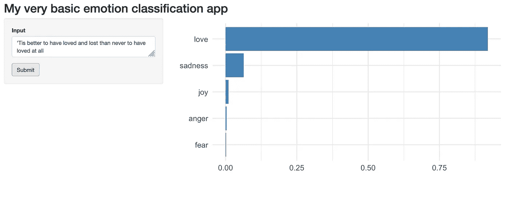
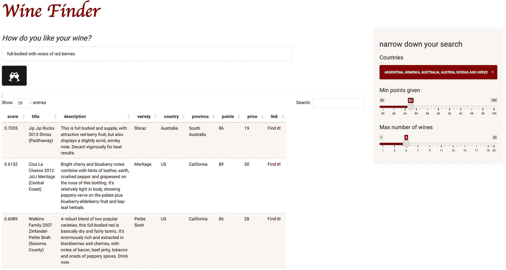

# 在闪亮的应用程序中提供变压器模型

> 原文：<https://towardsdatascience.com/serving-transformer-models-in-shiny-apps-9a1bed4b41a6>


“一个穿着蛇皮衣服的闪亮变形机器人”——用稳定扩散文本到图像模型生成——[https://huggingface.co/spaces/stabilityai/stable-diffusion](https://huggingface.co/spaces/stabilityai/stable-diffusion)

## 结合 R 和 Python 的精华来创建令人敬畏的 NLP 产品的分步指南

很长一段时间以来，R 一直是我处理大多数数据科学相关任务的首选工具。我特别喜欢我可以快速流畅地轻松完成工作。特别是，tidyverse 的出现真正改变了数据争论、探索性分析和数据可视化的游戏规则。此外，Shiny——一个用于构建多功能且漂亮的 web 应用程序的框架——变得越来越流行。

然而，当涉及到机器和深度学习时，Python 似乎比 Sci-kit Learn、PyTorch 和 Tensorflow/Keras 等 ML/DL 框架领先几步。因此，我发现自己越来越多地使用(并且喜欢)Python。

对我来说，令人沮丧的部分是我经常想在闪亮的应用程序中部署和展示计算机视觉和 NLP 模型。尽管 Shiny 最近才可以用于 Python，但 Shiny for Python 目前仍处于非常早期的开发阶段。Python 用户确实可以使用类似的工具，例如 Streamlit 和 Gradio 非常适合展示 ML 模型，但我发现它们与 Shiny 相比有些局限性——特别是在创建自定义用户界面时。当然，我需要探索 Python 的更多选项，但是我真的喜欢开发闪亮的应用程序。

因此，我开始学习如何做到以下几点:

1.  使用 R 的 reticulate 包在闪亮的 app 中使用 Python 代码。
2.  实现预训练的转换器模型来处理用户输入。
3.  将包含 R 和 Python 功能的应用程序容器化，并为 transformer 模型提供服务。

在本文中，我们将通过所有三个步骤来了解它是如何完成的。

# 第 1 部分:启动并运行 reticulate:一个非常简单的例子

我必须承认，开始使用 reticulate 并弥合 R 和 Python 之间的差距有些棘手，需要一些尝试、错误和毅力。好消息是，现在你可能不需要这么做了。在这里，我将展示一种在 R 和 Shiny 中使用 python 代码的方法。

## 第一步:准备好

首先，确保你已经安装了所有需要的包，包括 shiny 和 reticulate，并开始一个新的 Shiny 应用程序项目。

接下来，我们需要设置一个 Python 环境。有不同的方法可以做到这一点，例如根据 reticulate 文档使用 virtualenv。这里，我们将使用 conda 从一个 YAML 文件中设置我们的环境，在该文件中我们指定了所有必要的依赖项。在项目的主目录中创建一个名为 environment.yml 的新文件，包含以下内容:

```
name: my_env
channels:
  - conda-forge
  - defaults
dependencies:
  - python=3.8
  - pip
  - pip:
    - numpy
```

如您所见，我们已经指定环境应该被称为 my_env，其中 Python v. 3.8 将与 pip 一起安装，pip 是一个安装程序，它反过来获取 numpy 包，我们将需要它来创建一个简单的函数。

然后，我们可以通过在 ourRStudio 会话中打开一个终端并运行以下命令来创建环境:

```
conda env create -f environment.yml
```

您可以使用命令`conda env list`检查环境是否已经创建。要激活环境，请运行以下命令:

```
conda activate my_env
```

现在，为了让 reticulate 找到我们刚刚安装的 Python 版本，复制并保存命令`which python`的输出以备后用。它应该以类似于“../miniconda 3/envs/my _ env/bin/python "。

## 步骤 2:用 reticulate 和 Python 连接 Shiny

如果您已经将项目初始化为一个闪亮的 web 应用程序，您应该已经有一个名为 app.r 的文件。对于这个最小的示例，我们将保持它的简单性，并修改已经为我们制作的应用程序。在该脚本的顶部，插入以下几行:

```
library(shiny)
library(reticulate)Sys.setenv(RETICULATE_PYTHON="python-path-in-my_env")
reticulate::use_condaenv("my_env")
```

您也可以在一个名为。请改用 Rprofile。

## 步骤 3:创建和实现 Python 函数

现在，我们可以创建一个简单的 Python 函数，我们将在 app.r 的服务器代码中使用该函数。首先创建一个脚本，您可以使用以下代码行调用 python_functions.py:

```
import numpy as npdef make_bins(x, length):

  low = min(x)
  high = max(x)
  length = int(length) return np.linspace(low,high,length).tolist()
```

这个函数找到一个向量的最小值和最大值，并使用 Numpy 的`linspace()`函数返回一个从最低到最高的等距数字列表。列表的长度等于`length`，将由应用程序的用户交互设置。定义好函数后，我们可以继续前进到 app.r 并修改脚本以使用我们的 python 函数。

在上一步中我们在 app.r 中插入的两行代码的正下方，我们添加了以下代码行:

```
reticulate::py_run_file("python_functions.py")
```

这一行使我们的`make_bins()`功能在我们启动一个闪亮的会话时可用。现在，删除或注释掉服务器代码中的以下行:

```
bins <- seq(min(x), max(x), length.out = input$bins + 1)
```

然后，我们用以下内容替换该行:

```
bins <- py$make_bins(x, input$bins + 1)
```

注意`py$`部分，它表示该函数是 python 函数。我们终于可以运行应用程序，并希望看到它的工作！

# 第 2 部分:使用变压器！

因此，现在我们将尝试实现一个 transformer 模型来确定给定的输入文本是正面的还是负面的。我们将使用的模型叫做*蒸馏-基础-无壳-情感*，你可以在 huggingface 网站上了解更多关于[的信息。如果您还没有这样做，我鼓励您探索这个站点、可用的模型以及支持的 NLP 和计算机视觉任务。](https://huggingface.co/bhadresh-savani/distilbert-base-uncased-emotion/tree/main)

## 步骤 1:更新 conda 环境

我们首先需要通过以下方式将软件包 torch 和 transformers 添加到我们的 environment.yml 文件中:

```
name: my_env
channels:
  - conda-forge
  - defaults
dependencies:
  - python=3.8
  - pip
  - pip:
    - torch
    - transformers
```

然后，我们可以使用以下命令更新环境:

```
conda deactivate;
conda env update -f environment.yml --prune
```

`—-prune`标志确保在更新环境时删除不必要的包。

## 步骤 2:更新 python_functions.py

安装了 torch 和 transformers 之后，我们就可以编写新的 Python 函数来使用这个模型了。

```
import torch
from transformers import pipeline
import numpy as npdef get_model():
  model = pipeline("text-classification", model='bhadresh-savani/distilbert-base-uncased-emotion', top_k=-1)
  return modeldef get_predictions(input_text, classifier):
  predictions = classifier(input_text)
  return predictions
```

第一次运行`get_model()`时，模型被下载，这可能需要一两分钟。这是一个好主意，在一个闪亮的会话之外运行`get_predictions()`来了解输出是什么样子的。

## 步骤 3:创建一个公开模型的基本应用程序

现在，我们终于可以构建一个利用该模型的应用程序了。我在下面提供了一个简单的工作脚本，如果您已经完成了前面的步骤，您可以尝试一下。

作者图片

你会注意到我们在第 10 行用`model <- py$get_model()`加载了情感分类模型。

然后，在第 31–33 行，我们将模型应用于用户提供的一些输入文本，并将输出转换为数据框，这使得绘图更加容易。

```
predictions <- py$get_predictions(input$text)df <- map_df(predictions[[1]], unlist)
```

将 Python 函数的输出转换成 R 可以处理的数据类型有时会很棘手。如果你在自己的项目中遇到麻烦，你可能会发现[网格式文档](https://rstudio.github.io/reticulate/)很有用(参见“类型转换”)。

下面你可以看到应用程序会是什么样子。



作者图片

# 第 3 部分:用 Docker 封装应用程序

Docker 和容器技术提供了一种运行代码和应用程序并完全控制环境的好方法。我们首先需要创建一个 docker 文件，这通常会非常困难和耗时。在这里，我将展示一个将 Python、R、Shiny 和 transformer 模型组合在一个 Docker 图像中的解决方案。它可能不是最有效的，并且一些依赖项和命令可能是多余的。因此，您可以通过修改 docker 文件来指定如何构建图像，从而减少构建图像所需的时间以及图像的大小。

## 步骤 1:编写 Dockerfile 文件

Dockerfile 文件的第一行表示基本图像。默认情况下，使用最新版本。通常，在将应用程序投入生产时，选择特定的版本是明智的。接下来的几行安装了一些依赖项，包括 r。

```
FROM continuumio/miniconda3RUN apt-get update -y; apt-get upgrade -y; \
    apt-get install -y vim-tiny vim-athena ssh r-base-core \
    build-essential gcc gfortran g++
```

通常，我更喜欢使用 Rocker 项目创建的 Docker 映像，这使得编写 Docker 文件来封装闪亮的应用程序和其他基于 R 的应用程序变得非常容易。然而，当我将 Python 添加到组合中时，我遇到了一些问题，并决定尝试一种不同的方式。

接下来，像以前一样安装并激活我们的环境。我必须承认，我还不完全确定下面有多少环境变量是绝对必要的。

```
COPY environment.yml environment.yml
RUN conda env create -f environment.ymlRUN echo "conda activate my_env" >> ~/.bashrcENV CONDA_EXE /opt/conda/bin/conda
ENV CONDA_PREFIX /opt/conda/envs/my_env
ENV CONDA_PYTHON_EXE /opt/conda/bin/python
ENV CONDA_PROMPT_MODIFIER (my_env)
ENV CONDA_DEFAULT_ENV my_env
ENV PATH /opt/conda/envs/my_env/bin:/opt/conda/bin:/usr/local/sbin:/usr/local/bin:/usr/sbin:/usr/bin:/sbin:/bin
```

然后，我们用下面一行下载我们的模型:

```
RUN python -c "from transformers import pipeline; pipeline('text-classification', model='bhadresh-savani/distilbert-base-uncased-emotion')"
```

与运行时相反，在构建时这样做很重要。如果我们在运行时这样做，每个会话都将从下载模型开始！

安装 R 包有不同的方法。这种方式非常简单。

```
RUN R -e "install.packages(c('dplyr','purrr','ggplot2','shiny','reticulate'), repos = '[http://cran.us.r-project.org'](http://cran.us.r-project.org'))"
```

请注意，这实际上是一行。您还可以看到我们正在安装 dplyr、purrr 和 ggplot2，它们是我们实际需要的 tidyverse 包。因此，我们需要加载这些特定的包并从 app.r 中删除`library(tidyverse)`。

出于某种原因，我无法在此时安装整个 tidyverse。此外，这样做将花费相当长的时间，并导致图像比必要的要大。

最后，我们将项目文件夹中的所有内容复制到映像的工作目录，授予写/读/写权限，公开一个端口，并指定实际运行应用程序的最终命令。

```
COPY . ./RUN chmod ugo+rwx ./EXPOSE 3838CMD ["R", "-e", "shiny::runApp('/', host = '0.0.0.0', port = 3838)"]
```

下面你可以看到整个 Dockerfile 文件。

作者图片

## 步骤 2:构建图像

如果我们简单地将我们的 Dockerfile 称为“Dockerfile”，默认情况下，当我们运行以下命令时，Docker 将查找这个文件:

```
docker build -t mysimpleapp .
```

t 代表“tag ”,我们将此图像标记为“mysimpleapp”。末尾的点表示构建上下文是当前目录。

如果由于磁盘空间限制而遇到麻烦，您可以在 Docker 设置中增加允许的磁盘空间，或者，如果您有不需要的大型悬空图像，您可以运行`docker system prune`或`docker system prune -a`。请注意，后一个命令将删除所有未使用的图像！

最后，让我们的手指交叉，我们可以尝试运行我们的应用程序！

```
docker run -it -p 3838:3838 mysimpleapp
```

-it 标志意味着我们希望以交互模式运行，这样我们就可以在启动时看到容器“内部”发生了什么。这可能有助于防止意外出错。

在您的控制台中，您应该会看到 R 启动，然后是“监听 [http://0.0.0.0:3838](http://0.0.0.0:3838) ”。将您的浏览器指向此地址，并检查应用程序是否正常工作。

我在这里部署了一个稍微高级一点的应用[。这款我称之为 Wine Finder 的应用程序使用了一个名为](https://wineapp-tae5nnlp5a-ew.a.run.app/) [all-MiniLM-L6-v2](https://huggingface.co/sentence-transformers/all-MiniLM-L6-v2) 的语义搜索模型，让用户通过输入描述他们正在寻找的葡萄酒品质的查询来搜索他们可能喜欢的葡萄酒。例如，一个查询可能被表述为*“浓郁的红色浆果味道”*。该应用程序包括大约 130，000 种葡萄酒的描述，然后根据与查询的相关性进行排名。数据集在这里[可用](https://www.kaggle.com/datasets/zynicide/wine-reviews)。下面你可以看到这个应用程序的样子。



作者图片

加载可能会有点慢，因为我已经允许该服务在不使用时基本关闭。这导致了“冷启动”，这比让服务持续运行要便宜得多。

# 摘要

我们已经看到了如何在闪亮的应用程序中实现 python 函数和 transformer 模型，以及如何将它们包装在 docker 映像中，准备作为 web 服务进行部署。使用 AWS 和 Microsoft Azure 等云提供商将 docker 图像部署为 web 应用程序相对容易。但是，对于个人项目，我认为谷歌云是目前最便宜的选择。如果你想在 Google Cloud 上部署一个闪亮的应用，请务必查看[我的使用 Google Cloud Run 部署闪亮应用的分步指南](/dockerizing-and-deploying-a-shiny-dashboard-on-google-cloud-a990ceb3c33a)。无论您使用这些提供程序中的哪一个，过程都大致相同。您需要有一个帐户，将您的 docker 映像推送到容器注册表，然后使用该映像建立一个 web 服务。

我们还没有介绍在 Shinyapp.io 上直接运行 python 代码的闪亮应用程序的部署。该过程与本教程中的[描述略有不同。请注意，如果您计划在应用程序中公开 transformer 模型，shinyapps.io 可能不是一个可行的选项，至少如果您在免费层上，就不是。但是，如果您不需要应用程序实际包含大型 transformer 模型和/或大量数据，您可以考虑简单地为给定模型调用 Huggingface 推断 API。](https://github.com/ranikay/shiny-reticulate-app)