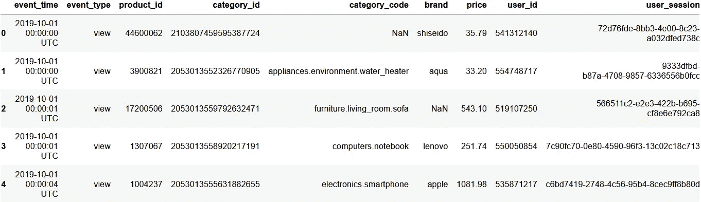
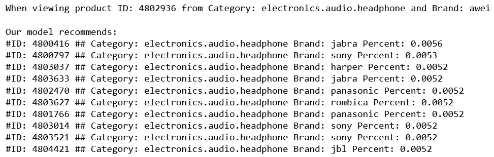
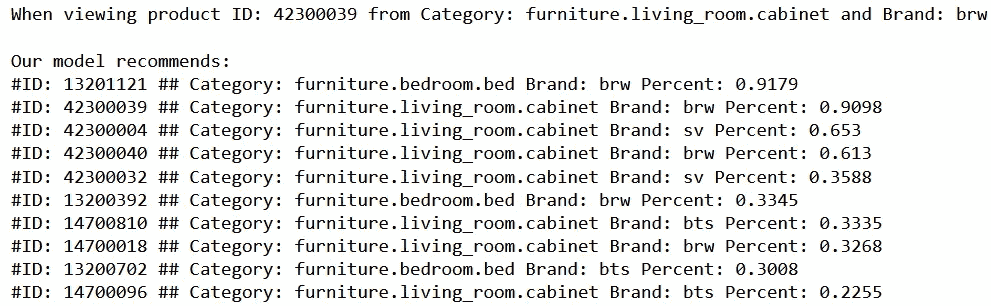
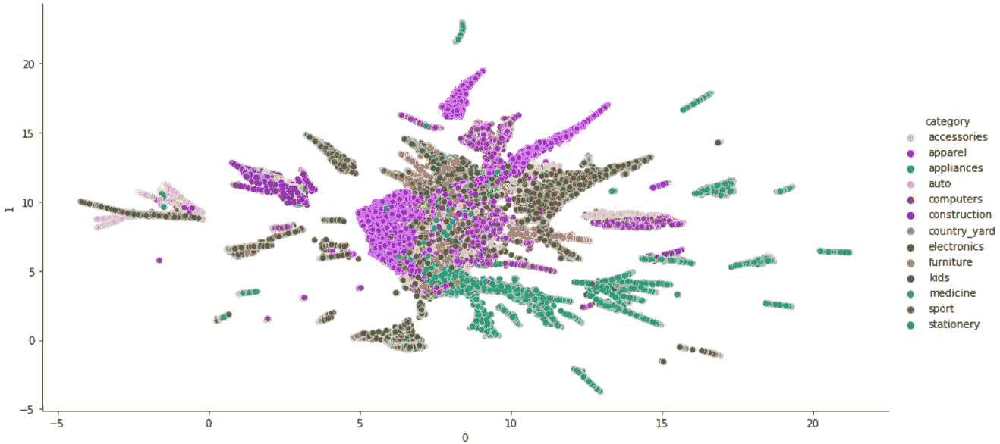

# 基于会话的 Word2Vec 推荐系统

> 原文：<https://towardsdatascience.com/session-based-recommender-systems-with-word2vec-666afb775509>

## 如何用 Python 在浏览器会话数据上用 Word2Vec 训练一个基本的推荐系统？


图片来自 [Unsplash](https://unsplash.com/photos/SYTO3xs06fU) 。

如果你熟悉 **Word2Vec** 算法，那么很可能是因为你在**自然语言处理** (NLP)领域的某个地方偶然发现了它。自 2013 年首次发表以来，T. Mikolov 等人的论文[越来越受欢迎，并在各种 NLP 应用中展示了最先进的结果。从那以后，出现了各种更新的、性能更好的模型——但是，当使用 NLP 或在信息检索(IR)领域工作时，Word2Vec 是不可避免的。](https://arxiv.org/abs/1301.3781)

除了它在 NLP 中的经典应用之外，我们还可以将底层的 Word2Vec 算法用于其他应用，比如某些类型的推荐系统问题。

在本文中，我们将了解如何利用 **Word2Vec 的 CBOW 算法**为基于会话的数据构建一个简单的**推荐系统。**

**首先**，我们将讨论使用 Word2Vec 算法解决此类问题背后的动机是什么，其次**，我们将看看如何在实践中使用 Python 3 实现这一点。**

# **1 |为什么要用 Word2Vec？**

**对于本文，我假设您非常熟悉 Word2Vec 模型及其底层架构(CBOW 和 SkipGram)的工作方式。如果你不熟悉这些，我强烈推荐你看看这篇文章，它很好地解释了这些概念。**

**我们将在本文中重点介绍的特定类型的推荐系统是所谓的*基于会话的*。在这种情况下，我们希望根据匿名用户当前的浏览器会话，向他们提供下次点击推荐。**什么意思？****

**例如，让我们考虑一个销售不同类别的各种产品的电子商务网站。有一天，用户可能会来到我们的网站，浏览我们的产品目录。我们的目标显然是让用户将产品添加到购物车中，并最终购买它。在推荐系统的帮助下，我们的目标是向用户推荐“相关”的产品。这增强了用户的购物体验，但也增加了购买的可能性。**

**然而，如果我们的用户对我们来说是匿名的，我们没有关于他们的任何历史数据，例如关于他们以前的购买或关于他们以前的浏览器会话。这使得给出“相关建议”变得越来越复杂。**

**这就是 Word2Vec 发挥作用的地方。**

**总结一下:Word2Vec 是一个模型，当训练有素时，它能够根据上下文捕捉单词的含义。**

**现在考虑我们上面的例子，我们可能有以下匿名用户的历史会话数据:**

```
session_1 = [1, 2, 5]
```

**在当前会话中，用户查看了产品编号 1、2 和 5。如果我们有足够多的这种类型的会话数据，我们可以在 Word2Vec 模型中使用它们作为输入向量，特别是使用 CBOW 算法。这样，我们的模型将能够赋予我们的项目“意义”，从而确定它们最有可能适合哪个上下文(即会话)。**

> **对于我们的用例，我们可以将“单词”翻译成“产品”，将“上下文”翻译成“会话”。**

**你可能会说，不使用 Word2Vec，我们也可以只向用户推荐来自同一类别的产品。事实上，这可能是一种选择。然而，由于类别可以是相当高的级别，并且产品仍然可以在类别中有所不同，因此产生的推荐可能变得与我们的用户不那么“相关”。**

**既然我们已经研究了理论，并且理解了 Word2Vec 在这个用例中可以为我们做什么，那么让我们实际上开始实现我们的想法，看看结果是什么样的。**

# **2 |用 Python 实现**

**对于我们的用例，我们将使用一个 Kaggle 数据集，其中包含来自多类别商店的电子商务数据(来源:【Kaggle.com】T2 和 [REES46 营销平台](https://rees46.com/))。数据集的大小相当大，因此，出于简化和演示的目的，我将使用 2019 年 10 月的原始数据集的子集。**

## **数据探索**

**在我们进入任何处理步骤之前，让我们先来看看我们的数据:**

****

**2019 年 10 月电商数据(数据集来源:[Kaggle.com](https://www.kaggle.com/datasets/mkechinov/ecommerce-behavior-data-from-multi-category-store?select=2019-Oct.csv)和 [REES46 营销](https://rees46.com/))。图片作者。**

**我们观察了各种各样的特性，但是对于我们的用例来说，只有几个特性是有趣的: *event_type* 、 *product_id* 、 *category_code* 和 *user_session* 。在这个数据集中，我们也有关于我们的用户的数据，因为我们有 *user_id* 值。尽管如此，我们不会使用它们，因为这个例子的目的是展示我们如何基于**匿名**用户会话数据来实现郑重推荐。**

***event_type* 变量描述了会话中发生的事件类型。这可以是“查看”、“购物车”或“已购买”。我们将使用包含*product _ id’*的每个会话的向量作为 Word2Vec 模型的输入。稍后，使用来自我们的 *category_code* 变量的数据，我们将能够测试我们的模型的预测结果。**

## **数据预处理**

**在将数据输入 Word2Vec 模型之前，我们首先需要执行一些处理步骤。为此，我们将使用熊猫库。**

**首先，我们的数据可能包含需要删除的缺失值。其次，我们只需要保留数据中的特定列，因为我们的用例不需要所有的列。这两个步骤在下面的代码中完成:**

**如上所述，出于演示的目的，我将只使用原始数据的一个子集。如下面的代码所示，为了创建数据的子集，我们将首先按照 *user_session* 对数据进行排序。这是为了确保我们将每个会话的所有数据分组在一起。然后我们选择指数 2'000'000 作为我们的分裂点。**

**为了确保我们的数据不会在会话中间被拆分，只要我们数据中的下一行仍然是同一先前会话的一部分，我们就将拆分索引 *split_at* 增加 1。最后，我们执行从第一行到找到的拆分索引的实际拆分。在我们的例子中，数据集在行索引 2'000'006 处被拆分。我们的子集现在包含总共 483，508 个唯一浏览会话数据。**

## **构建 W2V 推荐系统**

**现在我们的数据已经被清理和处理了，我们终于可以继续构建我们实际的基于 Word2Vec 的推荐系统了。我们将使用 **Gensim** 库，它有 Word2Vec 算法的实际实现，正如在原始论文中发表的。**

**为了用 Gensim 训练我们自己的 Word2Vec 模型，我们首先需要将我们的数据变成正确的形状，以便库可以在其上进行实际训练。它将一个向量列表作为输入，因此我们将使用下面的 *create_w2v_data* 辅助函数来转换我们的数据:**

**该函数将 Pandas 数据帧作为输入，并输出数据集中每个会话的列表**，而**是在该会话**中查看、放入购物车和/或购买的所有产品的列表。运行可能需要几分钟时间，但结果数据如下所示:****

```
[['2501061'],
 ['2701673', '2701773'],
 ['2900802', '2900090', '2900802', '2900803'],
 ['1004573'],
 ['1004792'],
  ...
]
```

**因为我们在数据中组合了所有三种事件类型(view、cart、purchased ),所以一个购买的产品将在同一个会话中出现三次。这很好:它让**与实际购买的产品有了额外的关联**，因为它们通常会更频繁地出现在数据集中。**

**我们会话的平均长度为 4.14，最长的会话包含 324 个已查看、放入购物车和/或已购买的产品。**

# **训练模型**

**最后我们可以开始我们模型的实际训练了！🎉**

**在 Gensim 库的帮助下，这可以通过几行代码完成:**

**我们用准备好的会话列表作为输入数据建立了一个模型，并设置了模型参数。我们将 *min_count* 设置为 3，因为这将确保我们的模型只针对在整个数据集中出现至少 3 次的产品进行训练——换句话说:该产品必须被查看过至少 3 次，或者被查看过两次并放入购物车一次，或者被购买过至少一次。我们还使用了一个 *window_size* ，它对应于我们数据集中最长的会话。为什么？以便我们考虑在会话中查看的所有产品。我们保留 Gensim 库中建议的其余参数。**

**万岁，我们已经训练好了我们的模型！接下来:让我们看看它能为我们做什么。**

# **3 |测试和可视化**

**训练一个模型很好，但是看到它的结果更好。**

## **测试**

**让我们看看我们的模型给出的建议。假设用户查看了保存在 *product_id* 4802936 下的特定类型的耳机。我们模型推荐的产品可以用 Gensim 函数 *predict_output_word* 检索。前 10 条建议的结果如下所示:**

****

**产品 ID 4802936 的建议(音频耳机)。图片作者。**

**事实上，我们可以看到，我们的模型成功地正确理解了这些产品属于相似的类别，并且这些 *product_id* 之间有相似之处。因此，如果用户查看 id 为 4802936 的耳机，模型将推荐其他替代耳机。**

**我们可以对 product_id 42300039 进行同样的操作，它是属于“客厅”类别的“橱柜”:**

****

**产品 ID 42300039 的建议(客厅橱柜)。图片作者。**

**同样，我们看到我们的模型设法推荐相关的项目。**

## **肉眼观察**

**我们还可以通过绘图来查看我们的数据，因为这可能会让我们对模型有更好的整体理解。我们将把模型中嵌入向量的维数减少到 2，这将允许我们很好地绘制数据。为此，我们可以利用来自 **umap-learn** 库中的 *umap* 降维工具。**

**该图将包含二维乘积嵌入向量，这些向量将按其各自的类别进行着色。为了简单起见，我们将只根据它们的主要类别对它们进行分组，即类别名称中列出的第一个类别。结果图如下所示:**

****

**W2C 推荐系统模型捕获的按类别划分的产品图。图片作者。**

**我们可以在上面的图中看到非常好的结果！这表明，我们的模型确实能够很好地按类别对产品进行分组。**

# **4 |总结和结论**

**总的来说，我们在本文中展示了，借助 Word2Vec CBOW 算法，可以快速、轻松地为基于匿名会话的数据构建一个相当好的推荐系统。**

**对于未来的工作，该模型可以通过各种其他方式进行微调和测试。例如，我们可以通过调整*窗口*的大小，以及 *min_count* 参数来改变模型的训练输入参数，并查看最终的推荐结果。**

**我希望这对你有所帮助，并且你学到了一些新的东西。请随意评论您可能有的任何反馈或问题！🎉**

# **参考资料:**

**[1] T. Mikolov 等人，[向量空间中单词表示的有效估计](https://arxiv.org/abs/1301.3781) (2013)**

**[2] R. Rehurek，[Gensim models . word 2 vec](https://radimrehurek.com/gensim/models/word2vec.html)(2022)**

**[3] T. Mikolov 等人，[单词和短语的分布式表示
及其组合性](https://arxiv.org/abs/1310.4546) (2013)**