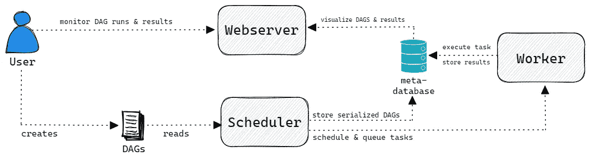
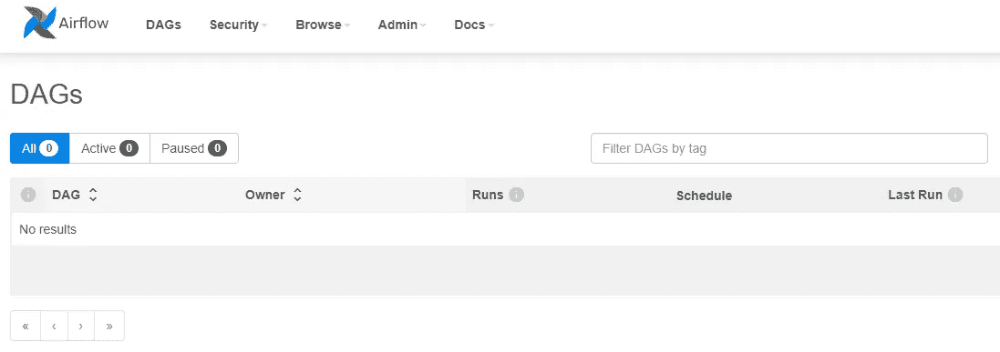
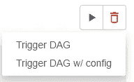
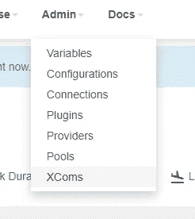

# 用 Docker-Compose 在 5 分钟内设置 Apache 气流

> 原文：<https://towardsdatascience.com/setting-up-apache-airflow-with-docker-compose-in-5-minutes-56a1110f4122>

## 数据工程

## 创建一个开发环境并开始构建 Dag


法比奥·巴拉西纳在 [Unsplash](https://unsplash.com?utm_source=medium&utm_medium=referral) 上拍摄的照片

答虽然参加派对已经很晚了(Airflow 在 2019 年成为了 Apache 的顶级项目)，但我仍然很难找到一个易于理解、最新、轻量级的解决方案来安装 Airflow。

今天，我们将改变这一切。

在下面的小节中，我们将在几分钟内创建一个轻量级的、独立的、易于部署的 Apache Airflow 开发环境。

Docker-Compose 将是我们的亲密伙伴，允许我们创建一个具有快速迭代周期的平滑开发工作流。只需旋转几个 docker 容器，我们就可以开始创建自己的工作流了。

> **注意**:以下设置不适用于任何生产目的，仅用于开发环境。

# 为什么是气流？

Apache Airflow 是一个**面向批处理的框架**，它允许我们轻松地用 Python 构建预定的数据管道。把“工作流当作代码”来想，它能够执行我们可以用 Python 实现的任何操作。

气流本身不是数据处理工具。这是一个**编排软件**。我们可以把气流想象成网中的某种蜘蛛。坐在中间，操纵一切，协调我们数据管道的工作量。

数据管道通常由需要以特定顺序执行的几个任务或动作组成。Apache Airflow 将这样的**管道建模为 DAG** (有向无环图)。一种有向边或任务的图，没有任何回路或循环。


一个简单的例子 DAG[图片作者]

这种方法允许我们并行运行独立的任务，从而节省时间和金钱。此外，我们可以将数据管道分成几个更小的任务。如果作业失败，我们只能重新运行失败的任务和下游任务，而不是重新执行整个工作流。

**气流由三个主要部分组成**:

1.  Airflow **调度器**—air flow 的“心脏”，解析 Dag，检查计划的时间间隔，并将任务传递给工人。
2.  气流**工作人员** —拾取任务并实际执行工作。
3.  Airflow **Webserver** —提供主用户界面来可视化和监控 Dag 及其结果。



气流组件的高级概述[图片由作者提供]

# 逐步安装

现在我们简要介绍了 Apache Airflow，是时候开始了。

## 步骤 0:先决条件

因为我们将使用 docker-compose 来启动和运行 Airflow，所以我们必须首先安装 docker。只需前往官方 Docker 网站[并为您的操作系统下载合适的安装文件。](https://docs.docker.com/get-docker/)

## 步骤 1:创建新文件夹

我们通过简单地为气流创建一个新的文件夹，开始得又好又慢。

只需通过您的首选终端导航到一个目录，创建一个新文件夹，并通过运行以下命令进入该文件夹:

```
mkdir airflow
cd airflow
```

## 步骤 2:创建一个 docker-compose 文件

接下来，我们需要得到一个 docker-compose 文件，它指定了所需的服务或 docker 容器。

通过终端，我们可以在新创建的 Airflow 文件夹中运行以下命令

```
curl [https://raw.githubusercontent.com/marvinlanhenke/Airflow/main/01GettingStarted/docker-compose.yml](https://raw.githubusercontent.com/marvinlanhenke/Airflow/main/01GettingStarted/docker-compose.yml) -o docker-compose.yml
```

或者简单地创建一个名为`docker-compose.yml`的新文件并复制下面的内容。

上面的 docker-compose 文件简单地指定了我们需要启动和运行的服务。最重要的是调度程序、web 服务器、元数据库(postgreSQL)和初始化数据库的 airflow-init 作业。

在文件的顶部，我们利用了一些在每个 docker 容器或服务中常用的局部变量。

## 步骤 3:环境变量

我们成功地创建了一个 docker-compose 文件，其中包含强制服务。然而，为了完成安装过程并正确配置气流，我们需要提供一些环境变量。

不过，在您的 Airflow 文件夹中创建一个包含以下内容的`.env`文件:

上述变量设置数据库凭证、气流用户和一些进一步的配置。

最重要的是，我们将利用的执行器气流。在我们的例子中，我们使用了`LocalExecutor`。

> **注意**:关于不同种类的遗嘱执行人的更多信息可以在[这里](https://airflow.apache.org/docs/apache-airflow/stable/executor/index.html)找到。

## 步骤 4:运行 docker-compose

这已经是它了！

只需前往终端，通过运行

```
docker compose up -d
```

经过一小段时间后，我们可以通过访问`http://localhost:8080`来检查结果和气流 Web UI。一旦我们用我们的凭证登录(airflow: airflow ),我们就可以访问用户界面。



气流 2 Web UI[作者截图]

# 快速测试

有了工作气流环境，我们现在可以创建一个简单的 DAG 用于测试目的。

首先，确保运行`pip install apache-airflow`来安装所需的 Python 模块。

现在，在 Airflow 文件夹中，导航到`dags`并创建一个名为`sample_dag.py`的新文件。

我们定义了一个新的 DAG 和一些非常简单的任务。

除了在 Web UI 中创建一个模型任务之外，`EmptyOperator`没有任何实际用途。通过利用`BashOperator`，我们创建了一个有点创造性的输出“HelloWorld！”。这使我们能够直观地确认正常运行的气流设置。

保存文件并转到 Web UI。我们现在可以通过手动触发来启动 DAG。



手动触发 DAG[作者截图]

> **注意**:您的 DAG 可能需要一段时间才会出现在 UI 中。我们可以通过在我们的终端`docker exec -it --user airflow airflow-scheduler bash -c "airflow dags list"`中运行以下命令来加快速度

运行 DAG 不会超过几秒钟。

一旦完成，我们可以导航到`XComs`并检查输出。



导航到 air flow XComs[作者截图]


检查输出[作者截图]

这就是了！

我们成功地用 docker-compose 安装了 Airflow，并进行了快速测试。

> **注意**:我们可以通过简单地执行`docker compose down`来停止正在运行的容器。

</how-to-design-better-dags-in-apache-airflow-494f5cb0c9ab>  

# 结论

Airflow 是一个面向批处理的框架，允许我们用 Python 创建复杂的数据管道。

在本文中，我们创建了一个简单易用的环境来快速迭代和开发 Apache Airflow 中的新工作流。通过利用 docker-compose，我们可以直接开始工作并编写新的工作流程。

但是，这样的环境应该只用于开发目的，不适合任何需要更复杂和分布式的 Apache Airflow 设置的生产环境。

你可以在我的 GitHub 上找到完整的代码。

*喜欢这篇文章吗？成为* [*中级会员*](https://medium.com/@marvinlanhenke/membership) *继续无限学习。如果你使用下面的链接，我会收到你的一部分会员费，不需要你额外付费。*

<https://medium.com/@marvinlanhenke/membership>  

**参考资料/更多资料:**

*   [气流文件](https://airflow.apache.org/docs/apache-airflow/stable/start/docker.html)
*   朱利安.德.鲁特.巴斯.哈伦斯克。阿帕奇气流的数据管道。纽约:曼宁，2021。