# 为电源和智能结果设置电源 BI

> 原文：<https://towardsdatascience.com/setting-up-power-bi-for-power-and-intelligent-results-6612b2fed574>

## 并理解为什么

奥拉夫·阿伦斯·罗特内在 [Unsplash](https://unsplash.com?utm_source=medium&utm_medium=referral) 上的照片

# 介绍

微软 Power BI 是一个流行且强大的商业智能平台，用于[推动各行各业多个组织的分析](https://www.gartner.com/reviews/market/analytics-business-intelligence-platforms/vendor/microsoft/product/microsoft-power-bi/reviews)。如果您渴望在分析和可视化领域找到一份职业，或者希望扩展您的数据工具集，Power BI 当然值得学习。本教程介绍 Power BI desktop，重点介绍如何配置 Power BI，以便高效地提供值得信赖的见解。本教程结束时，您将:

*   了解 Power BI Desktop 和 Power BI service 之间的区别，
*   配置 Power BI Desktop 以实现更高效(更少出错)的使用，
*   能够将存储在逗号分隔值(CSV)文件中的数据加载到 Power BI 中，
*   了解如何操作数据集中列的默认汇总方法。

# 装置

Power BI Desktop 免费下载。要安装，请转到 [Power BI 桌面网页](https://powerbi.microsoft.com/en-us/landing/free-account/?&ef_id=CjwKCAjwuYWSBhByEiwAKd_n_kyTC2w5CrCuvjak3k4BvdcTkHfQrsVC223trjTR9dQK_TYjZmJnPxoCQ1MQAvD_BwE:G:s&OCID=AID2202141_SEM_CjwKCAjwuYWSBhByEiwAKd_n_kyTC2w5CrCuvjak3k4BvdcTkHfQrsVC223trjTR9dQK_TYjZmJnPxoCQ1MQAvD_BwE:G:s&gclid=CjwKCAjwuYWSBhByEiwAKd_n_kyTC2w5CrCuvjak3k4BvdcTkHfQrsVC223trjTR9dQK_TYjZmJnPxoCQ1MQAvD_BwE)并点击**免费下载**按钮。如果出现提示，请打开 Microsoft Store，并按照 Microsoft Store 中 Power BI Desktop 页面中的说明进行操作。

现在，在我们进一步讨论之前，有两个警告值得一提。

*   首先，Power BI Desktop 仅在 Windows 上可用。如果你是 Mac 用户，并且想使用 Power BI Desktop，我建议你使用虚拟桌面软件，如 [Parallels](https://www.parallels.com/pd/general/?gclid=CjwKCAjwuYWSBhByEiwAKd_n_hU6xzSaWqu9eN7h_BIBImy0waumQRT8LyQb_c8RJtws_RLk1VE_KhoC6g4QAvD_BwE) 或在 Mac 上使用 [Boot Camp](https://support.apple.com/boot-camp) 双启动 Windows。
*   其次，要知道微软的 [Power BI service](https://docs.microsoft.com/en-us/power-bi/fundamentals/power-bi-service-overview) 和 Power BI Desktop 的区别，Power BI service 是一个软件即服务(SaaS)平台。如果您在使用 Power BI 的组织中工作，您可能会遇到可以在线访问的 Power BI 仪表盘。仪表板的在线部署和使用使用 Power BI 服务。Power BI Desktop 是一个免费的 Windows 应用程序，用于创建仪表板、报告和其他数据可视化资产。Power BI Desktop 创建的数据可视化资产可以保存为 Power BI Desktop 文件(PBIX ),可以与其他 Power BI Desktop 用户共享或在线部署(如果您在使用 Power BI 服务的组织中拥有 Microsoft 帐户)。有关 Power BI 服务和 Power BI 桌面之间的差异的更多信息，请参见[这篇文章](https://docs.microsoft.com/en-us/power-bi/fundamentals/service-service-vs-desktop)。

# 一些配置建议

安装完成后，打开 Power BI Desktop。继续并关闭介绍性的 Power BI 桌面窗口，它类似于下图。

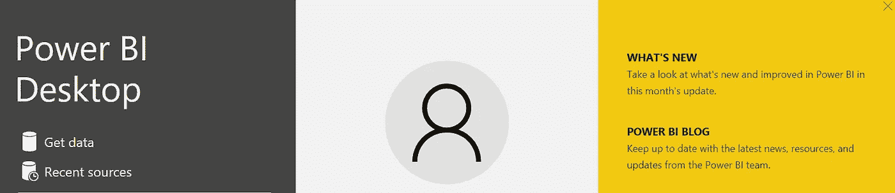

作者图片

然后导航到实际的 Power BI 桌面界面，如下所示。

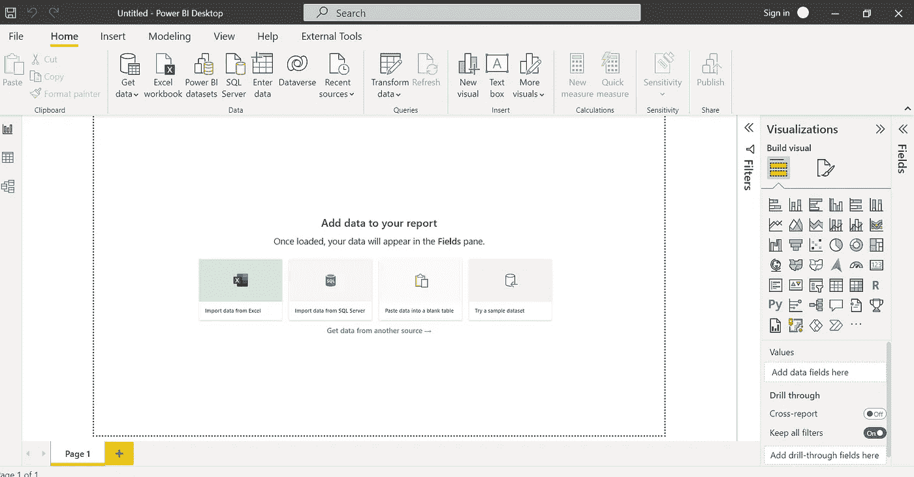

作者图片

至此，有几个配置我想推荐一下。首先，导航到*文件*，在打开的下一个侧菜单中选择*选项和设置*，然后在*选项和设置*界面中选择*选项*。

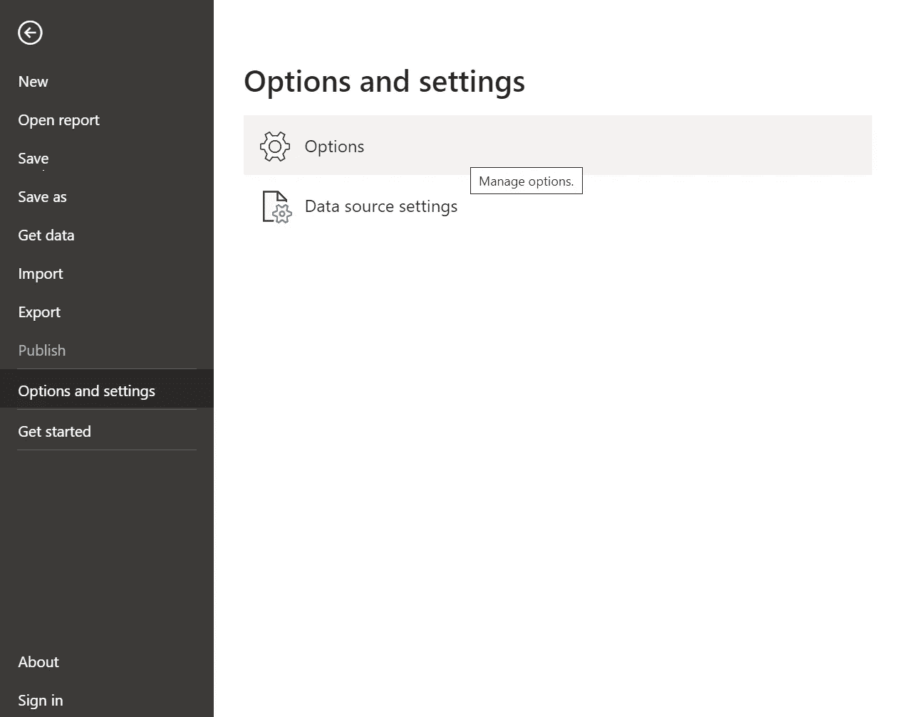

作者图片

我建议在*全局*选项的*数据加载*选项卡下设置以下配置选项。

*   在*类型检测*部分，选择**从不检测非结构化源的列类型和标题。**选择此选项将确保在用新数据刷新 Power BI 文件时，列的数据类型不会被意外更改。此外，确保不自动检测列类型和标题有助于加快刷新速度。欲了解更多信息，请参阅本文。

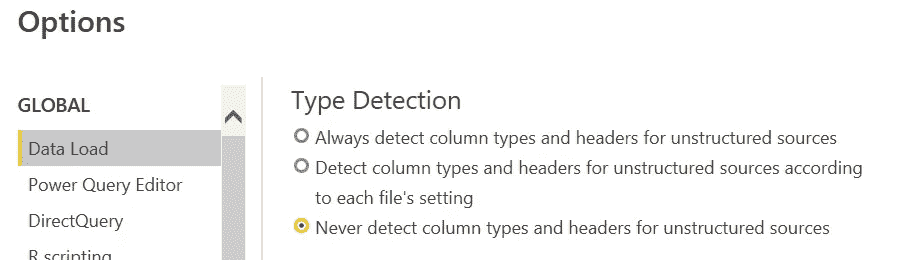

作者图片

*   在*时间智能*部分，关闭新文件的**自动日期/时间。如果该选项保持启用，Power BI 将自动为数据集中的任何日期列创建一个日历层次结构。也就是说，用户将能够深入到日期的年、季度、月和日级别。虽然自动化这个层次结构在某些上下文中可能有用，但是这个选项增加了 Power BI 中的[数据模型](https://exceleratorbi.com.au/what-is-a-power-bi-data-model/)的大小。查看[这篇文章](/tiq-part-1-how-to-destroy-your-power-bi-model-with-auto-date-time-8fec32b22aff)了解更多详情。**

作者图片

接下来*，在*当前文件*选项的*数据加载*标签中，取消**刷新数据时更新或删除关系**和**数据加载后自动检测新关系。**禁用这些选项允许用户控制在 Power BI 中管理表之间的[关系](https://radacad.com/back-to-basics-power-bi-relationship-demystified)的方式。否则， [Power BI 可能无法正确指定](https://radacad.com/power-bi-design-tip-disable-the-auto-detect-relationship)表之间的关系。*

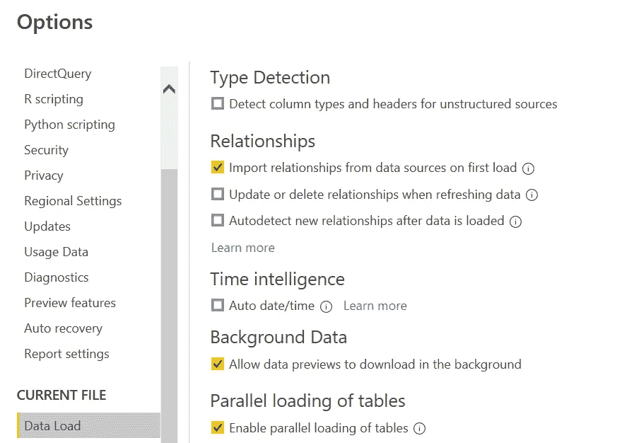

作者图片

# 加载数据

现在，让我们将一些数据放入 Power BI Desktop。本教程使用了 Kaggle 上发布的《2022 年世界幸福报告》的数据集。数据存储在一个 CSV 格式的文件中，可以从[这里](https://www.kaggle.com/datasets/ajaypalsinghlo/world-happiness-report-2022)下载。

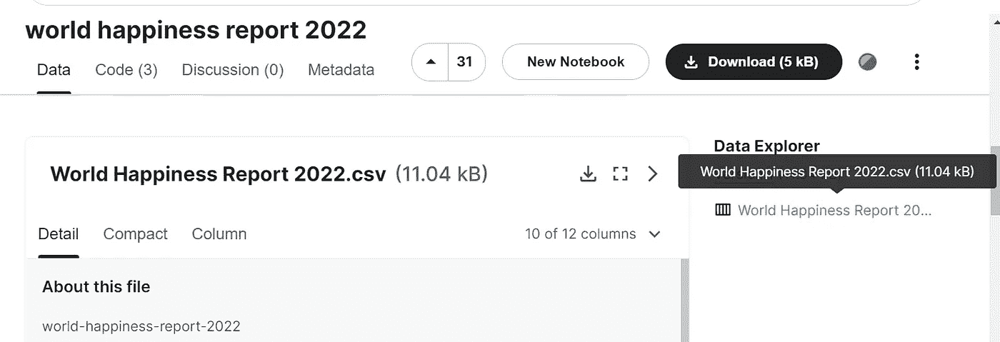

作者图片

一旦世界幸福报告 2022 CSV 文件下载到您的计算机，返回 Power BI 桌面并点击*主页*选项卡中的*获取数据*菜单。正如您将看到的，这里的*获取数据*菜单包含从不同来源获取各种数据的选项，这是 Power BI 非常强大的特性之一。出于本教程的目的，我们想要加载一个 CSV 文件，因此在展开的*获取数据*菜单中找到并点击*文本/CSV* 。

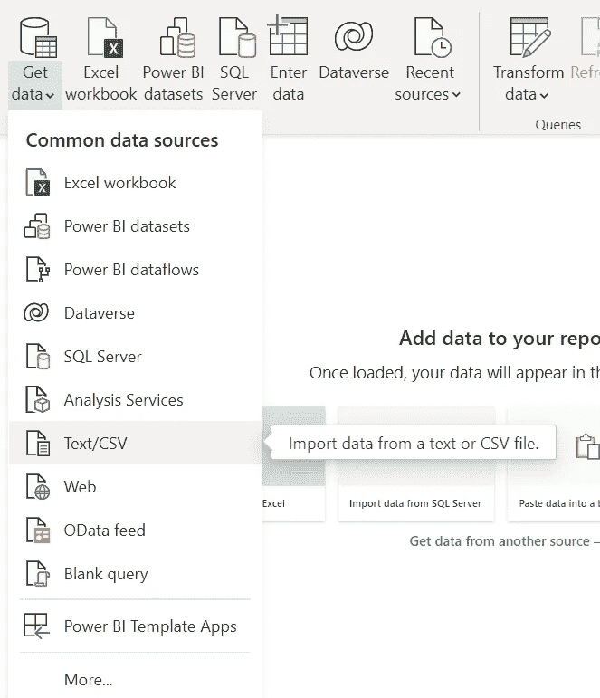

作者图片

现在，Windows 资源管理器将会打开。导航到下载《世界幸福报告 2022》CSV 文件的文件夹，选择 CSV 文件，点击*打开*按钮。接下来，将出现 CSV 文件中数据的预览。

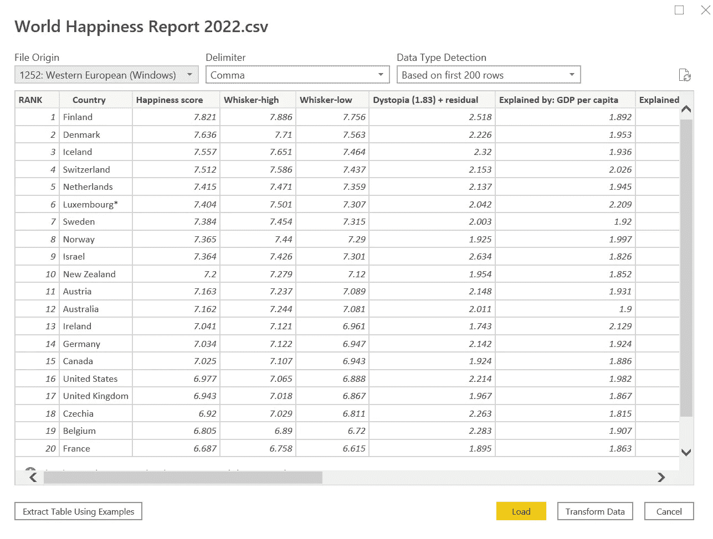

作者图片

如果我们需要清理和/或操作数据(例如，删除不必要的列，更改特定列的格式，删除重复的记录等。)，我们可以选择右下角的*转换数据*按钮，这将打开 [*电力查询*](https://docs.microsoft.com/en-us/power-query/power-query-what-is-power-query) ，这是一个准备数据的有用工具。

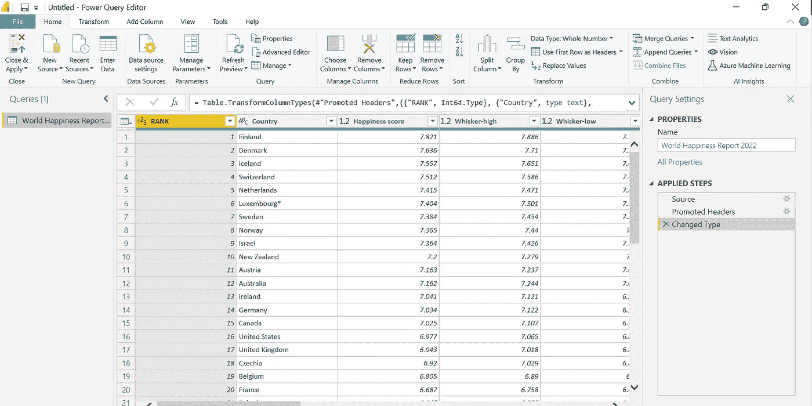

作者图片

然而，出于本教程的目的，请点击数据预览窗口右下角的*加载*按钮。

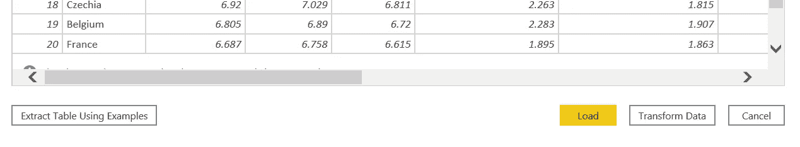

作者图片

你现在会看到《2022 年世界幸福报告》的数据出现在*字段*窗格下。

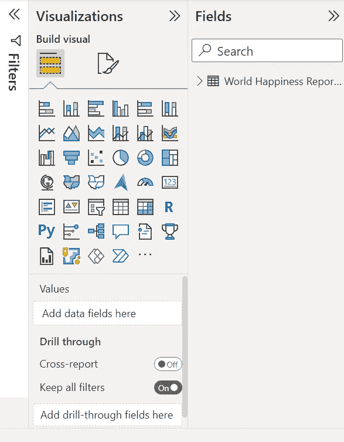

作者图片

点击世界幸福报告数据左侧的箭头，您将能够查看数据中的列。

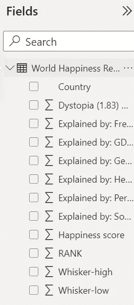

作者图片

## 那些σ符号是什么？

您可能想知道为什么除了 Country 之外的所有列都有一个求和符号(σ)。求和符号表示默认汇总用于这些列，默认情况下，汇总是给定列的所有行值的总和。举例来说，如果我们将*幸福得分*列拖到报告画布上，我们将看到一个条形图，其中一个条形显示了数据中所有幸福得分值的总和。

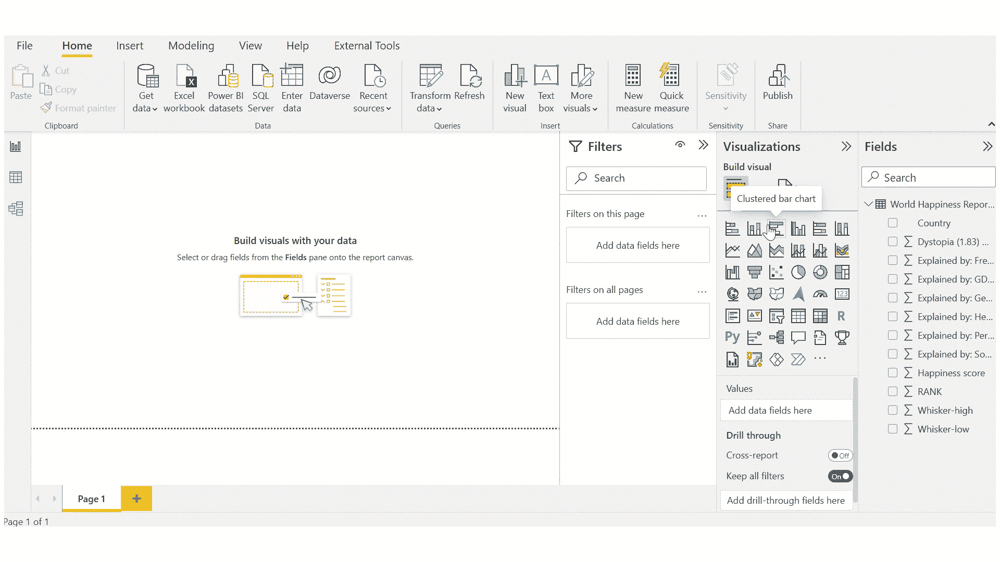

作者截图

作为检查，如果我们在 Excel 中打开世界幸福报告数据，并对幸福得分列求和，我们会得到 810.82 的值，与 Power BI Desktop 中显示的值相同。

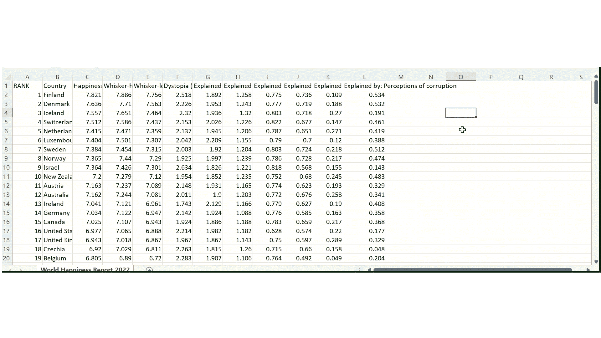

作者截图

这里，有两点值得一提。

*   首先，Country 列没有默认汇总，因为该列包含文本值(例如，“美国”、“加拿大”、“洪都拉斯”)，这些值不能进行数字汇总，例如 sum 或 means。
*   其次，了解默认总结也很重要，因为有时您可能需要除求和之外的特定总结方法，或者根本不需要总结。例如，如果您想要显示某一列的平均值，但保留默认的汇总，并显示感兴趣的列的总和，您可能会有一个非常困惑的观众。

关于上面的第二点，可以通过从当前的*报告*视图导航到*数据*视图来改变默认汇总或移除列的默认汇总。接下来，选择感兴趣的列，然后从*列工具*选项卡中的*汇总*下拉菜单中选择不同的选项。例如，下面的录音显示了如何删除幸福分数列的默认摘要。

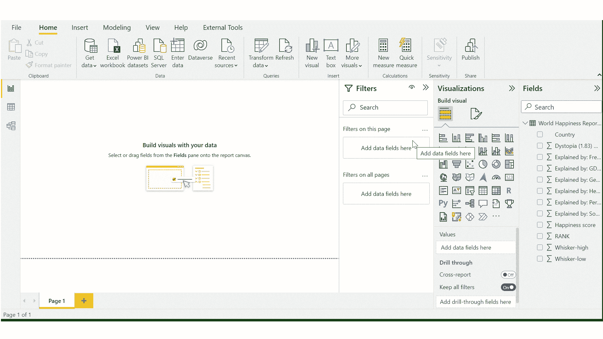

作者截图

哒哒！幸福分数栏不再有求和符号。

作者图片

那么，这种改变的实际效果如何呢？如果我们将快乐分数拖到报告画布中，将会出现一个包含数据中每一行的快乐分数值的表格。为什么？我们告诉 Power BI 不要汇总幸福分数列，所以现在显示属于该列的实际值。

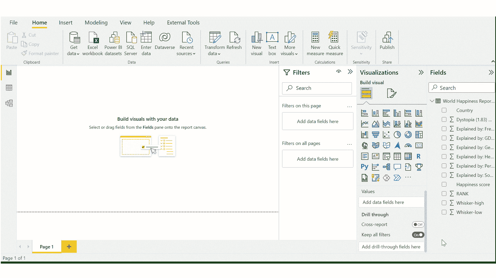

作者截图

好了，我们现在有了一个幸福分值的表格，但是如果我们想把这个表格包含在一个实际的仪表板或报告中，它将不会非常有用，因为没有办法知道与每个幸福分值相关联的国家。幸运的是，通过将 country 列拖到表中，我们可以很容易地将国家名称添加到这个表中。

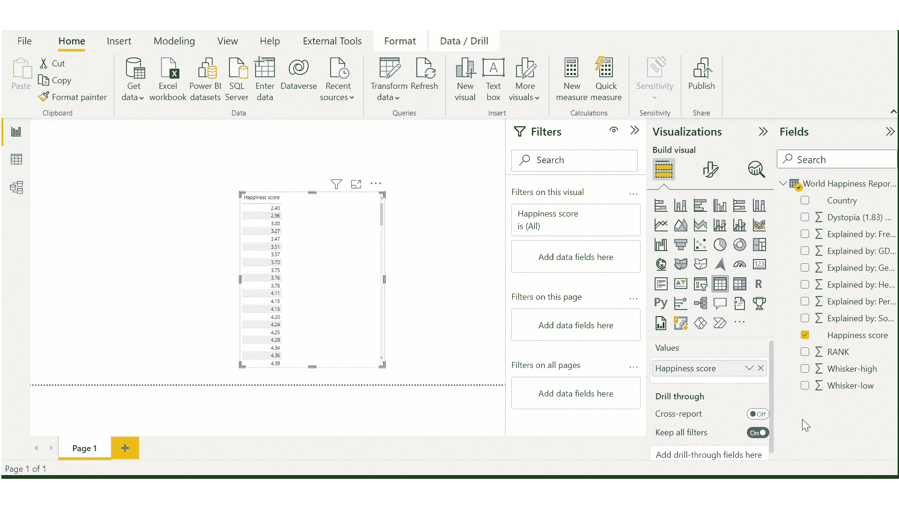

作者截图

请注意，在上面记录的结尾，我改变了列的顺序，这样国家将出现在第一个。如果我们决定不要这张桌子，我们需要做的就是选择桌子，然后点击桌子上方*更多选项*菜单中的*移除*(见桌子上方的三个点)。

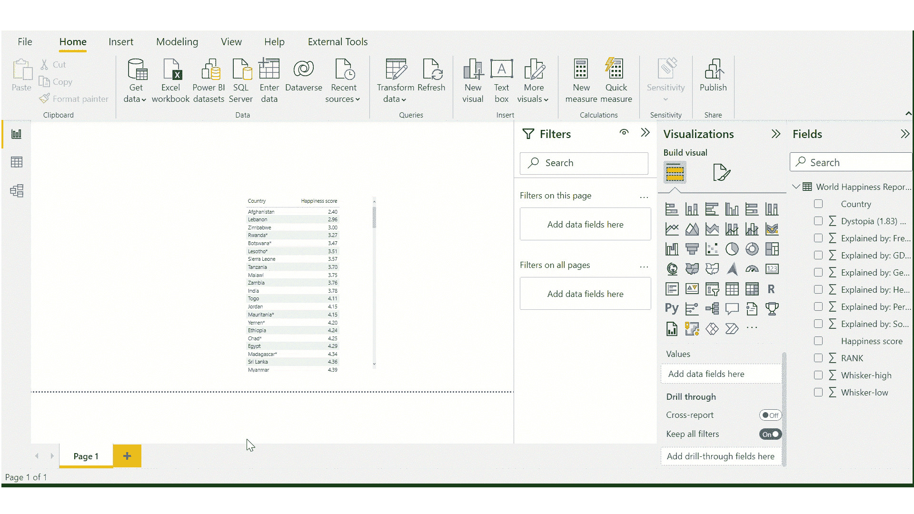

作者截图

# 结论

Power BI Desktop 易于安装。尽管如此，有效和高效地使用 Power BI 需要额外关注细节。本教程涵盖了一些基本的细节，可以帮助您和任何数据可视化的消费者获得更好的 Power BI 体验。特别是，阅读完本教程后，您现在已经掌握了一些有用的知识，可以帮助您设置 Power BI 以获得更好的性能、接收数据并理解默认总结的作用。

一如既往的感谢阅读！欢迎建设性的反馈、意见和问题。