# 在 M1 Mac 上用 Visual Studio 代码(VSCode)设置 Python、Julia 和 R

> 原文：<https://towardsdatascience.com/setting-up-python-julia-and-r-in-visual-studio-code-vscode-on-an-m1-mac-3e904a65b62b>

## Python，R & Julia

# 在 M1 Mac 上用 Visual Studio 代码(VSCode)设置 Python、Julia 和 R

## 随机想到在 VSCode 中使用 R 花了我两天时间来设置…

Python、Julia 和 R 是数据科学家使用的 3 种主要编程语言，我总是想从不同方面比较这 3 种语言。

我一直在想 R 真的是最适合统计分析的吗？Python 更新了这么多真的还是比 Julia 慢吗？在数据科学和数据分析项目中，3 种语言中哪一种最容易应用？谁知道呢？也许把这三种语言结合起来会创造出一件艺术品。


在 [Unsplash](https://unsplash.com/s/photos/mix?utm_source=unsplash&utm_medium=referral&utm_content=creditCopyText) 上由 [Eiliv-Sonas Aceron](https://unsplash.com/@shootdelicious?utm_source=unsplash&utm_medium=referral&utm_content=creditCopyText) 拍摄的照片

比较这 3 种语言最简单的方法是将它们全部安装在 VSCode 上，它支持所有 3 种语言，我不需要在不同的 ide 之间切换。

# 设置 Python

> 在 VSCode 中设置 Python 很简单，☺️.

你所需要的就是**下载并安装 Python 解释器**和 **Python 扩展**。VSCode 足够智能，可以在 Mac 上检测 Python😊，所以不需要为 Python 设置路径。

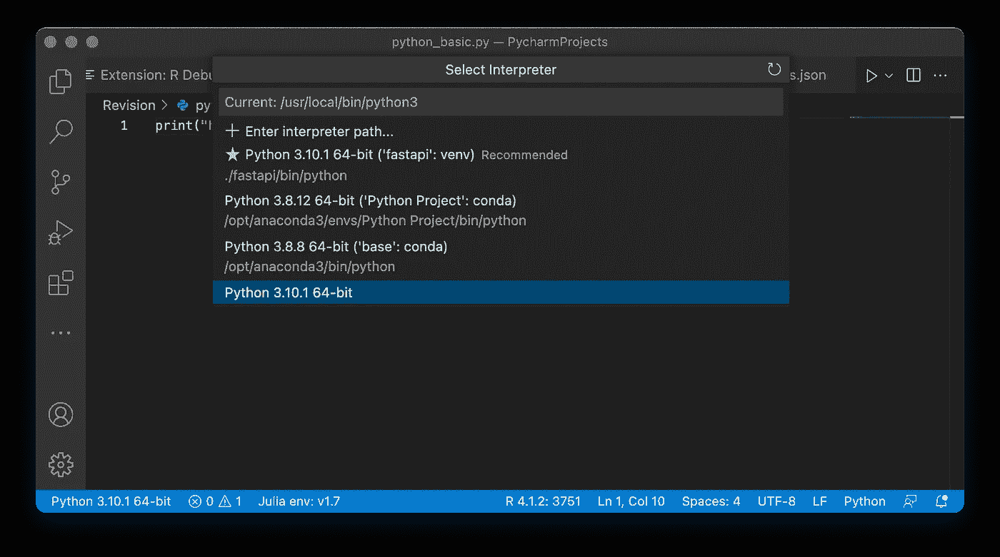

VSCode 检测到我的 Mac 上所有可用的 Python 解释器。图片作者。

## 下载并安装 Python

你可以通过 Python.org 的[安装 Python，或者如果你安装了 Anaconda 的话，可以使用 Anaconda](https://www.python.org/downloads/) 的 Python。

如你所见，我有一些 Python 解释器，原生 Python、虚拟环境中的 Python 和 Anaconda Python。VSCode 能够检测到所有这些。

## 在 VSCode 中安装 Python 扩展

下一步是安装两个 Python 扩展包，如下所示。同样，VSCode 足够聪明，可以向您建议运行 Python 所需的所有扩展包。

1.  来自微软的 Python 扩展(扩展 ID: ms-python.python)
2.  微软的 Pylance 扩展(扩展 ID: ms-python.vscode-pylance)

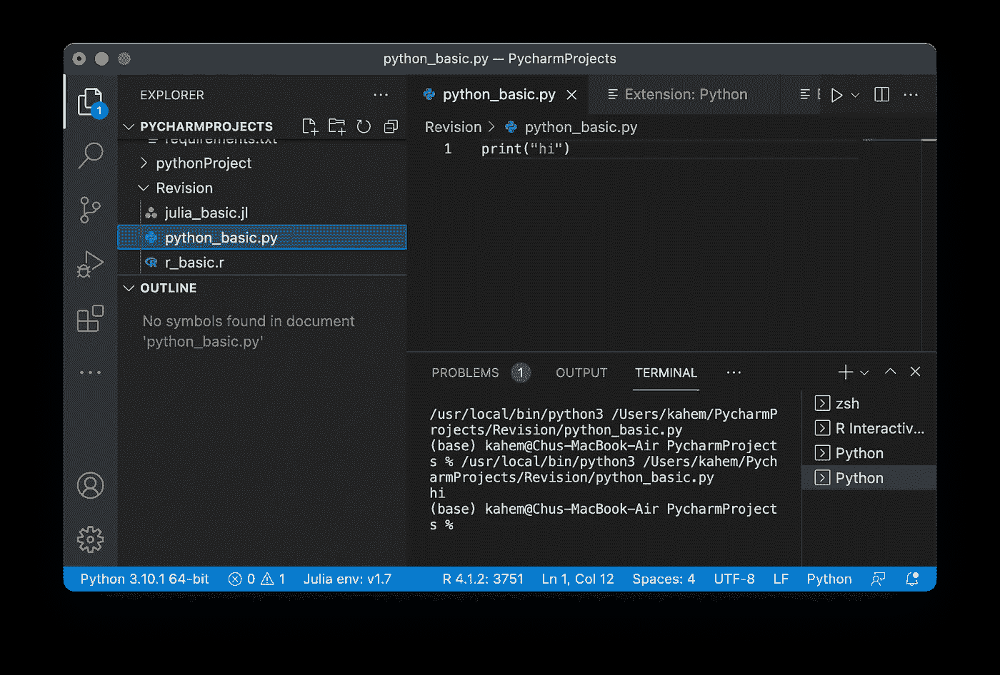

VSCode 上的 Python。图片作者。

你也可以在 VSCode 中运行 Jupyter Notebook 文件，你需要做的就是安装如下的扩展包。

1.  微软的 Jupyter 扩展(扩展 ID: ms-toolsai.jupyter)

这个扩展包附带了两个扩展包。

1.  Jupyter 键图
2.  Jupyter 笔记本渲染器

有了所有这些扩展包，您现在可以在 VSCode 上使用 Python 和数据科学家最喜欢的 Jupyter 笔记本。

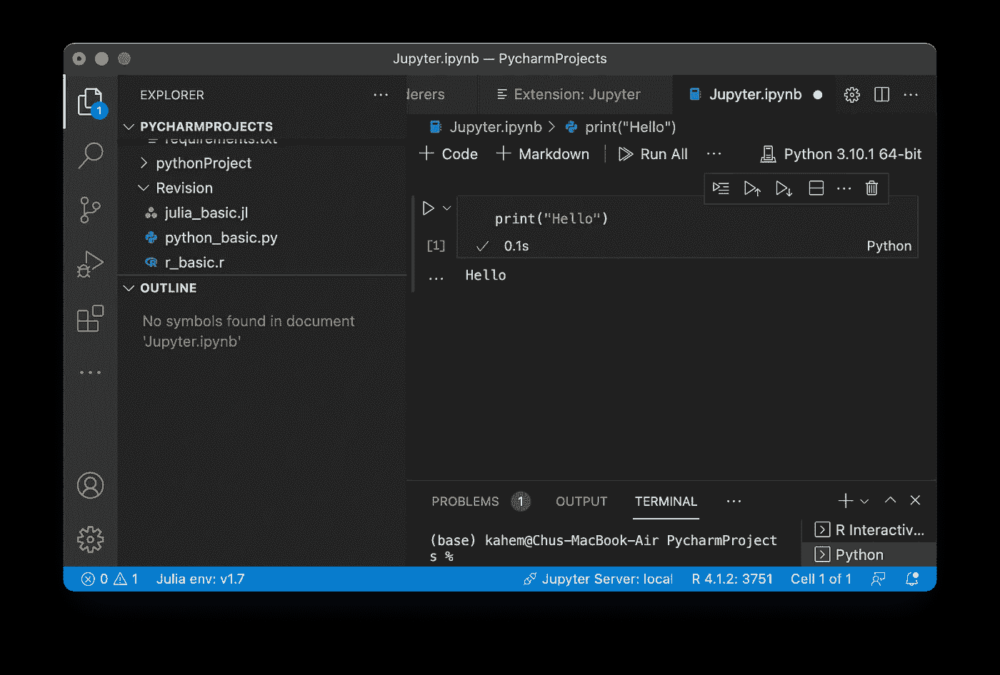

VSCode 上的 Jupyter 笔记本。图片作者。

有时，你可能需要一些额外的扩展包，VSCode 会聪明地向你推荐❤️.

# **设置朱莉娅**

对于朱莉娅，我必须手动设置路径。因此，设置 Julia 有 3 个步骤。

1.  安装并下载[茱莉亚](https://julialang.org)
2.  在 VSCode 中安装 julialang 的 Julia 扩展(扩展 ID: julialang.language-julia)
3.  设置 Julia 路径

我刚接触 MacOS，所以要花一些时间才能找到 Julia 的可执行文件。对于像我一样对苹果电脑不熟悉的人，我会牵着你的手走过这个❤️.

对我来说，我在应用程序文件夹里找到了我的朱莉娅。

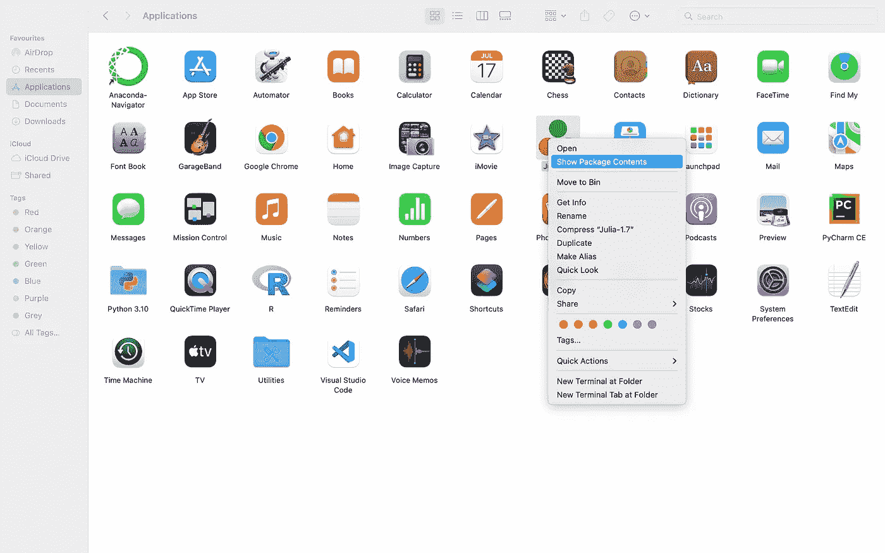

朱莉娅的位置。图片作者。

右键单击 Julia 图标，然后选择“显示包内容”，它将引导您进入下面的窗口。

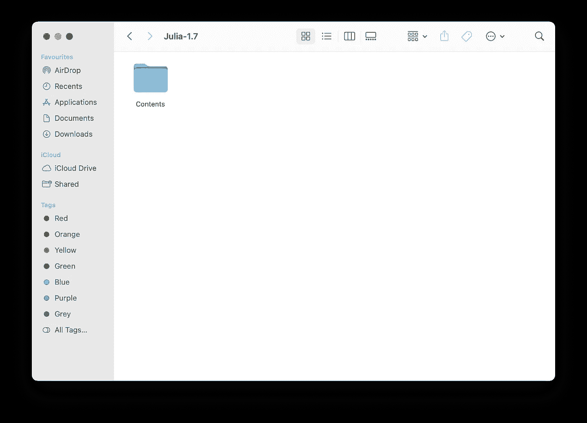

Julia 包内容。图片作者。

在内容文件中，有几个文件夹。我在资源文件夹中找到了 Julia 可执行文件，Julia 可执行文件的完整路径如下:

*/应用程序/Julia-1.7 . app/内容/资源/julia/bin*

你的道路可能与我的不同，因为我发现的一些资源与我的不同。

您可以通过右键单击 Julia 可执行文件，然后选择“获取信息”来复制路径。说明这一点是因为我对我的 Mac 电脑还很陌生😂，对我来说一切都需要时间。

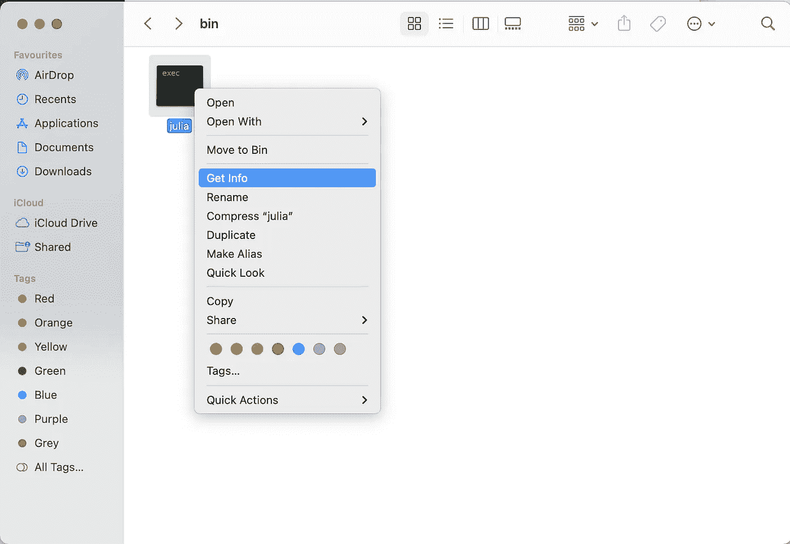

获取 Julia 可执行文件路径。图片作者。

所以现在你得到了朱莉娅路径。有两种方法可以设置路径。

## 管理图标中的设置

您可以通过单击“管理”打开“设置”，这是位于 VSCode 左侧面板最底部的⚙️图标，如下所示。

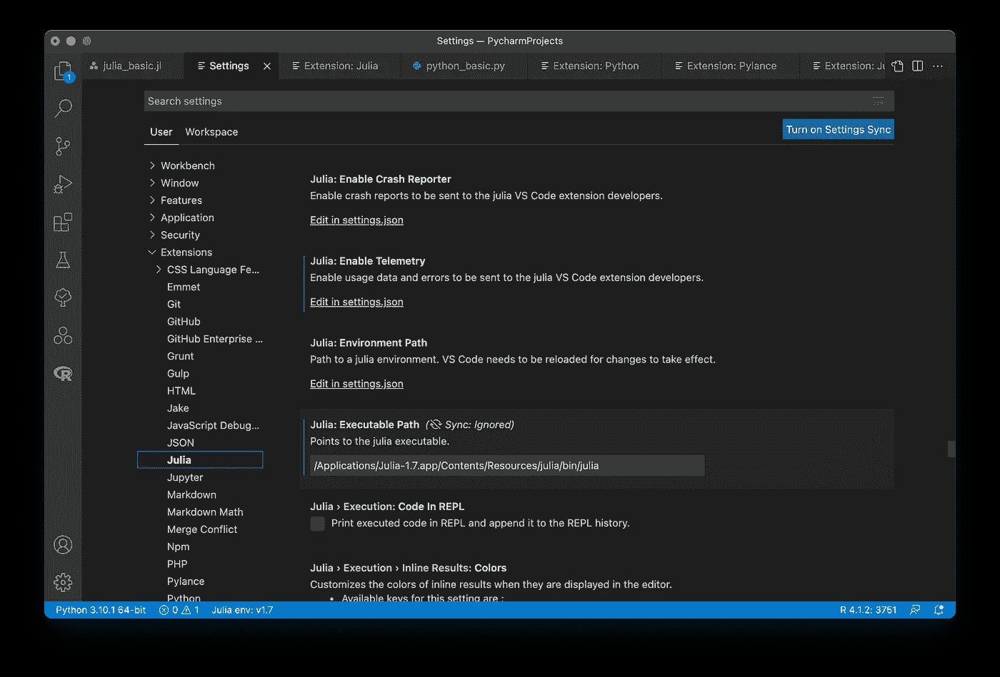

朱莉娅的设置。图片作者。

然后，在“扩展”，选择“朱莉娅”并向下滚动，直到你看到朱莉娅:可执行路径，粘贴您的路径在提供的空间。

## CMD + Shift + P

在 VSCode 下，按下键盘上的这 3 个键，将弹出如下的*命令面板*。你也可以打开*命令面板*，在顶部的功能栏上查看。

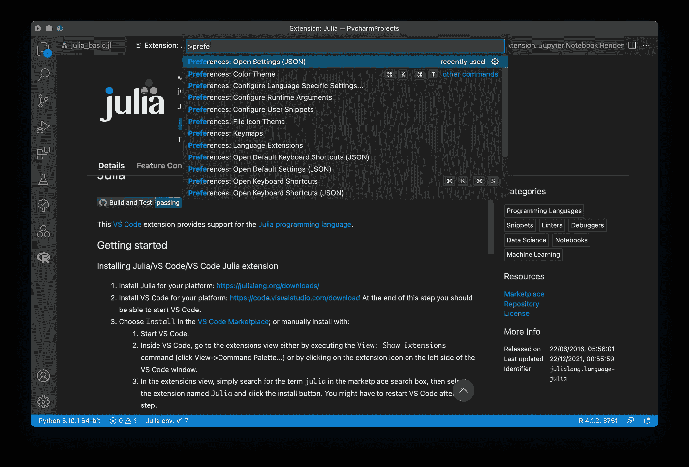

VSCode 命令调色板。图片作者。

搜索并选择*“首选项:打开设置(JSON)”*

```
"julia.executablePath": "/Applications/Julia-1.7.app/Contents/Resources/julia/bin/julia"
```

将路径修改为您之前获得的路径。

现在你都准备好了。

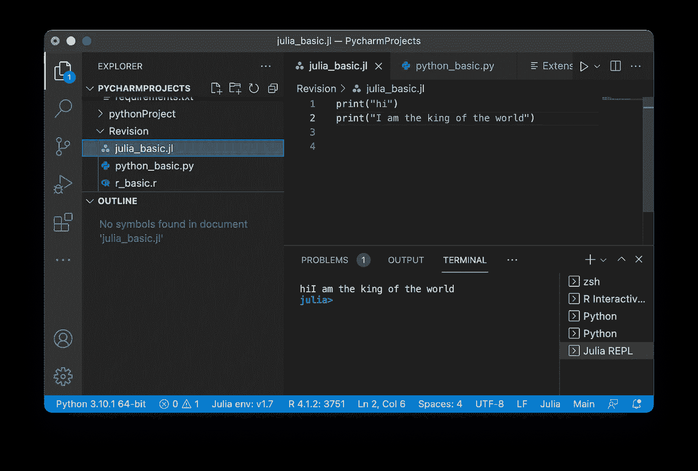

VSCode 里的 Julia。图片作者。

# 设置 R

当我在 VSCode 中设置 R 时，我会参考这两篇文章。

1.  [设置 Visual Studio 代码以在 VSCode 2021 上运行 R](https://www.r-bloggers.com/2021/01/setup-visual-studio-code-to-run-r-on-vscode-2021/)
2.  [Varun 的 VSCode 中 R 的全新开始](https://medium.com/analytics-vidhya/a-fresh-start-for-r-in-vscode-ec61ed108cf6)

两篇文章都很惊人，但可能由于 VSCode 的新更新，有一些细微的变化。

安装步骤参考第一篇，修改 *setting.json* 中的线条参考第二篇。

1.  [**下载安装 R**](https://cran.r-project.org)
2.  **通过 R 控制台**安装 R 包*“language server”*

```
install.packages("languageserver")
```

**3。安装 R 扩展组件**

需要两个 R 扩展包

*   r 由上田祐挥提供(分机 ID: ikuyadeu.r)
*   上田祐挥的 R 扩展包(扩展 ID: ikuyadeu.r-pack) —该扩展包包括在 VSCode 中已从市场上移除的 **R-LSP** 扩展包。

**4。通过 pip** 安装*弧度*

Radian 是一个 python 包，因此，如果您还没有安装 Python，应该先安装它。

```
pip3 install -U radian
```

**5。启用 r.bracketedPaste 以使用弧度**

**6。设置可执行路径**

对于第 5 步和第 6 步，可以通过更新 *setting.json* 中的行来一起完成，如下所示。

首先，使用快捷键 **Cmd + Shift + P** 或通过 VSCode 顶部功能栏的**视图**调出*命令面板*。然后，搜索*“首选项:打开设置(JSON)”*并修改如下行。

```
{"r.bracketedPaste": true,"r.alwaysUseActiveTerminal": false,"r.rpath.mac": "<path for R executable file>","r.rpath.linux": "","r.rterm.mac": "<path of python packages radian>","r.lsp.path": "<path for R executable file>","r.lsp.debug": true,"r.lsp.diagnostics": true,"r.rterm.option": [
"--no-save",
"--no-restore",
"--r-binary=<path for R executable file>"]}
```

下面是我的 *setting.json* 在设置好 Julia 和 r 之后的样子。

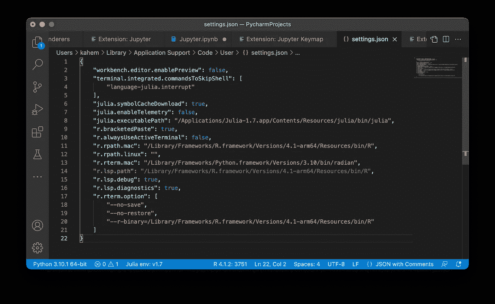

Setting.json. Image 作者。

现在你已经准备好了！

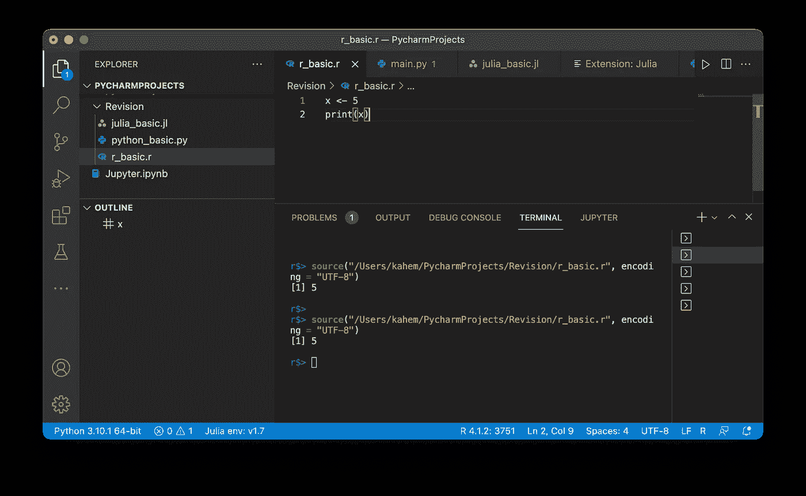

VSCode 中的 r。图片作者。

令人惊讶的是，Python 和 R 的可执行文件与 Julia 的不同。所以当我为 R 设置路径的时候，我不得不使用`find.package(“languageserver”)` 来定位安装的库的路径，然后找到 R 的可执行文件。

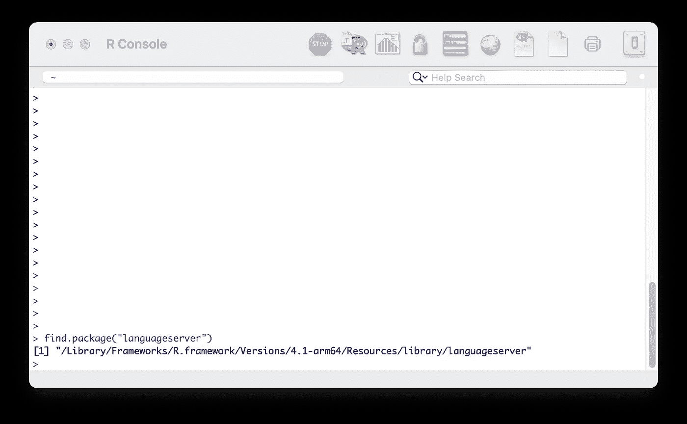

r 控制台。图片作者。

我们刚刚完成了在 VSCode 中设置 Python、Julia 和 R😄。现在，您可以在一个 IDE 中使用所有三种语言。

> 干得好！

# 保持联系

在 YouTube[上订阅](https://www.youtube.com/channel/UCiMtx0qbILP41Ot-pkk6eJw)


照片由[莫里茨·克纳林格](https://unsplash.com/@mokngr?utm_source=unsplash&utm_medium=referral&utm_content=creditCopyText)在 [Unsplash](https://unsplash.com/s/photos/happy-new-year?utm_source=unsplash&utm_medium=referral&utm_content=creditCopyText) 上拍摄

*祝贺并感谢你阅读到最后。希望你喜欢这篇文章。*😁

> 新年快乐！