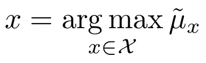
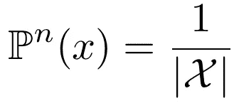
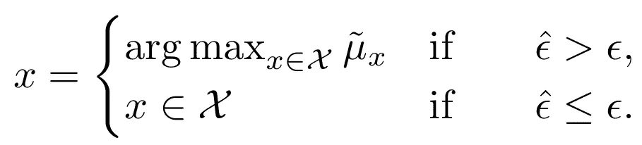
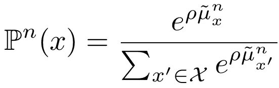
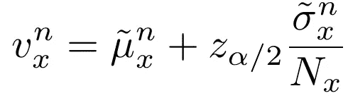
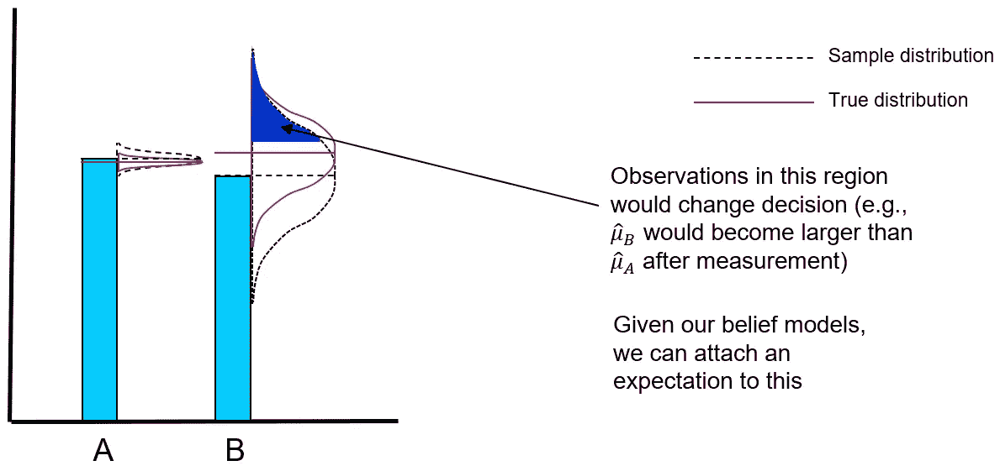

# 你应该知道的强化学习中的七个探索策略

> 原文：<https://towardsdatascience.com/seven-exploration-strategies-in-reinforcement-learning-you-should-know-8eca7dec503b>

## 纯探索和开发，ϵ-greedy，玻尔兹曼探索，乐观初始化，置信区间，知识梯度

霍利·曼达里奇在 [Unsplash](https://unsplash.com?utm_source=medium&utm_medium=referral) 上拍摄的照片

**探索-开发困境**在日常生活中无处不在。一旦你找到一家你喜欢的餐馆，你可能会决定下半辈子都去同一家餐馆，利用你积极的经历。然而，探索新的场地也有一定的吸引力。是的，你可能会有一些痛苦的经历，但你也可能会找到一个新的最爱！在探索和利用之间找到适当的平衡至关重要。

在强化学习中，困境同样重要。对于中等现实的问题，问题的规模是巨大的，计算是昂贵的(如果不是，我们可以只是列举)。因此，我们想要学习好状态的精确值，而不是在低质量的状态上浪费宝贵的(计算)预算。与此同时，过于狭窄的焦点可能会让我们陷入局部最优。

我们可以把这个问题形式化如下。给定某个**度量预算**，我们的目标是以这样一种方式分配我们的度量，即我们识别最显著的[状态](/a-deep-dive-into-problem-states-498ad0746c98)。根据大数定律，通过无限多的样本，我们将逼近一个状态的真实值。然而，有限的测量预算不能完全解决不确定性，样本均值可能偏离真实均值。换句话说，我们不确定我们是否真正确定了具有最高值的州。

**在这个上下文中，一个测量值是决定样品的一个特定状态。这个概念可以很容易地扩展到(顺序)动作选择问题，例如在 Q-learning 和 SARSA 这样的算法中遇到的问题。*

出于本文的考虑，让我们假设状态空间是可枚举的，并且每个**度量都有一个显著的成本**(计算的或金钱的)。想一想在你的[数字孪生](/need-help-making-decisions-ask-your-digital-twin-6e4cf328cb0)环境中的冗长模拟或者[真实世界](/five-things-to-consider-for-reinforcement-learning-in-business-environments-23647a32f01f)观察——足以明智地选择你的测量。

这个问题可以想象如下。假设我们从一个噪声函数中采样，状态 *x∈X* 的测量值**在真实平均值 *μ_x* 附近有一些不确定性(即标准偏差 *σ_x* )。通过绘制测量值，我们能够**构建样本均值**——在本文中用 a ~表示——最终应该收敛到真实均值。然而，有限的测量预算意味着我们无法详尽地测量每个州。

***为简单起见，我们假设可以直接确定要测量的状态。将本文中的策略扩展到顺序决策问题是很简单的，在顺序决策问题中，我们选择引导我们进入新状态的行动。*

够了*解释*，让我们转移到*探索*攻略！

# 一.纯粹的剥削

在像 [Q-learning 和 SARSA](/walking-off-the-cliff-with-off-policy-reinforcement-learning-7fdbcdfe31ff) 这样的算法中，你通常会在所有 Q 值上看到一些最大化器。在这个简化的问题设置中，我们等效地选择具有**最高期望值**的状态:

纯粹的剥削总是选择最好的已知状态。由于最初的估计往往很差，所以很容易陷入局部最优。

这个表达式暗示我们选择最好的状态，**给定我们当前估计的状态值**。尤其是在早期，这些估计可能非常糟糕。在没有先验知识的情况下，我们甚至可能简单地将状态值初始化为 0 或另一个任意数。

考虑到利用的本质，值**的初始化非常重要**(参见策略四)。假设你用零初始化你的表。然后，一个积极的观察就足以产生积极的回报估计，并观察相同的选项，直到时间结束。

即使我们在开发之前强制观察每个状态至少一次，最初的观察结果也可能与真实值相差甚远。因此，纯粹的开发倾向于对很少的状态给出非常精确的估计，通常会快速收敛到局部最优**而忽略状态空间的大部分。**

# 二。天真的探索

纯粹探索的两极对立是完全随机地探索状态。我们给每个状态分配一个**相等的概率，并相应地采样:**

天真探索随机选择一个州，对每个州赋予相等的概率。因为它没有考虑我们所学的值，所以样本效率很低。

这听起来很平均主义，但有一个问题。我们没有以任何方式考虑我们对状态值的**知识，这意味着我们可能对有希望的状态进行欠采样，而对差的状态进行过采样。通过很多很多的观察，这个策略应该是可行的，但是正如我们之前提到的——测量通常是昂贵的。**

# 三。ε-贪婪的

前两种策略有明显的警告，但放在一起，它们往往会产生相当不错的结果。概率ϵ(通常为 5%或 10%)和使用剥削剩余的 1-ϵ时间。因此，我们将大部分计算预算用于改进对有希望的测量的估计，同时加入**偶然随机测量**以避免局部最优。

ϵ-greedy 方法在开发(通常是大部分时间)和利用之间进行平衡，不时地进行随机测量并避免局部最优。

ϵ-greedy 通常是 RL 实现的**默认度量策略**，克服了纯探索和开发中的明显警告。ϵ的背景需要一些考虑，因为它决定了勘探和开发之间的平衡。我们也可以使它依赖于时间(例如，类似于 *ϵ_n=1/n* 的东西)，在开始时产生一个随着测量次数减少的高探测率。谐波步长允许对时间行为进行更多控制，但代价是需要调整另一个参数。如果测量值很便宜，ε-贪婪政策通常可以很好地发挥作用，否则就是一种粗糙的方法。

# 四。乐观初始化

假设我们不用 0 来初始化 Q 值，而是用+∞来代替。第一个观察用样本平均值代替了 Q 值，使其对未观察到的状态相对没有吸引力。因此，乐观初始化**强制每个状态至少被观察一次**，因为它总是具有更高的预期回报。自然，初始值可以设置得更低(比如 10，000，或者任何适合问题的值)来稍微缓和一下乐观情绪。

初始化过程本身并不是一个测量策略，但是它会对其他策略的行为产生实质性的影响。如前所述，一个观察值可能不能很好地代表真实的平均值。

# 动词 （verb 的缩写）玻尔兹曼探索

ϵ-greedy 的方法平衡了探索和开发，但是在探索的时候是随机的。我们应该**更频繁地测量“有希望的”状态**(即，具有更高的期望值)，这样才不会在低估计值的状态上浪费我们的测量值，而这些状态成为未经雕琢的钻石的可能性极小。

Boltzmann exploration 提供了一种优雅的方式，以与我们的期望成比例的方式来集中我们的测量预算。对于每个状态，它使用 **softmax 函数**定义一个采样概率:

Boltzmann exploration 利用 sofmax 函数来确定对每个状态进行采样的概率，返回与样本均值成比例的概率

> 对于那些熟悉[离散](/a-minimal-working-example-for-discrete-policy-gradients-in-tensorflow-2-0-d6a0d6b1a6d7) [政策梯度算法](/policy-gradients-in-reinforcement-learning-explained-ecec7df94245)的人来说，请注意，这里使用了相同的 sofmax 机制，根据预期回报为每个行动附加一个概率。

温度 *ρ* 可以固定在适合问题的水平，但是我们也可以根据执行的测量次数来改变它。通过逐渐降低温度，我们**最初鼓励勘探**，随着时间的推移，倾向于开采。

玻尔兹曼方法微妙地平衡了勘探和开发。我们仍然允许采样避开局部最优，但是也考虑我们收集的知识来集中我们的测量。然而，一个主要的缺点是，在能够计算分母之前，我们必须**评估所有状态**至少一次，这可能需要大量的工作。此外，温度 *ρ* 引入了一个必须调整的额外参数。

# 不及物动词乐观置信区间

到目前为止，我们只考虑了期望值的估计，而没有考虑这些估计中的**不确定性。如果您有一些模拟经验，您可能知道——遵循大数定律——均值的置信区间(即标准误差)随着观察次数的增加而减少。使用乐观置信区间，我们选择具有最高上限的状态:**

当使用乐观置信区间时，我们选择置信区间上限最高的状态。随着间隔随着更多的观察而缩短，该策略鼓励访问具有高度不确定性的国家。

例如，如果我们假设观察值是正态分布的，我们可以设置一个包含 95%概率的真实平均值的区间。我们进行的测量越多，间隔就变得越紧(注意，*样本*的方差没有减少，只是*均值*的方差减少)。

在测量一个状态至少两次后，我们可以计算它的标准偏差，从而得到它的平均值的**置信区间**。真实的均值可能在区间内的任何地方(同样:假设分布假设成立，并且具有给定的概率)，那么为什么不考虑它可能在区间的顶部呢？

这正是**乐观置信区间**所反映的。我们不是根据预期的平均值来选择州，而是根据平均值的第 95 个四分位数。实际上，我们选择了一种形式的上界，一种最好的情况。因此，我们的估计的不确定性被明确地考虑在内，当更频繁地测量一个状态时，间隔缩小。

置信区间要求跟踪一个额外的变量(**标准偏差**)并测量每个状态至少两次，但是在我们的决策中明确整合测量不确定性的吸引力是显而易见的。虽然这种方法通常工作得很好，但是术语 *z_α/2* 没有特别的含义，必须由用户来调整。该方法也不能保证收敛。让我们看看我们是否能在那上面展开一点。

# 七。知识梯度

跟踪不确定性的概念可以通过形式化测量状态的**临界值**来扩展。假设我们还有一个测量要做，我们应该采样哪个状态来最大化我们的学习效果？这是知识梯度法回答的问题。在极限情况下，这种方法收敛到最佳状态。

就本文的目的而言，深入讨论知识梯度太过牵强。它植根于**贝叶斯统计**，其中我们假设状态的先验分布，并根据每次观察更新它们。在这种观点下，状态的均值和标准差是需要学习的随机变量。

类似于前述的置信区间，测量可能改变样本均值，使得状态成为**新的最佳选项**。在那种情况下，我们实际上*学到了一些东西——我们进行了一项测量，改变了我们的决策。*

下图显示了**知识梯度**的概念。在纯粹剥削的情况下，我们总是选择国家 A，因为它有较高的样本均值。然而，假设我们的下一个测量来自状态 B 的阴影区域；其样本平均值将成为最高值。由于我们知道分布情况，我们可以给抽取的样本附加一个概率。这正是驱动知识梯度的机制。

知识梯度算法图解。对于每个状态，该算法考虑测量将改变样本均值的样本的概率，使得它成为新的最佳状态。算法测量知识梯度最高的状态[图片由作者提供]

这个过程本身并不一定很难实现，但是它确实需要相当多的符号——对于这篇概述文章来说太多了。我希望很快在一篇独立的文章中介绍它，现在可以参考鲍威尔 T34 弗雷泽的优秀教程。

现在跳过实际的数学，总体思想的轮廓如下:

*   跟踪观测值的**样本均值**和**样本方差**，构建贝叶斯模型
*   计算表示测量状态 x 相对于所有其他状态 *x'≠x* 的相对值的度量
*   将指标插入**累积密度函数**和**概率密度函数**，捕捉测量值将产生所有状态的最佳平均值的分布部分
*   在此基础上，计算知识梯度以反映测量状态 *x* 的**边缘值**
*   选择知识梯度最高的州

虽然这份名单上最复杂的，但它显然也是最不直观和最复杂的。如果测量预算真的是一个问题，它可能值得麻烦，否则更简单的方法可能就足够了。

下次您实现 RL 算法时，不要盲目采用标准的ε贪婪方法，而是考虑探索一些替代策略！

# TL；速度三角形定位法(dead reckoning)

*   **纯剥削** —始终选择样本均值最高的州。
*   **纯探索** —始终选择随机状态。
*   **ε-贪婪**——纯粹的剥削，但是选择一个随机的行动(探索)带有一些概率ϵ.
*   **乐观初始化** —以鼓励或强制探索的方式初始化未知状态的值，至少观察每个状态一次。
*   **玻尔兹曼探测** —样本状态与其估计值成比例，针对可能随时间降低的探测温度进行校正。
*   **乐观置信区间** —将样本均值置信区间的上限作为确定测量值的代理，乐观地考虑测量值的不确定性。
*   **知识梯度** —假设测量值的先验分布，并随时间更新。选择具有最高边际信息值的状态，即成为新的最佳状态的最高概率。

# 参考

鲍威尔。W. B .和 Frazier，P. (2008 年)。*优学。*运筹学教程。可用[在线](https://pubsonline.informs.org/doi/epdf/10.1287/educ.1080.0039)。