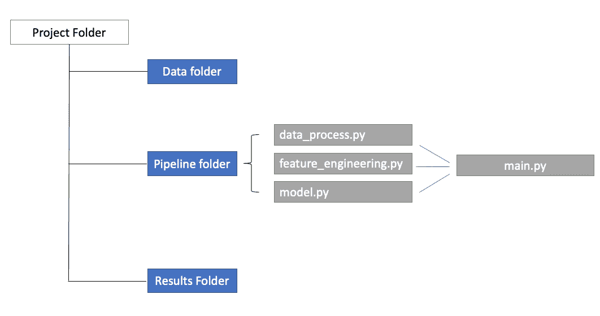

# 成为更好的数据科学家我遵循的七条原则

> 原文：<https://towardsdatascience.com/seven-principals-i-follow-to-be-a-better-data-scientist-25a547d6acfc>

照片由[海蒂·芬](https://unsplash.com/@heidijfin?utm_source=unsplash&utm_medium=referral&utm_content=creditCopyText)在 [Unsplash](https://unsplash.com/s/photos/north-star?utm_source=unsplash&utm_medium=referral&utm_content=creditCopyText) 拍摄

## 树立我的北极星

时间过得真快，我已经在两家不同的公司担任数据科学家超过一年半了。在[我之前的文章](/how-i-became-a-data-scientist-7f5b10606612)中，我写了我作为经济学博士如何成为一名数据科学家。在文章的最后，我分享了我在该行业工作时收集的一些想法。我想在这篇文章中进行更多的阐述，并总结出成为一名更好的数据科学家需要遵循的七条原则。

## 原则 1:沟通是关键

沟通是建立任何关系的关键。在员工中，我们通过与同事、上司、利益相关者、客户等互动，不断扩大我们的网络。即使作为一个任务更加面向研究的人，我花了很多时间编写代码和测试模型，沟通仍然在我的日常任务中扮演着非常重要的角色。我需要收集和验证来自 IT 团队的数据；我需要与同事讨论模型开发进度；我需要向利益相关者/经理等传达发现和见解。有效的沟通非常重要，尤其是在疫情之后远程工作越来越普遍的时候。我的建议是，在你的日历上以一定的频率与你需要沟通的每个人预约同步会议，并不断更新你的项目进度，包括里程碑和挑战。

除了与任务相关的交流，另一个重要的部分是交流你的发现。作为数据科学家，很多时候我们面临着向非技术受众传达新奇的技术内容的挑战。在这种情况下，一个常见的错误是专注于展示研究结果背后的复杂模型和算法，并展示它是多么前沿。除非是学习阶段，否则很多时候这种交流只会让听众感到困惑。为什么他们那么在乎你怎么得到结果(即使你花了大部分时间在这部分)，他们只需要知道如何利用这些信息。数据科学不仅仅是编码和花哨的模型。它所揭示的商业价值才是在交流中应该强调的。作为一个从学术界出来的人，我花了一些时间来适应快节奏的环境，并学习如何识别我的非技术观众的痛点。开发一流的模型仅仅是第一步，只有让其他人看到你作品的价值，并最终信任和购买它，你的任务才能完成。

在交流研究结果时，数据讲述能力和演示技巧是必不可少的，这也是我督促自己提高的地方。我收集的一些好的建议是观察好的演讲者，练习公开演讲，在演讲前总是排练，并不断地从你的观众那里寻求反馈。

## 原则 2:快速学习，边做边学

数据科学是一个不断变化的领域，因此跟上最新的趋势和技术对于确保工作中的一致性能至关重要。对于全职工作的数据科学家来说，花几周时间学习新东西以便能够将其应用到工作项目中是不现实的。我们需要快速学习，实现这一点的方法之一就是通过**边做边学**。与其迷失在一个新概念的太多细节和背景信息中，完全掌握它的最快方法是遵循一个值得信赖的实用教程并复制它，然后尝试进行定制创新，以在您的项目中取得更好的结果。举个学习随机森林算法的例子。我们确实需要知道一些关于算法的基础知识——它是什么，它可以用在哪里，等等。然后我们只是在当前的项目中使用它，跟随一些教程，看看结果是什么。与教科书或在线课程相比，带有示例的博客文章是快速自学的绝佳来源。最后，我们对结果进行故障排除，并寻找改进算法应用的方法。比如算法的超参数是什么，怎么调等等。

快速学习让我们跟上时代。它主要是问题驱动或项目驱动，其中快速学习为我们提供了短期解决方案。从长远来看，我们应该有一个坚实的计划来提高某些技能，这些技能可能需要更多的持续练习。在这种情况下，我们需要**养成学习**的习惯。我们可以报名参加学习特定技能的课程。最重要的是，我们应该接触数据科学的最新实践，即使它们可能与我们的日常工作无关。我订阅了许多科技公司在 Medium 上的科技博客( [instacart](https://tech.instacart.com/) 、 [Airbnb](https://medium.com/airbnb-engineering) 、 [Lyft](https://eng.lyft.com/) 、[网飞](https://netflixtechblog.medium.com/)等)，以及数据科学简讯，只是为了了解社区周围发生的事情，并进一步探索我感兴趣的事情。我们还可以扩大我们的网络，并形成我们自己的学习社区，在那里我们可以分享我们所学到的东西，以及新的东西。最后，**根据著名的费曼法则，**利用教学的力量来更好地学习。这是我开这个博客的主要原因。

## 原则 3:发展专家领域

我从作为数据科学家的工作中收集到的另一个想法是，我们不需要成为所有方面的专家，但我们需要开发数据科学的专家领域。**这使你成为一名杰出的数据科学家，而不仅仅是一名可以被轻易取代的有用的数据科学家**。数据科学是一个需要大量协作的职位。你需要什么都懂一点，才能和同事用同一种语言交流。然而，你应该优先考虑你的时间和精力，在至少一个你有全面了解的特定领域工作，并且你要让自己成为任何人在这个领域有任何问题都要去解决的人。这很像在博士项目中，你选择一个领域来完成你的论文，在那里你用这个领域中所有重要的文献来更新自己，你提出并解决这个领域中的问题，你研究并开发这个领域中的新方法，并且有可靠的发现来分享。在数据科学、预测、因果推理、NLP 等领域都有很多。根据你的背景和激情，确定某些领域，并在这些领域建立全面的知识体系。最重要的是，宣传自己是这些领域的专家(或即将成为专家)，就与这些领域相关的任何事情提出你的意见，以增加你在员工中的知名度和影响力。

## 原则 4:高效编码

对数据科学家来说，编码的确很重要，但在我看来，与解决问题、批判性思维等相比，它不是最重要的硬技能。作为一名初级数据科学家，我们需要编码来完成我们的工作，但是随着我们职业生涯的发展，我们和其他人的区别不太可能来自于编写花哨的代码，而是你可以用代码交付什么。编码是手段，不是目的。不要误解我的意思，我认为能够高效、干净地编写代码是很重要的，尤其是当你和别人一起做一个项目的时候。我的观点是，与其花大量时间浏览教程，阅读关于如何编码和如何干净编码的教科书，不如尝试向有经验的人学习，总结好的实践，并确保将它们应用到自己的项目中。很多时候，在工作中，你不需要从头开始写代码，因为可能已经存在一些相关的项目。作为一个没有数据科学或计算机科学背景的人，我总是着迷于我同事的代码是多么干净、不言自明和高效。我请他们和我一起进行代码评审，向他们学习，并根据他们使用的代码编写我的代码模拟。编码是通过复制来创造。

关于编码的另一个重要方面是，我们应该为模块化代码片段建立一个数据库，特别是那些你经常在不同空间重用的代码片段。每当在同一个项目中或跨项目重复使用时，编写函数和类是非常有用的。一些公司会购买智能和用户友好的工具，这些工具已经存储了模板代码片段，数据科学家只需要定制数据输入或参数，以便获得漂亮的数据可视化或找到最佳模型。

我给那些从事最终将投入生产的端到端项目的人的另一个建议是建立一个项目文件夹，并将不同的任务模块化。您将有几个 python 文件负责数据清理、要素工程、模型训练中的不同任务，还有一个主文件导入和调用不同的对象来完成端到端的过程。很容易做出任何改变，重新训练模型，更新数据集，并最终将项目投入生产。

作者图片

## 原则 5:培养商业头脑

为了准备面试，你可能需要在[案例研究回合](/structure-your-answers-for-case-study-questions-during-data-science-interviews-a14a02d21e6c)中，对你面试的公司的商业模式进行自我教育。在工作中，你将假设的案例研究问题投入生产。你不仅需要提出解决方案，还要实施和推出最终产品。在整个过程中，你需要培养商业敏锐性:

*   了解你正在处理的数据:每一列是什么意思？价值观缺失怎么处理？是分割数据还是对数据进行聚类？获取或生成哪些有用的特征？我可以在这里使用哪些有用的内部或外部数据集？
*   知道如何建立模型来解决不同的问题:一个线性基线模型就足够了，还是我需要使用复杂的深度学习模型？我如何在可解释性和模型复杂性之间做出选择？我应该使用什么指标来确保我的模型针对业务难点？
*   知道如何宣传你的工作:为什么我的项目有意义(或者通过 xxx 赚到$$$或者通过 xxx 省下$$$)？我应该如何量化效果？

了解你正在处理的业务是第一步。很多时候，我们可能太急于跳入技术细节，而没有看到全局。知道如何增加影响和宣传你的项目带来的价值与完成项目一样重要。

## 原则 6:学会管理工作量和优先处理任务

管理工作量通常是我们忽略的事情，尤其是在我们职业生涯的初期。我们希望对所有事情都说是，以建立良好的声誉，避免示弱。**知道何时以及如何说不是我们应该培养的一种品质。**尽管接受挑战和走出舒适区对确保持续增长很重要，但推动自己前进和筋疲力尽之间有着明显的区别。推动和挑战自己前进是积极主动的，也是主动的。这是你选择为自己做的事情，以发展你的核心技能，实现你为自己设定的目标。你会激励自己非常努力地工作，而不觉得累，反而很有成就感。另一方面，精疲力尽对我们的心理健康是一种威胁，从长远来看，它会逐渐危及我们的生产力。这是你由于超负荷的责任而被迫做的事情。倦怠发生的比你所知道的要多。当你对工作感到非常紧张和焦虑，真的需要休息时，就会发生这种情况；当你不能专注于你正在做的事情，因为你担心所有其他等待完成的任务；即使在工作时间之外，你也无法停止思考工作。无论何时发生，都是你的身体试图警告你摄入过多。倦怠有不同的阶段，如果你只是强迫自己度过难关，它会随着时间的推移而升级。

要处理它:

*   第一步是**识别信号**。问问你自己为什么我今天没有效率，是因为我过去几天工作太多了吗？
*   **不要过度承诺**。合理对待你的工作量和你完成它们的能力。不要害怕诚实和示弱。允许自己有不知道的事，不擅长的事，不熟悉的事。只要你有计划去提高你所需要的关键技能，并且知道如何与人合作，你就不应该对自己太苛刻，去做最好的事情。如果这次你想通过过度承诺来让自己度过一个巨大的任务，问问自己这种努力是否是可持续的，你是否能在未来的所有时间里强迫自己度过。如果不是，为什么这次要这么做？职业成长是一场长跑游戏，不是短跑。
*   **在接受额外任务时，总是要分清轻重缓急。**有时，我们确实会收到来自工作伙伴的特别请求。每当你预见到这些任务不会很快完成时，就和你的经理一起调整你已经拥有的所有任务的优先级，这样你就知道你把所有的精力都放在了最重要和最紧急的任务上。

时间管理和心理健康在职业和个人生活中都非常重要。我们真正需要做的是知道我们的界限，沟通我们的界限，并学会对事情说不，这样我们就可以把时间和精力集中在更重要的元素上。

## 原则 7:方向比速度更重要

很多时候，我们专注于提高实现目标的速度，你有没有想过，在这个目标上花时间是否值得？如果是这样，另一个问题是你是否在朝着正确的方向接近这个目标。如果你的目标是获得晋升，与从事多个小项目相比，从事影响力更大、知名度更高的项目更有可能得到领导的认可。拥有良好的演示和讲故事的技能会让你有更好的机会宣传你自己和你的项目，让别人看到你，而不是只专注于实现最花哨的模型和技术细节，却不能让别人看到价值。

每个人的时间和精力都是有限的，因此我们需要将它们转化为正确的效用函数来解决优化问题。我们怎么知道什么是正确的方向？我们可以寻求他人的建议，参加课程，阅读书籍/文章，等等。然而，这些都是别人的经验，可能与我们自己的不一致。除了参考他人，我们需要问问自己，我们真正想要的生活是什么。我们需要睁大眼睛看所有可能的方向，去探索。当然，我们可能会在这个过程中犯错误，这就是为什么我们要不断地探索、反思和总结。我在做我喜欢的事情吗？我走的路对吗？快速到达目的地，却不是你想要的目的地，有什么意义？只要我们知道我们正在到达我们真正渴望的地方，而不是因为别人告诉我们，绕道而行，晚点到达也没关系。我们不会通过阅读别人的故事找到自己的激情。我们需要探索自己的可能性。这对职业和个人生活都是如此。

## 摘要

总而言之，我遵循的七个原则是:

*   沟通是关键
*   快速学习，边做边学
*   发展专家领域
*   高效编码
*   培养商业头脑
*   学会管理工作量和区分任务的优先级
*   方向比速度更重要

我上面列出的所有原则也是相互关联的。例如，我们需要培养商业敏锐性，知道什么是正确的方向，然后知道如何通过优先化任务来管理我们的工作量。你能想到其他人会如何联系吗？

*免责声明*

这些是我总结的原则，基于我的经验和我对在这个行业工作不到两年的员工的理解，以及我从不同来源收集的建议。作为一名初级数据科学家，我可能有自己的局限性，因为我的工作更多的是基于研究。我们非常欢迎你在下面留下评论，添加你认为重要但没有在这里列出的其他原则。或者根据自己的经历阐述你同意或不同意的某些原则。

感谢您的阅读！如果感兴趣，请查看我的其他文章:

 [## 我的博客文章库

### 我快乐的地方

zzhu17.medium.com](https://zzhu17.medium.com/my-blog-posts-gallery-ac6e01fe5cc3) 

订阅我的电子邮件列表:

 [## 每当朱发表。

### 每当朱发表。感谢您的阅读！通过订阅保持对我的故事的更新！由…

zzhu17.medium.com](https://zzhu17.medium.com/subscribe) 

注册成为中级会员:

 [## 请通过我的推荐链接朱加入媒体

### 阅读朱(以及媒体上成千上万的其他作家)的每一个故事。您的会员费直接支持…

zzhu17.medium.com](https://zzhu17.medium.com/membership) 

或者在 YouTube 上关注我:

 [## 朱

### 你好。欢迎来到我的 Youtube 频道！！！我想用这个空间来分享我的生活、观点、建议和有趣的东西…

youtube.com](https://youtube.com/channel/UCMs6go1pvY5OOy1DXVtMo5A)