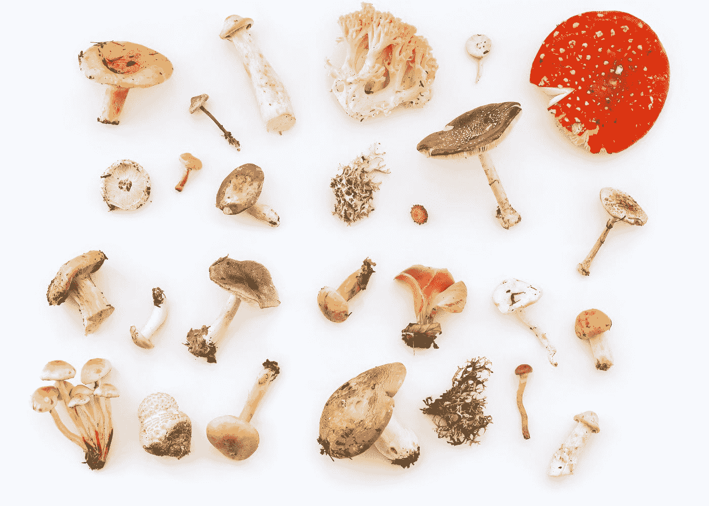
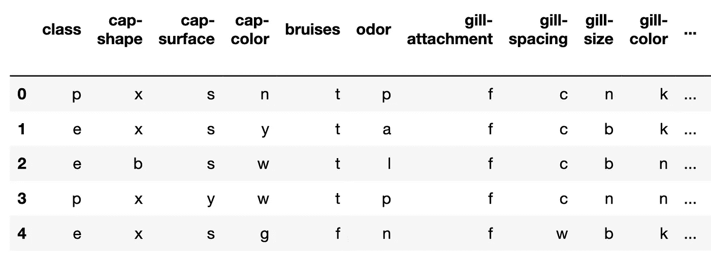
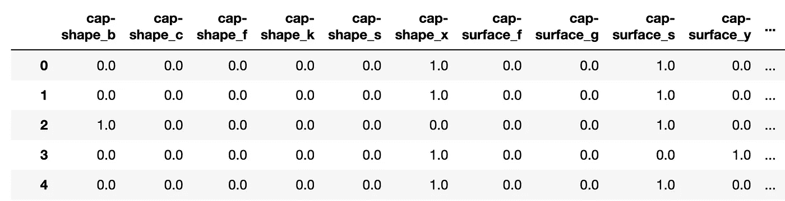
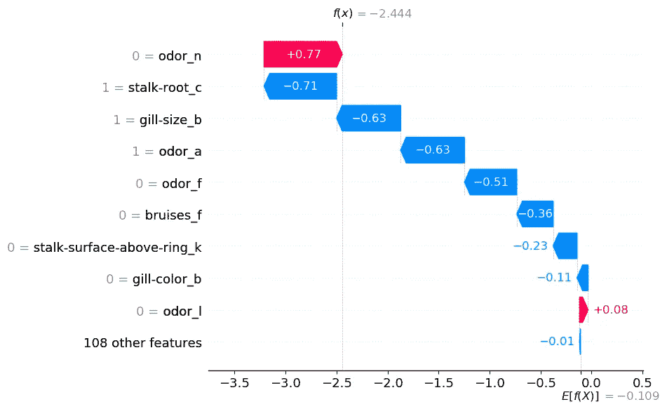
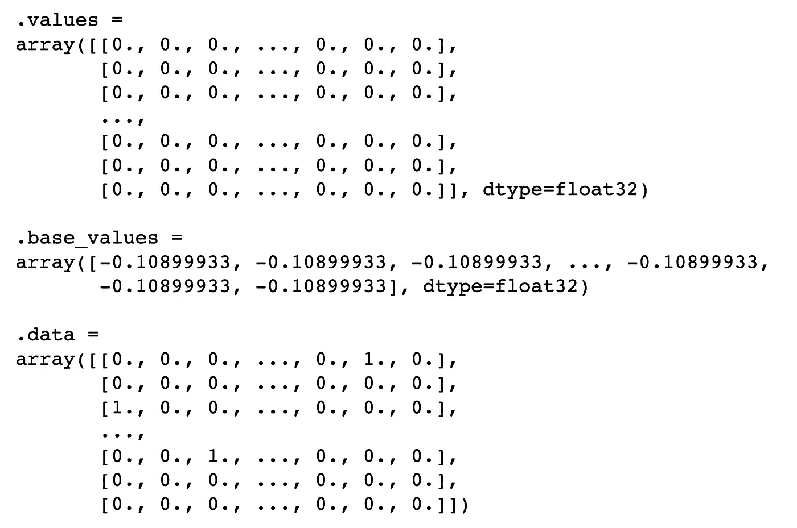
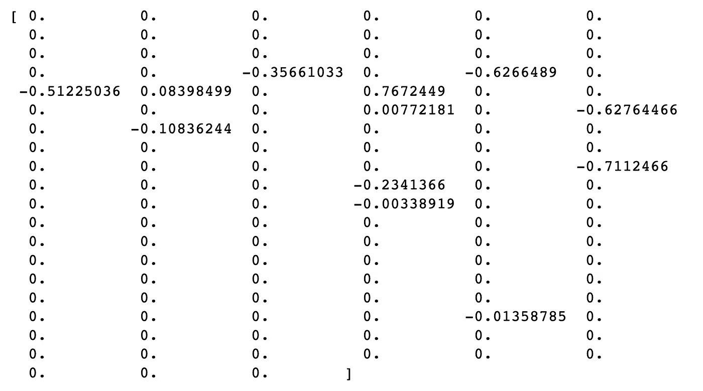
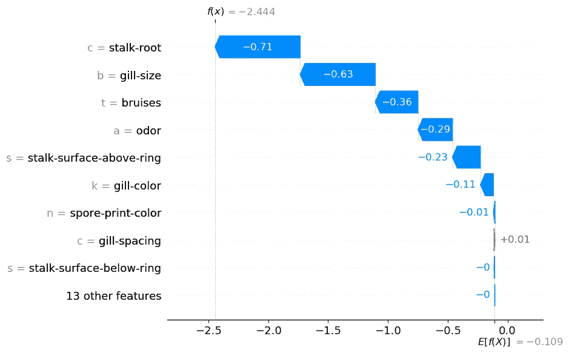
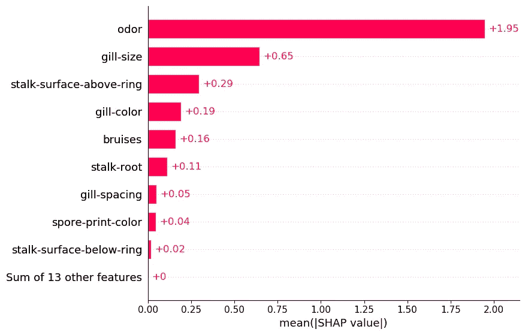
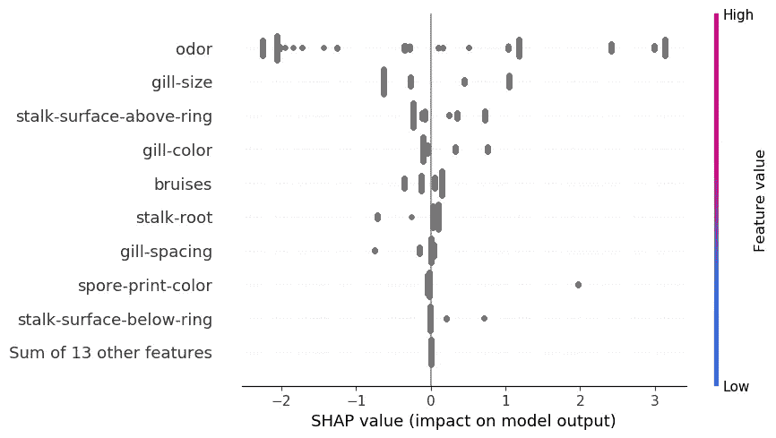
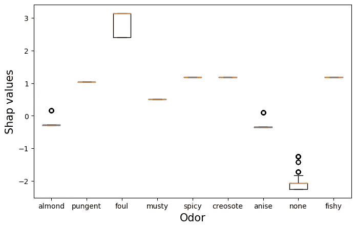

# 分类特征的 SHAP

> 原文：<https://towardsdatascience.com/shap-for-categorical-features-7c63e6a554ea>

## 将已经用一键编码转换的分类特征的 SHAP 值相加

[卡利内里](https://unsplash.com/@kalineri?utm_source=medium&utm_medium=referral)在 [Unsplash](https://unsplash.com?utm_source=medium&utm_medium=referral) 上拍摄的照片

分类特征在用于模型之前需要进行转换。一键编码是实现这一点的常用方法:我们最终为每个类别提供一个二进制变量。这很好，直到开始理解使用 SHAP 的模型。每个二元变量都有自己的 SHAP 值。这使得很难理解原始分类特征的总体贡献。

一种简单的方法是将每个二元变量的 SHAP 值相加。这可以解释为原始分类特征的 SHAP 值。为此，我们将带您浏览一下 **Python 代码**。我们将会看到我们能够使用 SHAP 聚集图。然而，当涉及到理解分类特征的关系的本质时，这些是有限的。最后，我们向您展示如何使用箱线图来可视化 SHAP 值。

如果你不熟悉 SHAP 或者 python 包，我建议你阅读下面的文章。我们深入探讨如何诠释 SHAP 价值观。我们还探索了本文中使用的一些聚合。

</introduction-to-shap-with-python-d27edc23c454>  

在处理分类变量时，还有一个替代解决方案。那就是使用 CatBoost 进行建模。您可以在下面的文章中找到这个解决方案。

</shap-for-categorical-features-with-catboost-8315e14dac1>  

# 资料组

为了演示分类特征的问题，我们将使用蘑菇分类数据集。您可以在图 1 中看到这个数据集的快照。目标变量是蘑菇的**类。也就是说蘑菇是有毒的(p)还是可食用的(e)。你可以在 UCI 的 MLR 中找到这个数据集。**

图 1:蘑菇数据集快照(来源:作者)(数据集来源: [UCI](https://archive.ics.uci.edu/ml/datasets/Mushroom) )(许可证:CC BY 4.0)

对于模型特征，我们有 22 个分类特征。对于每个功能，类别由一个字母表示。例如**气味**有 9 个独特的类别——杏仁(a)、茴香(l)、杂酚油(c)、鱼腥味(y)、恶臭(f)、霉味(m)、无(n)、刺鼻(p)、辛辣(s)。这是蘑菇的味道。

# 系统模型化

我们将带您浏览用于分析该数据集的代码，您可以在 [GitHub](https://github.com/conorosully/medium-articles/blob/master/src/interpretable%20ml/SHAP/SHAP_categorical.ipynb) 上找到完整的脚本。首先，我们将使用下面的 Python 包。我们有一些处理和可视化数据的通用包(第 2-4 行)。我们使用 **OneHotEncoder** 来转换分类特征(第 6 行)。我们使用 **xgboost** 进行建模(第 8 行)。最后，我们使用 **shap** 来理解我们的模型是如何工作的(第 10 行)。

我们导入数据集(第 2 行)。我们需要一个数字目标变量，所以我们通过设置有毒的= 1 和可食用的= 0 来转换它(第 6 行)。我们还得到分类特征(第 7 行)。我们不使用 **X_cat** 数据集进行建模，但它以后会派上用场。

要使用分类特征，我们还需要转换它们。我们从安装编码器开始(第 2–3 行)。然后，我们用它来转换我们的分类特征(第 6 行)。对于每个分类特征，每个类别都有一个二元特征。我们为每个二进制特性创建特性名称(第 9 行到第 10 行)。最后，我们将这些放在一起创建我们的特征矩阵(第 12 行)。

最后，我们有 117 个特征。您可以在**图 2** 中看到特征矩阵的快照。例如，你可以看到**帽形**现在已经被转换成 6 个二元变量。功能名称末尾的字母来自原始功能的类别。

图 2: X 特征矩阵(来源:作者)

我们使用这个特征矩阵训练一个模型(第 2-5 行)。我们正在使用一个 **XGBClassifier。**XGBoost 模型由 10 棵树组成，每棵树的最大深度为 2。该模型在训练集上的准确率为 97.7%。

# 标准 SHAP 值

此时，我们想了解模型是如何做出这些预测的。我们从计算 SHAP 值开始(第 2-3 行)。然后，我们使用瀑布图(第 6 行)可视化第一次预测的 SHAP 值。你可以在**图 3** 中看到这个情节。

您可以看到每个二元要素都有自己的 SHAP 值。以气味为例。它在瀑布图中出现了 4 次。odor_n = 0 的事实增加了蘑菇有毒的可能性。同时，odor_a = 1，odor_f = 0，odor_I = 0 都降低了概率。还不清楚蘑菇气味的总体贡献是什么。在下一节中，我们将会看到，当我们把所有的个人贡献加在一起时，情况就变得很清楚了。

图 3:第一次观察的瀑布图(来源:作者)

# 分类特征的 SHAP

让我们从探索 **shap_values** 对象开始。我们在下面的代码中打印该对象。您可以在下面的输出中看到，它由 3 个组件组成。我们有每个预测的 SHAP 值(**值**)。**数据**给出二进制特征的值。每个预测也将具有相同的基值( **base_values** )。这是平均预测对数概率。

(来源:作者)

我们可以通过打印下面的内容来仔细查看第一个预测的 SHAP 值。有 117 个值。每个二进制变量一个。SHAP 值与 X 特征矩阵的顺序相同。记住，第一个分类特征**帽形**有 6 个类别。这意味着前 6 个 SHAP 值对应于该特征的二进制特征。接下来的 4 个对应于**盖面**特征等等。

(来源:作者)

我们希望将每个分类特征的 SHAP 值相加。为此，我们首先创建 **n_categories** 数组。这包含每个分类变量的唯一类别数。数组中的第一个数字对于**帽形**将是 6，然后对于**帽面**将是 4，依此类推…

我们使用 **n_categories** 来分割 SHAP 值数组(第 5 行)。我们得到了一个子列表。然后，我们对每个子列表中的值求和(第 8 行)。这样我们就从 117 个 SHAP 值变成了 22 个 SHAP 值。我们对**形状值**对象(第 2 行)中的每一个观察都这样做。对于每次迭代，我们将求和的 shap 值添加到 **new_shap_values** 数组中(第 10 行)。

现在，我们需要做的就是用新值替换原来的 SHAP 值(第 2 行)。我们还用原始分类特征的类别字母替换二元特征数据(第 5–6 行)。最后，我们用原始的特性名称替换二进制特性名称(第 9 行)。分别以数组和列表的形式传递这些新值非常重要。这些是**形状值**对象使用的数据类型。

更新后的**形状值**对象可以像原始对象一样使用。在下面的代码中，我们为第一次观察绘制了瀑布。您会注意到这段代码和以前完全一样。

您可以在**图 4** 中看到输出。我们现在有 22 个 SHAP 值。您还可以看到左侧的特征值已被类别标签所取代。我们之前讨论过气味特征。您现在可以清楚地看到这个特性的总体贡献。它将对数概率降低了 **0.29** 。

图 4:更新 SHAP 值后的第一次观测的瀑布图(来源:作者)

在上面的图中，我们有气味= a。这告诉我们蘑菇有“杏仁”的气味。我们应该避免把这个情节理解为“杏仁味降低了对数几率”。我们将多个 SHAP 值加在一起。因此，我们应该把它解释为“杏仁气味和其他气味的缺乏降低了对数几率”。例如，查看第一个瀑布图，缺少“恶臭”气味(odor_f = 0)也降低了对数几率。

在我们继续讨论这些新 SHAP 值的集合之前，有必要讨论一些理论。我们能够用 SHAP 值做到这一点的原因是因为它们的可加性。也就是平均预测值(**E[f(x)】**)加上所有的 SHAP 值等于实际预测值( **f(x)** )。通过把一些 SHAP 值加在一起，我们不会干扰这个性质。这就是为什么 **f(x) = -2.444** 在**图 3** 和**图 4** 中都是一样的。

## 卑鄙的 SHAP

与瀑布图一样，我们可以像使用原始 SHAP 值一样使用 SHAP 聚合。例如，我们在下面的代码中使用平均 SHAP 图。查看**图 5** ，我们可以使用该图来突出重要的分类特征。例如，我们可以看到，气味往往具有较大的正/负 SHAP 值。

图 5:平均 SHAP(来源:作者)

## 蜂群

另一种常见的聚合是蜂群图。对于连续变量，此图很有用，因为它可以帮助解释关系的性质。我们可以看到 SHAP 值是如何与特征值相关联的。但是，对于分类特征，我们已经用标签替换了特征值。因此，在**图 6** 中，您可以看到 SHAP 值都被赋予了相同的颜色。我们需要创造自己的情节来理解这些关系的本质。

图 6:分类变量的蜂群(来源:作者)

## SHAP 箱线图

一种方法是使用 SHAP 值的箱线图。在**图 7** 中，您可以看到一个气味特征。这里，我们根据气味类别对气味特征的 SHAP 值进行了分组。你可以看到，臭味导致更高的 SHAP 值。这些蘑菇很可能有毒。请不要吃任何难闻的蘑菇！同样，没有气味的蘑菇更容易食用。一条橙色的线意味着这些蘑菇的所有 SHAP 值都是相同的。

图 7:气味 SHAP 值的箱线图(来源:作者)

我们使用下面的代码创建这个箱线图。我们从获得气味 SHAP 值开始(第 2 行)。记住这些是更新值。对于每个预测，气味特征只有一个 SHAP 值。我们还得到气味类别标签(第 3 行)。我们根据这些标签分割 SHAP 值(第 6-11 行)。最近，我们用这些值为每一种气味类别绘制了一个箱线图(第 27-32 行)。为了使图表更容易理解，我们还用完整的类别名称替换了字母(第 14-24 行)。

实际上，很可能只有少数特征是绝对的。您将需要更新上述过程，以便只对分类进行求和。你也可以想出自己的方式来想象这些特征之间的关系。如果你有其他的方法，我很乐意在评论中听到。

我也有兴趣了解特性依赖将如何影响这个分析。根据定义，变换后的二元特征将是相关的。这可能会影响 SHAP 值的计算。我们使用**树形图**来估计 SHAP 值。我的理解是，这些不像 **KernelSHAP** 那样受到依赖的影响。我很有兴趣在评论中听到你的想法。

我希望这篇文章对你有帮助！你可以成为我的 [**推荐会员**](https://conorosullyds.medium.com/membership) **来支持我。你可以访问 medium 上的所有文章，我可以得到你的部分费用。**

<https://conorosullyds.medium.com/membership>  

你可以在|[Twitter](https://twitter.com/conorosullyDS)|[YouTube](https://www.youtube.com/channel/UChsoWqJbEjBwrn00Zvghi4w)|[时事通讯](https://mailchi.mp/aa82a5ce1dc0/signup)上找到我——注册免费参加 [Python SHAP 课程](https://adataodyssey.com/courses/shap-with-python/)

## 参考

南伦德伯格， *SHAP 蟒包* (2021) 【T2，

南伦德伯格和 s .李，*解释模型预测的统一方法* (2017 年)，[https://arxiv.org/pdf/1705.07874.pdf](https://arxiv.org/pdf/1705.07874.pdf)