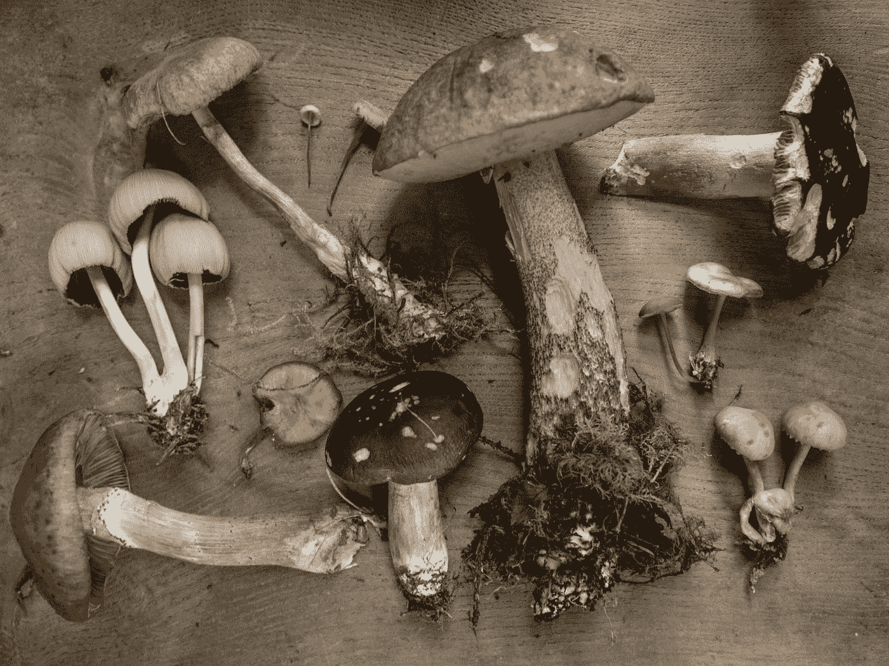
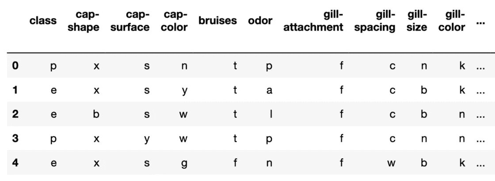
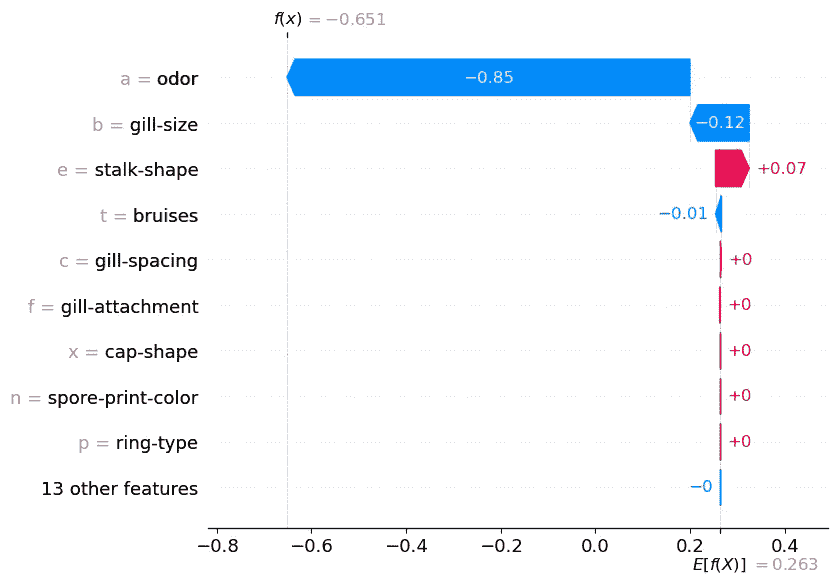
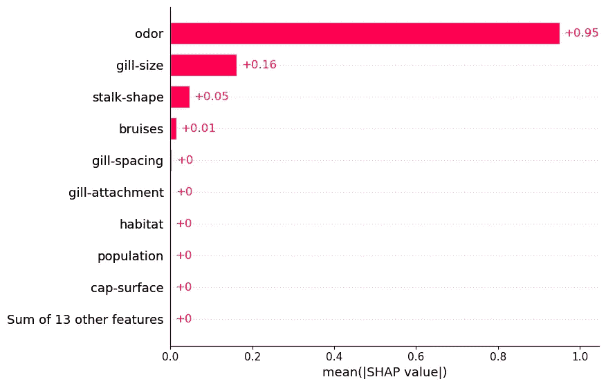
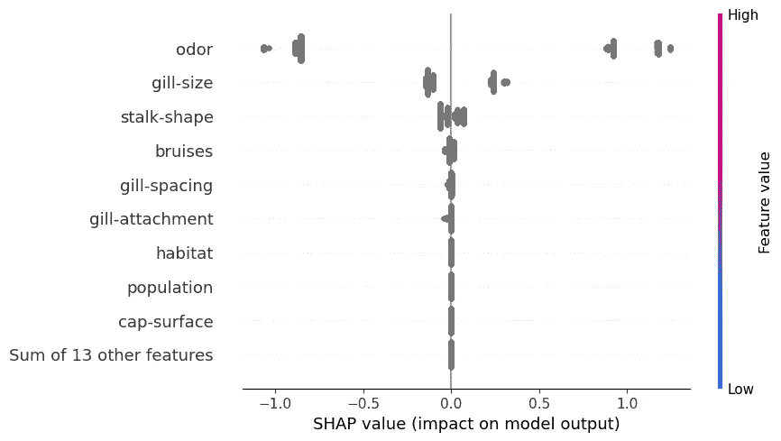
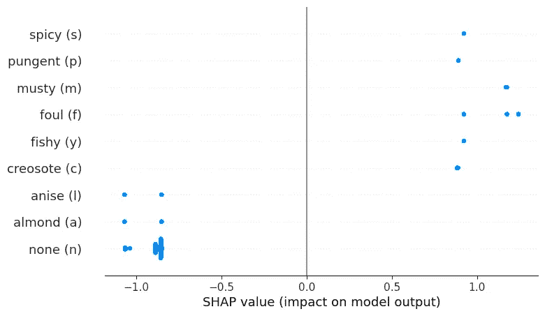

# 使用 CatBoost 实现分类特征的 SHAP

> 原文：<https://towardsdatascience.com/shap-for-categorical-features-with-catboost-8315e14dac1>

## 避免对分类要素的 SHAP 值进行后处理

安德鲁·雷德利在 [Unsplash](https://unsplash.com?utm_source=medium&utm_medium=referral) 上的照片

结合 **CatBoost** 和 **SHAP** 可以提供强大的洞察力。尤其是在处理分类特征时。CatBoost 处理这些功能的方式使得使用 SHAP 更容易理解您的模型。

对于其他建模包，我们需要首先使用一次性编码来转换分类特征。问题是每个二元变量都有自己的 SHAP 值。这使得很难看出原始分类特征的总体贡献。

在[之前的文章](/shap-for-categorical-features-7c63e6a554ea)中，我们探索了这个问题的一个解决方案。它包括深入研究 SHAP 对象，并手动添加单个 SHAP 值。这可能很乏味！作为替代，我们可以使用 CatBoost。

[CatBoost](https://catboost.ai/) 是一个梯度提升库。与其他库相比，它的一个主要优势是可以处理非数字特征。分类特征无需转换即可使用。这意味着 CatBoost 模型的 SHAP 值很容易解释。每个分类要素只有一个 SHAP 值。

我们将:

*   计算并解释 CatBoost 模型的 **SHAP 值**
*   应用 **SHAP 聚合**s——我们将看到，在理解分类特征的关系时，它们是有限的
*   为了解决这一限制，将为单个特征创建一个**蜂群图**。

一路上，我们将通过 [**Python 代码**](https://github.com/conorosully/medium-articles/blob/master/src/interpretable%20ml/SHAP/SHAP_catboost.ipynb) 来获得这些结果。

如果你是第一次来 SHAP，那么看看**下面的**视频**。**如果你想要更多，那就来看看我的 [**SHAP 课程**](https://adataodyssey.com/courses/shap-with-python/) **。**注册我的 [**简讯**](https://mailchi.mp/aa82a5ce1dc0/signup) :)即可免费获取

# 资料组

对于此分析，我们将使用与之前相同的数据集。这是一个蘑菇分类数据集。您可以在**图 1** 中看到该数据集的快照。目标变量是蘑菇的**类。**即蘑菇是有毒的(p)还是可食用的(e)。你可以在 [UCI 的 MLR](https://archive.ics.uci.edu/ml/datasets/Mushroom) 中找到这个数据集。

图 1:蘑菇数据集快照(来源:作者)(数据集来源:[UCI](https://archive.ics.uci.edu/ml/datasets/Mushroom))(license:CC BY 4.0)

对于模型特征，我们有 22 个分类特征。对于每个功能，类别由一个字母表示。例如，**气味**有 9 个独特的类别——杏仁(a)、茴香(l)、杂酚油(c)、鱼腥味(y)、恶臭(f)、霉味(m)、无(n)、刺鼻(p)、辛辣(s)。这是蘑菇的味道。

# 系统模型化

我们将带您浏览用于分析该数据集的代码，您可以在 [GitHub](https://github.com/conorosully/medium-articles/blob/master/src/interpretable%20ml/SHAP/SHAP_catboost.ipynb) 上找到完整的脚本。首先，我们将使用下面的 Python 包。我们有一些处理和可视化数据的通用包(第 2-4 行)。我们使用 **CatBoostClassifier** 进行建模(第 6 行)。最后，我们使用 **shap** 来理解我们的模型是如何工作的(第 8 行)。确保您已经安装了所有这些软件包。

我们导入数据集(第 2 行)。我们需要一个数字目标变量，所以我们通过设置有毒的= 1 和可食用的= 0 来转换它(第 6 行)。我们还得到分类特征(第 7 行)。在前一篇文章的这一点上，我们需要转换这些特性。有了 CatBoost，我们可以直接使用它们。

当我们在下面(第 7 行)训练我们的模型时，您可以看到这一点。我们通过非数字特征(X)、目标变量(y)和列表来表明特征是分类的( **cat_features** )。我们所有的特征都是绝对的。这意味着 **cat_features** 是一个从 0 到 21 的数字列表。最后，分类器由 20 棵树组成，每棵树的最大深度为 3。它在训练集上的准确率为 98.7%。

# SHAP 地块

我们现在可以继续理解我们的模型是如何做出这些预测的。如果你不熟悉 SHAP 或者 python 包，我建议你阅读下面的文章。我们深入探讨如何诠释 SHAP 价值观。我们还探索了本文中使用的一些聚合。

  

## 水冷壁图

我们从计算 SHAP 值开始(第 2-3 行)。然后，我们使用瀑布图(第 6 行)可视化第一次预测的 SHAP 值。你可以在**图二**中看到这个情节。这告诉我们每个分类特征值是如何对预测做出贡献的。例如，我们可以看到这种蘑菇有一种杏仁(**一种**)的气味。这使得对数概率降低了 **0.85** 。换句话说，它降低了蘑菇有毒的可能性。

图 CatBoost 的 SHAP 瀑布(来源:作者)

从上面的图表中，很容易看出每个特性的贡献。相比之下，我们在**图 3** 中有瀑布图。如前所述，这是在前一篇文章中创建的。为了对分类特征建模，我们首先使用一键编码对它们进行转换。这意味着每个二元要素都有自己的 SHAP 值。例如，气味将有 9 个 SHAP 值。每个独特的类别一个。因此，很难理解气味对预测的总体贡献。

图 3:独热编码的 SHAP 瀑布(来源:作者)

我们可以采用图 3 中**的 SHAP 值来创建一个类似于图 2** 中**的图。这就是为什么每个分类特征只有一个 SHAP 值。为此，我们需要通过将一个分类特征的所有值相加来“后处理”SHAP 值。不幸的是，没有直接的方法可以做到这一点。我们需要自己手工更新 SHAP 值对象。我们已经看到，通过使用 CatBoost，我们可以避免这一过程。**

## 绝对平均 SHAP

SHAP 聚合也适用于 CatBoost。例如，我们在下面的代码中使用平均 SHAP 图。查看**图 5** ，我们可以使用该图来突出重要的分类特征。例如，我们可以看到，气味往往具有较大的正/负 SHAP 值。

图 4:均值 SHAP 图(来源:作者)

## 蜂群

另一种常见的聚合是蜂群图。对于连续变量，此图很有用，因为它可以帮助解释关系的性质。也就是说，我们可以看到 SHAP 值如何与特征值相关联。然而，对于分类特征，特征值不是数字的。因此，在图 6 的**中，您可以看到 SHAP 值都被赋予了相同的颜色。我们需要创造自己的情节来理解这些关系的本质。**

图 5:蜂群图(来源:作者)

## 一窝蜂只为一个特征

一种方法是对单个特征使用蜂群图。你可以在**图 6** 中看到我们的意思。这里，我们根据气味类别对气味特征的 SHAP 值进行了分组。例如，你可以看到一股恶臭会导致更高的 SHAP 值。这些蘑菇很可能有毒。在上一篇文章中，我们使用箱线图得到了类似的结果。

图 6:蜜蜂群寻找气味(来源:作者)

我们不会详细讨论这个情节的代码。简而言之，我们需要创建一个新的 SHAP 值对象， **shap_values_odor** 。这是通过对 SHAP 值进行“后处理”来完成的，因此它们是我们想要的形式。我们用气味的 SHAP 值代替原来的 SHAP 值(第 24 行)。我们还用气味类别替换特征名称(第 43 行)。如果我们正确地创建了 **shap_values_odor** ，我们可以使用 beeswarm 函数来创建绘图(第 46 行)。

最后，SHAP 和 CatBoost 是分析分类特征的有力工具。这两个包可以无缝地协同工作。缺点是您可能不想使用 CatBoost。如果您正在使用 RandomForest、XGBoost 或神经网络等模型，那么您需要使用替代解决方案。你可以在下面的文章中找到这个。我们还将更详细地介绍如何对 SHAP 值进行后处理。

  

我希望这篇文章对你有帮助！如果你想看更多，你可以成为我的 [**推荐会员**](https://conorosullyds.medium.com/membership) **来支持我。你可以访问 medium 上的所有文章，我可以得到你的部分费用。**

  

你可以在|[Twitter](https://twitter.com/conorosullyDS)|[YouTube](https://www.youtube.com/channel/UChsoWqJbEjBwrn00Zvghi4w)|[时事通讯](https://mailchi.mp/aa82a5ce1dc0/signup)上找到我——注册免费参加 [Python SHAP 课程](https://adataodyssey.com/courses/shap-with-python/)

## 参考

南伦德伯格， *SHAP 蟒包* (2021) *，*[https://github.com/slundberg/shap](https://github.com/slundberg/shap)

南伦德伯格和 s .李，*解释模型预测的统一方法* (2017)，https://arxiv.org/pdf/1705.07874.pdf