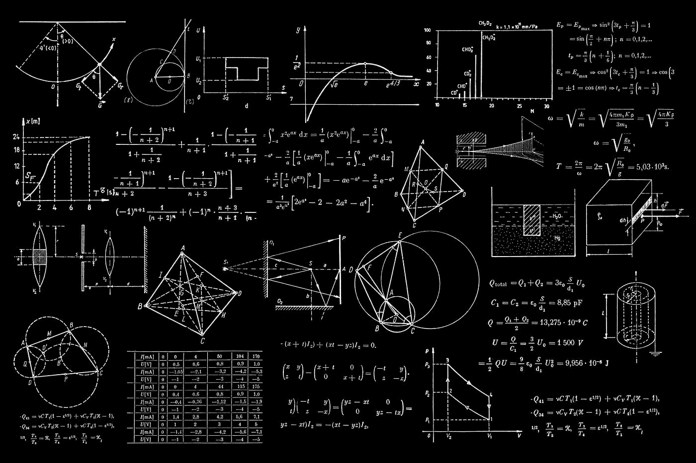
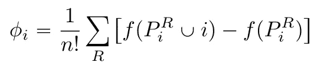

# XGBoost 的 SHAP:从 NP 完全到多项式时间

> 原文：<https://towardsdatascience.com/shap-for-xgboost-from-np-completness-to-polynomial-time-20c9e78907a0>

# XGBoost 的 SHAP:从 NP 完全到多项式时间

丹-克里斯蒂安·pădureț在 [Unsplash](https://unsplash.com?utm_source=medium&utm_medium=referral) 上拍摄的照片

> 更新:发现我关于渐变提升的新书，[实用渐变提升](https://www.amazon.com/dp/B0BJ82S916)。这是用 python 中的许多例子对渐变增强的深入探究。

 [## 实用的渐变增强:深入探究 Python 中的渐变增强

### 这本书的梯度推进方法是为学生，学者，工程师和数据科学家谁希望…](https://www.amazon.com/dp/B0BJ82S916) 

网络上有一些很好的文章，解释了如何使用和解释机器学习的 Shapley 值。例如参见[博士 Dataman](https://medium.com/u/319122a619c6?source=post_page-----20c9e78907a0--------------------------------) 的文章:

 [## 用 SHAP 价值观解释你的模型

### 使用 SHAP 值来解释任何复杂的 ML 模型

towardsdatascience.com](/explain-your-model-with-the-shap-values-bc36aac4de3d) 

然而，没有多少论文详细说明这些值是如何计算的。然而，这是一个非常有趣的主题，因为计算 Shapley 值是一个 np 完全问题，但一些库，如 [shap](https://shap.readthedocs.io/en/latest/index.html) 可以在一个小故障中计算它们，即使是对于具有数百个特征的非常大的基于树的 XGBoost 模型。这怎么可能呢？

这就是我们将在本文中通过给出该方法的 python 实现来发现的。

# ML 方法用于 ML 方法

激发使用 Shapley 值的潜在想法是，理解一个现象的最好方法是为它建立一个模型。一旦你有了模型，你就可以玩它，数学分析它，模拟它，理解输入变量，内部参数和输出之间的关系。一句话，解释一下。

然而，当处理决策树的森林时，正如 XGBoost、CatBoost 和 LightGBM 所构建的，底层模型很难理解，因为它混合了数百个决策树。

因此， [SHAP 的论文](https://arxiv.org/pdf/1705.07874.pdf)提出在任何 ML 模型之上建立一个解释模型，这将带来对底层模型的一些洞察。为了便于理解这个解释模型，SHAP 论文的作者建议使用一个简单的线性加法模型，该模型考虑以下三个特性:

*   局部精度:特征重要性的总和必须等于预测值。
*   缺失:如果一个特性没有参与到模型中，那么相关的重要性必须为空。
*   一致性:如果比较两个模型，其中一个模型对某个特性的贡献高于另一个模型，那么这个特性的重要性也必然高于另一个模型。

信不信由你，但只有一种价值观符合这些要求:由诺贝尔经济学奖获得者沙普利创造的价值观，这些价值观以他的名字命名。即使有不止一个公式，也只有一种方法来计算它们。最简单的一个是:

作者的公式。

其中 n 指定模型中存在的特征的数量，R 是这些特征的可能排列的集合，PiR 是索引低于所考虑的排列的 I 的特征的列表，f 是必须计算其 Shapley 值的模型。

请注意，维数为 n 的集合的排列数是 n 的阶乘，因此 n！以总数为因子。

这种方法的工作原理简单而通用。它适用于任何类型的模型:它包括为每个可能的子模型建立没有特征 I 的模型。为此，扫描所有可能的排列。然后计算每个模型和具有所考虑特征的相同模型所获得的预测之间的差异。根据 Shapley，该差异的平均值给出了特征的重要性。

虽然非常简单，但在一般情况下，该公式的计算时间非常昂贵，因为要训练的模型数量随着特征数量的增加而成阶乘增加。因此是 np 完全的。有了 x₂x₁的两个特征，可以为特征 1 建造两个模型:一个没有任何特征，一个只有 x₂.

有了三个特征，它已经更复杂了。可以构建 6 个模型:2 个不带特征，1 个带 x₂，1 个带 x₃，1 个带 x₂和 x₃，1 个带 x₃和 x₂.此外，必须为每个预测迭代操作。

# 线性模型的 Shapley 值

为了理解这个概念，下面给出了 SHAP 方法的一个实现，首先是线性模型:

计算线性模型的 Shapley 值。作者代码。

第一个函数列出了 n 个特征的所有可能的排列。因此，它建立了前一个公式的集合 R。

该函数 *compute_theta_i* 构成了该方法的核心，因为它将计算给定特征 I 的 theta 值。为此，它将遍历所有可能的排列，构建包含和不包含该特征的集合，最后使用该模型进行两次预测，并计算其差值。

然后计算这些差值的总和，用特征数量的阶乘的倒数进行加权。

然后使用函数 *train_linear_model 对回归数据训练的两个模型进行测试。*

第一个模型只使用了两个特性。获得的θ值与理论非常一致，因为它们等于特征与相应回归系数的乘积。具有 3 个特征的模型也是如此。

这证实了实现是正确的，并提供了理论预测的结果。

# 通用实现

为了支持任何类型的模型，对先前的代码进行改进以对每个特征子集执行重新训练就足够了。

注意，在线性模型的情况下，重新训练是没有用的。事实上，线性模型本质上是相加的，删除一个特征意味着不考虑它，给它赋一个空值。

修改后的代码如下:

计算任何类型模型的 Shapley 值。作者代码。

不同排列的计算保持不变。

引入了一个 ZeroModel 类来训练没有任何特征的模型。按照惯例，这种类型的模型返回零。

执行训练的函数已更改为获取有用的数据。这一次，它不是为线性模型定型，而是为回归定型 XGBoost 模型。为了避免过度学习，估计器的数量和深度已经减少。

事实上，在过度拟合的情况下，计算的 Shapley 值是无效的，因为模型有足够的自由度来拟合数据，即使只有单个特征。然后，它会在每种情况下做出几乎精确的预测，所有特征最终都具有相同的 Shapley 值。
最后，计算 Shapley 值的方法本身已得到改进，以执行重新训练。最有趣的部分是关于有和没有要加权的特征的特征集的生成。

这个新的实现可以像以前一样在相同的数据集上进行测试。shap 库也用于确保计算出的值是一致的。

由于 Shapley 值的总和给出了预测值，因此局部精度特性受到了很好的重视。
此外，该代码获得的值与 shap 库提供的值符号相同。数量级相当。
数据越复杂，差距越小。

这种差异是由于 shap 库使用的方法，该方法利用决策树的结构，而不是像这里一样重新计算所有模型。

# 计算基于树的模型的 Shapley 值

上一小节中的方法仅用于教学目的。

实际上，构建 n 因子模型的需求是禁止的。即使是 5 个特性，我们也需要训练不少于 5 个！=120 个模型，这与要分析的预测一样多。
幸运的是，有一个解决方案，由 SHAP 方法的作者提出，利用决策树的结构，大大减少计算时间。然后只需要训练一个模型。

请注意，计算 Shapley 值的一般方法是一个 NP 完全问题。也就是说，没有办法在多项式时间内计算它们。

## 决策树的存储信息

首先提醒一下，在决策树的构建过程中，每个节点的增益、权重和覆盖都是存储的。这些值用于计算特征重要性，但也可用于以较低的成本计算 Shapley 值的良好估计。

## SHAP 方法的开发

Lundberg 和 Lee 在他们关于该主题的第一篇出版物的补充论文中，提出了在决策树的情况下计算 Shapley 值的多项式时间实现。

这个想法是依靠单一的模型，从而避免必须训练快速指数数量的模型。为了做到这一点，他们使用与树叶和盖子相关的重量。目标是从这个单一模型中获得所有可能的特征组合的预测。

方法如下:对于给定的观察值，以及对于要计算 Shapley 值的特征，我们简单地遍历模型的决策树。

在每一个节点上，如果决策涉及子集的一个特征，那么所有的事情都像一个标准的行走一样发生。另一方面，如果节点处的决策是基于没有被子集选择的特征，则不可能选择跟随树的哪个分支。在这种情况下，对两个分支都进行了探索，并且通过覆盖对结果权重进行加权，即通过测试所涉及的观察数量进行加权。

剩下的就是计算没有特征的子模型和具有特征的子模型之间的差异，并对其进行平均。

这个策略被用在 SHAP 库中，该库在上面被用来验证所提出的通用实现。

# 结论

本文给出了计算任何模型的 Shapley 值的最小代码。

然而，如介绍中所述，该方法是 NP 完全的，并且不能在多项式时间内计算。

SHAP 正在使用一个技巧来快速计算 Shapley 值，重用先前计算的决策树值。