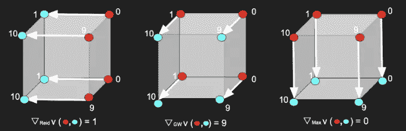
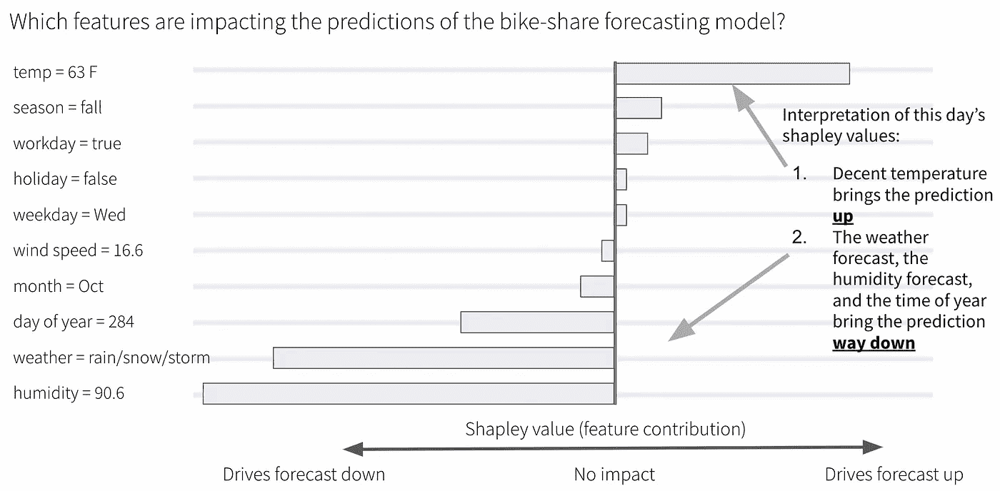
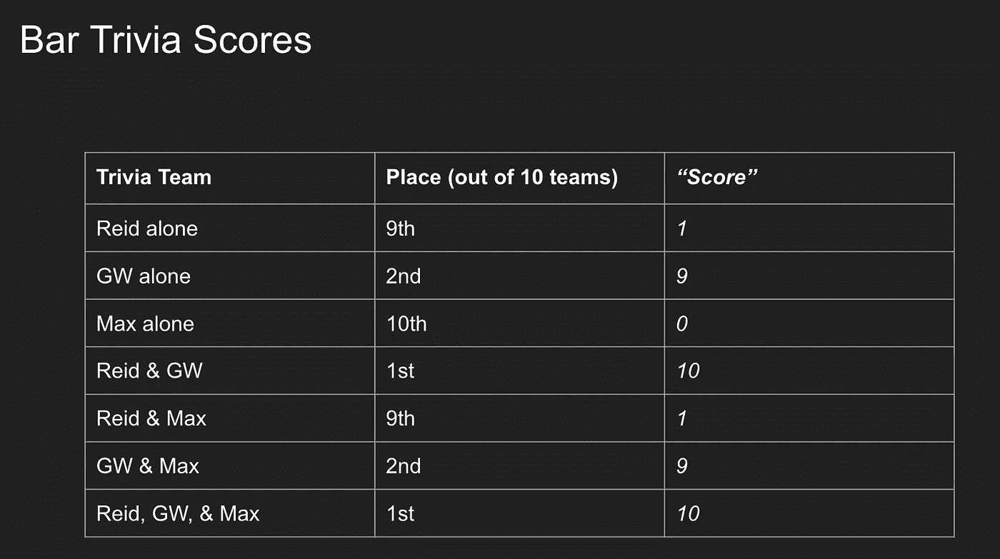
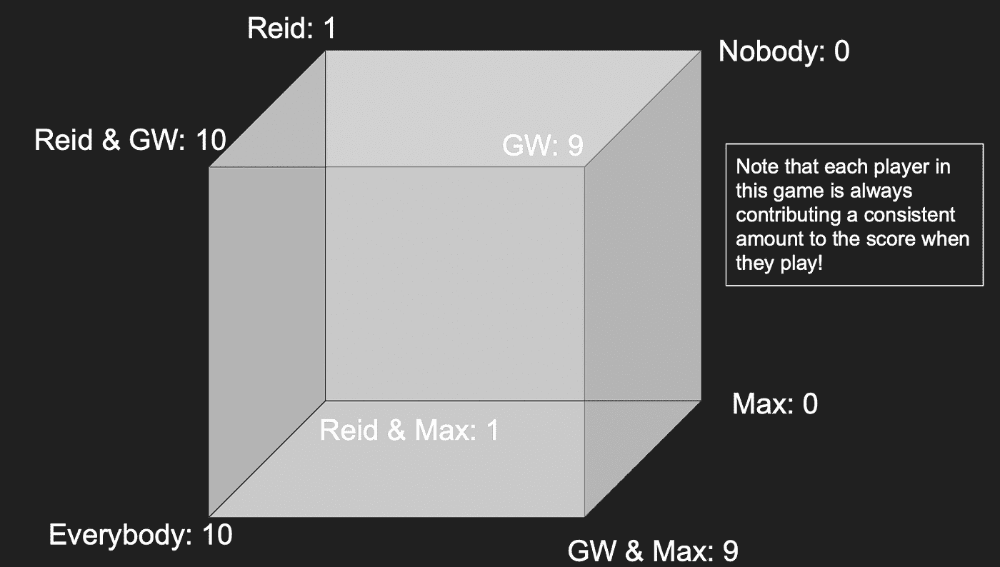
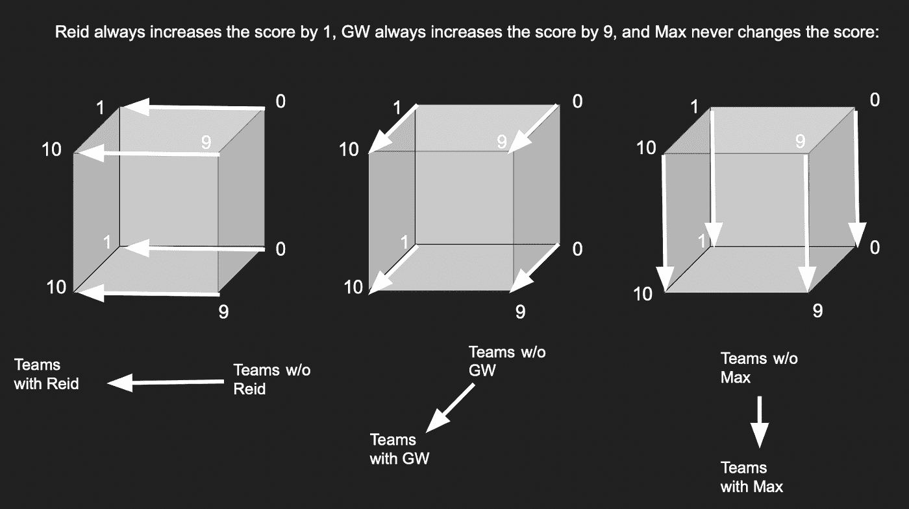
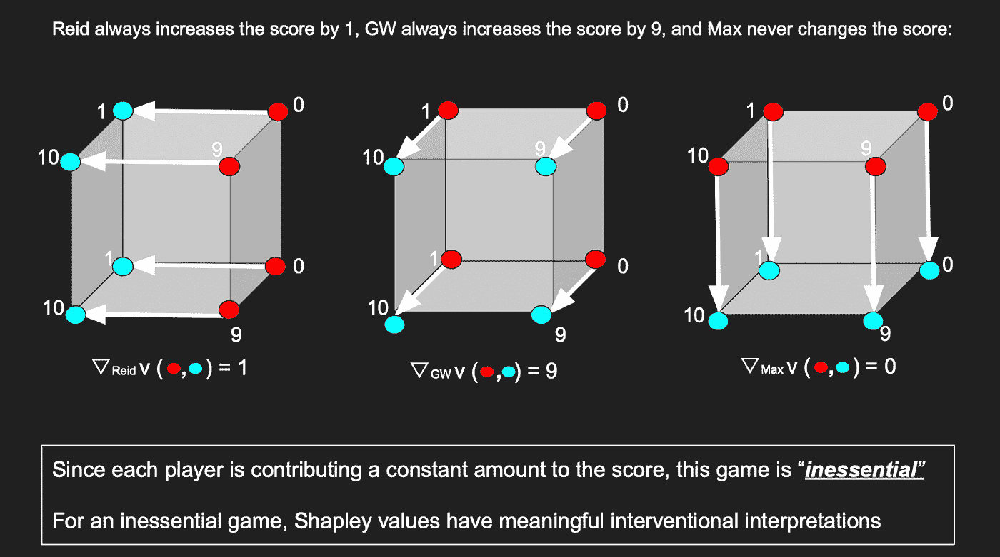
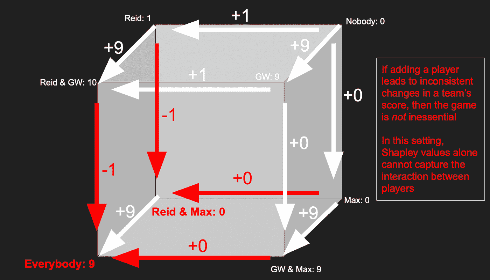
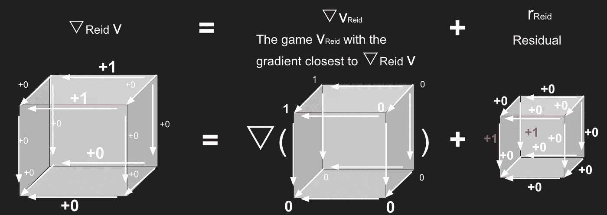

# Shapley 残差:测量 Shapley 值的可解释性的限制

> 原文：<https://towardsdatascience.com/shapley-residuals-measuring-the-limitations-of-shapley-values-for-explainability-d9cdc3582522>

## 让我们用酒吧琐事来显示沙普利值错过的信息



我们将使用一个游戏的立方体表示来解释 Shapley 值的解释和限制。

# **简介**

为了负责任地使用机器学习，你应该尝试解释是什么驱动了你的 ML 模型的预测。许多数据科学家和机器学习公司正在认识到，能够逐个功能地解释模型如何对给定的输入做出反应是多么重要。本文将展示 Shapley 值，一种最常见的可解释技术，在解释一个模型时是如何遗漏重要信息的。然后，我们将介绍 Shapley 残差，一种测量 Shapley 值如何捕捉模型行为的新技术，以及一些开始计算它们的代码！

考虑克里斯托弗·莫尔纳尔的[可解释机器学习书](https://christophm.github.io/interpretable-ml-book/)中的以下例子:一家自行车共享公司使用季节信息、星期几、天气信息等功能，训练一个模型来预测某一天被借出的自行车数量。然后，如果他们的模型预测未来某一天的骑手数量低于平均水平，他们可以找出*为什么*低于平均水平的分数会出现:通过观察模型对每个特征的反应。是因为一个节日吗？是因为天气吗？

计算每个模型特征重要性的一种常用方法是使用 **Shapley 值**，因为这是一种 1)广泛适用于许多问题，2)基于坚实的理论基础，3)易于用 SHAP Python 库实现的方法。



**问题:**在某些场景中，Shapley 值无法表达关于模型行为的信息，因为它一次只为*的一个特征*返回一个分数。例如，在自行车共享场景中，我们将天气和星期几视为独立的特征，但有时这些特征的组合*才是重要的；在那些特征组合比单个特征本身更重要的场景中，Shapley 值可能无法正确解释一个模型。*

# **酒吧琐事示例**

让我们使用一个更简单的设置和更少的功能来更详细地解决 Shapley 值的问题。

我喜欢每周和不同的同事去附近的酒吧参加知识之夜。很明显，我们团队中的一些成员比其他人更有贡献。

我们能量化每个团队成员对琐事表现的影响吗？我们可以对每个玩家使用 Shapley 值，其解释如下:当将该玩家添加到琐事团队时，它们应该对应于分数的预期变化。存在其他可能的解释，但我们将使用这一个。

(* *注:这类计算 Shapley 值的方法称为“介入性”Shapley 值，测量“添加此功能时分数的预期变化”一种不同的类型被称为“有条件的”Shapley 值。介入方法和条件方法之间的关键区别在于它们如何处理分数的预期变化为零的特征——其 Shapley 值应该是多少？零？如果你认为答案是“是”，那就用介入的方法。相反，如果您认为由于相关性，要素可能仍然具有重要性，并且如果您认为重要性应该包括在其 Shapley 值中，则考虑使用条件方法。)*



从几何角度来看，绘制不同球队的所有 3 人游戏分数的一个有用方法是将这些分数排列成一个立方体上的点，这样相邻的点只相差一名球员。然后，点之间的路径(也称为立方体的边缘)将代表在将球员加入球队时分数的变化。

*(注意:有两个玩家，我们会把它画成一个正方形。对于四个或更多的玩家，我们将不得不把它画成一个超立方体)*

让我们称这个形状为 GameCube 这将是一个对我们有用的形状，因为【Shapley 值和 GameCube 边都将对应于增加一名球员时分数的变化。



*图 1:将每一个琐事分数标绘在一个立方体的不同顶点上，对应于当晚队中在场的球员。*

在我们的故事中，Reid 只知道体育琐事，GW 知道电影、音乐、历史、地理、文学——除了体育琐事，几乎什么都知道。所以当里德演奏时，他提高了一点分数；GW 玩的时候，她增加一个 *lot* 的分数。而我，嗯，我主要是为了啤酒和陪伴。

Shapley 值是一个*完美的*可解释的度量*只有当一个玩家*总是*为一个团队的分数贡献相同的*数量时。由于每个球员在得分上的变化在我们迄今为止的故事中是恒定的，我们可以将 Shapley 值 1 分配给 Reid，将 Shapley 值 9 分配给 GW，将 Shapley 值 0 分配给 Max。这些 Shapley 值代表了每个球员加入球队时的预期得分变化！



*图 2:查看添加每个球员时队伍得分的变化。*

用更专业的术语来说，每个玩家的影响都一致的游戏(就像我们到目前为止的故事)被称为“无关紧要的游戏”。此外，我们将使用符号 *▽v* 来表示 GameCube *v* 的“梯度”,它计算顶点上的值之间沿边缘的值，我们将使用 *▽_player_v* 来表示特定*玩家*的方向的边缘值，沿所有其他边缘为零。

比如 GameCube 渐变 *▽_Reid_ν* 代表了加入 Reid *时所有可能的分数变化。*



*图 3:将添加玩家时分数的变化表示为游戏立方体相对于每个玩家的部分梯度*

# **特征贡献不能总是表示为一个单一的数字——因此 Shapley 值是不够的。**

您应该预料到，在大多数情况下，您正在使用的特征不会对模型输出产生持续的影响，相反，一个特征的影响通常取决于其他特征是什么。

## 让我们改变一下我们的故事。

假设 Max 的行为根据他和谁一起玩而改变。当和 GW 玩的时候，他很冷静，喝他的啤酒，关心他自己的事情，让 GW 做大部分的工作，所以他不会降低分数。但是当马克斯和里德一起玩的时候，他嫉妒里德对体育的了解，所以马克斯开始说得更多，提出了一些错误的答案，使分数下降了 1 分！



*图 4:玩家贡献不一致的新 game cube*

在这个新的 GameCube 上，GW 的边是恒定的，所以她的 Shapley 值 9 仍然与她玩游戏时分数的变化完全对应。但是马克斯和里德的优势不是恒定的，因为他们对得分的影响取决于他们和谁一起玩。因此，我们使用 GameCube 边缘来量化 Max 和 Reid 带来的东西的方法现在有问题了。

当真实数据科学家使用 Shapley 值时，他们通过获取玩家对其团队的平均贡献来解决这个问题——在 GameCube 上，这意味着将玩家的贡献量化为他们所在方向的平均边缘值。所以在我们上面的 GameCube 上，GW 的 Shapley 值仍然是 9，但是 Reid 的 Shapley 值现在是 0.5，Max 的 Shapley 值现在是-0.5。对于一些用例，故事到此结束——玩家的平均贡献有时可以很好地量化他们的影响！

然而，当涉及到*信任*沙普利价值观时，这可能会导致一个问题。因为我们更信任 GW 的 Shapley 价值观，而不是 Max 或 Reid 的 Shapley 价值观，因为她对团队的贡献比 Max 或 Reid 的贡献更具一致性。

# 沙普利残差

Shapley 残差是对玩家的边缘偏离恒定值的程度的度量，较低的 Shapley 残差意味着 Shapley 值接近完美地代表了特征贡献，而较高的 Shapley 残差意味着 Shapley 值遗漏了重要的模型信息:也就是说，一个特征的贡献还取决于其他特征。

最初 Shapley residuals 论文的作者将这种缺失信息公式化为最小二乘回归中的误差项。例如，对于玩家*里德*:

*▽_Reid_ν = ▽_ν_Reid + r_Reid*

这个方程的左边是和前面一样的偏梯度。等式的右边是一个新的 GameCube 的梯度之和， *▽_ν_Reid，*加上一个剩余的 Cube， *r_Reid，*，它测量我们的游戏偏离 Reid 无关紧要的程度。



*图 5:剩余立方是游戏相对于给定玩家偏离无关紧要性的量。*

关键的想法是，如果里德对团队有持续的影响，剩余的立方体 *r_Reid* 将全为零。另一方面，如果剩余立方体上的值 *r_Reid* 偏离零，那么这是一个信号，即 Reid 的 Shapley 值缺少关于 Reid 的影响*如何取决于还有谁与 Reid 一起玩的信息。剩余立方体上的值越高，里德的贡献就越依赖于哪些其他玩家在场。*

# 计算 Shapley 残差的代码

## 进口

## 生成合成数据集

## 训练模型和内核简单解释器

## 计算特征联盟的期望值

这使用了`explainer.synth_data`，即训练讲解者时由`shap`库生成的合成数据样本集。

字典`coalition_estimated_values`将特征联盟映射到使用这些特征时模型相对于基线的期望值(当*没有使用特征*时的期望值:平均模型输出)。

*(注意，我们将列表转换为字符串，因为列表在 Python 中不是可哈希的类型。)*

## 进度检查

`coalition_estimated_values`应该是这样的:

```
{'[]': 0,
 '[0]': -0.3576234198270127,
 '[1]': 0.010174318030605423,
 '[2]': -0.08009846972721224,
 '[0 1]': -0.34261386138613864,
 '[0 2]': -0.37104950495049505,
 '[1 2]': 0.14435643564356437,
 '[0 1 2]': -0.396}
```

## 创建超立方体对象

我们使用的是三维数据，所以这只是一个立方体。但这种方法扩展到超立方体，随着维数的增加，增长速度变慢。

请随意使用本文附录中的 Hypercube python 类的代码，或者自己编写代码。它需要将`coalition_estimated_values`放置在立方体的顶点上，并且它需要将边值计算为相邻顶点值之间的*差*。

## 计算 Shapley 残差

对于每个要素，最小化| |▼_ feature _ cube—▼_ cube _ feature | |以计算残差。这使用了一个名为`residual_norm` 的助手函数，在本文末尾的附录中有定义。

# 结论

Shapley 值已经成为一种非常流行和可推广的方法，用于解释哪些特征对机器学习模型很重要。通过使用 Shapley 残差量化它们的有效性，您将能够进一步确定您的机器学习模型的行为到底来自哪里，以及哪些来自 Shapley 值的见解值得信任。

特别感谢[原始沙普利残差论文](https://proceedings.neurips.cc/paper/2021/file/dfc6aa246e88ab3e32caeaaecf433550-Paper.pdf)的作者们所做的工作！

# 附录

作品中的所有图像都是作者创作的。

下面是 Hypercube 对象和其他帮助函数的代码，您可以使用上面的起始代码来计算 Shapley 残差。