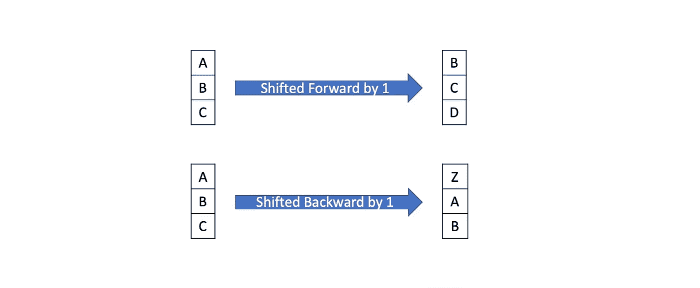
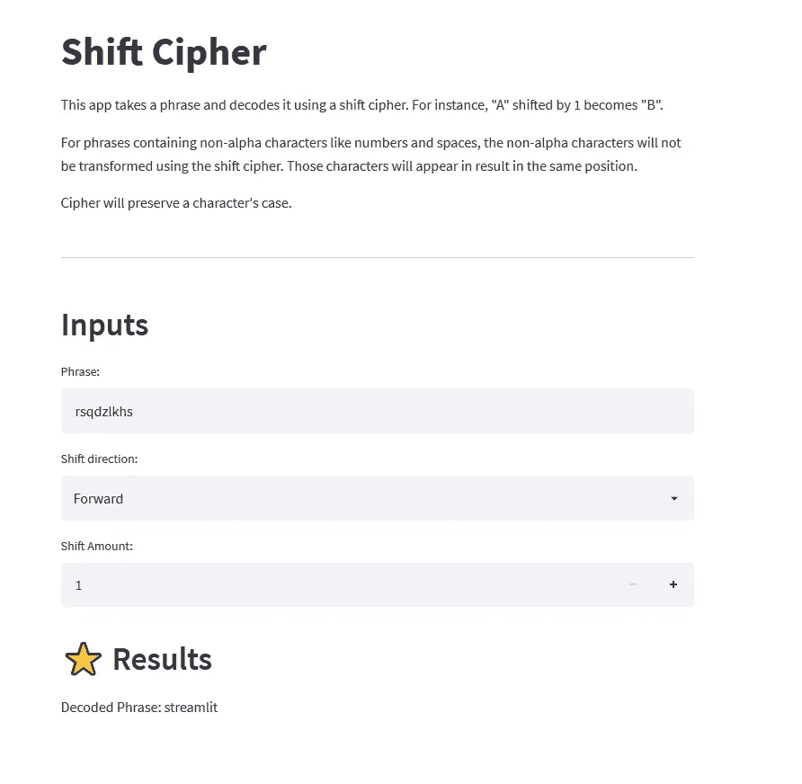
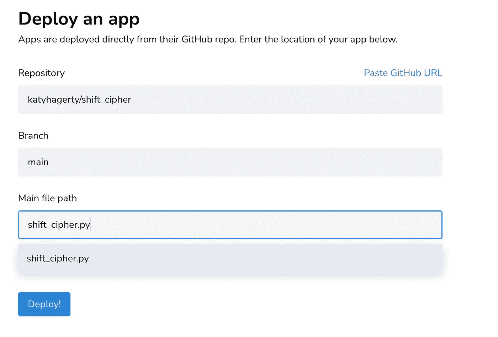

# 数据流中的移位密码

> 原文：<https://towardsdatascience.com/shift-cipher-in-streamlit-525225667237>

## 如何快速构建和部署用 Python 编写的可共享 web 应用程序


马库斯·温克勒在 [Unsplash](https://unsplash.com?utm_source=medium&utm_medium=referral) 上的照片

# 概观

你有没有想过向不懂 Python 的人炫耀自己的 Python 代码？你有没有希望自己可以不用处理前端开发就能分享互动应用？

最近，我在玩 La Famiglia 时发现自己也处于这种情况，这实际上是一个棋盘游戏形式的密室。其中一个谜语涉及移位密码。线索中的每个字母都必须移动一定的数字。例如，将字母“A”移动一位会得到字母“B”。请看下面的插图。



移位密码的例子。图片作者。

不幸的是，我们的线索并不容易。我们必须将每个字母移动 19。手动计算字母表是一件麻烦的事，也很容易出错。Python 可以立即无误地处理这项任务。

我决定用 Streamlit 构建和部署一个用户友好的应用程序，而不是忍受这样一个容易自动化的任务。由于 Streamlit 处理前端，**建造** **一个工作原型用了不到 30 分钟。** Python 处理所有后端，Streamlit Cloud 允许共享。以下是成品的链接:

[streamlit _ shift _ cipher _ app](https://share.streamlit.io/katyhagerty/shift_cipher/main/shift_cipher.py)



最终产品。图片作者。

# 什么是 Streamlit？🔍

Streamlit 是一个 Python 库，可以将 Python 脚本快速转换为可共享的基于 web 的应用程序。Streamlit 处理所有前端，因此不需要 web 开发经验。仅依靠 Python，Streamlit 允许用户在很短的时间内构建应用程序，并继续积累数据科学家的追随者。此外，Streamlit 提供了广泛的小部件和直观的命令选择。

Streamlit 最棒的地方在于它可以非常轻松地分享应用程序。Streamlit Cloud 允许您免费部署、管理和共享应用程序。用户不必下载项目目录。他们甚至不需要 Python。他们只需要一个网络浏览器和一个链接。与此同时，应用程序经理可以将 GitHub 配置文件链接到 Streamlit Cloud，这样对代码的任何编辑都会自动更新。

# 先决条件🔑

本文涵盖了 Streamlit 对象和命令。它假设读者熟悉 Python 对象，如字符串、字典和函数。

# 密码📚

这个应用的 GitHub Repo 可以在[这里](https://github.com/katyhagerty/shift_cipher)找到。

首先，要安装 Streamlit，请在终端中运行以下命令。**Streamlit 云中已完成的应用不需要安装 Streamlit** 。由于这些应用程序是基于网络的，它们只需一个浏览器就能工作。但是，编辑和构建自定义的 Streamlit 应用程序需要安装 Streamlit 库。

```
pip install streamlit
```

## 库、文本和小部件

首先，导入库。`streamlit`为应用程序提供基础，`string`填充用于解码字符的字典。

`st.title`、`st.write`、`st.header`在 app 中显示文字。`phrase`允许用户输入任何文本。`shift_dir`创建班次方向的下拉菜单。最后，`shift_no`接受一个表示短语中每个字母需要移动多少位置的数字。

## 功能

第一个函数`create_dict`创建两个字典。`letter_to_no`将字母表中的每个字母分配给其对应的从零开始的索引。`no_to_letter`反其道而行之。当给定一个索引号时，它返回一个字母。

`st.cache`是一个装饰器，它通过将结果存储在缓存中来加速应用程序。在重新运行函数之前，它会检查输入、外部变量、函数体或任何引用函数体是否发生了变化。如果没有任何变化，它将不会在后续运行中重新运行该功能。

`create_dict`循环遍历`string.ascii_lowercase`中的每个字母，这是字母表中所有字母的列表。`enumerate`是一个内置函数，它计算遍历一个可迭代对象的次数。它从 iterable 返回计数和值。两本词典都是从 0 开始的。

`shift`有三个输入— `phrase`、`shift_no`和`shift_dir`。像以前一样，`st.cache`阻止应用程序不必要的运行。该函数获取短语中的每个字母字符，并按照`shift_dir`和`shift_no`的描述找到它的对应字符。该函数循环遍历每个字符`i`，并检查一些东西。首先，它检查`i`是否大写，并将该信息存储在`upper_case`中。由于`letter_to_no`和`no_to_letter`字典使用小写字母，`line 10`将`i`转换为小写。如果`i`是一个字母字符，那么`letter_to_no`返回其索引或`ind`。例如，“a”的索引为 0，“z”的索引为 25。如果`shift_dir`是“前进”，那么`shift_no`被加到`ind`上。否则，它被减去。

`no_to_letter`有从 0 到 25 的按键。但是，`shift_ind`可能小于 0 也可能大于 25。考虑下面的例子:

```
ind = letter_to_no["z"]       # ind = 25
shift_no = 2
shift_ind = ind + shift_no    # shift_ind = 27
```

mod 运算符`%`通过除法然后返回余数来解决这个问题。对于上面的例子，`shift_ind % 26 = 1`。

如果`i`不是 alpha 字符，那么`i`被添加到`answer`中，不做任何处理。如果`i`是大写的，那么`line 27`会在将`sub`附加到`answer`之前将其大写。

## 输出

`Line 3`使用文本对象`st.write`显示用`shift`找到的解码短语。

## 利用 Streamlit 云部署

使用 Streamlit Cloud 部署应用只需不到 5 分钟。首先，我在这里创建了一个 Streamlit 云账户[。接下来，我将我的 GitHub 个人资料链接到我的 Streamlit Cloud 帐户。这样做允许 Streamlit Cloud 填充下拉菜单，以便我可以轻松选择要部署的应用程序。](https://share.streamlit.io/)



请注意下拉菜单以简化部署。图片作者。

# 结论👏

多亏了 Streamlit，你可以很容易地解码线索，甚至用 backwards 选项编写自己的隐藏消息。希望本教程展示了 Streamlit 所能提供的一切——简单性、可共享性以及最重要的速度。

感谢您阅读我的文章。如果您喜欢我的内容，*请考虑关注我*。还有，你可以通过订阅 Medium 来支持我和其他作家。使用我下面的推荐链接不会额外花费你。

欢迎所有反馈。我总是渴望学习新的或更好的做事方法。请随时留下您的评论或联系我 katyhagerty19@gmail.com。

[](https://medium.com/@katyhagerty19/membership) 