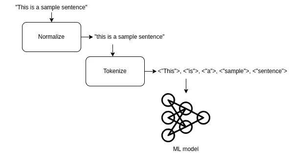
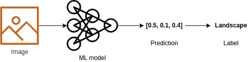
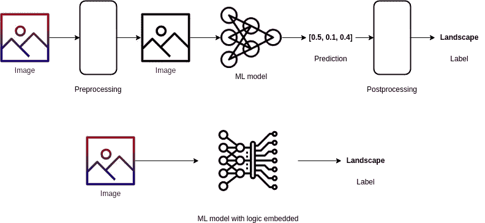
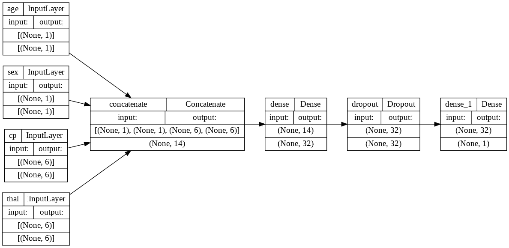
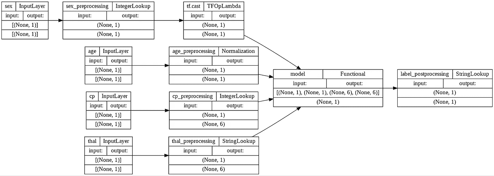

# 使用 TensorFlow 缩短模型部署

> 原文：<https://towardsdatascience.com/shortening-model-deployment-with-tensorflow-d5a11044d0d>

## 如何使用 TensorFlow 简化 ML 模型部署和服务


[稳定扩散](https://huggingface.co/spaces/stabilityai/stable-diffusion)生成的图像来自提示“酷炫的机器学习和 AI stuff”。

U 通常，对于现实生活中的机器学习应用程序，最终目标是在生产中部署模型以供客户使用。但对于一个由机器学习应用程序驱动的系统来说，不仅仅是模型预测，还有另外两个主要步骤是预处理和后处理。

**预处理**与实际预测之前的所有步骤相关。对于图像分类，它可以是归一化，通常，视觉模型要求输入像素在 0 和 1 之间。在文本模型的情况下，预处理可以是文本标记化或删除空格和标点符号。预处理可以采取多种形式，但归根结底是处理输入，以便模型可以做出可靠的预测。



NLP 任务的预处理管道

**另一方面，后处理**负责处理模型输出所需的所有步骤，以使其呈现理想的形式。在分类任务的情况下，通常，模型输出每个类别的概率，但是终端用户通常不关心这些，所以我们需要处理这些输出，以便它们可以采用标签的形式，在文本情感分析中，这些标签通常是“正面”和“负面”。



后处理管道

当预处理和后处理成为一个复杂系统的一部分时，挑战就开始了，这个复杂系统可能已经在使用中，并且需要维护。

想象以下场景—您是一家提供医疗保健 ML 产品的公司的成员，该产品包括一个 API，客户可以使用该 API 发送图像并预测 x 射线是否有健康问题。最初，工程师们使用 [ResNet-50](https://arxiv.org/abs/1512.03385) 模型创建了一个具有良好结果的基线，因此该公司开始使用它，但经过几周的研究，科学家们提出了一个使用 [MobileNetV2](https://arxiv.org/abs/1801.04381) 的改进版本，因此团队更换了模型，几周后，他们再次提出了一个使用 [EfficientNetB3](https://arxiv.org/abs/1905.11946) 的更好的模型。太好了！在一个月内，您的结果提高了 3 倍，您的客户也更高兴了，但这里的挑战是什么？

在那一个月里，你必须调整你的系统来处理三种不同的模型，每一种模型都有不同的输入。举例来说，让我们假设团队使用基于 TensorFlow 的模型，并使用 [Keras 应用模块](https://keras.io/api/applications/)加载它们，在那里您可以看到预训练的 [**ResNet-50**](https://keras.io/api/applications/resnet/#resnet50-function) 期望输入具有 224 x 224 x 3(宽度 x 高度 x 通道)的大小，通道是 BGR 的格式，并且每个颜色通道相对于 ImageNet 数据集以零为中心。 [**MobileNetV2**](https://keras.io/api/applications/mobilenet/#mobilenetv2-function) 也期望图像大小为 224 x 224 x 3，但期望像素在-1 和 1 范围内。最后，[**efficient net B3**](https://keras.io/api/applications/efficientnet/#efficientnetb3-function)期望图像的大小为 384 x 384 x 3，并且已经将图像缩放作为模型的一部分。
在这个场景中，您有一个带有特定预处理例程的初始管道，然后必须更改它以支持第二个模型，然后再次更改它以支持第三个模型，现在想象一下，如果您需要一周多次交换模型，并行服务多个模型，回滚到以前的模型，对照新模型评估旧模型，很容易混淆不同的预处理例程，丢失代码，或者忘记重要的细节。 特别是因为该公司很可能为不同的客户提供多种服务，这只是为了展示事情有多容易失控。

那么我们能做什么？虽然管理这样一个系统确实是一项复杂的任务，但是我们可以通过将模型的预处理和后处理逻辑融合或嵌入其中来使事情变得容易得多。



常规流水线与嵌入处理逻辑的流水线

让我们通过一个实际的例子来展示这个概念。
在这里，我将使用 TensorFlow 和“[克里夫兰心脏病诊所基金会](https://archive.ics.uci.edu/ml/datasets/heart+Disease)”数据集构建一个简单的系统，目标是对患者是否患有心脏病进行分类。这个例子是基于 Keras 代码的例子“[结构化数据分类从零开始](https://keras.io/examples/structured_data/structured_data_classification_from_scratch/)”。
你可以按照这个例子用 [Colab 笔记本](https://colab.research.google.com/drive/1NXJL1c2kNzYJxbHZNwlkhsGclj8BGc4V?usp=sharing)来写完整的代码。

为了简化起见，我们将只使用这些功能的一个子集，以下是关于它们的一些信息:

> **年龄:**年龄以年为单位“数值”
> **性别:** (1 =男性；0 =女性)
> **CP:** 胸痛类型(0，1，2，3，4)
> **Thal:**3 =正常；6 =修复缺陷；
> **7 =可逆性缺损【目标:】**诊断心脏病(1 =真；0 =假)“目标(二进制)”

我特别选择了这些特性，因为它们有不同的数据类型和不同的预处理要求。

# 张量流预处理层

TensorFlow 有一种内置的方式来处理不同的数据类型，即[预处理层](https://keras.io/api/layers/preprocessing_layers/)，与常规预处理步骤相比，它们的一大优势是您可以将这些层与模型或 TensorFlow 数据集结合起来，以优化端到端的管道，同时使部署变得更加容易。

对于常规用例，需要对这些层进行调整以了解如何处理数据,“调整”步骤类似于我们在标准化数据之前需要了解某个特征的均值和标准差，这就是我们在第一种情况下要做的事情。

## 标准化(年龄特征)

对于数字特征“年龄”,我们将应用特征归一化，换句话说，我们将移动和缩放输入到以 0 为中心的分布中，标准差为 1，这正是`[normalization](https://keras.io/api/layers/preprocessing_layers/numerical/normalization/)`层所做的。首先，我们创建一个 TensorFlow 数据集，该数据集只加载来自 pandas 数据框的数据和原始要素和标注格式的地图

```
raw_data = tf.data.Dataset.from_tensor_slices(
            (dict(data[[“age”, “sex”, “cp”, “thal”]]), data.target))
```

之后，我们可以创建预处理层，通过使用`adapt`方法来学习如何使用该数据集对要素进行预处理。

```
age_preprocessing = L.Normalization()
age_preprocessing.adapt(raw_data.map(lambda x, y: x["age"])
                              .map(lambda x: tf.expand_dims(x, -1)))
print(f"Age mean: {age_preprocessing.mean.numpy()[0]:.2f}")
print(f"Age variance: {age_preprocessing.variance.numpy()[0]:.2f}")
---------- Outputs ----------
Age mean: 54.27
Age variance: 81.74
```

这里发生的事情是，我正在获取`raw_data`数据集，并通过映射 lambda 操作仅提取`age`特征，然后我扩展维度以适应预处理层的预期格式。
适应数据后，`[Normalization](https://keras.io/api/layers/preprocessing_layers/numerical/normalization/)`层学习到“年龄”特征的均值为 54.27，方差为 81.74。现在在此基础上，它可以正常化该特征的新数据。

## IntegerLookup(性特征)

接下来，我们可以学习预处理“性别”特征，这是一个分类数字特征，这意味着每个值实际上意味着不同的类别，这里它们是(1 =男性；0 =女性)。对于这种特定情况，我们还希望该层能够处理未知或错误的值，在正常情况下，如果输入不同于 1 或 0，该层将抛出错误，并且不会给出输出，但这里这些值将被预处理为“-1”，模型将返回预测，这种行为取决于每个上下文。

```
sex_preprocessing = L.IntegerLookup(output_mode="int")
sex_preprocessing.adapt(raw_data.map(lambda x, y: x["sex"]))
sex_vocab = sex_preprocessing.get_vocabulary()
print(f"Vocab size: {len(sex_vocab)}")
print(f"Vocab sample: {sex_vocab}")
---------- Outputs ----------
Vocab size: 3
Vocab sample: [-1, 1, 0]
```

这里的`output_mode=”int”`表示这一层的输出是一个`Integer`。
在适应数据之后，`[IntegerLookup](https://keras.io/api/layers/preprocessing_layers/categorical/integer_lookup/)`层了解到“性别”特征具有大小为 3(包括 OOV)的词汇表，并分配`[-1, 1, 0]` 作为输入的可能值。请注意，这一层的主要好处是处理未知值，因为输出等于输入。

## 整数查找(cp 功能)

对于另一个分类数字特征“cp”特征，我们也将使用类似于“sex”特征的`[IntegerLookup](https://keras.io/api/layers/preprocessing_layers/categorical/integer_lookup/)`层，但是我们将改变输出格式。

```
cp_preprocessing = L.IntegerLookup(output_mode="one_hot")
cp_preprocessing.adapt(raw_data.map(lambda x, y: x["cp"]))
cp_vocab = cp_preprocessing.get_vocabulary()
print(f"Vocab size: {len(cp_vocab)}")
print(f"Vocab sample: {cp_vocab}")
---------- Outputs ----------
Vocab size: 6
Vocab sample: [-1, 4, 3, 2, 1, 0]
```

这里的`output_mode=”one_hot”`表示该层的输出具有[一键编码](https://en.wikipedia.org/wiki/One-hot)格式，在这种情况下，每个输出都具有类似于“[0，0，0，0，1，0]”的格式，这种格式可用于为模型提供更多关于特征的信息，尤其是如果特征不具有[布尔](https://en.wikipedia.org/wiki/Boolean_data_type)或[序数](https://en.wikipedia.org/wiki/Ordinal_data)性质。
在适应数据之后，`[IntegerLookup](https://keras.io/api/layers/preprocessing_layers/categorical/integer_lookup/)`层了解到“cp”特征具有大小为 6(包括 OOV)的词汇表，并分配`[-1, 4, 3, 2, 1, 0]`作为输入的可能值，进一步处理为独热编码格式。

## 字符串查找(thal 特征)

最后，对于“thal”特性，我们将使用`[StringLookup](https://keras.io/api/layers/preprocessing_layers/categorical/string_lookup/)`层，对于该特性，我们有可以作为文本或数字出现的字符串值。

```
thal_preprocessing = L.StringLookup(output_mode="one_hot")
thal_preprocessing.adapt(raw_data.map(lambda x, y: x["thal"]))
thal_vocab = thal_preprocessing.get_vocabulary()
print(f"Vocab size: {len(thal_vocab)}")
print(f"Vocab sample: {thal_vocab}")
---------- Outputs ----------
Vocab size: 6
Vocab sample: ['[UNK]', 'normal', 'reversible', 'fixed', '2', '1']
```

与“cp”功能类似，我们也有`output_mode=”one_hot”`，这意味着该功能的输出也将有[一键编码](https://en.wikipedia.org/wiki/One-hot)格式，因为词汇表很小，这个选项应该很好。
在适应数据之后，`[StringLookup](https://keras.io/api/layers/preprocessing_layers/categorical/string_lookup/)`层了解到“thal”特征具有大小为 6(包括 OOV)的词汇表，并且将`[‘[UNK]’, ‘normal’, ‘reversible’, ‘fixed’, ‘2’, ‘1’]`分配为输入的可能值，这里`[UNK]`被分配为未知值(OOV)，并且这些值被进一步处理为独热编码格式。

## 合并图层和数据集

现在我们已经有了适合我们数据的所有预处理层，我们可以让它们成为我们数据集管道的一部分。这样做的动机是 [tf.data pipeline](https://www.tensorflow.org/guide/data) 可以利用预处理层来使数据摄取更快、更有效。另一种选择是将这些层用作模型的一部分，并以这种方式对其进行训练，本文的“[在模型之前或模型内部预处理数据”一节中讨论了这种权衡。](https://keras.io/guides/preprocessing_layers/)

由于这不在本文的讨论范围之内，我就不详细介绍这一部分了，但是你可以在“数据集”部分看看相关的 [Colab 笔记本](https://colab.research.google.com/drive/1NXJL1c2kNzYJxbHZNwlkhsGclj8BGc4V?usp=sharing)。

## 建模

在常规设置中，对数据进行预处理后，您将得到如下所示的模型:

```
age_input = L.Input(shape=(1,), dtype=tf.float32)
sex_input = L.Input(shape=(1,), dtype=tf.float32)
cp_input = L.Input(shape=(len(cp_vocab),), dtype=tf.float32)
thal_input = L.Input(shape=(len(thal_vocab),), dtype=tf.float32)concat_inputs = L.Concatenate()([age_input, sex_input, 
                                 cp_input, thal_input])
x = L.Dense(32, activation="relu")(concat_inputs)
x = L.Dropout(0.5)(x)
output = L.Dense(1, activation="sigmoid")(x)

model = tf.keras.models.Model(inputs=[age_input, sex_input, 
                                      cp_input, thal_input], 
                              outputs=output)
model.summary()
---------- Outputs ----------____________________________________________________________________
Layer (type)              Output Shape Param # Connected to                      ====================================================================
age (InputLayer)          [(None, 1)]  0       []                                                                                                                                    sex (InputLayer)          [(None, 1)]  0       []                                                                                                                                    cp (InputLayer)           [(None, 6)]  0       []                                                                                                                                    thal (InputLayer)         [(None, 6)]  0       []                                                                                                                                    concatenate (Concatenate) (None, 14)   0       ['age[0][0]', 
                                                'sex[0][0]',
                                                'cp[0][0]', 
                                                'thal[0][0]']                                                                                                                        dense (Dense)             (None, 32)   480     ['concatenate[0][0]']                                                                                                         dropout (Dropout)         (None, 32)   0       ['dense[0][0]']                                                                                                                   dense_1 (Dense)           (None, 1)    33      ['dropout[0][0]']                                                                                                                    ====================================================================
Total params: 513
Trainable params: 513
Non-trainable params: 0
____________________________________________________________________
```



常规型号的图表

这个模型会有我们在开始时讨论的所有问题，对于部署，我们需要跟踪在训练期间使用的准确的预处理参数，这将需要维护人员的大量工作。幸运的是，TensorFlow 允许我们将模型预处理逻辑嵌入到模型中。

## 结合模型和预处理

将预处理层与我们的模型结合起来是相当简单的，事实上，我们基本上可以将任何可以转化为张量流图的张量流操作结合起来，让我们看看新模型是什么样子的:

```
age_input = L.Input(shape=(1,), dtype=tf.int64)
sex_input = L.Input(shape=(1,), dtype=tf.int64)
cp_input = L.Input(shape=(1,), dtype=tf.int64)
thal_input = L.Input(shape=(1,), dtype=tf.string)# Preprocessing
age_processed = age_preprocessing(age_input)
sex_processed = tf.cast(sex_preprocessing(sex_input), 
                        dtype=tf.float32)
cp_processed = cp_preprocessing(cp_input)
thal_processed = thal_preprocessing(thal_input)# Model prediction
output = model({"age": age_processed, 
                "sex": sex_processed, 
                "cp": cp_processed, 
                "thal": thal_processed})# Postprocessing
label_postprocess = label_postprocessing(output)
model = tf.keras.models.Model(inputs=[age_input, sex_input, 
                                      cp_input, thal_input], 
                              outputs=label_postprocess)
model.summary()
---------- Outputs ---------- ____________________________________________________________________
Layer (type)          Output Shape Param # Connected to                      ====================================================================
sex (InputLayer)      [(None, 1)]  0    []                                                                                                                                    age (InputLayer)      [(None, 1)]  0    []                                                                                                                                    cp (InputLayer)       [(None, 1)]  0    []                                                                                                                                    sex_preprocessing     (None, 1)    0    ['sex[0][0]']      
thal (InputLayer)     [(None, 1)]  0    []                                                                                                                                    age_preprocessing     (None, 1)    3    ['age[0][0]'] cp_preprocessing      (None, 6)    0    ['cp[0][0]'] 
tf.cast (TFOpLambda)  (None, 1)    0    ['sex_preprocessing[0] [0]']                                                                                                           thal_preprocessing    (None, 6)    0    ['thal[0][0]'] 
model (Functional)    (None, 1)    513  ['age_preprocessing[0][0]', 
                                         'cp_preprocessing[0][0]', 
                                         'tf.cast[0][0]', 
                                         'thal_preprocessing[0][0]']                                                                                                          label_postprocessing  (None, 1)    0    ['model[0][0]']  ====================================================================
Total params: 516
Trainable params: 513
Non-trainable params: 3 ____________________________________________________________________
```



组合模型的图表

请注意，我还包括了一个“后处理”层，该层负责将模型输出(0 或 1)映射到实际标签，我省略了创建它的代码，因为它与我们之前所做的类似，但它也包括在 [Colab 笔记本](https://colab.research.google.com/drive/1NXJL1c2kNzYJxbHZNwlkhsGclj8BGc4V?usp=sharing)中。
您可以看到模型本质上是相同的，但是第二个模型将所有预处理逻辑嵌入到模型图中，这种方法的优点是您可以保存和加载该模型，并且它将拥有运行推理所需的一切。让我们看看它们有什么不同:

## 第一个模型的推论

```
sample = {"age": 60, "sex": 1, "cp": 1, "thal": "fixed"}sample = {"age": age_preprocessing(sample["age"]),
          "sex": sex_preprocessing(sample["sex"]), 
          "cp": cp_preprocessing(sample["cp"]),
          "thal": thal_preprocessing(sample["thal"])}print(model.predict(sample))
---------- Outputs ----------
0
```

## 第二个模型的推论

```
sample = {"age": 60, "sex": 1, "cp": 1, "thal": "fixed"}print(model.predict(sample))
---------- Outputs ----------
"Have heart disease"
```

如您所见，使用第二种方法，您的推理服务需要做的就是加载模型并使用它。

# 结论

在本文中，我们讨论了我们在模型部署过程中面临的与模型的预处理和后处理相关的一些挑战，我们还研究了一种显著减少认知负载和维护工作以部署和服务模型的方法，即使用 TensorFlow 将所有逻辑嵌入模型本身。

**注:“除特别注明外，所有图片均为作者所有。”**