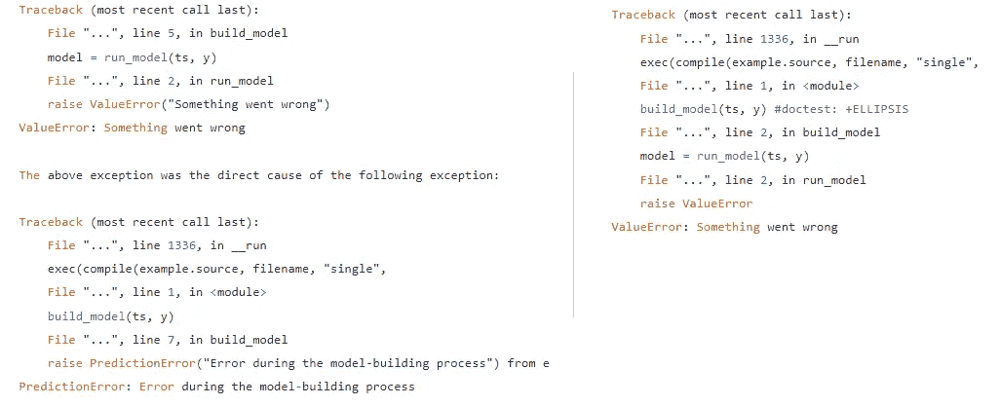

# 我们应该在 Python 中使用自定义异常吗？

> 原文：<https://towardsdatascience.com/should-we-use-custom-exceptions-in-python-b4b4bca474ac>

## Python 有如此多的内置异常，以至于我们很少需要创建和使用自定义异常。还是我们？

自定义异常:拥有自己的错误。照片由[布雷特·乔丹](https://unsplash.com/@brett_jordan?utm_source=medium&utm_medium=referral)在 [Unsplash](https://unsplash.com?utm_source=medium&utm_medium=referral) 上拍摄

我们应该使用自定义异常还是内置异常？实际上，这是一个非常好的问题。有人说，

> 不惜一切代价避免自定义异常。有如此多的内置异常，你很少需要一个自定义的。

还有人说，

> 在项目中使用自定义异常。将内置异常留给引发它们的典型情况，并引发自定义异常来通知与应用程序相关的错误，而不是代码本身。

Deitel 和 Deitel (2019)声称应该使用内置异常。Kapil (2019)建议在创建接口或库时使用自定义异常，因为这有助于诊断代码中出现的问题。Bader (2017)也是如此，他解释说，当代码遵循 [*时，自定义异常有助于用户，请求原谅比请求许可*编码策略](https://devblogs.microsoft.com/python/idiomatic-python-eafp-versus-lbyl/)更容易。

如果您对这种情况感到困惑，或者您只是对自定义异常感兴趣，那么这篇文章就是为您准备的。我们将讨论是否应该在项目中使用自定义异常，而不是尽可能使用内置异常(所以，基本上，总是这样)。在我们继续之前，请注意这不是一个对与错的选择。相反，我们将寻找黄金法则，它将帮助我们找到正确的平衡。

# **定义自定义异常**

首先，让我们看看如何在 Python 中定义自定义异常。这是一个简单的任务，因为您唯一需要做的就是创建一个从内置的`Exception`类继承的类:

我将在下面展示你可以做得更多；但事实是，大多数时候我只使用一个空类(实际上，它不是空的，因为它是从`Exception`继承的)，因为这就是我所需要的。通常，我会添加一个描述性的文档字符串:

如您所见，如果添加 docstring，您不需要使用`pass`语句。也可以用省略号(`…`)代替`pass`语句。这三个版本的工作方式相同。选择在特定情况下效果更好的，或者你更喜欢的。

*注意命名有多重要*。在计算预测过程中出现问题时，这似乎是一个非常通用的定制例外。根据您的需要，您可以创建更加具体的异常，但是不要忘记使用信息丰富的名称。Python 中的一个通用规则是使用简短但信息丰富的名称。具有讽刺意味的是，自定义异常构成了一个异常，因为它们通常有很长的名称。这是因为大多数人——包括我自己——喜欢使用独立的异常名，我认为您也应该遵循这条规则。考虑这些信息丰富且模糊的异常名称对:

*   `NegativeValueToBeSquaredError`对`SquaredError`
*   `IncorrectUserNameError`对`InputError`
*   `OverloadedTruckError`和`NoLoadOnTruckError`对`LoadError`

左边的名字比右边的更具体，信息更丰富。另一方面，您可以将右边的异常视为左边的可以继承的一般错误；例如:

这被称为*异常层次*。内置错误也有其层次。异常层次结构可以服务于一个重要的目的:当你创建这样一个层次结构时，用户不必知道所有特定的异常(Lutz 2013)。相反，知道并捕捉一般的异常(在我们的例子中，它是`LoadError`)就足够了；这将使得捕捉从它继承的所有异常(`OverloadTruckError`和`NoLoadOnTruckError`)成为可能。Bader (2017 年)强化了这一建议，但警告不要让这样的层级结构过于复杂。

然而，有时追求简单就足够了:

如果你认为`NoLoadOnTruckError`不应该是一个错误，因为卡车有时确实会空载，那你就对了。但是，请记住，异常不一定意味着错误；他们的意思是…嗯，他们的意思是例外。然而，这是一个以“Error”结束异常类名称的 Python 规则，所有内置异常都是这样命名的(例如，`ValueError`或`OSError`)。

# **引发自定义异常**

自定义异常的引发方式与内置异常相同。然而，值得记住的是，我们可以用几种方法做到这一点。

## **检查一个条件，如果不满足就加注**

不满足特定条件时会引发异常。您可以在有消息或没有消息的情况下执行此操作:

## 捕捉一个内置异常并引发一个自定义异常

在这里，我们不提高`ZeroDivisionError`，而是提高自定义`EmptyVariable Error`。一方面，这种方法可以提供更多的信息，因为它指出了问题所在。另一方面，它并没有讲述整个故事；也就是说，仅提高`EmptyVariableError`不会通知用户变量为空，因此在使用`get_mean()`计算平均值时会被零除。开发者决定用户是否应该知道这些详细信息的需求；有时，没有这种需要，但其他时候追溯传递的信息越多越好。

我们可以通过与`EmptyVariableError`一起提供的消息来传达这一信息，但是有一种更好的方式来做到这一点——如下所述。

## **捕捉一个内置异常，并从中产生一个自定义异常**

这里，我们在回溯中包括了`EmptyVariableError`和`ZeroDivisionError`；我们唯一改变的是在前面代码片段的第 10 行添加了`as e`，在第 11 行添加了`from e`。

这个版本提供了更多的信息，因为它说了更多的细节:变量是空的，没有数据，当使用`get_mean()`计算平均值时，由于缺少数据而引发了`ZeroDivisionError`。`ZeroDivisionError: division by zero`这么说吗？肯定不是直接的，但是你需要仔细地分析回溯来间接看到它。

因此，从内置异常引发自定义异常有助于您传达关于所发生事件的更详细的信息。

# **丰富自定义异常**

到目前为止，我们只使用了简单的自定义异常。尽管简单，但这种方法是高度可定制的，这是由于在引发异常时能够使用任何消息。但是，我们可以创建一个内置在异常类中的消息。这样，您就不必在引发异常时提供消息。看这里:

因此，如果您不提供`truck_no`，将不会使用任何消息。当您这样做时，`NoLoadOnTruckError`将被引发，并显示消息`"The truck 12333 is empty"`。这是一个简单的例子；你可以在这里阅读更多关于这个话题的[。](/how-to-define-custom-exception-classes-in-python-bfa346629bca)

我只在一种情况下使用这种方法:否则我将不得不在代码的几个地方使用相同的长消息，这时我会引发这个异常。然后，用内置消息扩展这样一个异常类是有意义的，但是我尽可能保持这个类简单，尽量不使它的代码复杂。

然而，在其他情况下，我通常只使用一个从`Exception`基类继承的空类:提供我所需要的最简单的解决方案。尽管没有提供更丰富的功能，但丰富的异常类可能会变得复杂。此外，这样的类不能被进一步定制；您只能省略消息或使用内置于类中的消息，但不能使用不同的消息。考虑到这一点会使这个类变得更加复杂。

# **示例**

既然我们已经知道了如何定义定制异常，那么让我们来看看它们是如何工作的。

首先，注意我改变了表示代码的方式，命令以`>>>`开始。这就是如何在`[doctest](https://docs.python.org/3/library/doctest.html)`中格式化代码及其输出，这是一个用于文档测试的内置模块。您不仅可以将文档作为`doctest`测试来运行，以查看代码是否运行良好，而且您还可以轻松地区分代码及其输出。

我决定在类型提示中使用类型别名。在我看来，这样的类型提示比直接添加到函数签名中的复杂类型提示更具可读性。因此，我们有了`TimeSeriesDates`和`TimeSeriesValues`类型，两者都是列表，前者是`datetime.datetime.date`对象，而后者是浮点数。

然后，我创建了`IncorrectTSDataError`，这是一个在时序数据不正确时使用的异常。注意，我们在数据不正确的三种不同情况下使用相同的异常类。这是一个简单的解决方案，在这种简单的情况下就足够了。我们可以创建一个异常层次结构，从`IncorrectTSDataError`继承三个定制异常。然而，在您的项目中，也许更复杂的异常层次结构会更好。

然后，定义主建模函数`build_model()`。当然，这是一个简化的函数，它只做两件事:

*   检查数据是否正确:`ts`不缺失，`y`不缺失，`ts`和`y`长度相同；和
*   构建模型(由`run_model()`函数表示)。

我们可以将检查代码移到一个专用的函数中(例如`check_data()`)，如果`build_model()`的代码变得更长，我肯定会这么做。

如果其中一项检查失败，该函数将抛出`IncorrectTSDataError`异常，消息取决于出错的原因。否则，该功能继续并调用`run_model()`功能。当然，这里的数据检查过于简单，因为它仅用于表示目的。我们可以检查数据是否确实是一个`datetime.datetime.date`列表；我们可以检查点的数量是否足以建立预测模型；等等。

现在，看看我们是如何运行`run_model()`函数的:我们使用`try-except`块来这样做，以便能够捕获在这个过程中抛出的任何错误。当我们捕捉到一个错误时，我们不沉默它，而是重新引发它，从它引发`PredictionError`:`raise PredictionError from e`。为了简单起见，我没有在错误中包含该消息。这样，原始错误将包含在回溯中。

为了运行它并看看它是如何工作的，我们需要`run_model()`函数。让我们创建一个只会引发错误的模拟(这里，`ValueError`)。

> [一个对象的*模仿*](https://en.wikipedia.org/wiki/Mock_object) 是它模仿原始对象行为的人工表示，在我们的例子中，是`run_model()`函数。这意味着我们不需要整个对象(函数)，只需要它的模拟来做我们需要模仿的事情。在这里，它养`ValueError`就够了。

这样，无论何时我们运行该函数，它都会引发`ValueError`:

这是我们正在运行的应用程序。我们将从单变量分布中生成值，因此数据中不太可能有趋势。

第 23–25 行的完整回溯如下所示(用省略号代替路径、名称等。):

我们现在应该看看使用内置异常而不是`PredictionError`进行回溯会是什么样子。我们需要首先改变`build_model()`函数:

这个版本的`build_model()`函数实际上没有多大意义，因为它只是简单地调用了`run_model()`。然而，它可以做得更多；例如，它可以检查数据或进行数据预处理。

让我们在与上面完全相同的场景中检查一下回溯:

查看下图来比较这两种追溯:

左侧是使用自定义异常时的回溯。右侧使用了内置的 ValueError。来源:作者。

请注意以下几点:

*   使用定制异常的回溯提供了最初的错误(`ValueError`)，但是使用定制的`PredictionError` 异常和定制的消息来解释它。
*   与此同时，当使用内置异常类时，带有原始`ValueError`的部分比相应的回溯更简洁易读。

你同意我的观点吗，自定义异常的追溯更清晰？

`raise MyException from AnotherExcepion`语法非常强大，因为它使您能够显示根异常的回溯，以及定制异常的回溯。这样，就导致错误的问题而言，回溯比仅使用内置异常时获得的回溯信息要多得多。

# **结论**

定制异常很容易创建，尤其是当您不去添加`.__init__()`和`.__str__()`方法时。这是一种非常罕见的情况，更少的代码意味着更多的功能。通常情况下，从`Exception`类继承一个空类是可行的方法。

但是对于一个空类，您需要做出一个决定:是否要写一个 docstring。(至于是选择`pass`语句还是省略号根本无关紧要，所以我们可以忽略它。)而答案是，视情况而定。这取决于你对你的班级有什么期望。如果它是一个服务于不同异常的通用类，那么你可能需要一个 docstring 来说明这一点。但是，如果选择这个选项，您需要考虑几个更精确的异常类是否能更好地完成这项工作。我不是说他们会，因为通常你不想使用 50 个自定义异常；不像你钱包里有 100 美元的钞票，有时 5 美元比 50 美元好。

还有一件事很重要:一个好的、信息丰富的名字。如果您使用了一个好的名称，那么即使没有 docstring 和消息，您的异常类也可能是独立的。即使您确实需要 docstring 和消息，您的异常仍然需要一个好的名称。一个好处是异常类可以有比典型 Python 对象更长的名称。所以，`IncorrectAlphaValueError`和`MissingAlphaValueError`甚至看起来都不算长。

真正伟大的是`raise from`，它使我们能够从代码内部引发的异常中引发自定义异常。这个功能允许我们在回溯中包含两个部分:一个与最初引发的异常相关(尽管它不是必须内置的)，它显示发生了什么以及发生在哪里；我们可以称之为误差的基本来源。第二部分与我们的定制异常相关，实际上*使用与项目相关的词语向用户解释*实际发生了什么。将这两部分结合起来使得回溯功能更加强大。

然而，不管你是在做一个你想提供给其他人的包，一个商业项目，还是其他任何东西(例如，一个展示带有一些分析的报告的笔记本)，这都是有区别的。更详细地解释:

1.  *供他人使用的包*。这种包通常会受益于自定义异常。它们需要被很好地设计和明智地使用，这样它们才能准确地显示出哪里出了问题。
2.  *一个商业项目*。自定义异常通常是一个不错的选择。内置异常提供关于 Python 相关问题的信息，自定义异常将添加关于项目相关问题的信息。这样，您就可以通过将 Python 代码与项目语言相结合的方式来设计您的代码(如果出现异常，还可以进行回溯)。
3.  *轻量级代码*，像在笔记本里。类似地，这可以是一个脚本的代码，甚至是一个片段，使用一次或两次。通常情况下，自定义异常是多余的，会不必要地使代码变得复杂。笔记本通常不需要如此深远的异常处理；因此，在这种情况下，您很少需要创建自定义异常。

当然，这些规则总会有例外，所以根据您的经验和项目的细节，在特定情况下选择最佳方法。但是 ***不要害怕使用定制异常*** ，因为它们可以极大地有益于您的项目。

我希望你喜欢这篇文章。不知何故，很多书都默默地省略了这个话题，甚至不提自定义异常。当然，也有反例，比如我在文中提到的那些书。然而，我觉得大多数作者并不认为自定义异常是一个有趣和/或重要到值得讨论的话题。我的观点是相反的，原因很简单，我发现定制异常在相当多的项目中很有价值。如果一个人从未尝试过使用自定义异常，也许是时候这样做了，并检查自己它们是如何工作的。

在我看来，自定义异常为诊断问题提供了一个极好的工具。Python 以可读性和用户友好性著称；使用自定义异常可以帮助我们进一步改进这一点，尤其是当我们设计我们的包时。如果您决定不惜一切代价只使用内置异常来避免自定义异常，那么您就有降低 Python 可读性的风险。

因此，我希望从现在开始，您不要害怕创建自己的异常类。当您处理一个接口或包时，不要害怕创建一个嵌套的异常类层次结构。但是，有时您不需要自定义异常。重点是，考虑您的 Python 项目是否会从自定义异常中受益总是好的。如果您决定使用它们，请记住不要过于复杂，并且永远不要忘记 Python 的哲理:“简单比复杂好”，以及“扁平比嵌套好”

# 资源

*   Bader D. (2017)。 *Python 技巧:令人敬畏的 Python 特性自助餐*。图书宝贝。
*   Deitel P .，Deitel H. (2019)。*面向程序员的 Python:与大数据和人工智能案例研究*。皮尔森教育。
*   Kapil S. (2019)。*干净的 Python:Python 中优雅的编码*。新闻媒体。
*   Lutz M. (2013 年)。*学习 Python* 。第五版。奥莱利媒体。
*   [https://towardsdatascience . com/how-to-define-custom-exception-classes-in-python-BFA 346629 BCA](/how-to-define-custom-exception-classes-in-python-bfa346629bca)
*   [https://dev blogs . Microsoft . com/python/idiomatic-python-eafp-vs-lbyl/](https://devblogs.microsoft.com/python/idiomatic-python-eafp-versus-lbyl/)
*   [https://better programming . pub/python-type-hinting-friend-foe-or-just-a-headaw-73c 7849039 C7](https://betterprogramming.pub/pythons-type-hinting-friend-foe-or-just-a-headache-73c7849039c7)
*   [https://docs.python.org/3/library/doctest.html](https://docs.python.org/3/library/doctest.html)
*   [https://peps.python.org/pep-0020/](https://peps.python.org/pep-0020/)
*   [https://en.wikipedia.org/wiki/Mock_object](https://en.wikipedia.org/wiki/Mock_object)