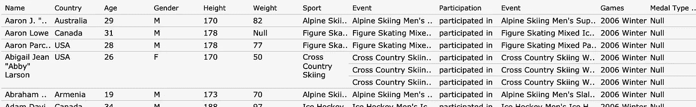
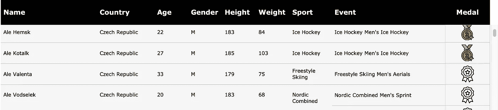

# 你应该在数据可视化中添加文本表格吗？

> 原文：<https://towardsdatascience.com/should-you-add-text-tables-in-your-data-visualisations-bf59d080d312>

作为一名数据分析师，这么多年来，在我所有的需求讨论中，有一件事是很常见的。我总是在房间里至少有一个人请求仪表板中的一个细节选项卡，其中有一个包含所有可能字段的表格。要求来自各种各样的利益相关者——工程师、工程经理、产品所有者、项目经理、CSM、tam、营销经理、材料经理、全球供应经理等等。

米卡·鲍梅斯特在 [Unsplash](https://unsplash.com?utm_source=medium&utm_medium=referral) 上的照片

在我职业生涯的早期，我总是试图说服利益相关者利用他们从仪表板而不是原始数据中获得的洞察力。我曾经觉得，当可以从数据库中方便地查询原始数据时，在仪表板上添加原始数据是没有意义的。但这改变了。

> 正如朱利叶斯·凯撒所说，“经验是一切的老师。”

随着时间的推移，我有机会与许多有不同类型问题的利益相关者一起工作。我意识到，作为一名分析师，如果我想为我的客户建立一个一站式的自助分析能力，就需要满足他们的所有需求。在一些特定的用例中，表格非常有用。

**精细数据剖析—** 假设您正在处理客户反馈数据，其中包含客户评级和评论。现在，您当然可以进行情感分析和文字云来显示分布情况，但如果最终用户想要确切了解人们在特定问题领域报告了什么样的问题，一个包含所有独特评论的表格会非常有帮助。

**数据分发—** 一些最终用户(尤其是面向客户的角色)将使用您开发的工具中的图表来创建演示文稿，以展示给他们的客户。这些客户端可能已经请求了表格格式的数据，以便它们可以在内部进一步接收这些数据。因此，仪表板上有一个现成的表格，其中只有相关的维度和指标，这简化了他们的工作。

**进一步处理—** 一些最终用户将下载数据，在电子表格软件中进一步处理数据，以做出商业决策或发布预测。从现有图表中下载数据可能会导致列数不足，或者所有列都包含多余的列，以后可能需要删除这些列。在仪表板上有一个定制的数据表将会非常快。

我说过数据表不仅重要，而且在某些用例中是不可避免的，我也相信这个表不一定是单调乏味的。这是一个文本密集型的数据可视化，这使得表格的简洁和专业外观变得尤为重要。

有一些非常简单的技巧可以让你的桌子看起来同样漂亮，同时又不影响功能。

## 1.限制列数

作为一个经验法则，我尝试选择最重要的维度和度量，并且只以表格不会水平滚动的方式显示它们。因为在大多数可视化工具中没有窗格冻结选项，水平滚动只会增加更多的问题而不是价值。

为了实现这一点，您应该非常清楚地知道该功能的最终目标。在需求阶段，我通常会问我的客户很多问题，以了解他们将如何使用这个工具，以及他们希望从中获得什么。这通常有助于我确定/列出表中显示的 8-10 个主要领域。

我使用的另一个策略是将多个字段合并在一个字段中。例如，我在其中一个数据集中保存了州和城市的信息，这对客户来说是很重要的。因此，我没有将它显示为两个单独的列，而是创建了一个位置字段——“城市，州”。这为我节省了一些空间。另一个例子是当有一个用户数据集时，需要显示用户的年龄和性别。因此，我将三个字段合二为一来显示—姓名|年龄|性别。这在没有任何信息损失的情况下创造了一些空间。

## 2.对比标题栏

使用深色背景的粗体标题。这立即提升了外观，使其看起来更整洁、更清爽。

## 3.适当的行高和列宽

增加默认的行高和列宽，在每行和每列中留出一些空白。这有助于提高可读性，并为大量文本的数据可视化提供喘息空间。

## 4.使用绩效指标

绩效指标是一种非常有效的方式，可以一目了然地显示趋势。您可以使用彩色的向上或向下箭头来显示积极和消极趋势*。您还可以添加一些条件格式，根据 KPI 值为特定列的背景着色。甚至迷你趋势图也可以添加到其中一个列中。

**可用性方面-请确保添加的指标不会影响可下载文件的数据质量。确保这一点的最简单方法是自己测试。*

## 5.有意义的工具提示

这是所有类型的视觉化的一个普遍提示，尤其是对一张桌子。 ***不在工具提示中显示多余信息。*** 由于表格中的所有列都是文本的，所以在工具提示中显示相同的信息并没有额外的价值。请添加更多信息或禁用工具提示。

这些只是可以用来改善表格可视化的许多事情中的一部分。以下是我最近一次[也就是](https://public.tableau.com/views/120YearsofOlympicHistory_16492491248400/B2VBWeek3?:language=en-GB&:display_count=n&:origin=viz_share_link)的前后结果。

图像前(作者)

图像后(作者)

希望这些信息对你有用！请让我知道你是否有任何提高数据可视化的技巧。我很想了解更多。

感谢阅读！

*下次见……*