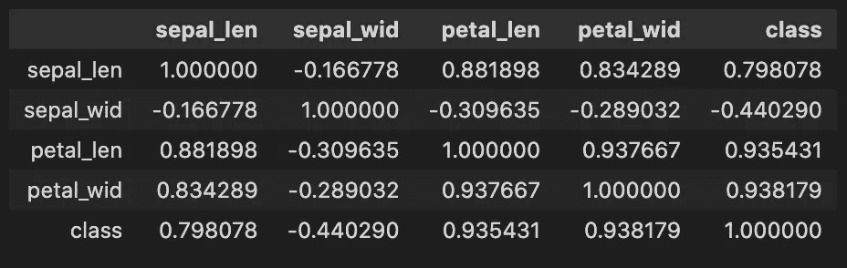
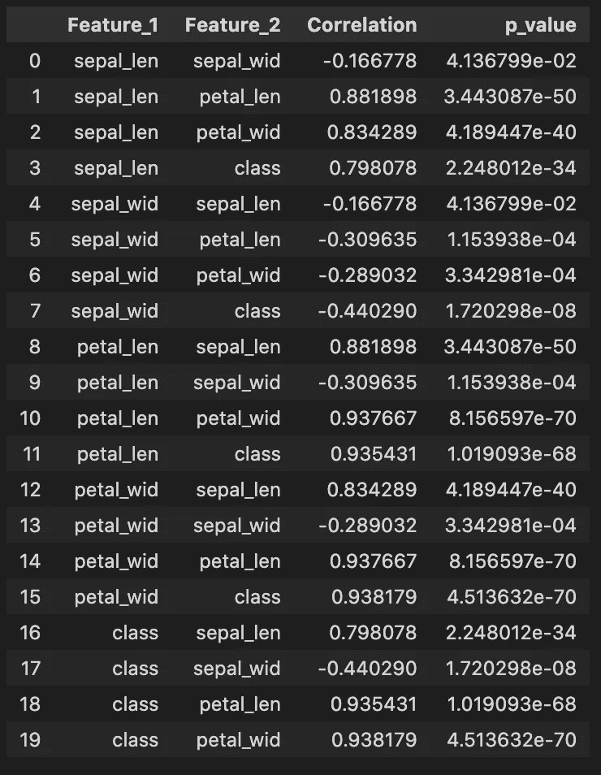

# 你应该使用熊猫相关函数吗？

> 原文：<https://towardsdatascience.com/should-you-use-pandas-corr-function-af82c454bc0>

## 熊猫 corr()的局限性及对策

克里斯·利维拉尼在 [Unsplash](https://unsplash.com/s/photos/statistics?utm_source=unsplash&utm_medium=referral&utm_content=creditCopyText) 上的照片

# 什么是相关性？

相关性被定义为两个随机变量之间的关联。在统计学中，它通常指一对变量线性相关的程度。

> 旁白:在谈论相关性时必须提到的一个强制性警告是“相关性并不意味着因果关系”。查看[这篇文章](https://sundaskhalid.medium.com/correlation-vs-causation-in-data-science-66b6cfa702f0)了解更多。

您会经常发现自己在探索性数据分析中使用相关性。在监督设置中，可以查看特征和目标变量之间是否存在高度相关性，从而决定数据集是否可用于预测目标结果。在无监督的设置中，您可能会使用它来查看是否有要素之间具有高度相关性。这种相关性可能指向您可能想要删除的冗余功能。

大多数数据科学新手会发现自己在使用 pandas 内置的关联函数，即 pandas。DataFrame.corr()，如下所示

使用熊猫计算相关性的代码。DataFrame.corr()

使用 pandas 计算相关性的代码输出。DataFrame.corr()

如果您查看该功能的[文档](https://pandas.pydata.org/docs/reference/api/pandas.DataFrame.corr.html)，根据设计，它具有最小配置。它允许您更改计算相关性的方法，例如，它提供了 Pearson、Spearman、Kendall Tau 计算相关性的方法。要了解更多关于这些方法的信息，请参阅下面的文章。

</clearly-explained-pearson-v-s-spearman-correlation-coefficient-ada2f473b8>  </kendall-rank-correlation-explained-dee01d99c535>  

然而不管用什么方法。DataFrame.corr()函数仅返回由相关值组成的 DataFrame。

# 熊猫角的限制()

相关性只是故事的一半。当我们谈论变量之间的相关性时，我们理想情况下想要度量的是整个总体中变量之间的相关性。然而，大多数数据科学家处理的是数据样本。因此，如果我们获得不同的样本，我们可能会有不同的相关分数。因此，我们需要评估我们计算的相关值的**显著性**，这取决于样本大小。关于显著性检验的理论公式，请查阅这篇文章。

</eveything-you-need-to-know-about-interpreting-correlations-2c485841c0b8>  

# 如果不是 corr()还有什么？

从应用角度来说，如果熊猫。DataFrame.corr()没有给出 p 值，如何找到它们？你可以自己计算。或者您可以使用 scipy 来计算相关性！

Scipy 的 stats 库提供了熊猫相关测试的所有三个版本。DataFrame.corr()即[皮尔森](https://docs.scipy.org/doc/scipy/reference/generated/scipy.stats.pearsonr.html)、[斯皮尔曼](https://docs.scipy.org/doc/scipy/reference/generated/scipy.stats.spearmanr.html)、[肯德尔τ](https://docs.scipy.org/doc/scipy/reference/generated/scipy.stats.kendalltau.html)。使用它很简单，只需传入要比较的数据帧的列。考虑下面的片段

使用 Scipy.stats 计算相关性和 p 值的代码

用于计算相关性和 p 值的代码 Scipy.stats 的输出

从上面的输出中，我们可以看到 p 值，从而知道相关性有多重要。

# 结论

对于数据样本的相关性测试(这是您经常要做的工作),也要计算 p 值。因此，当处理样本数据时，请使用熊猫的 scipy.stats。DataFrame.corr()