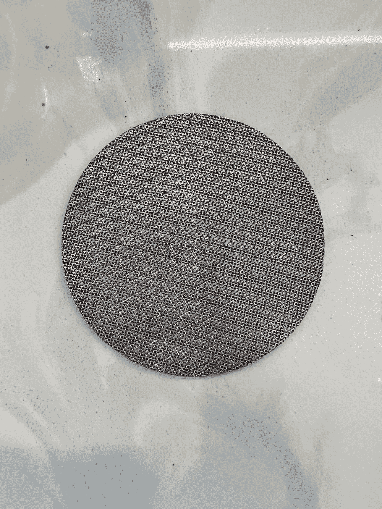
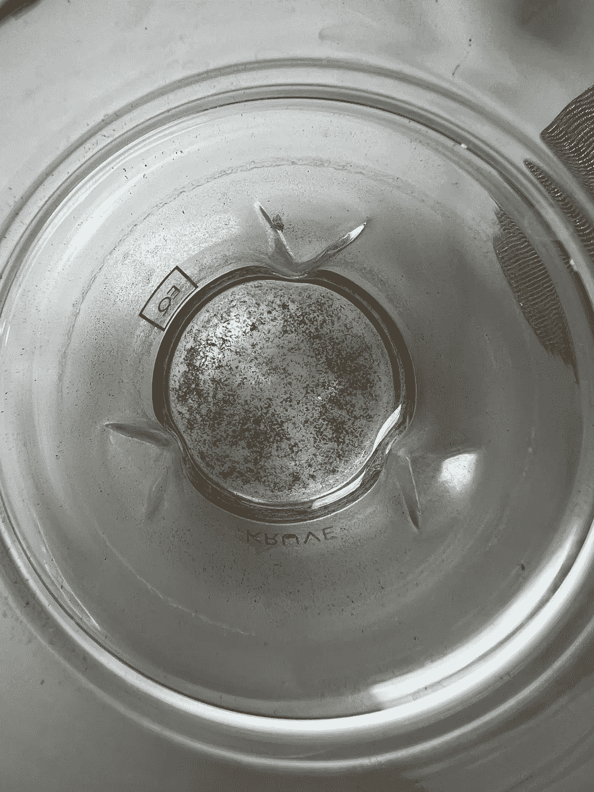
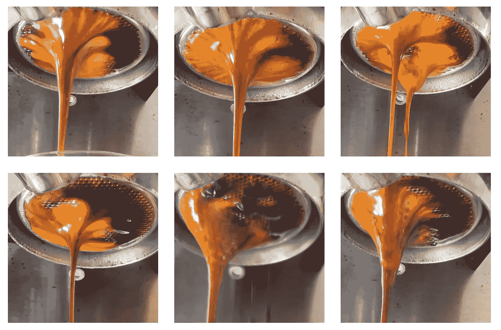
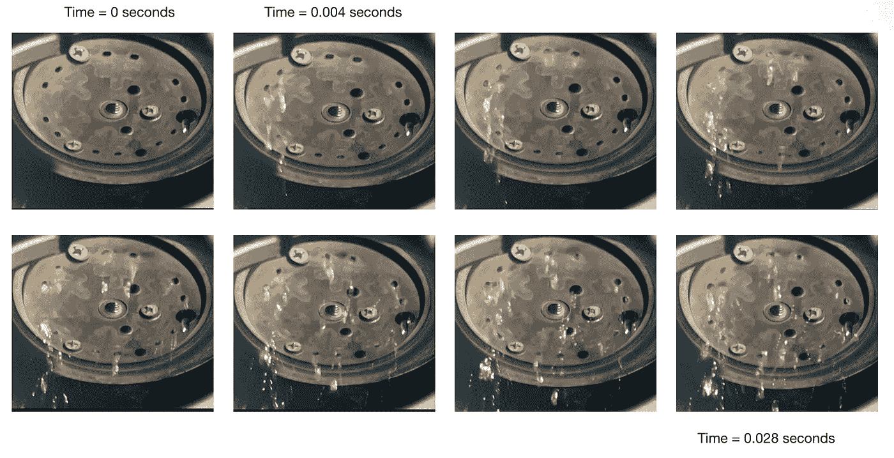
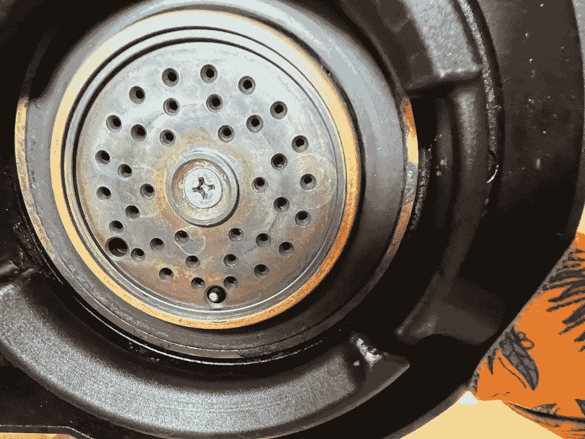
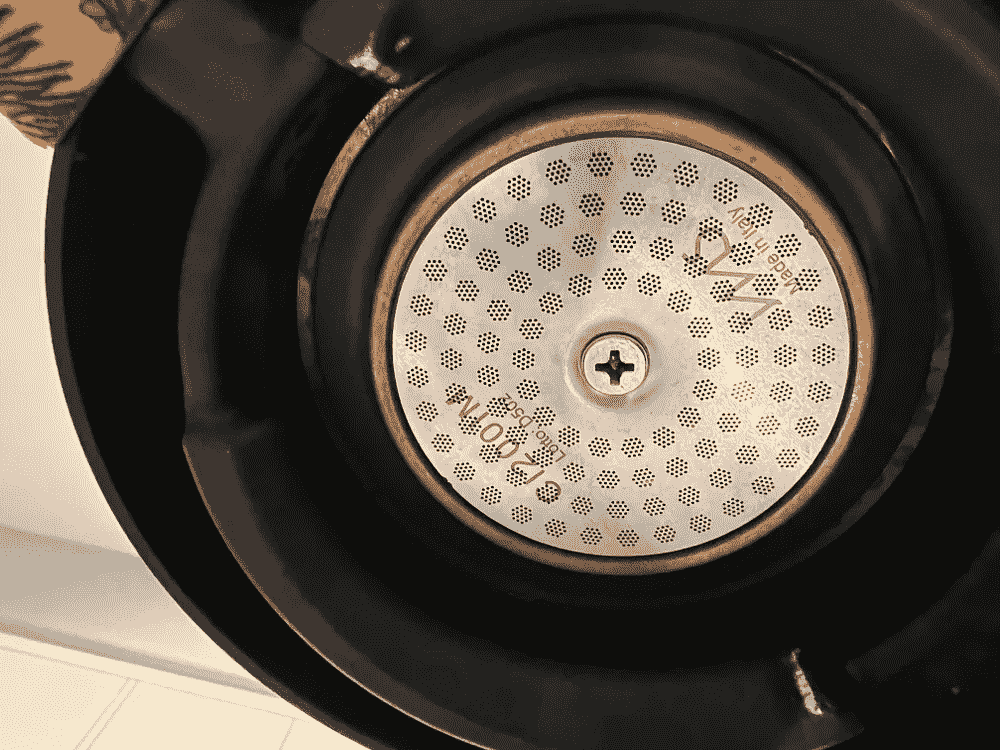
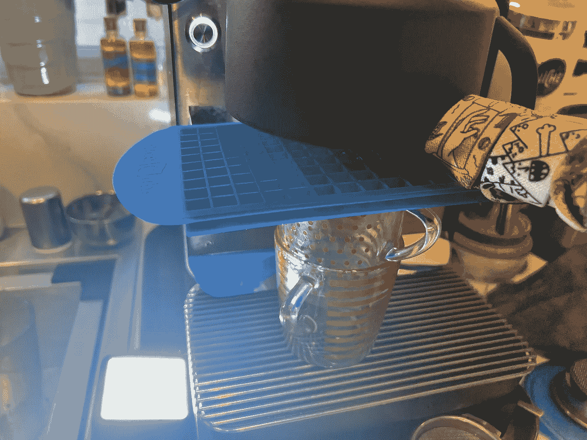
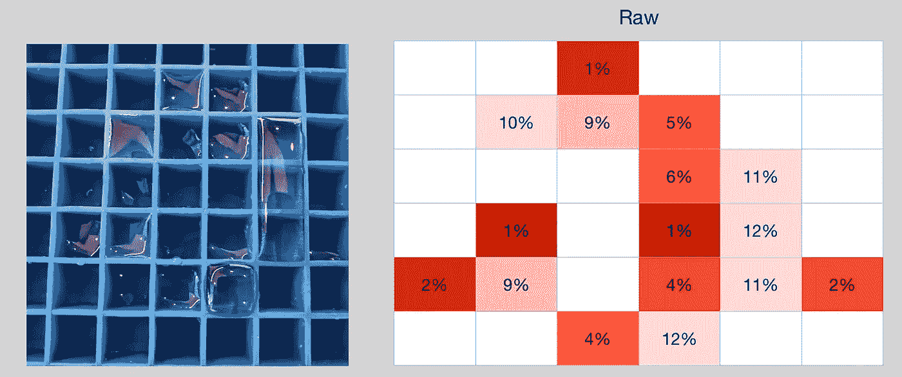
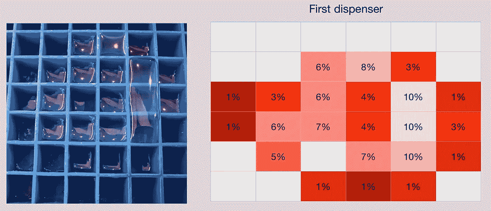
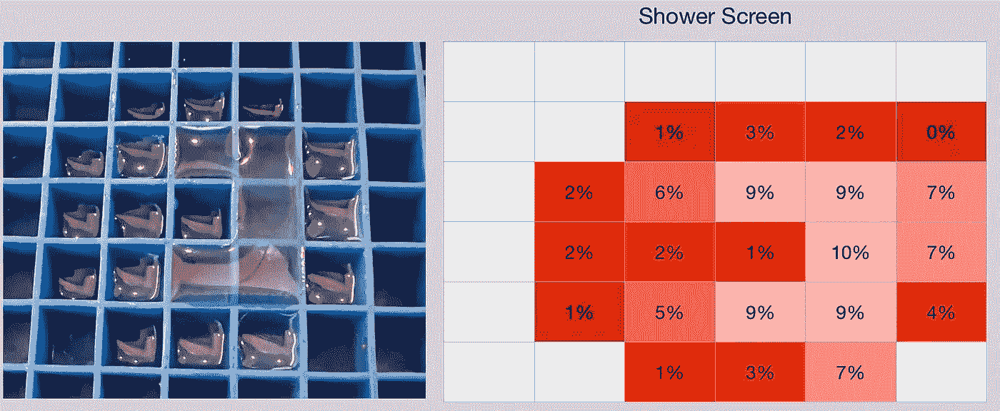

# 淋浴屏幕深潜在一个体面的咖啡机

> 原文：<https://towardsdatascience.com/shower-screen-deep-dive-on-a-decent-espresso-machine-9389cbebbdf1>

## 咖啡数据科学

## 拆掉淋浴帘

我在我的意式浓缩咖啡机中发现了对淋浴屏幕的兴趣。咖啡机的这一块并没有被谈论太多。淋浴帘确实控制着水进入圆盘，所以它可能和过滤篮一样重要。我深入研究了它是如何工作的，以更好地理解为什么我会在我的实验档案中看到一些奇怪的结果。我从视觉数据开始，在那里我看到了片面的行为，所以我扩展了数据收集，以更好地了解水流是如何沿着圆盘分布的。在分析过程中，视觉数据和流量数据有奇怪的不匹配，但显然输入水有轻微的不均匀性。

让我们从一个[顶部滤网](/metal-meshes-and-espresso-389d29c832c5)开始。我用了一段时间，主要的好处是保持淋浴屏幕更干净。我没有太注意深度清洁它，但我会在拍摄之间翻转它。有一天不小心没用上，看到我的[蒸汽预注配置文件](https://medium.com/nerd-for-tech/steam-pre-infusion-for-espresso-a-summary-1c58c65a937a?source=rss-ae592466d35f------2)有了很大的提升。所以我清理了金属网，我发现简单清理后粘在里面的东西不到 0.01 克。我也试着暂时不用金属网。

所有图片由作者提供

然而，我注意到我的新轮廓在左侧保持同样的通道。不只是几个镜头，而是每一个镜头都表现出这种行为。

六个不同的镜头

所以我拉下淋浴的屏风去看引擎盖下面。我还拆了水分散屏。水孔只在外圈。我注意到水从一边流出的速度比另一边稍快。这可以解释我在照片里看到的。

体面的咖啡机有水进入分散屏幕，然后到 IMS 淋浴屏幕。

左:分散屏，右:淋浴屏。

我想要更好的关于拍摄的信息，因为这可能只是在拍摄开始时发生的，而不是根本原因。

# 更多空间数据

所以我拿出我的迷你冰块托盘，测量了一下。

我测量了分散筛上方的原材料的水量，然后是分散筛或分配器，最后是淋浴筛。这可以告诉我他们的水是从哪里来的。我惊讶地发现水并没有像我想象的那么均匀。

随着分散屏幕的出现，情况有所好转，但仍然有一个由外部更高的流量引起的甜甜圈。

淋浴屏幕的情况有所改善，但右边的水量更大。

这让我觉得在理解每个单元的淋浴屏幕方面还有很多工作要做，而且有很大的机会来改进浓缩咖啡的拍摄。我敢肯定为什么一些浓缩咖啡比其他的效果更好的部分原因是因为它们弥补了淋浴屏幕设计的不足。所以我相信一个更好的设计也会改善剖面设计。

有一部分仍然缺乏很好的解释。根据数据，淋浴屏幕的右侧有更高的流量，但在上面的拍摄示例中，左侧出来得更快。我不确定为什么会这样，机器是水平的。我有更多的数据来表明，内部提取轨道左侧流量较高。我已经调整了我的个人资料和冰球准备来解释这种奇怪的流动，但我希望我有一个更好的答案。

如果你愿意，可以在推特、 [YouTube](https://m.youtube.com/channel/UClgcmAtBMTmVVGANjtntXTw?source=post_page---------------------------) 和 [Instagram](https://www.instagram.com/espressofun/) 上关注我，我会在那里发布不同机器上的浓缩咖啡照片和浓缩咖啡相关的视频。你也可以在 [LinkedIn](https://www.linkedin.com/in/dr-robert-mckeon-aloe-01581595) 上找到我。也可以关注我在[中](https://towardsdatascience.com/@rmckeon/follow)和[订阅](https://rmckeon.medium.com/subscribe)。

# [我的进一步阅读](https://rmckeon.medium.com/story-collection-splash-page-e15025710347):

[我的书](https://www.kickstarter.com/projects/espressofun/engineering-better-espresso-data-driven-coffee)

[我的链接](https://rmckeon.medium.com/my-links-5de9eb69c26b?source=your_stories_page----------------------------------------)

[浓缩咖啡系列文章](https://rmckeon.medium.com/a-collection-of-espresso-articles-de8a3abf9917?postPublishedType=repub)

工作和学校故事集