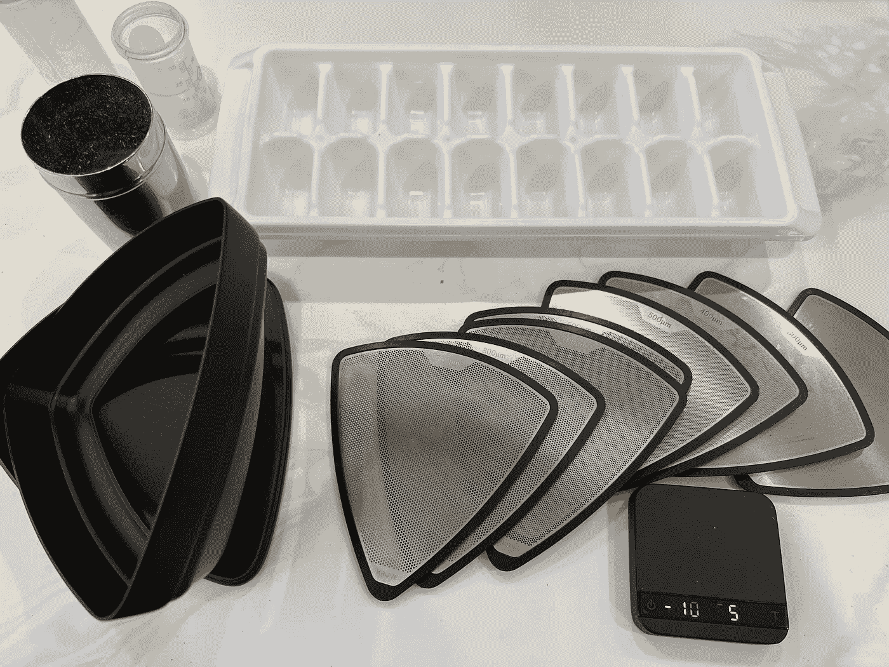
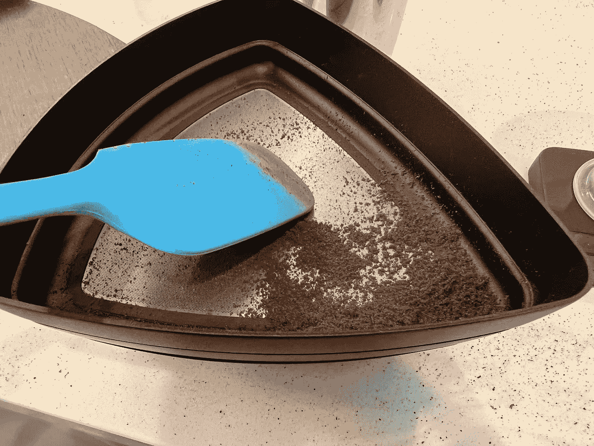
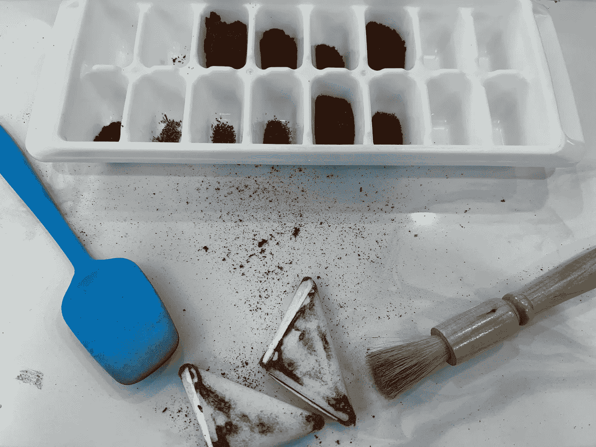
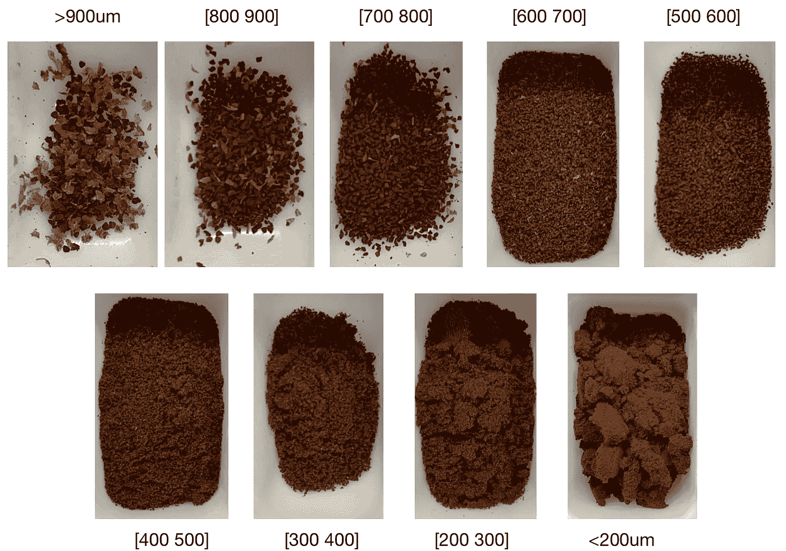
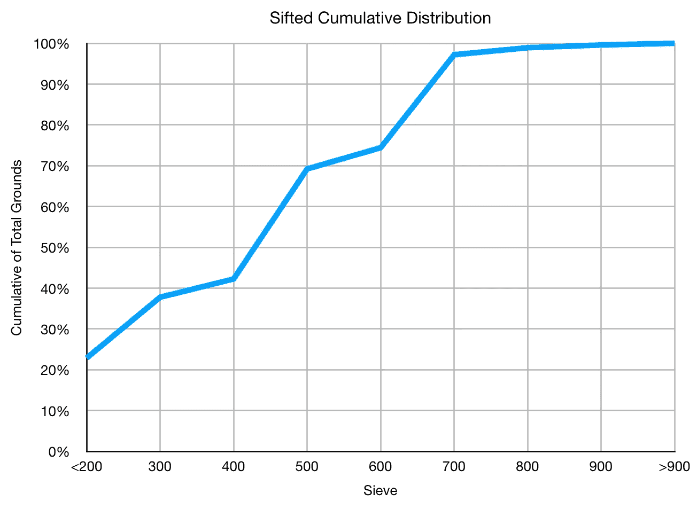
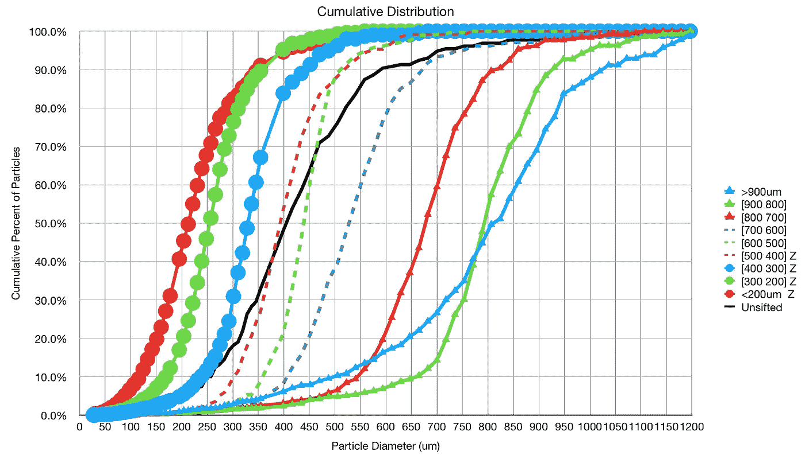
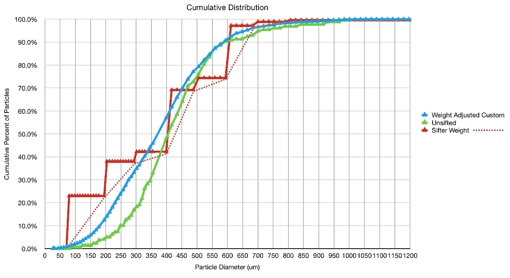
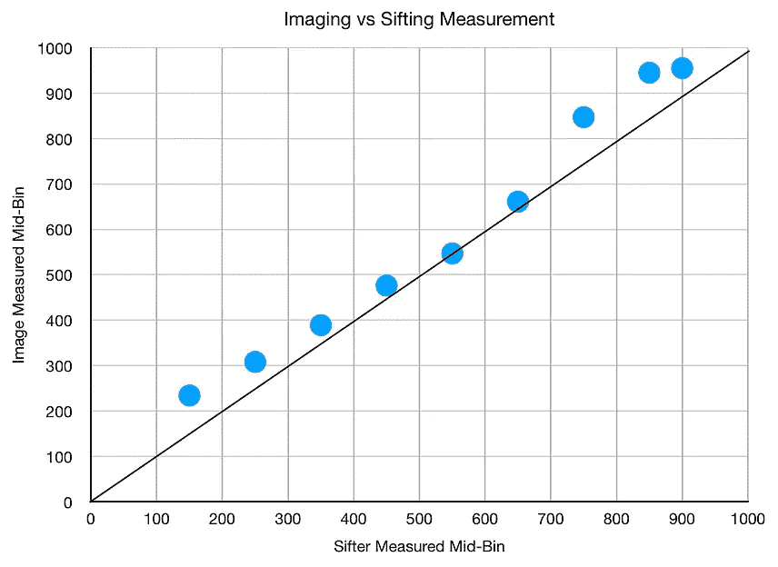
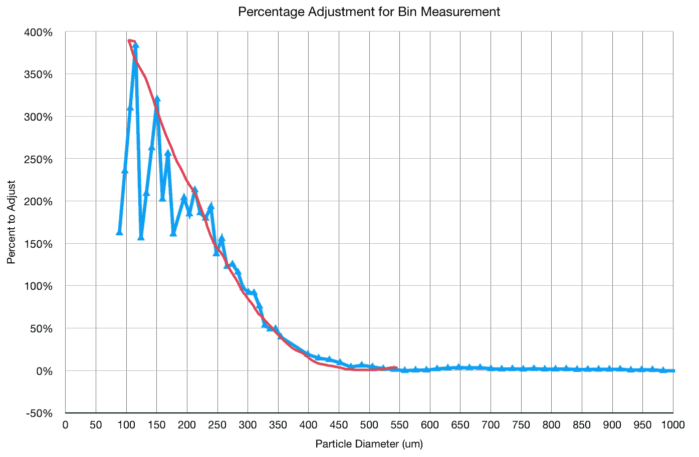

# 筛选与成像咖啡研磨分布

> 原文：<https://towardsdatascience.com/sifting-vs-imaging-coffee-grind-distributions-f77328e258ac>

## 咖啡数据科学

## 混合筛选和图像测量

最近，我决定想要一整套克鲁夫筛用于一些实验。我特别感兴趣的是我能从使用不同屏幕尺寸的[断奏](/staccato-espresso-is-fundamentally-better-than-regular-espresso-e73e88337127)方法中学到什么。因为我有全套设备，所以我想我可以通过一堆筛子进行筛选，并使用图像处理与颗粒分布测量进行比较。

我开始用一个比平常更大的研磨尺寸来研磨浓缩咖啡，但是它应该会给不同的屏幕提供更宽的分布。

所有图片由作者提供

一旦我达到 500 微米，400 微米和 300 微米，我不得不开始使用搅拌器来加速筛选。对于 200 微米，我不得不使用刮刀推动地面通过。

我用一个冰块托盘来收集粉末。

这种设置也很容易可视化。

初步筛选的累积分布如下所示:

# 地面分布

然后我使用一种[图像处理技术](https://rmckeon.medium.com/measuring-coffee-grind-distribution-d37a39ffc215?source=your_stories_page-------------------------------------)来测量每一层的研磨分布，包括未研磨的地面。名称中的 Z 表示使用放大的图像进行测量。每一个地面水平拍摄两张图像:广角和望远镜。wide 用于校准望远镜的每像素测量值。

使用[Upper() Lower()]托盘设置这种分配，以显示粉末落在两个箱子之间。

[900 800]和> 900um 有一个拖尾，但这两者都有少量样品和大量干扰物。

我使用这些分布和 sift 权重来做出更准确的分布，并将其与未 sift 的分布进行比较。我还覆盖了每个筛选屏幕的重量(用一条红色虚线来线性近似之间的点)。

这表明成像技术低估了高达 300um 左右的微粒数量。然而，当与使用相同技术获得的数据相比时，成像技术仍然表现良好。

我还研究了仓中点，也就是 50%的粒子上下的点。我把这些和筛盘的中间箱做了比较。[400 500]的中间仓是 450 微米。

这种重量调整的研磨分布可用于确定每个箱测量的重量调整参数，以更好地从 2D 图像颗粒测量得到实际重量，这需要考虑密度和体积。

每一杯咖啡可能都有调整，我怀疑事先使用密度测量会更准确。

这对我理解如何通过成像来估算体重是一个很有帮助的练习。目前，我只使用成像测量来比较地面，所以除了粒子密度之外，任何误差都应该是相似的。我可以预先测量整体密度，以改善烘烤过程中的测量。

如果你愿意，可以在推特、 [YouTube](https://m.youtube.com/channel/UClgcmAtBMTmVVGANjtntXTw?source=post_page---------------------------) 和 [Instagram](https://www.instagram.com/espressofun/) 上关注我，我会在那里发布不同机器上的浓缩咖啡照片和浓缩咖啡相关的视频。你也可以在 [LinkedIn](https://www.linkedin.com/in/dr-robert-mckeon-aloe-01581595) 上找到我。也可以关注我在[中](https://towardsdatascience.com/@rmckeon/follow)和[订阅](https://rmckeon.medium.com/subscribe)。

# [我的进一步阅读](https://rmckeon.medium.com/story-collection-splash-page-e15025710347):

[我未来的书](https://www.kickstarter.com/projects/espressofun/engineering-better-espresso-data-driven-coffee)

[浓缩咖啡系列文章](https://rmckeon.medium.com/a-collection-of-espresso-articles-de8a3abf9917?postPublishedType=repub)

[工作和学校故事集](https://rmckeon.medium.com/a-collection-of-work-and-school-stories-6b7ca5a58318?source=your_stories_page-------------------------------------)

个人故事和关注点

[乐高故事启动页面](https://rmckeon.medium.com/lego-story-splash-page-b91ba4f56bc7?source=your_stories_page-------------------------------------)

[摄影飞溅页面](https://rmckeon.medium.com/photography-splash-page-fe93297abc06?source=your_stories_page-------------------------------------)

[改善浓缩咖啡](https://rmckeon.medium.com/improving-espresso-splash-page-576c70e64d0d?source=your_stories_page-------------------------------------)

[断奏生活方式概述](https://rmckeon.medium.com/a-summary-of-the-staccato-lifestyle-dd1dc6d4b861?source=your_stories_page-------------------------------------)

[测量咖啡磨粒分布](https://rmckeon.medium.com/measuring-coffee-grind-distribution-d37a39ffc215?source=your_stories_page-------------------------------------)

[浓缩咖啡中的粉末迁移](https://medium.com/nerd-for-tech/rebuking-fines-migration-in-espresso-6790e6c964de)

[咖啡萃取](https://rmckeon.medium.com/coffee-extraction-splash-page-3e568df003ac?source=your_stories_page-------------------------------------)

[咖啡烘焙](https://rmckeon.medium.com/coffee-roasting-splash-page-780b0c3242ea?source=your_stories_page-------------------------------------)

[咖啡豆](https://rmckeon.medium.com/coffee-beans-splash-page-e52e1993274f?source=your_stories_page-------------------------------------)

[浓缩咖啡用纸质过滤器](https://rmckeon.medium.com/paper-filters-for-espresso-splash-page-f55fc553e98?source=your_stories_page-------------------------------------)

[浓缩咖啡篮及相关主题](https://rmckeon.medium.com/espresso-baskets-and-related-topics-splash-page-ff10f690a738?source=your_stories_page-------------------------------------)

[意式咖啡观点](https://rmckeon.medium.com/espresso-opinions-splash-page-5a89856d74da?source=your_stories_page-------------------------------------)

[透明 Portafilter 实验](https://rmckeon.medium.com/transparent-portafilter-experiments-splash-page-8fd3ae3a286d?source=your_stories_page-------------------------------------)

[杠杆机维护](https://rmckeon.medium.com/lever-machine-maintenance-splash-page-72c1e3102ff?source=your_stories_page-------------------------------------)

[咖啡评论和想法](https://rmckeon.medium.com/coffee-reviews-and-thoughts-splash-page-ca6840eb04f7?source=your_stories_page-------------------------------------)

[咖啡实验](https://rmckeon.medium.com/coffee-experiments-splash-page-671a77ba4d42?source=your_stories_page-------------------------------------)