# Sigmoid 和 SoftMax 功能在 5 分钟内完成

> 原文：<https://towardsdatascience.com/sigmoid-and-softmax-functions-in-5-minutes-f516c80ea1f9>

## 机器学习中两个最常用的激活函数背后的数学原理

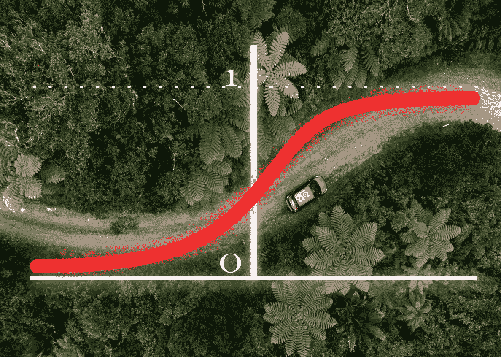

在 [Unsplash](https://unsplash.com/@malcoo?utm_source=unsplash&utm_medium=referral&utm_content=creditCopyText) 上由[Tomámalík](https://unsplash.com/@malcoo?utm_source=unsplash&utm_medium=referral&utm_content=creditCopyText)拍摄。作者编辑

T he Sigmoid 和 SoftMax 函数定义了用于机器学习的**激活函数**，更具体地说是用于**分类方法的深度学习领域。**

[*激活函数*](http://a) :对神经元的加权和进行变换，使输出为非线性的函数

> 注意。sigmoid 函数也被称为**逻辑函数**,因为它最初是通过逻辑回归算法引入的

这两个函数都从实数 R 的范围中取一个值χ，并输出一个介于 0 和 1 之间的数，该数代表χ属于某一类的概率**和**。

[*符号*](http://b) : *P(Y=k|X=x)* 读作“给定输入 X 为 X，Y 为 k 的概率”。

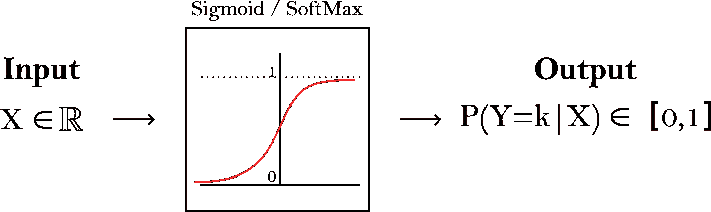

**图一**。Sigmoid 和 SoftMax 函数的图示。输出读作“给定输入 X，Y 成为类 k 的概率”。作者图片

**但是如果两个函数映射相同的转换(即做相同的事情)，它们之间的区别是什么？** Sigmoid 用于**二元分类**方法，其中我们只有 2 个类，而 SoftMax 适用于**多类问题**。实际上，SoftMax 函数是 Sigmoid 函数的扩展。
因此，两个函数的输入和输出略有不同，因为 **Sigmoid** 只接收一个输入，并且只输出一个表示属于 *class1* 的概率的数字(记住我们只有 2 个类，因此属于 *class2 的概率= 1 - P(class1)* )。而另一方面, **SoftMax** 是矢量化的，这意味着它采用一个与我们拥有的类具有相同条目数量的向量，并输出另一个向量，其中每个分量代表属于该类的概率。

**图二**。每个功能的输出图示。一个重要的性质是将每个 Sigmoid 类的所有概率相加，并且 SoftMax 应该等于 1。在 Sigmoid 的情况下，我们得到 P(Y=class2|X) = 1 - P(Y=class1|X)。作者图片

我们已经知道每个函数的作用以及在什么情况下使用它们。唯一剩下的就是数学公式(*更多的数学符号！*)

# Sigmoid 和 SoftMax 函数的数学公式

## Sigmoid 函数

假设我们的模型输出单个值 *X* ，它可以从实数 X ∈ (-∞，+∞)中取任何值，我们希望将该数字转换为概率 P ∈ [0，1]，它表示属于第一类的概率(我们只有两个类)。

然而，要解决这个问题，我们必须以相反的方式思考。我怎么把一个概率 P ∈ [0，1]转换成一个值 X ∈ (-∞，+∞)？
虽然看起来不合逻辑，但解决之道在于**赌马** ( *数学家向来喜欢游戏*)。

在赛马投注中，有一个常用术语叫做 ***赔率***【1】。当我们说 17 号马赢得比赛的几率是 3/8 时，我们实际上是说在 11 场比赛后，这匹马将赢得其中的 3 场，输掉 8 场。在数学上，赔率可以被视为两个独立事件之间的比率，并表示为:

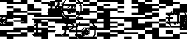

**赔率公式**

赔率可以取任何正值，因此没有上限限制[0，+∞]。然而，如果我们取对数奇数，我们发现范围值变为(-∞，+∞)。*赔率*的*日志*称为***logit 函数:***

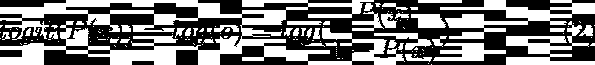

**Logit 函数公式**。将概率从(0，1)映射到整个实数范围(-∞，+∞)

最后，我们寻找的函数，即逻辑函数或 SIGMOID 函数，是 logit 的逆函数(将范围(-∞，+∞)中的值映射到[0，1])

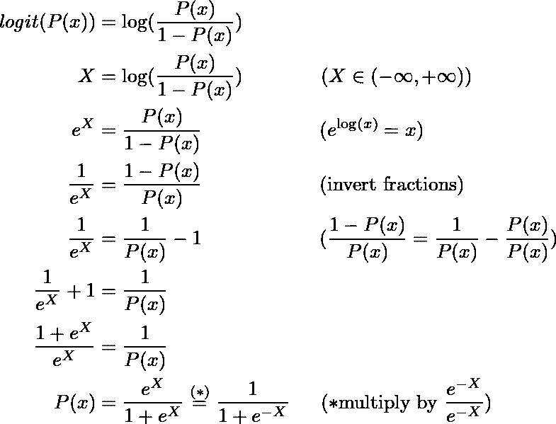

计算 logit 函数的反函数

从而得到公式:

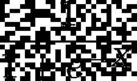

**Sigmoid 函数公式。**

其中 X 表示输入(在神经网络的情况下，输入是最后一个神经元的加权和，通常由 z = x1 w1 + x2 w2 + … + xn wn 表示)

## SoftMax 函数

另一方面，我们已经看到 SoftMax 接受一个向量作为输入。这个向量和我们的类有相同的维数。我们称它为 X(尽管神经网络中另一个常见的符号是 Z，其中向量的每个元素都是倒数第二层的输出)

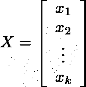

k 类的输入向量

与 Sigmoid 函数相同，输入属于真实值(在这种情况下是每个向量条目)*Xi*∑(-∞，+∞)并且我们想要输出一个向量，其中每个分量是概率 P ∈ [0，1]。此外，输出向量必须是**所有预测类别的概率分布**，即向量的所有条目必须加起来为 1。这个限制可以解释为每个输入必须属于一个类，并且只能属于一个类。

我们可以认为 X 是包含每个类的 P(Y=i|X)的逻辑的向量，因为逻辑可以是任何实数(这里我表示类号)。还记得 logit ∈ (-∞，+∞)吗

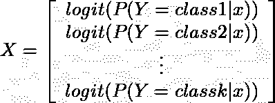

给定 x，Y 属于第 I 类的概率的对数

然而，与二元分类问题不同，我们不能应用 Sigmoid 函数。原因是，当应用 Sigmoid 时，我们获得的是孤立的概率，而不是所有预测类别上的**概率分布，因此输出向量元素的总和不是 1 [2]。**

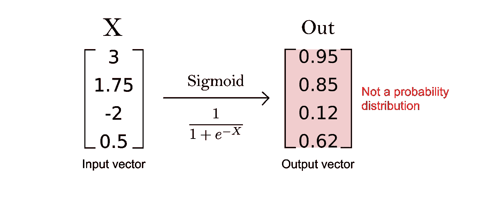

**图 3** 。为什么 sigmoid 函数不能用于多类分类？请注意，输出向量元素的总和不是 1。作者图片

要将 X 转换成概率分布，我们可以应用指数函数并获得几率∈ [0，+∞)

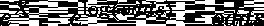

记住 X 是一个向量，因此 log(odds)和 odds 也是向量

在此之后，我们可以看到，奇数是一个关于概率的单调递增函数。因此，当概率增加时，赔率也以指数方式增加[2]。

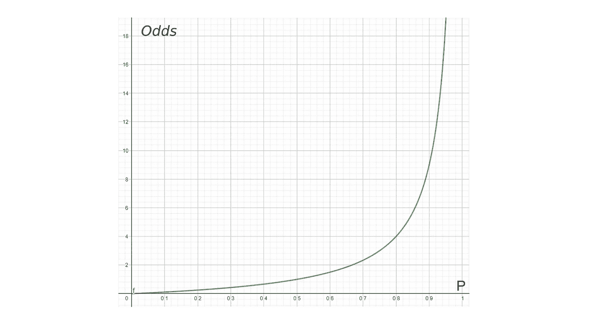

**图 4** 。奇函数图。来自 [Geogebra](https://www.geogebra.org/calculator) 的截图

因此，我们可以使用 odd(或其等价的 *exp(logit)* )作为分数来预测概率，因为 odd 越高，概率越高。

最后，我们可以通过除以所有赔率的总和来归一化结果，这样范围值从[0，+∞)变为[0，1]，并且我们确保所有元素的总和等于 1，从而构建所有预测类的概率分布。

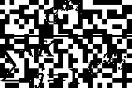

**SoftMax 函数公式**

现在，如果我们举一个和之前一样的例子，我们会看到输出向量确实是一个概率分布，它的所有条目加起来都是 1

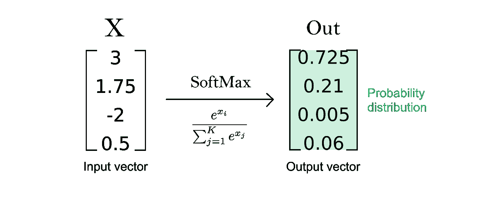

**图 5** 。使用 SoftMax，我们可以获得所有预测类别的概率分布。注:为便于阅读，结果已精确到小数点后 3 位。作者图片

# 参考资料和资源

**[**logit 函数**](https://www.geo.fu-berlin.de/en/v/soga/Basics-of-statistics/Logistic-Regression/The-Logit-Function/index.html#:~:text=The%20inverse%20form%20of%20the,back%20from%20logits%20to%20probabilities.&text=The%20logistic%20function%20for%20the,%2C6%5D%20is%20shown%20below.) **。Hartmann，k .，Krois，j .，Waske，B. (2018 年):SOGA 电子学习项目:统计和地理空间数据分析。柏林自由大学地球科学系。****

****【2】**[**Youtube。深度学习中的 logit 和 soft max**](https://youtu.be/Qn4Fme1fK-M)。闵素赫。2019**