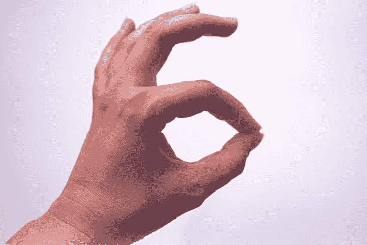
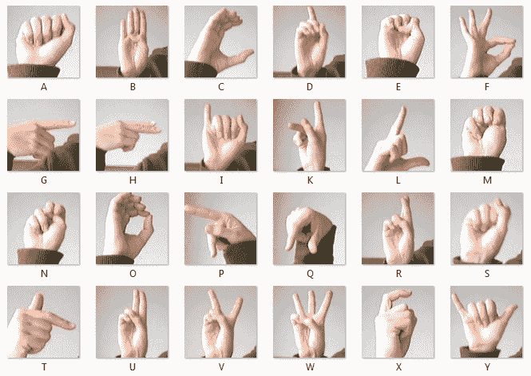
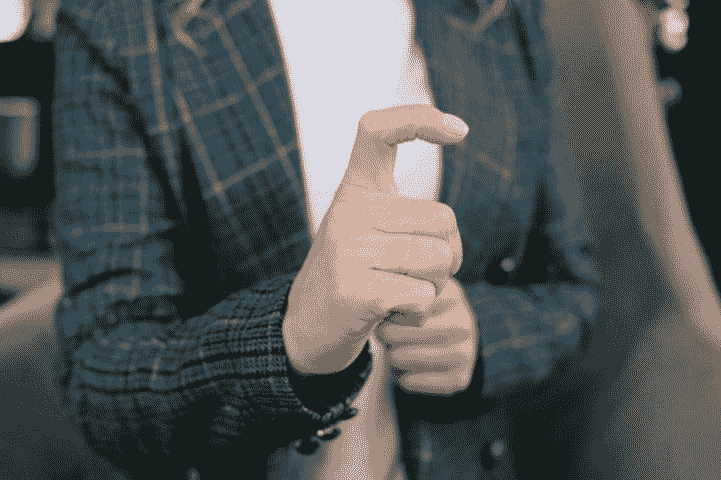
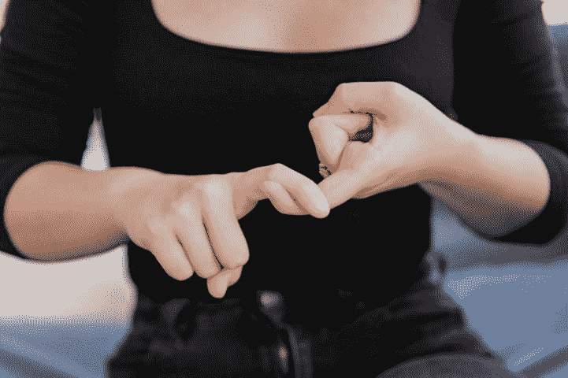
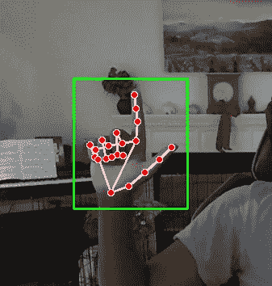
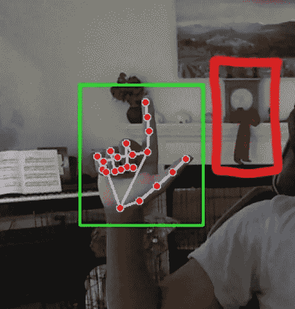
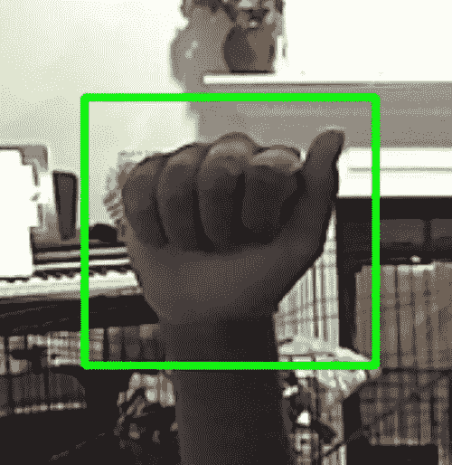
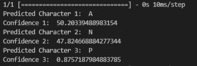

# 高级计算机视觉手语识别

> 原文：<https://towardsdatascience.com/sign-language-recognition-with-advanced-computer-vision-7b74f20f3442>

## 使用 MediaPipe 和 Keras 实时检测手语字符

来自 Pexels 的手语“F”的图像

手语是一种主要由重听人或聋人使用的交流方式。这种基于手势的语言使人们能够轻松地传达想法和思想，克服听力问题带来的障碍。

这种便捷交流方式的一个主要问题是，全球绝大多数人缺乏这种语言的知识。正如任何其他语言一样，学习手语需要花费大量的时间和精力，不利于更多的人学习。

然而，在机器学习和图像检测领域，这个问题有一个显而易见的解决方案。实现预测模型技术来自动分类手语符号可以用于为虚拟会议(如缩放会议等)创建一种实时字幕形式。这将大大增加有听力障碍的人获得这些服务的机会，因为它将与语音字幕齐头并进，为有听力问题的人创造一个双向在线交流系统。

Kaggle 上有许多大型手语训练数据集，这是一个流行的数据科学资源。在这个模型中使用的一个被称为 ***"*** [***手语 MNIST***](https://www.kaggle.com/datasets/datamunge/sign-language-mnist)***"***并且是公共领域免费使用的数据集，具有 24 个美国手语字母中的每一个的大约 1000 个图像的像素信息，不包括 J 和 Z，因为它们是基于手势的符号。

“美国手语字母的各种用户和背景的裁剪图像蒙太奇”来自 MNIST 手语

为训练准备数据的第一步是将数据集中的所有像素数据转换并成形为图像，以便算法可以读取这些图像。

上面的代码从重塑所有 MNIST 训练图像文件开始，以便模型理解输入文件。与此同时，LabelBinarizer()变量获取数据集中的类并将它们转换为二进制，这一过程大大加快了模型的定型速度。

下一步是创建数据生成器来随机实现对数据的更改，增加训练示例的数量，并通过向不同的实例添加噪声和变换来使图像更加真实。

处理完图像后，必须编译 CNN 模型，以识别数据中使用的所有信息类别，即 24 组不同的图像。数据的规范化也必须添加到数据中，用较少的图像来平衡类。

请注意，算法初始化时添加了变量，如 Conv2D 模型，并浓缩为 24 个特性。我们还使用批处理技术让 CNN 更有效地处理数据。

最后，定义损失函数和度量以及将模型拟合到数据将创建我们的手语识别系统。由于构建模型所需的时间长度，在语句末尾识别出 ***model.save()*** 命令是很重要的。为每次使用重新训练模型可能需要几个小时的时间。

这段代码有很多东西需要解开。让我们分段来看。

**第一行:**

***model.compile()*** 函数接受许多参数，其中三个显示在代码中。优化器和损失参数与下一行中的 epoch 语句一起工作，通过递增地改变数据的计算方法来有效地减少模型中的错误量。

除此之外，选择要优化的度量是精度函数，它确保模型在设定的历元数之后具有可实现的最大精度。

**第 4 行:**

此处运行的函数使设计的模型符合在第一位代码中开发的图像数据。它还定义了模型为提高图像检测的准确性而必须进行的 ***历元*** 或迭代次数。这里也称为验证集，向模型引入一个测试方面。该模型使用这些数据计算精确度。

**第 5 行:**

在代码位的所有语句中， ***model.save()*** 函数可能是这段代码中最重要的部分，因为它可能会在实现模型时节省几个小时的时间。

来自 Pexels 的手语“X”的图像

所开发的模型以大约 95%的训练准确度准确地检测和分类手语符号。

现在，使用两个流行的实时视频处理库 Mediapipe 和 Open-CV，我们可以获取网络摄像头输入，并在实时视频流上运行我们之前开发的模型。

展示 Pexels 手语的女性图像

首先，我们需要导入程序所需的包。

开始时运行的 OS 命令只是阻止来自 Mediapipe 使用的 Tensorflow 库的不必要的警告。这使得程序提供的未来输出更加清晰易懂。

在启动代码的主 while 循环之前，我们需要首先定义一些变量，比如 Open-CV 的保存模型和相机信息。

这里设置的每个变量都被分成四类。开头的类别与我们在本文第一部分中训练的模型直接相关。代码的第二和第三部分定义了运行和启动 Mediapipe 和 Open-CV 所需的变量。最后一类主要用于分析检测到的帧，并创建用于图像模型提供的数据的交叉引用的字典。

这个程序的下一部分是主 while True 循环，大部分程序都在这个循环中运行。

该程序的这一部分从您的相机获取输入，并使用我们导入的图像处理库将输入从设备显示到计算机。这部分代码着重于从你的相机中获取一般信息，并简单地在一个新窗口中显示出来。然而，使用 Mediapipe 库，我们可以检测手的主要标志，如手指和手掌，并在手周围创建一个边界框。

来自 Mediapipe 的手绘注释图像，作者

包围盒的概念是所有形式的图像分类和分析的重要组成部分。该框允许模型直接聚焦于功能所需的图像部分。否则，算法会在错误的位置找到模式，并可能导致不正确的结果。

例如，在训练过程中，缺少边界框会导致模型将诸如时钟或椅子等图像的特征与标签相关联。这可能导致程序注意到位于图像中的时钟，并且仅基于时钟存在的事实来决定正在显示什么手语字符。

上一个带有高亮显示的时钟的图像，作者

快好了！该程序的倒数第二部分是根据提示捕捉单个帧，将其裁剪到边界框的尺寸。

这段代码看起来与程序的最后一部分非常相似。这主要是因为涉及边界框的生产的过程在两个部分中是相同的。然而，在代码的这个分析部分，我们利用 Open-CV 的图像整形特性将图像调整到边界框的尺寸，而不是在它周围创建一个可视对象。除此之外，我们还使用 NumPy 和 Open-CV 来修改图像，使其具有与模型训练图像相同的特征。我们还使用 pandas 创建一个 dataframe，其中包含来自保存的图像的像素数据，因此我们可以像创建模型一样对数据进行规范化。

作者修改的手的图像

在代码的顶部，您可能会注意到正在定义的变量的奇数序列。这是由于相机库语法的性质。当 Open-CV 处理和更改图像时，更改是在所用帧的顶部进行的，本质上是保存对图像所做的更改。多个等值变量的定义使得函数中显示的框架与运行模型的画面分离。

最后，我们需要在经过处理的图像上运行经过训练的模型，并处理信息输出。

代码的这一部分包含大量信息。我们将逐一剖析这部分代码。

前两行绘制了手部图像属于 Keras 不同类别的预测概率。数据以两个张量的形式呈现，其中第一个张量包含概率信息。张量本质上是特征向量的集合，非常类似于数组。该模型产生的张量是一维的，允许它与线性代数库 NumPy 一起使用，以将信息解析为更具 pythonic 式的形式。

在这里，我们利用之前在变量 letterpred 下创建的类列表来创建一个字典，将张量中的值与键进行匹配。这允许我们将每个字符的概率与其对应的类别相匹配。

在这一步之后，我们使用列表理解从最高到最低对值进行排序。然后，这允许我们获取列表中的前几个项目，并将它们指定为与所示手语图像最接近的 3 个字符。

最后，我们使用一个 for 循环遍历字典中的所有 key:value 对，创建字典是为了将最大值与其对应的键匹配，并打印出每个字符概率的输出。

手语' A '，作者

如图所示，该模型准确地预测了从摄像机中显示的角色。除了预测字符，该程序还显示了 CNN Keras 模型的分类置信度。

开发的模型可以以多种方式实现，主要用途是为涉及视频通信的呼叫提供字幕设备，如 Facetime。要创建这样一个应用程序，模型必须一帧一帧地运行，随时预测显示的是什么符号。使用其他系统，我们也可以识别一个人什么时候没有显示任何手势，或者在手势之间转换，从而更准确地判断通过美国手语显示的单词。这种实现可以用来将显示的字母串在一起，最终识别单词甚至句子，从而创建一个全功能的手语文本翻译器。这种设备将极大地方便那些听力障碍者享受虚拟交流的好处。

该程序允许通过使用 Keras 图像分析模型，从手语到英语进行简单方便的交流。该项目的代码可以在我的 GitHub 个人资料中找到，链接如下:

[***mg 343/手语-检测(github.com)***](https://github.com/mg343/Sign-Language-Detection)