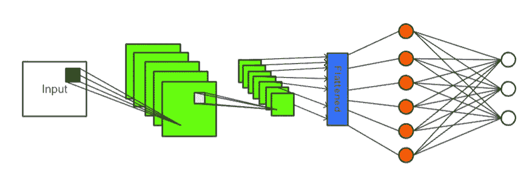
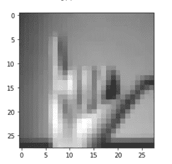
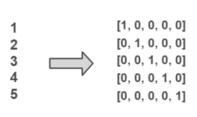
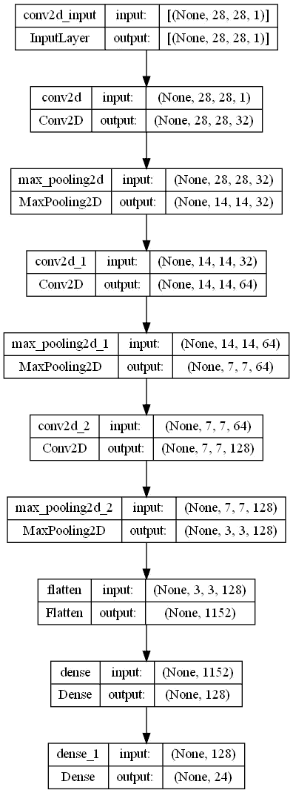
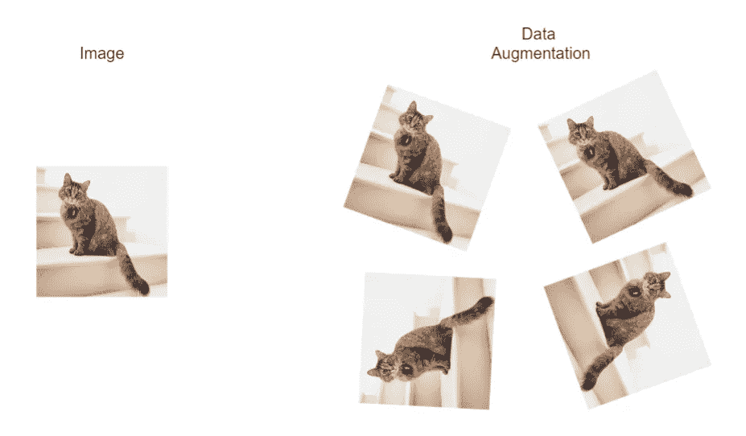
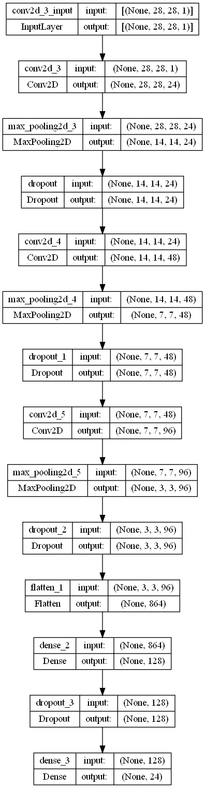
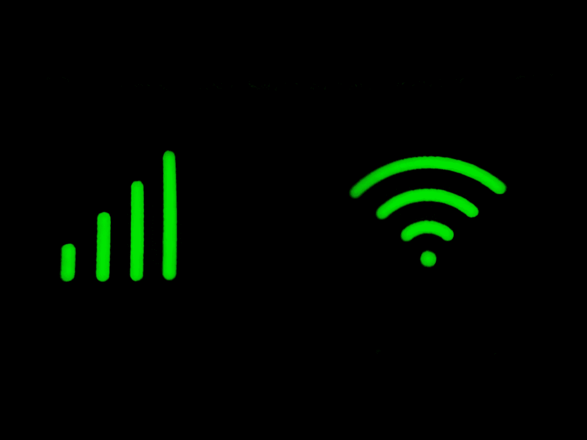

# 使用深度学习的手语识别

> 原文：<https://towardsdatascience.com/sign-language-to-text-using-deep-learning-7f9c8018c593>

## 端到端管道，包括模型构建、超参数调整和部署

来源:[ka ggle 上的手语 MNIST](https://www.kaggle.com/datasets/datamunge/sign-language-mnist?select=amer_sign2.png)

看看你将要建造的[模型](https://sathwick-reddy-m-sign-language-to-text-web-app-6j4rww.streamlitapp.com/)。

关于本文中使用的代码或模型的更多细节，请参考这个 [GitHub Repo](https://github.com/Sathwick-Reddy-M/Sign-Language-Recognition) 。

好吧！！！现在，让我们开始构建卷积神经网络模型，将手语转换为英语字母表。

# 理解问题

## **问题定义**

***将手语转换为文本*** 可以分解为预测与手语中的表示相对应的英文字母的任务。

## **数据**

我们将在 Kaggle 上使用[手语 MNIST](https://www.kaggle.com/datasets/datamunge/sign-language-mnist) 数据集，该数据集根据 [CC0:公共领域](https://creativecommons.org/publicdomain/zero/1.0/)获得许可。

关于数据集的一些事实

1.  没有字母 J & Z 的情况(原因:J & Z 需要运动)
2.  灰度图像
3.  范围从 0 到 255 的像素值
4.  每个图像包含 784 个像素
5.  标签用数字编码，从 A 到 Z 的范围是从 0 到 25
6.  数据来自训练和测试集，每个组包含 784 个像素以及代表图像的标签

## **评估指标**

我们将使用准确性作为评估标准。准确度是正确分类的样本与样本总数的比率。

## **造型**

卷积神经网络(图片由 Sathwick 提供)

1.  卷积神经网络(CNN)是图像分类问题的首选。
2.  卷积神经网络是由卷积层组成的人工神经网络。
3.  CNN 很好地处理了图像数据。卷积层与密集层的主要区别在于，在前者中，每个神经元只连接到前一层中的一组特定神经元。
4.  每个卷积层包含一组过滤器/内核/特征映射，帮助识别图像中的不同模式。
5.  随着图像通过更深的层，卷积神经网络可以发现更复杂的模式。
6.  与典型的密集分层人工神经网络不同，使用 CNN 的另一个优势是，一旦它在一个位置学习到一个模式，它就可以识别任何其他位置的模式。

# 初始端到端工作流

## **导入所需的模块和包**

必要的进口

## **准备数据**

使用 pandas 读取 CSV 文件( *sign_mnist_train.csv* )并混洗整个训练数据。

分离图像像素和标签允许我们应用特定于特征的预处理技术。

准备数据

## 标准化和批处理

对输入数据进行归一化非常重要，尤其是在使用梯度下降法时，当数据进行归一化时，梯度下降法更有可能更快地收敛。
将训练数据分组为批次减少了训练模型所需的时间。

标准化和批处理

来自应用预处理后的训练数据的图像

预处理图像(图像由 Sathwick 提供)

## **二值化标签**

标签二值化器(图像由 Sathwick 提供)

Scikit-Learn 库中的`LabelBinarizer`以一对一的方式对标签进行二进制化，并返回独热编码向量。

二值化标签

## 分离验证数据

验证数据将有助于选择最佳模型。如果我们在这里使用测试数据，我们将选择在测试数据上过于乐观的模型。

数据分离

## **建立模型**

CNN 模型可以定义如下

构建 CNN 时通常的选择是

1.  选择一组卷积运算层
2.  增加较深卷积层中的神经元数量
3.  在卷积池层之后添加一组密集层

美国有线新闻网；卷积神经网络

模型的架构(图片由 Sathwick 提供)

现在是模型建造的关键选择

1.  `loss` —指定我们试图最小化的损失函数。由于我们的标签是一个热编码的，我们可以选择 ***分类交叉熵*** 作为损失函数。
2.  `optimizer` —该算法寻找最小化损失函数的最佳权重。亚当就是这样一种算法，它在大多数情况下都运行良好。

在构建模型时，我们可以指定评估模型的任何指标，我们选择这些指标作为准确性。

定义损失、优化器和指标

## 检查站

`ModelCheckpoint` —通过访问验证数据上的模型性能，保存每个时期训练期间找到的最佳模型。

`EarlyStopping` —在指定的次数内没有进展时中断训练。

检查站

## 寻找模式

拟合数据

## 回顾模型培训

历史对象包含在模型训练期间获得的损失和指定的度量细节。该信息可用于获得学习曲线，并访问训练过程和模型在每个时期的性能。

保存历史

有关培训期间获得的学习曲线的更多详情，请参考[这本](https://github.com/Sathwick-Reddy-M/sign-language-to-text/blob/main/sign-language-recognition.ipynb) jupyter 笔记本。

## 最佳模特

检索在训练期间获得的最佳模型，因为在训练结束时接收的模型不必是最佳模型。

最佳模特

## **在测试台上的表现**

测试集上的性能

准确率:94%

# **超参数调谐**

照片由[丹尼斯·莱昂](https://unsplash.com/@denisseleon?utm_source=medium&utm_medium=referral)在 [Unsplash](https://unsplash.com?utm_source=medium&utm_medium=referral) 上拍摄

***你可以在下面的超参数调*** [***这里的***](https://github.com/Sathwick-Reddy-M/sign-language-to-text/blob/main/sign-language-recognition.ipynb) ***找到代码和生成的模型。***

当谈到超参数调谐，有太多的选择，我们可以在给定的 CNN 调谐。需要调整的一些最基本和最常见的超参数包括

## 卷积和最大池对的数量

这代表了我们堆叠在一起的`Conv2D`和`MaxPooling2D`对的数量，构建了 CNN。

随着我们堆叠更多对，网络变得越来越深，增加了模型识别复杂图像模式的能力。

但是堆叠太多的层会对模型的性能产生负面影响(随着其深入 CNN，输入图像尺寸迅速减小)，并且随着模型的可训练参数的数量急剧增加，还会增加训练时间。

## 过滤

过滤器决定输出要素地图的数量。一个过滤器作为一个模式，将能够找到图像回旋时的相似性。在大多数情况下，增加连续层中的过滤器数量效果很好。

## 过滤器尺寸

这是一个约定，把过滤器的大小作为一个奇数，给我们一个中心位置。偶数尺寸滤波器的一个主要问题是它们需要不对称填充。

我们可以使用多个具有较小滤波器大小的卷积层，而不是使用由(7x7，9x9)等较大滤波器组成的单个卷积层，这更有可能提高模型的性能，因为更深的网络可以检测复杂的模式。

## 拒绝传统社会的人

Dropout 充当正则化器，防止模型过度拟合。脱落层使一些神经元对下一层的贡献无效，而使其他神经元保持不变。辍学率决定了特定神经元的贡献被取消的概率。

在初始时期，我们可能会遇到训练损失大于验证损失的情况，因为一些神经元可能会在训练期间被丢弃，但是在验证中使用了具有所有神经元的完整网络。

## 数据扩充

数据增强(图片由 Sathwick 提供)

通过数据扩充，我们可以生成稍微修改过的可用图像副本，并将其用于训练模型。这些不同方向的图像有助于模型识别不同方向的对象。

例如，我们可以对图像进行小的旋转、缩放和平移。

数据扩充

要尝试的其他超参数

1.  批量归一化-对图层输入进行归一化
2.  更深的网络工作得很好——用两个连续的滤波器大小(3X3)的卷积层替换滤波器大小(5X5)的单个卷积层
3.  密集层中的单元数和密集层数
4.  用跨距> 1 的卷积层替换 MaxPooling 层
5.  优化者
6.  优化器的学习速率

## **最终模型的评估**

超参数调整后的最佳模型(图片由 Sathwick 提供)

模型评估

准确率:96%

# **部署模型以简化流程**

照片由 Praveen kumar Mathivanan 在 [Unsplash](https://unsplash.com?utm_source=medium&utm_medium=referral) 上拍摄

Streamlit 是一个出色的平台，消除了手动部署所需的所有麻烦。
有了 Streamlit，我们所需要的只是一个 GitHub 存储库，其中包含一个指定应用流程的 python 脚本。

## 设置

使用以下命令安装 Streamlit 库

`pip install streamlit`

要运行 Streamlit 应用程序，请使用`streamlit run <script_name>.py`

## 构建应用程序

您可以在此处找到完整的 Streamlit 应用流程[。](https://github.com/Sathwick-Reddy-M/sign-language-to-text/blob/main/web_app.py)

需要在超参数调整和`LabelBinarizer`之后获得最佳模型，以将模型的输出转换回相应的标签。

简化缓存

decorator 只运行该函数一次，防止在重新显示页面时不必要的返工。

## 模型预测

我们应该将上传的图像整形为 28x28，因为这是我们模型的输入形状。我们还必须保留上传图像的纵横比。

然后，我们可以使用预处理的图像作为模型输入，并获得相应的预测，该预测可以使用`label_binarizer`转换回代表英文字母的标签

预处理和预测

## 将应用部署到 Streamlit 云

1.  在这里注册一个 Streamlit 账户[。](https://streamlit.io/)
2.  通过授予访问您的存储库的所有必要权限，将您的 GitHub 帐户与您的 Streamlit 帐户连接起来。
3.  确保存储库包含指定所有应用程序依赖项的 requirements.txt 文件。
4.  点击可用的新应用按钮[这里](https://share.streamlit.io/)。
5.  给出存储库、分支名称和 python 脚本名称，其中包含了我们应用程序的流程。
6.  单击部署按钮。

现在，您的应用程序将被部署到 web 上，并且将在您更新存储库时得到更新。

# 摘要

在本教程中，我们了解了以下内容:

1.  使用深度学习为问题开发解决方案的管道
2.  预处理图像数据
3.  训练卷积神经网络
4.  模型评估
5.  超参数调谐
6.  部署

请注意，本教程仅简要介绍了使用深度学习技术开发解决方案的完整端到端管道。这些管道包括大量的培训，搜索更广泛的超参数和特定于用例的评估指标。需要对模型、数据和更广泛的图像预处理技术有更深入的理解，以建立解决复杂问题的管道。

看一下[型号](https://sathwick-reddy-m-sign-language-to-text-web-app-6j4rww.streamlitapp.com/)。

有关本文中使用的代码或模型的更多细节，请参考此 [GitHub Repo](https://github.com/Sathwick-Reddy-M/Sign-Language-Recognition) 。

**感谢阅读！**

我希望这篇教程对你构建下一个奇妙的机器学习项目有所帮助。如果你发现文章中的任何细节不正确，请在评论区告诉我。我很乐意听取您对存储库的建议和改进。

*   如果您喜欢这篇文章， [*请在 medium*](https://medium.com/@sathwickreddy) 上关注我。
*   下面我们连线上 [*LinkedIn*](https://www.linkedin.com/in/sathwick-reddy-mora-a546451b6) *。*