# 信号处理，超越傅里叶变换:线性调频小波变换介绍，使用 Python

> 原文：<https://towardsdatascience.com/signal-processing-beyond-the-fourier-transform-introduction-to-the-chirplet-transform-using-146a00478318>

## 从理论介绍到实际操作:以下是您需要了解的关于 Chirplet 变换的内容

加里·穆勒曼斯在 [Unsplash](https://unsplash.com/s/photos/chirp?utm_source=unsplash&utm_medium=referral&utm_content=creditCopyText) 上的照片

信号处理最常见的操作之一就是对信号进行**变换。**我们这样做的原因是，对信号执行操作的最简单方法并不总是通过观察信号并在其自然域内进行分析*。

> *我将把**自然域**称为信号的原始空间。例如，如果信号是时间序列，自然域是 2D 域，其中 x 是时间，y 是信号值

我给你举个例子。考虑以下自然域(时间序列)中的信号:

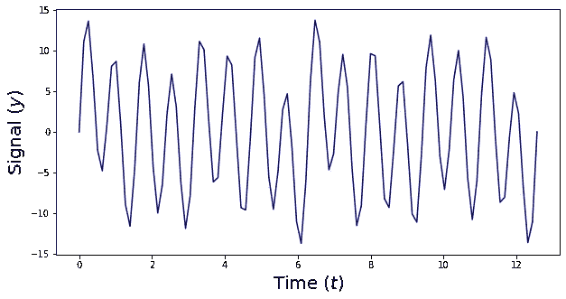

作者图片

在探索信号的过程中，一件有趣的事情是观察信号是否可以分解成分量**和**。之所以有趣，是因为每种成分都有特定的来源。换句话说，我们正在以某种方式对信号进行逆向工程。

为了将上面显示的信号分成多个分量，我们必须改变信号的**域**。这意味着我们必须在**频率**中查看信号，而不是在时域中查看(更多信息请参见[这里的](http://fourier space vs real space))。

我们在这里建议的是，信号是正弦分量的总和。每个分量都有特定的振幅、相位和频率。为了进行分析，我们使用了**傅立叶变换**。在我们正在做的例子中，它看起来像这样:

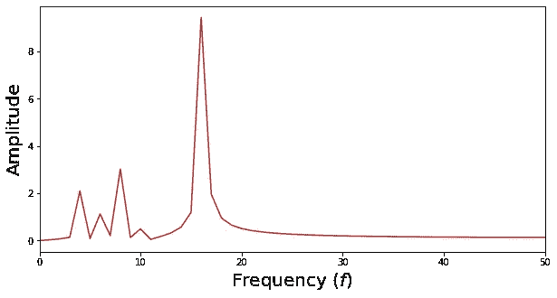

作者图片

现在如果你看上面的图像(所谓的**光谱**)，你会看到它有 4 个峰值:

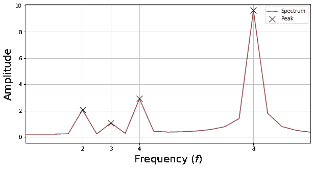

作者图片

让我们将这 4 个 x 轴值及其对应的 y 值存储在两个列表中:

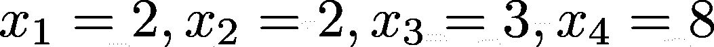

频率值，按作者分类的图像

振幅值，图片由作者提供

现在，原始信号可以分解成 n_c=4 个分量。每个分量都是一个具有给定振幅和频率的正弦*。我们把每一个组件都叫做\phi，我们把时间数组叫做 t。这是结果

> *它也可以是余弦，我认为正弦只是为了让这个例子更容易理解。

所以如果我们画出这些我们会得到:

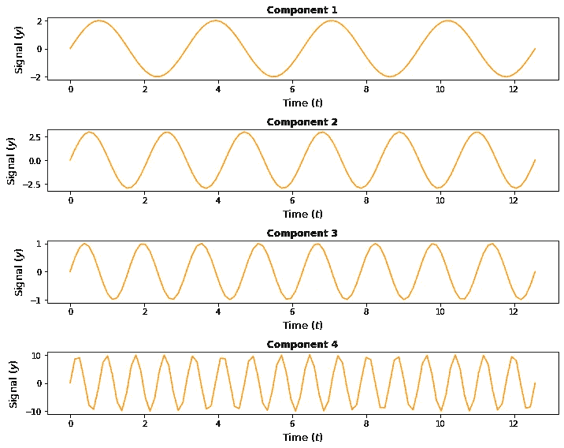

作者图片

很棒吧？

傅立叶变换(或者更确切地说，它的实际实现也称为**快速傅立叶变换，**非常有效)在理论上是一种有趣的算法，在信号处理中也是一种非常有用的算法。我们在图像处理、音频处理、时间序列分析和许多其他领域使用它。尽管如此，在这个算法做出的所有假设中，有一个非常大的假设:

> 傅立叶变换认为频率相对于时间是固定的。

这并不总是正确的。

例如，看一看(或者实际上听一听)下面的声音:【https://www.youtube.com/watch?v=5TGCFGsQIx0

你在开始时听一个低音符(低音)，它开始变得越来越高，以至于几乎令人讨厌。在这种情况下，正弦波看起来像这样:

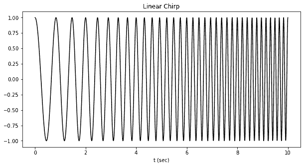

作者图片

在这一点上，如果你试图应用这个信号的傅立叶变换，它将没有任何意义，因为你依赖于一个不真实的假设:**频率确实随时间变化！** 随时间变化的那种正弦波通常称为**啁啾。**获得由线性调频脉冲构成的信号分解的方法称为**线性调频脉冲变换。**

我们开始吧！🙂

# 1.线性调频小波变换的方程

线性调频小波变换的公式如下:

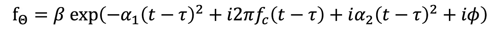

作者图片

让我描述一下你在上面的等式中看到的所有值:

## 1.1 测试版

**β**值是线性调频脉冲的**振幅**。这是唯一一个不是指数函数自变量的值:

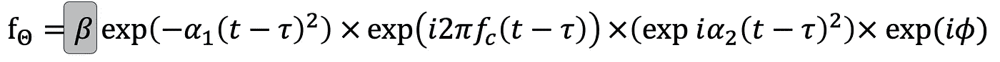

作者图片

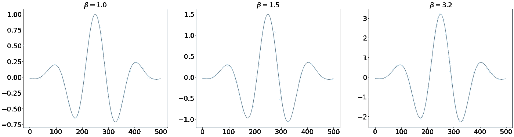

作者图片

如果你看上面的图像，固定所有的值，β只改变振幅。

## 1.2 阿尔法 1

alpha_1 位是唯一一个非正弦位。如果你看上面的表达式，它只不过是一个高斯项。

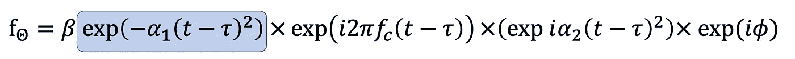

作者图片

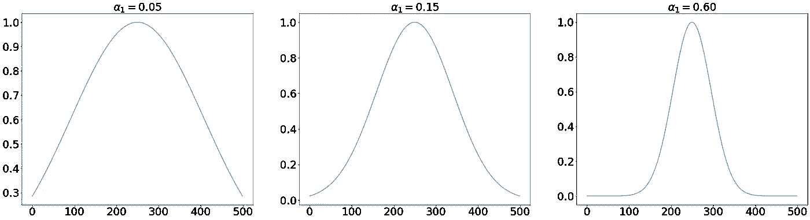

特别地，alpha_1 项是高斯的方差。这意味着 alpha_1 越小，你的铃铛的**形状就越宽。该术语也被称为**调制术语**。**

## 1.3 华氏度

f_c 是正弦项。记住！我们只选取了实数部分，所以它只是线性调频脉冲的正弦部分。

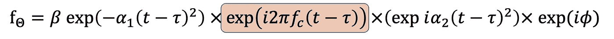

作者图片

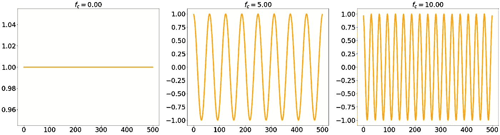

作者图片

f_c 值越大，在相同的时间内(在这种情况下，500 个数据点)看到的起伏就越多

## 1.4 阿尔法 _2

α_ 2 是纯粹的**啁啾**部分。我的意思是，这个组件随着时间上下波动，它具有我们之前在 YouTube 视频中绘制和看到的行为。

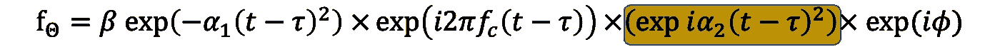

作者图片

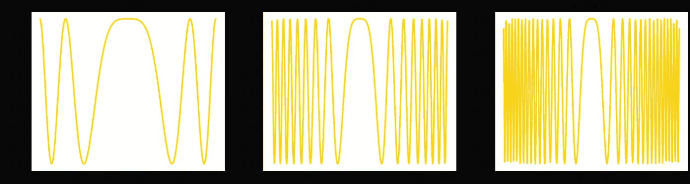

作者图片

你可以看到，起伏的次数增加了(类似于 f_c 中发生的情况)，但这里的次数不是固定的，而是随时间增加的。

## 1.5 Phi

phi 参数非常容易理解。它只不过是一个相移。正如我们所看到的，它是唯一一个在指数变量中的参数，但是没有时间依赖性。这只会改变正弦波的相位。例如，如果我们考虑这个相移**和**正弦部分(与α1 相关的部分),我们得到:

作者图片

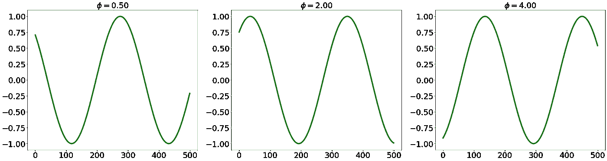

作者图片

## 1.6 吨

tau 参数可能是最简单的一个。所有的线性调频小波函数都是某种指数函数(虚的或非虚的),并且以时间值为中心。那个时间值是**τ。**

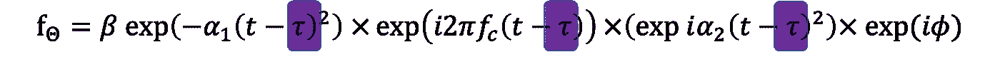

作者图片

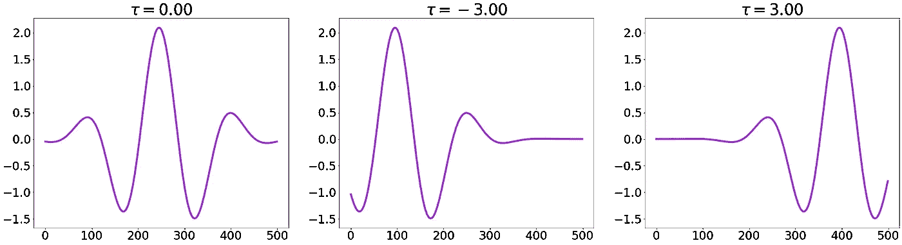

作者图片

# 2.动手操作数字实施

在这几行代码中，您可以:

A.生成一个线性调频脉冲
B .使用上述参数并注意差异
C .绘制结果

## 2.1 分析功能定义:

## 2.2 生成默认线性调频脉冲:

## 2.3 生成随机线性调频脉冲:

## **2.4 绘制随机线调频脉冲:**

# 3.结论

如果你喜欢这篇文章，你想知道更多关于机器学习的知识，或者你只是想问我一些你可以问的问题:

A.在 [**Linkedin**](https://www.linkedin.com/in/pieropaialunga/) 上关注我，我在那里发布我所有的故事
B .订阅我的 [**简讯**](https://piero-paialunga.medium.com/subscribe) 。这会让你了解新的故事，并给你机会发短信给我，让我收到你所有的更正或疑问。
C .成为 [**推荐会员**](https://piero-paialunga.medium.com/membership) ，这样你就不会有任何“本月最大数量的故事”了，你可以阅读我(以及成千上万其他机器学习和数据科学顶级作家)写的任何关于现有最新技术的文章。