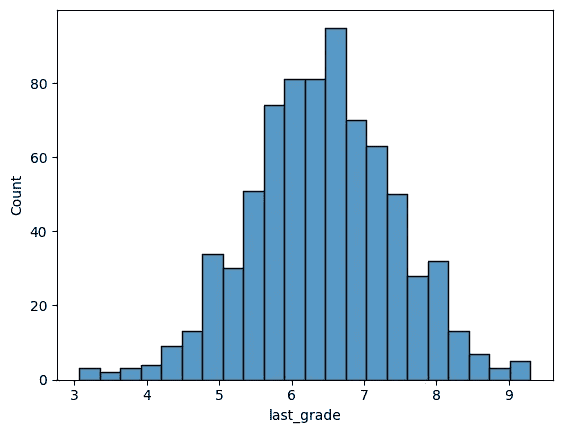
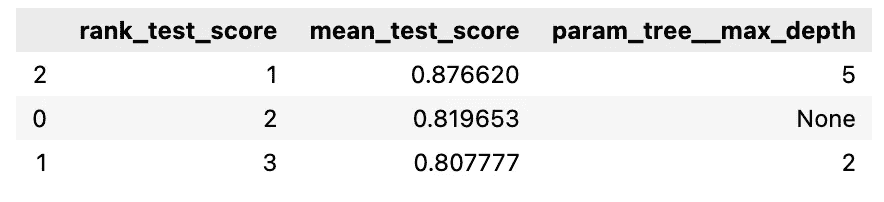
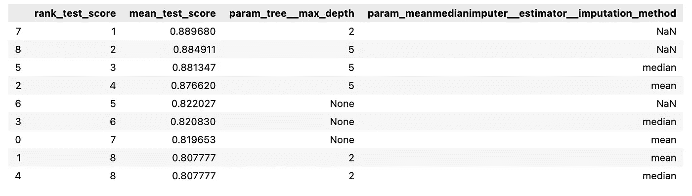

# 使用这些参数显著增加您的网格搜索结果

> 原文：<https://towardsdatascience.com/significantly-increase-your-grid-search-results-with-these-parameters-b096b3d158aa>

## 使用估计器开关对任何机器学习流水线步骤进行网格搜索


照片由[埃克托尔·j·里瓦斯](https://unsplash.com/es/@hjrc33?utm_source=medium&utm_medium=referral)在 [Unsplash](https://unsplash.com?utm_source=medium&utm_medium=referral) 上拍摄

构建机器学习模型的一个非常常见的步骤是使用交叉验证在训练集上对分类器的参数进行网格搜索，以找到最佳参数。鲜为人知的是，您还可以对几乎任何管道步骤进行网格搜索，例如特征工程步骤。例如，哪种插补策略对数值最有效？均值、中值还是任意？使用哪种分类编码方法？一键编码，还是顺序编码？

在本文中，我将指导您使用网格搜索在您自己的机器学习项目中回答这些问题。

要安装本文所需的所有 Python 包:

`pip install extra-datascience-tools feature-engine`

## 数据集

让我们考虑下面这个我创建的非常简单的公共领域数据集，它有两列:`last_grade`和`passed_course`。“最后成绩”列包含学生在最后一次考试中取得的成绩，而“通过课程”列是一个布尔列，如果学生通过了课程，则为`True`，如果学生未通过课程，则为`False`。我们能否建立一个模型，根据学生的最后成绩来预测他们是否通过了课程？

让我们首先探索一下[数据集](https://gist.github.com/sTomerG/22f485026a29079810bc4c62ed4ef064):

```
import pandas as pd

df = pd.read_csv('last_grades.csv')
df.isna().sum()
```

```
OUTPUT
last_grade       125
course_passed      0
dtype: int64
```

我们的目标变量`course_passed`没有`nan`值，所以不需要在这里删除行。

当然，为了防止任何数据泄漏，我们应该在继续之前先将数据集分成训练集和测试集。

```
from sklearn.model_selection import train_test_split

X_train, X_test, y_train, y_test = train_test_split(
                                    df[['last_grade']],
                                    df['course_passed'],
                                    random_state=42)
```

因为大多数机器学习模型不允许`nan`值，所以我们必须考虑不同的插补策略。当然，一般来说，你会启动 EDA(探索性数据分析)来确定`nan`值是 *MAR* (随机缺失) *MCAR* (完全随机缺失)还是 *MNAR* (非随机缺失)。这里有一篇很好的文章解释了这两者之间的区别:

[](/all-about-missing-data-handling-b94b8b5d2184) [## 关于丢失数据处理的所有内容

### 丢失数据是数据专业人员每天都需要处理的问题。虽然有很多文章，博客…

towardsdatascience.com](/all-about-missing-data-handling-b94b8b5d2184) 

我们不去分析为什么有些学生的最后一次成绩丢失了，而是简单地尝试在不同的插补技术上进行网格搜索，以说明如何在任何流水线步骤上进行网格搜索，例如这个特征工程步骤。

让我们来探究自变量`last_grade`的分布:

```
import seaborn as sns

sns.histplot(data=X_train, x='last_grade')
```



最后一级的分布(按作者分类的图片)

看起来最后的成绩正态分布，平均值为~ *6.5* ，值在~ *3* 和~ *9.5* 之间。

让我们看看目标变量的分布，以确定使用哪个评分标准:

```
y_train.value_counts()
```

```
OUTPUT
True     431
False    412
Name: course_passed, dtype: int64
```

目标变量大致平分，这意味着我们可以使用 *scikit-learn* 的默认计分器进行分类任务，也就是准确度分数。如果目标变量划分不均，准确度分数不准确，则使用 [F1](https://scikit-learn.org/stable/modules/generated/sklearn.metrics.f1_score.html) 代替。

## 网格搜索

接下来，我们将建立模型和网格搜索，并通过优化分类器的参数来运行它，这是我看到的大多数数据科学家使用网格搜索的方式。我们现在将使用 [*特征引擎*](https://feature-engine.readthedocs.io/en/latest/) *的* `[MeanMedianImputer](https://feature-engine.readthedocs.io/en/latest/api_doc/imputation/MeanMedianImputer.html#feature_engine.imputation.MeanMedianImputer)`来估算平均值，使用 *scikit-learn* 的`[DecisionTreeClassifier](https://scikit-learn.org/stable/modules/generated/sklearn.tree.DecisionTreeClassifier.html)`来预测目标变量。

```
from sklearn.tree import DecisionTreeClassifier
from sklearn.pipeline import Pipeline
from sklearn.model_selection import GridSearchCV

from feature_engine.imputation import MeanMedianImputer

model = Pipeline(
  [
    ("meanmedianimputer", MeanMedianImputer(imputation_method="mean")),
    ("tree", DecisionTreeClassifier())
  ]
)

param_grid = [
  {"tree__max_depth": [None, 2, 5]}
]

gridsearch = GridSearchCV(model, param_grid=param_grid)
gridsearch.fit(X_train, y_train)

pd.DataFrame(gridsearch.cv_results_).loc[:,
                                      ['rank_test_score', 
                                       'mean_test_score', 
                                       'param_tree__max_depth']
                                      ].sort_values('rank_test_score')
```



以上代码的结果(图片由作者提供)

从上表中我们可以看到，使用`GridsearchCV`我们了解到，只需将`DecisionTreeClassifier`的`max_depth`从默认值*无*更改为 *5，就可以将模型的精度提高约 0.55。这清楚地说明了网格搜索的积极影响。*

然而，我们不知道用平均值来估算缺失的`last_grades`是否实际上是最佳估算策略。我们能做的实际上是使用[*extra-data science-tools*](https://extra-datascience-tools.readthedocs.io/en/latest/)’`[EstimatorSwitch](https://extra-datascience-tools.readthedocs.io/en/latest/notebooks/tutorial.html#EstimatorSwitch)`对三种不同的插补策略进行网格搜索:

*   平均插补
*   中位数插补
*   任意数字插补(默认为 *999* 为*特征引擎*的`[ArbitraryNumberImputer](https://feature-engine.readthedocs.io/en/latest/api_doc/imputation/ArbitraryNumberImputer.html)`)。

```
from feature_engine.imputation import (
                                  ArbitraryNumberImputer,
                                  MeanMedianImputer,
                               )
from sklearn.model_selection import GridSearchCV
from sklearn.tree import DecisionTreeClassifier
from extra_ds_tools.ml.sklearn.meta_estimators import EstimatorSwitch

# create a pipeline with two imputation techniques
model = Pipeline(
  [
    ("meanmedianimputer", EstimatorSwitch(
                            MeanMedianImputer()
                          )),
    ("arbitraryimputer", EstimatorSwitch(
                            ArbitraryNumberImputer()
                          )),
    ("tree", DecisionTreeClassifier())
  ]
)

# specify the parameter grid for the classifier
classifier_param_grid = [{"tree__max_depth": [None, 2, 5]}]

# specify the parameter grid for feature engineering
feature_param_grid = [
    {"meanmedianimputer__apply": [True],
     "meanmedianimputer__estimator__imputation_method": ["mean", "median"],
     "arbitraryimputer__apply": [False],
    },
     {"meanmedianimputer__apply": [False],
     "arbitraryimputer__apply": [True],
    },

]

# join the parameter grids together
model_param_grid = [
    {
        **classifier_params,
        **feature_params
    }
    for feature_params in feature_param_grid
    for classifier_params in classifier_param_grid
]
```

这里需要注意一些重要的事情:

*   我们在管道中的 *extra-datascience-tools 的* `EstimatorSwitch`中包含了两个估算器，因为我们不想同时使用两个估算器。这是因为在第一个估算器转换了 *X* 后，将没有`nan`值留给第二个估算器进行转换。
*   我们在分类器参数网格和特征工程参数网格之间分割参数网格。在代码的底部，我们将这两个网格连接在一起，以便每个特征工程网格都与每个分类器网格相结合，因为我们想为`ArbitraryNumberImputer`和`MeanMedianImputer`尝试一个 *None* 、 *2* 和 *5* 的`max_tree_depth`。
*   我们在特征参数网格中使用字典列表而不是字典，这样可以防止同时应用`MeanMedianImputer`和`ArbitraryNumberImputer`。使用`EstimatorSwitch`的`apply`参数，我们可以简单地打开或关闭两个估算器中的一个。当然，你也可以运行代码两次，第一次注释掉第一个估算器，第二次注释掉第二个估算器。但是，这将导致我们的参数网格中出现错误，因此我们也需要调整该网格，并且不同插补策略的结果在相同的网格搜索 cv 结果中不可用，这使得比较更加困难。

让我们看看新的结果:

```
gridsearch = GridSearchCV(model, param_grid=model_param_grid)
gridsearch.fit(X_train, y_train)

pd.DataFrame(gridsearch.cv_results_).loc[:,
                                         ['rank_test_score', 
                                          'mean_test_score', 
                                          'param_tree__max_depth',
                     'param_meanmedianimputer__estimator__imputation_method']
                                           ].sort_values('rank_test_score')
```



特征工程的网格搜索结果(图片由作者提供)

我们现在看到了一个新的最佳模型，这是一个决策树，它的`max_depth`为 *2* ，使用了`ArbitraryNumberImputer`。我们通过实施不同的插补策略将精确度提高了 1.4%！作为一个受欢迎的奖励，我们的树深度已经缩减为 2，这使得模型更容易解释。

当然，网格搜索可能已经花费了相当多的时间，并且不仅在分类器上网格搜索，而且在其他流水线步骤上网格搜索也可能花费更长的时间。有几种方法可以将额外花费的时间减到最少:

*   首先对分类器的参数进行网格搜索，然后根据情况对其他步骤(如特征工程步骤)进行网格搜索，反之亦然。
*   使用*extra-data science-tools*'`[filter_tried_params](https://extra-datascience-tools.readthedocs.io/en/latest/notebooks/tutorial.html#filter_tried_params)`防止网格搜索的重复参数设置。
*   使用 *scikit-learn* 的`[HalvingGridSearch](https://scikit-learn.org/stable/modules/generated/sklearn.model_selection.HalvingGridSearchCV.html)`或`[HalvingRandomSearch](https://scikit-learn.org/stable/modules/generated/sklearn.model_selection.HalvingRandomSearchCV.html#sklearn.model_selection.HalvingRandomSearchCV)`代替`GridSearchCV`(仍在实验阶段)。

# 最后

除了使用网格搜索来优化决策树等分类器之外，我们还看到，您实际上可以使用*extra-data science-tools*'`EstimatorSwitch`通过对插补策略进行网格搜索来优化机器学习管道中的任何步骤。除了插补策略和分类器本身之外，还有一些值得网格搜索的流水线步骤的例子:

*   [表示分类变量的](https://feature-engine.readthedocs.io/en/latest/api_doc/encoding/MeanEncoder.html) vs [序数](https://feature-engine.readthedocs.io/en/latest/api_doc/encoding/OrdinalEncoder.html) vs [一键编码](https://feature-engine.readthedocs.io/en/latest/api_doc/encoding/OneHotEncoder.html)。
*   一个[稀有标签编码器](https://feature-engine.readthedocs.io/en/latest/api_doc/encoding/RareLabelEncoder.html)的公差。
*   一个[任意异常封口机](https://feature-engine.readthedocs.io/en/latest/api_doc/outliers/ArbitraryOutlierCapper.html)对一个[异常修剪器](https://feature-engine.readthedocs.io/en/latest/api_doc/outliers/OutlierTrimmer.html)。
*   是否使用[目标回归变压器](https://scikit-learn.org/stable/modules/generated/sklearn.compose.TransformedTargetRegressor.html)。

感谢阅读！有任何问题，请随时联系我。我经常写关于机器学习、数据科学和 Python 的文章，所以如果你感兴趣，可以考虑在 [Medium](https://medium.com/@tomergabay) 和/或 [LinkedIn](https://www.linkedin.com/in/tomer-gabay/) 上关注我。