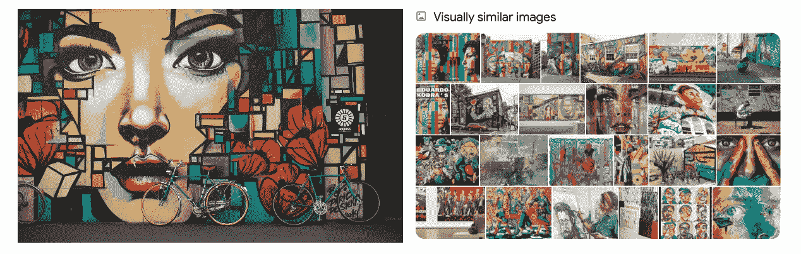
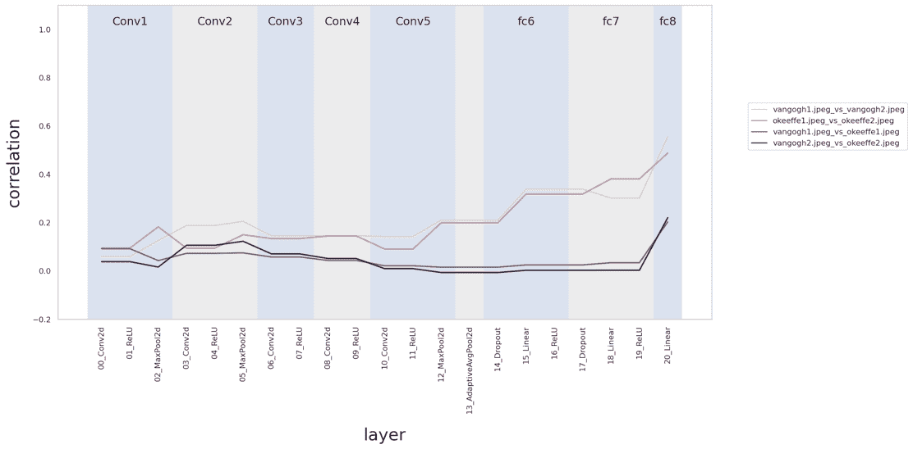
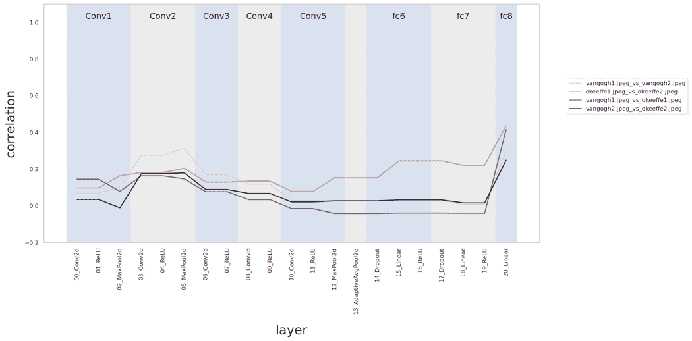
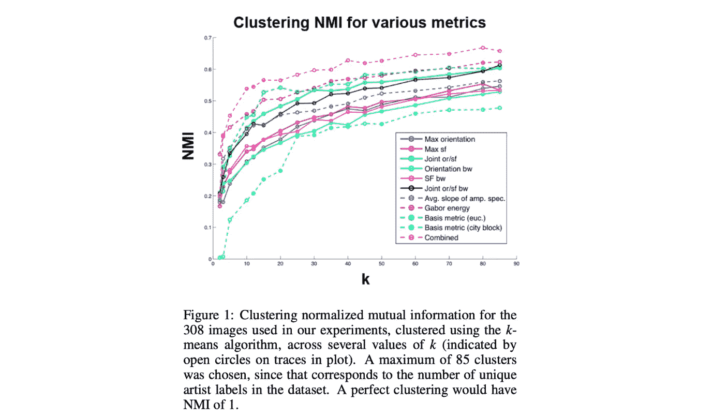

# 视觉艺术中基于相似性的图像搜索

> 原文：<https://towardsdatascience.com/similarity-based-image-search-for-visual-art-750c038283c7>

## 从人类感知和定量判断两方面评价视觉艺术的相似性

基于相似性的图像搜索，也称为基于内容的图像检索，在历史上一直是一项具有挑战性的计算机视觉任务。这个问题对于视觉艺术来说尤其困难，因为对于“相似性”的度量应该定义为什么以及谁应该为艺术设定标准，这个问题并不明显

例如，当我上传一张壁画的照片到谷歌寻找相似的图片时，谷歌在“视觉相似图片”部分给了我一系列选项。大多数图像是壁画，壁画中突出描绘了一张脸；其他的都是画了一张脸的纯画。所有的图像跨越了各种各样的配色方案和风格纹理。

左图:丁满·克劳泽( [Unsplash](https://unsplash.com/photos/3MAmj1ZKSZA) )拍摄的壁画照片。
右图:谷歌认为与这张照片相似的图片截图。

来自 Geirhos 等人[1]的 2018 年[论文](https://arxiv.org/abs/1811.12231)揭示了在 ImageNet 上训练的卷积神经网络(CNN)偏向于图像的风格纹理。为了迫使 CNN 学习基于形状的表示，研究人员在 ImageNet 上应用了风格转移，以创建一个“风格化-ImageNet”数据集。

我决定以他们的发现为基础，调查在纹理偏好与形状偏好模型上训练来自相同艺术风格的艺术作品对的效果。在比较文森特·梵高(Vincent van Gogh)和乔治亚·奥基夫(Georgia O'Keeffe)的绘画作品时，我发现，与形状偏好的风格化图像网络训练的 AlexNet 模型(图 2)相比，纹理偏好的图像网络训练的 AlexNet 模型在关联同一艺术家的作品方面做得更好(图 1)。

我从这个实验中得出的主要结论是**在评估视觉艺术**的相似性时，如果我们将来自同一艺术家的艺术作品作为相似性的标准，**那么** **寻找和比较风格纹理远比形状表征更重要**。然而，对“风格”的评价似乎是一个非常主观和人类感性的过程。这一发现让我更加好奇，在确定艺术相似性时，什么样的技术方法可以结合人类和定量判断。

图 1:在 ImageNet-trained AlexNet(一个纹理偏向模型)上训练时的相关性得分。注意，相同艺术家图像对 vangogh1-vangogh2 和 okeeffe1-okeeffe2 的相关分数远高于不同艺术家图像对 vangogh1-okeeffe1 和 vangogh2-okeeffe2 的相关分数。

图 2:在风格化图像网络训练的 AlexNet(一种形状偏向模型)上训练时的相关性得分。注意，相同艺术家图像对 vangogh1-vangogh2 和 okeef f1-okeef F2 以及不同艺术家图像对 vangogh 1-okeef f1 和 vangogh 2-okeef F2 的相关分数都相当接近。

Hughes 等人[2]在 2011 年[发表的一篇论文](https://ieeexplore.ieee.org/abstract/document/7073967)结合了定量和心理学研究，得出结论认为**将人类感知信息与 art 的高阶统计表示相结合，对于解决 art 的基于相似性的搜索问题极其有效**。人类对艺术风格的感知通常基于元素的质量，如线条、阴影和颜色，这些元素很难使用低阶统计来捕捉。因此，这些研究人员利用了高阶空间统计数据，并将他们的发现应用于比较视觉艺术。然后，他们进行了心理物理学实验，要求参与者判断成对艺术作品之间的相似性，并将这些结果与他们的预测模型结合使用。

# 量化过程和结果

Hughes 等人对 308 幅高分辨率图像数据集进行了研究，这些图像涵盖了各种艺术家的作品。他们使用两种图像分解方法从图像中提取特征:

*   **Gabor 滤波器**，对特定方向和空间频率的线条和边缘敏感
*   **稀疏编码模型**，学习一组与图像的高阶统计特征相关的基函数

提取特征后，他们通过以下四个指标对这些艺术图像进行比较和评估:

*   **峰值方向**，其查看峰值振幅出现在从稀疏编码模型学习的基函数的 2D 傅立叶变换中的什么方向
*   **峰值空间频率**，查看峰值振幅出现的空间频率
*   **方向带宽**，测量基函数对于该首选方向的选择性
*   **空间频率带宽**，其测量基函数对于该优选空间频率的选择性

然后，研究人员探索了不同的距离度量(例如 KL 散度)，以比较上述四种度量的分布，从而导出距离矩阵。值得注意的是，由于没有风格相似性的基本事实，研究人员通过真实艺术家标签来比较艺术作品，即毕加索的所有画作都被赋予相同的标签，因此距离矩阵是根据真实艺术家标签构建的。使用不同的距离度量执行 k-means 聚类揭示了对视觉艺术图像使用这些高阶统计表示的总体成功(见下图)。

来源:Hughes 等人

# 心理物理知觉相似性实验

除了开发一种定量表征视觉艺术作品风格的方法，研究人员还进行了两项心理物理学实验，以利用人类的感知信息。他们要求参与者判断抽象艺术、风景和肖像中的艺术图像对之间的相似性，汇总他们的答案，为这三个类别中的每一个创建一个相似性矩阵。

实验 1 试图比较感知判断在预测艺术作品之间的风格关系时的功效。研究人员为每一类图片展示了两张图片；然后，他们使用基于特征的距离训练了一个回归模型，根据它们感知的相似性来预测两幅图像之间的距离。通过学习的模型，他们预测了保留图像和训练图像之间的距离。最后，他们将预测的距离与图像之间的真实感知距离进行了比较。

研究人员发现，来自抽象和景观艺术品的感知信息能够进行统计意义上的预测，这告诉我们**有用的统计信息不仅存在于感知相似性数据中，还可以用于模拟视觉艺术作品之间的差异**。

实验 2 测量了三类图像**的**有限感知信息**在多大程度上可以预测更大图像集合**中的风格差异和关系，这与基于相似性的图像搜索问题直接相关。这个过程与实验 1 相似，只是这次他们拿出了三个类别中的 51 张图片，并使用剩余的图片来创建一个感知距离矩阵。他们的预测距离矩阵表明，即使只有有限的感知信息，这些信息也有助于**“指导我们结合统计特征来理解风格感知的方式。”**

# 最后的想法

总之，Hughes 等人的论文“比较艺术风格计量分析中的高阶空间统计和感知判断”向我们展示了将人类感知信息与高阶统计信息结合起来评估视觉艺术相似性的重要性和必要性

在评价艺术风格如何被感知、定义和评价相似性方面，仍需要进行更多的心理学研究。在他们的论文中，他们提到“目前…对支配人类风格感知的因素的定量研究屈指可数。”

考虑到计算机视觉的更广泛背景，思考艺术风格的高阶统计表示的需要与 CNN 中更深卷积层的需要类似也是有趣的。

总而言之，在考虑如何为视觉艺术品开发更好的基于相似性的图像搜索系统时，将判断植根于人类感知，同时优化并利用所有可用的定量信息是关键。

# 参考

[1] Geirhos，r .，Rubisch，p .，Michaelis，c .，Bethge，m .，Wichmann，F. A .，和 Brendel，w .“ImageNet 训练的 CNN 偏向于纹理；增加形状偏差可以提高准确性和鲁棒性。”ICLR 2019。arXiV 预印本:【https://arxiv.org/abs/1811.12231】T2。

[2] Hughes，J. M .、Graham，D. J .、Jacobsen，C. R .和 Rockmore，D. N .，“比较艺术风格分析中的高阶空间统计和感知判断”，2011 年第 19 届欧洲信号处理会议。【https://ieeexplore.ieee.org/abstract/document/7073967】T4。

Catherine Yeo 是哈佛大学计算机科学专业的本科生。你可以在推特[*@ catherinehyeo*](https://twitter.com/catherinehyeo)*找到她。*

*这篇文章的灵感来自哈佛大学心理学 1406，“生物和人工视觉系统:人类和机器如何表现视觉世界。”感谢乔治·阿尔瓦雷斯教授的反馈和指导。*