# 相似度量和图与集合的邻接

> 原文：<https://towardsdatascience.com/similarity-measures-and-graph-adjacency-with-sets-a33d16e527e1>

## 考古学中的数据科学，第二部分

为什么我的考古里有数学？…或者考古学在我的数学里？(图片由作者提供)

在我的上一篇文章([第一部分](https://medium.com/p/648a2f20d389))中，我向您介绍了用数据科学分析考古遗址的过程。我谈到了“太空中的旧东西”令人沮丧的复杂本质，以及人工制品和位置的网络是如何构成二分图的。

然而，当我们创建一个双模式图并将其投射到其组成的单模式图的过程中，我们在某种程度上陷入了一种悬而未决的状态……*所有的*最终都连接到了*所有其他的*！

嗯，算是吧。我不得不承认我故意把你带进了一个死胡同。当然，这是我狡猾的计划的一部分，为了达到更有趣的主题，思考两个事物“相似”的含义以及*集合的相似性度量。*

在我的辩护中，我确实简要地提到过`igraph`没有最好的工具来真正地*用二分图做*很多有趣的事情。问题是，它在`bipartite_projection`中使用的方法只是简单地将关联矩阵中的两两事件相加。事实证明，这在很多情况下没什么用。

相反，我们需要探索一些更健壮的方法来评估集合之间的相似性。与计算相关性或距离的数值方法不同，在比较集合之间的对应性和相似性时，需要考虑一些概念上的特性。在本文中，我们将看看一些最常用的基于集合的相似性度量，并通过*推理*如何为我们的目标选择合适的度量。

对于那些刚刚加入的人来说，这是考古数据科学系列的第二部分，包括:

*   [第一部分](https://medium.com/p/648a2f20d389) —创建和探索二分图和单模图，
*   第二部分-集合和图邻接的相似性度量，
*   第三部分—图结构和社区检测方法，
*   第四部分——地理空间网络

我将继续使用 R 编写[代码](https://github.com/archaeojsc/assemblage_network)，但是所有这些都可以用 Python 轻松完成。

# 介绍

在我们进入度量、方法和组合学(即*集*的数学)的杂草之前，让我们停下来想一想，当我们说两件事*相似*时，我们到底是什么意思。

一般来说，当事物既不完全相同也不完全不同时，我们称之为*相似*。相似的东西都是相似的——*ish*。这意味着共享特征或属性的某种度量暗示着*关联*，但不一定是*共性*或*同一性*。它表示相似或对应，但它有一定的模糊性，即相似性意味着主观或定性的评估。

因此，我们的目标是双重的。首先，我们需要确定什么集合相似性度量最接近地反映了集合元素之间的关系。其次，我们必须确定一种合适的方法来确定这些实体之间相似性的阈值。换句话说，我们需要为*相似性*选择标准，并为我们的集合之间被认为相似(或不相似)的内容设置*限制*。

在这一期中，我们将通过探索一些度量相似性的常用算法来解决第一个目标。我将讨论它们背后的直觉，它们的优势，以及选择合适度量的标准。因为这涉及到一些冗长的讨论，所以当我们开始研究网络结构和社区检测时，我将在下一篇文章中讨论阈值。

## 集合和相似性

与距离或相似性可以很容易计算的实值向量空间不同，集合由唯一成员或元素的无序集合组成。这些成员元素可以是任何东西，例如数字、字母、单词、对象、类别，因此并不总是有明显的数字解决方案，例如可用于元素比较的向量范数或坐标。

相反，我们必须比较集合之间元素的隶属度。更具体地说，我们比较集合上的 or 运算的某些属性的大小或基数，比如它们的交集和并集。幸运的是，有许多度量标准可以用来比较集合之间的相似性。出于我们的目的，我将只讨论几个最常见的:

*   重叠或 Szymkiewicz-Simpson 系数
*   雅克卡德相似系数(又名谷本系数)
*   索伦森-骰子系数

这些相似性度量中的每一个都是专门为处理集合的特性而导出的。它们之间的区别只是它们权衡共同元素(即交集)与差异的方式。

然而，在选择一种方法之前，考虑您试图捕捉的集合之间的确切关系是很重要的。如果您的样本都包含大致相同数量的元素，那么与每个样本的成员数量相差很大的情况相比，您可能会做出不同的选择。完整子集的可能性有多大，这些子集对获取很重要吗？差异比共性更重要，还是相反？

与任何数据分析一样，有必要明确考虑你的*方法论*以及你的方法。选择方法的基本原理和理由是该过程的关键部分。毕竟，这就是我们称之为数据*科学*的原因。

## 重温二部图和投影

首先，让我们回去重新创建我们的采样位置(称为“proveniences”)和在这些位置发现的工件类型的二分图，就像我们在[第一部分](https://medium.com/p/648a2f20d389)中所做的那样。

同样，我们有工件类型和位置之间的连接图，并且已经可以在每个顶点类型中看到一些粗略的分组(一个类型在图的顶部，一个在底部)。这个图是密集连接的，有许多节点和边。

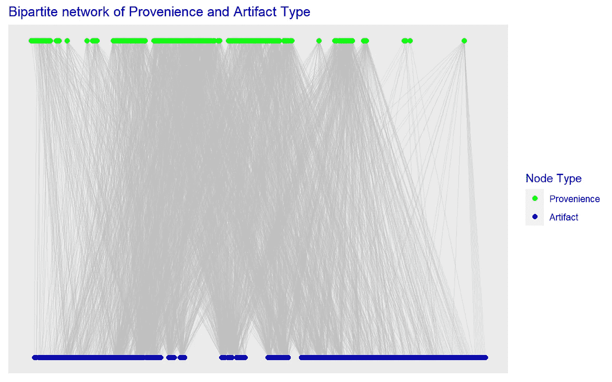

人工制品-provenience 连接的二分图(图片由作者提供)。

现在，我们从图中检索来源和工件类型的二元关联矩阵，我们将使用它作为我们的相似性度量的数据。请记住，我们只考虑在每个产地存在(`1`)或不存在(`0`)一种文物类型。

根据我们定位关联矩阵的方式，我们现在有了在每个产地发现的工件类型集合(按行)或者发现每个工件类型的产地集合(按列)。

目标是找到这个集合系统的一个划分，使得每个普罗旺斯子集包含一个连贯的文物类型集合(即考古学家所说的*集合*)，并且每个文物类型子集都在一个连贯的普罗旺斯空间集合中被发现(我们称之为*上下文*)。

我们现在要做的是，看看我们在二分图的投影模式中计算“一致性”的方法。为了将我们的二分节点类型投影到两个独立的单模图中，我们想要评估这些集合的成对比较之间的相似性度量。

## 考古目标

在我上一篇[文章](https://link.medium.com/DrRhVKZIItb)中，我向你介绍了几个考古学概念以及一些关于集合和图形的概念。现在我想停下来解释一下为什么我们对寻找这些子集和分区如此感兴趣。你看，考古学家并不真正解释文物本身。

我们对解释跨越时间和空间的人类活动感兴趣，这给了我们一个了解更抽象概念的窗口，如*行为*或*文化*。我们这样做的方法是，因为我们没有时间机器回去观察人们实际上在做什么，通过寻找这些活动留下的物理残余物(即碎片或垃圾)之间的关联模式。我知道这很奇怪，但是效果出奇的好。

想一想你的垃圾可能会显示出你的日常行为！

无论如何，我们对寻找人工制品(物品)和产地(三维空间中的位置)的分组如此感兴趣的原因是，这些只是我们收集的样本。我们想知道这些样本是从哪个群体中抽取的。在这种情况下，这些群体就是*集合*和*上下文*。我们想看看我们是否能把一个集合或环境与另一个区分开来，然后看看揭示了什么样的模式。

例如，一个被识别的人工制品的集合是否有一个特定的日期范围，以便它唯一地识别一个地点被占据的时间或时间？一个集合与家庭活动有关，而另一个反映经济活动，这些空间(即它们的背景)是分开的还是混合的？如果场地被多次占用或被多个家庭占用，它们是连续的还是间歇的？如果不同的集合是连续的，它们可能会混合到相同的上下文中。

有这么多问题，但是将工件和证据数据解析成集合和上下文是第一步。我们想确保我们的分析方法是恰当的。

# 投影的相似性度量

我们在第一部分的[中发现`igraph`中的`bipartite_projection`方法只对两两巧合的数量求和。这意味着，即使集合之间有一个共享元素也足以将它们联系起来。它根本不考虑集合中有多少元素*不同*或被考虑的元素的总数*。*](https://medium.com/p/648a2f20d389)

最后，每个投影中的每个节点都与几乎所有其他节点相连，没有好的方法来评估这些连接的强度。不是特别有用。

现在，我们可以开始更仔细地研究基于集合的相似性度量，以及如何使用它们来投影我们的二分图。我们可以使用现有的包来实现这些，但是我更喜欢构建我们自己的函数，以便更好地理解“引擎盖下”正在发生的事情。

请注意，这些函数是针对二元关联矩阵的。对于具有多重性或计数的集合(即多重集合或 m-集合)，将需要不同的方法。

## 重叠或 Szymkiewicz-Simpson 系数

这个相似性度量就是两个集合之间交集的公共元素的数量除以两个集合中较小的中的成员总数。记住，组成一个集合的唯一成员或元素的数量就是它的大小或者(更正式地说)它的基数。

比如说我们有两个集合:X={a，b，c}和 Y={b，c，d，e，f}。它们的交集是 X∩Y={b，c}并且这些集合的基数|X|=3 并且|Y|=5。它们的重叠系数为:

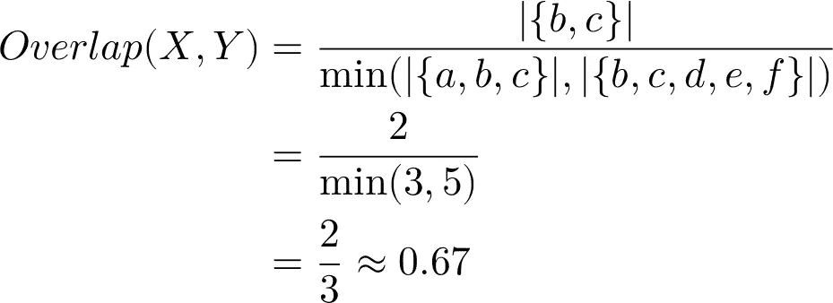

重叠系数示例

很简单，对吧？只是较小集合的成员同时也是较大集合的成员的比例(因此，*与*重叠)。

但是，请注意，如果较小集合中的所有元素*都在较大的集合中——也就是说，如果我们从集合 X 中删除元素 a，使其成为 Y 的完整的*子集*——那么不管 Y 中有多少额外的成员，系数都等于 1*

因此，这个相似性度量以一种非常具体的方式定义了*相似性*。它包括一个假设，即任何子集都有效地等同于它的超集。这个小小的定义可能非常有用，这取决于您的应用程序。

重叠系数是一个通用的相似性度量，用于从基因测序到主题建模的所有事情。这也很容易通过我们的二元关联矩阵来计算。

# Jaccard(或 Tanimoto)相似性指数

Jaccard 指数可能是集合相似性度量中最著名和最常用的。你可能还会看到这一指数被称为 Tanimoto(甚至 Jaccard-Tanimoto)指数，因为它在不同的研究领域随着时间的推移而独立形成。然而，所有版本都引用基于两个集合的*交集*和它们的*并集*之间的基数比率的相似性度量。

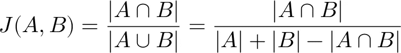

Jaccard(或 Tanimoto)相似性指数

与重叠系数不同，您可以看到 Jaccard 索引在分母中考虑了两个集合的总成员数。这意味着这个指数将总是 T21 惩罚集合间的差异，即使一个是另一个的真子集。

为了演示，让我们回到我们的玩具示例集 X={a，b，c}和 Y={b，c，d，e，f}来计算 Jaccard 索引值。

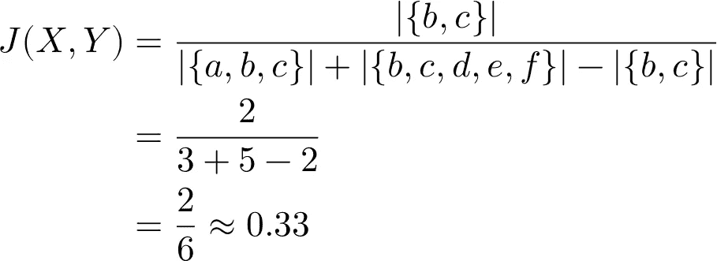

Jaccard 示例

通过考虑集合的总基数，Jaccard 索引比重叠系数(≈0.67)低一点*。接下来，让我们把元素 a 去掉，让 X 成为 Y 的真子集，看看会发生什么。鉴于重叠系数为 1，我们发现*

*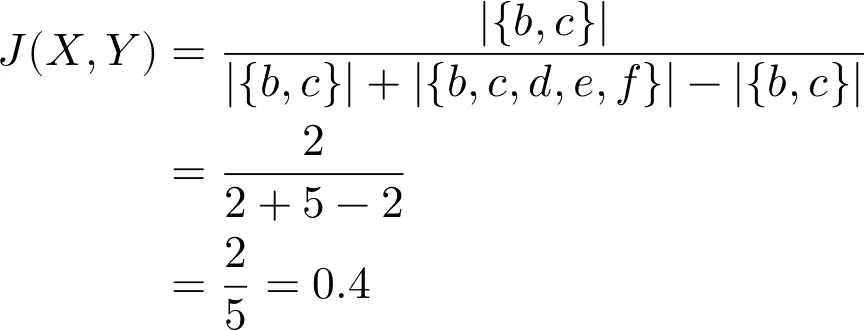*

*Jaccard 子集示例*

*这是一个显著的差异！即使 X 是 Y 的真子集，Jaccard 索引也强调了集合之间的*差异*超过了它们的共性。集合之间的差异越大，索引值越低。同样，根据您的用例，差异的额外惩罚可能对您有利。*

*正如已经提到的，Jaccard 相似性指数可能是集合相似性度量中最常见和最通用的。它通常用于比较分类数据，经常出现在生态或社会科学应用中。*

*我们计算指数的函数与计算重叠系数的函数非常相似，只是用求和代替了外积中的最小值，并改变了分母。*

## *索伦森-骰子相似系数*

*与 Jaccard 指数相似，s rensen–Dice 相似系数比较交集与两个集合的总隶属度的比率。不同之处在于，索伦森-骰子的分母是基数之和，而不是 Jaccard 的集合并的分母。另一个不同之处是，索伦森-骰子将分子中的交集增加了一倍，其效果是“加权”集合之间的共性比差异多一点。*

*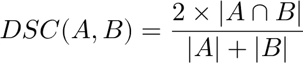*

*索伦森-骰子相似系数*

*让我们再次看看索伦森-骰子相似度与我们的玩具示例 X={a，b，c}和 Y={b，c，d，e，f}的比较。*

*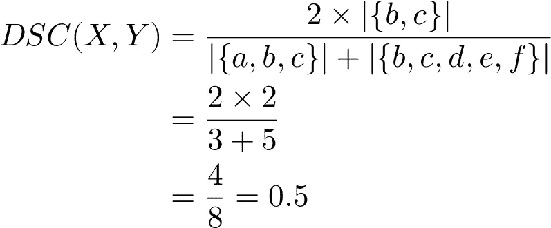*

*索伦森-骰子相似系数示例*

*正如所料，我们计算的相似性 DSC=0.5 略高于 Jaccard，但低于重叠系数。如果我们再让 X 成为 Y 的真子集(*即*，掉元素 a)，现在会发生什么？*

*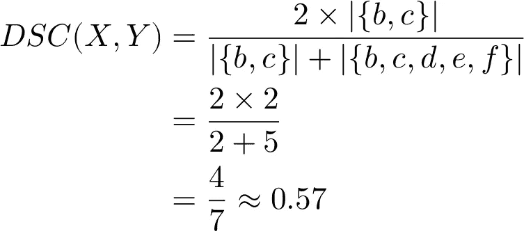*

*索伦森-骰子相似系数子集示例*

*像 Jaccard 一样，s rensen–Dice 相似性系数*并不*将真子集等同于同一性，而是将其计算为比 Jaccard 相似性指数更强的相似性。不同之处在于，Jaccard 是交集与并集的比率，而 s rensen–Dice 是交集与两个集合的*不相交*并集(*即*，并集减去交集)的比率。*

*实际上，它是匹配与不匹配的比率，而不是 Jaccard 的匹配与整体成员的比率。和以前一样，这可能更适合您的特定应用。*

*二元关联矩阵的函数设置现在应该很熟悉了。*

# *选择相似性*

*我们现在有三种非常具体的方法来度量相似性，那么我们如何选择使用哪种度量呢？嗯，没有“放之四海而皆准”的答案，所以我们必须决定对于我们的特定场景，我们所说的“相似性”是指什么。*

*我们必须考虑我们的数据生成过程，并根据我们认为的内在结构，决定我们对我们试图捕捉的相似性进行什么样的排序。更重要的是，我们需要从数据中*证明*那个决定。*

## *重新审视数据分布*

*回想一下[第一部分](https://medium.com/p/648a2f20d389),当我们查看程度和边权重分布时，对于产地和工件类型，我们发现由相对低强度的边形成了高密度的连接。我们正在寻找相似性度量来纠正这一点，但是我们希望我们的单模投影有多“稀疏”呢？哪种方法最有可能揭示我们的数据是否有真实的结构，哪种方法可能会无意中掩盖联系？*

*当观察各种相似性度量和它们的直觉时，我们发现共性对差异的相对权重产生了显著的差异。然而，每次计算涉及的*基数*完全取决于每个样本中可能有多少成员。这也意味着样本量的*多样性*会影响我们的相似性度量。让我们看看那些是什么样子的。*

*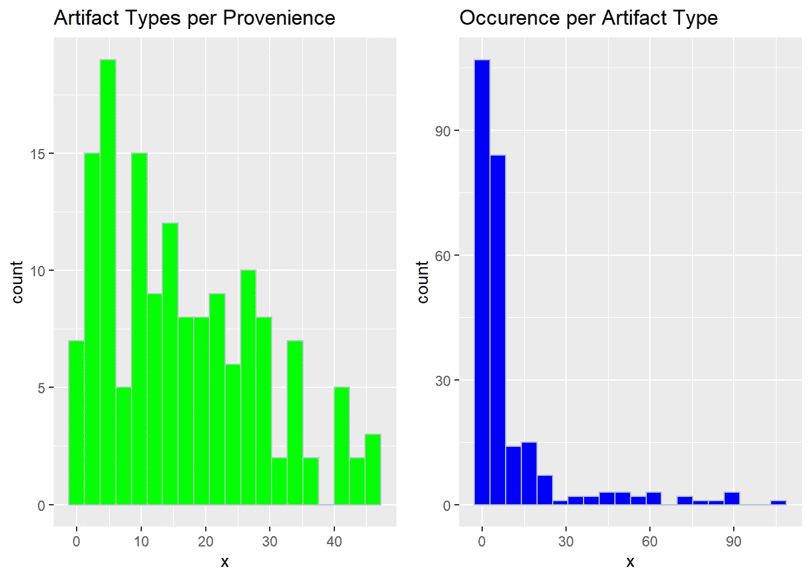*

*证据和人工制品类型的样本量分布*

*在左边，我们有一个密度分布，显示了在一个地区内有多少种艺术品。在右边，我们有找到任何单一工件类型的产地的数量。*

*有一件事立即引起了人们的注意——我们相当大一部分的产地包含了各种各样的人工制品类型，但是这些个体类型中的大多数只能在很少的产地中找到。同样值得注意的是，一些艺术品类型似乎在很高比例的省份出现。请记住，我们的样本仅包含 152 个产地和 251 种独特的人工制品类型。*

*然而，这两种分布都是右偏的，这对于我们试图发现隐藏的网络结构是有希望的。为什么？这意味着右边尾部的所有值都不太可能提供特别的信息。*

*这种偏差在工件类型中更加突出。另一方面，普罗旺斯的倾斜程度较低，这表明整体空间结构不太分散。*

*随处可见的*工件类型*很少告诉我们*其他*工件类型之间的联系，也几乎没有告诉我们产地之间的差异或相似之处。*

*类似地，包含一点点所有东西的产地不能帮助我们找到空间差异，并且很可能是不同集合混合在一起的地方。*

*这并不是说它们不重要，一旦我们找到了用于进一步分析的一级结构，我们可以将它们连接起来，但目前它们没有任何信息。我们正在寻找的内在结构不太可能在那些样本中找到。*

*幸运的是，我们现在知道样本的*主体*(当被投影为单模图时)应该具有比我们之前在“一切到一切”投影中发现的更小的图节点*度*。*

## *比较相似性度量*

*记住我们的样本分布，我们可以通过选择相似性度量来进行推理。从我们上面讨论的三种方法中，我们要考虑的是:*

*   *对我们的目标来说，适当的子集有多大的可能性和重要性？*
*   *我们想要对集合的交集进行多强的加权？*
*   *我们想要多强烈地惩罚这些差异？*

*当然，我们也想考虑我们选择的数据样本的度量看起来是什么样的，以及这对它的图形结构有什么影响。我们将确定关联矩阵`g_assemblages_bpg_inc`的方向，以捕捉适当的维度(来源或工件类型)，并将其传递给我们的相似性函数。*

*每一个都代表了我们的单模图投影的一个潜在的加权邻接矩阵。出于比较的目的，我们将拉出这些正方形矩阵中每一个的下面的三角形(不包括自对自对角线，它将全是 1)。*

*首先，让我们看一下 provenience 维度的三个相似性度量。*

*现在，我们将值列表堆叠到一个数据框中，并绘制每种方法的结果相似性值的密度分布图。*

*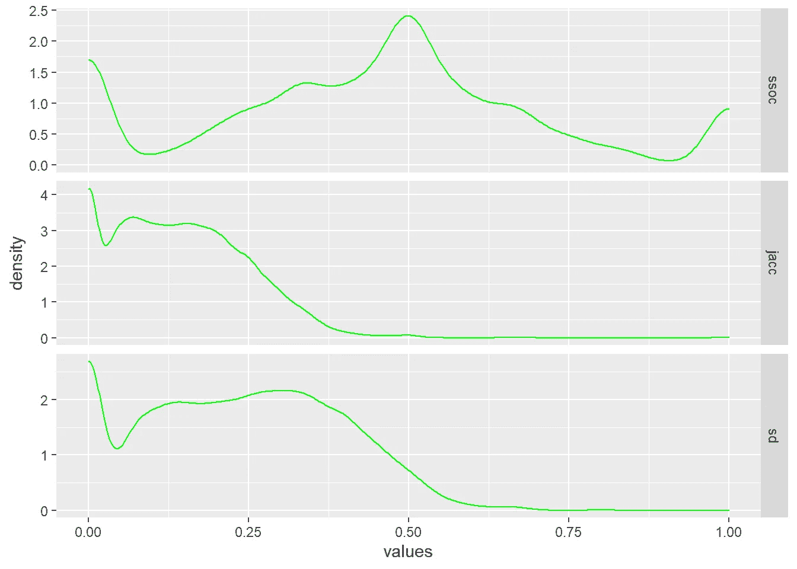*

*三种产地相似性度量值的密度分布图*

*很容易看出不同的相似性度量是如何遵循我们之前讨论过的关于集合的直觉的。*

*重叠系数(`ssoc`顶行)几乎是*寻找子集的*，因此将近一半的省被计算为 50%(或更好)匹配。这意味着，至少通过设置重叠，我们的大部分位置样本将被认为更相似，而不是不相似——其中许多被认为是相同的。*

*相反，Jaccard 相似性指数(`jacc`中间一行)计算出大多数相同的产地为*不同的*。与重叠系数不同，Jaccard 优先考虑*差*而不是交集，因为两个集合的并集*总是*大于它们的交集，除非集合*相同*。*

*类似地，索伦森-骰子相似性指数(`sd`底行)被视为对我们的样本之间的差异加权更大——但*只是*差异，而不是连接集的完整基数。密度曲线与 Jaccard 非常相似，但是您可以看到，它对集合交集的强调将相似性值推向了 50%的更高水平。*

*但是，请注意，我们的 provenience 数据分布如何反映在相似性度量配置文件中。尽管每个 provenience 的工件类型的数量有些右偏，但是大多数 provenience 展示了相对较高的基数集。这导致了我们相似性度量的奇怪的多模态分布。*

*更大的集合意味着更有可能在成对的产地之间至少有一些交集。不幸的是，这也增加了微小但*虚假*相似性的可能性。*

*接下来，让我们看一下沿着工件类型的相似性的投影。*

*同样，我们将堆叠相似性值，以便查看它们的分布。*

**

*三种伪影类型相似性度量值的密度分布*

*这些看起来与各省相似性的密度分布非常不同，但也注意到现在相似性度量之间似乎有相当大的*小于*的差异。这是为什么呢？*

*因为每个工件类型出现的产地数量的分布比每个产地的类型更加右偏。换句话说，我们平均比较了小得多的*组*组。这使得交叉点更小，更不容易开始。然而，这也使得集合之间的任何对应更有意义。*

*如果您仔细观察，您会注意到我们的三个相似性度量之间的差异在右尾巴中仍然可见。如果我们排除零值，我们可以看得更清楚。*

*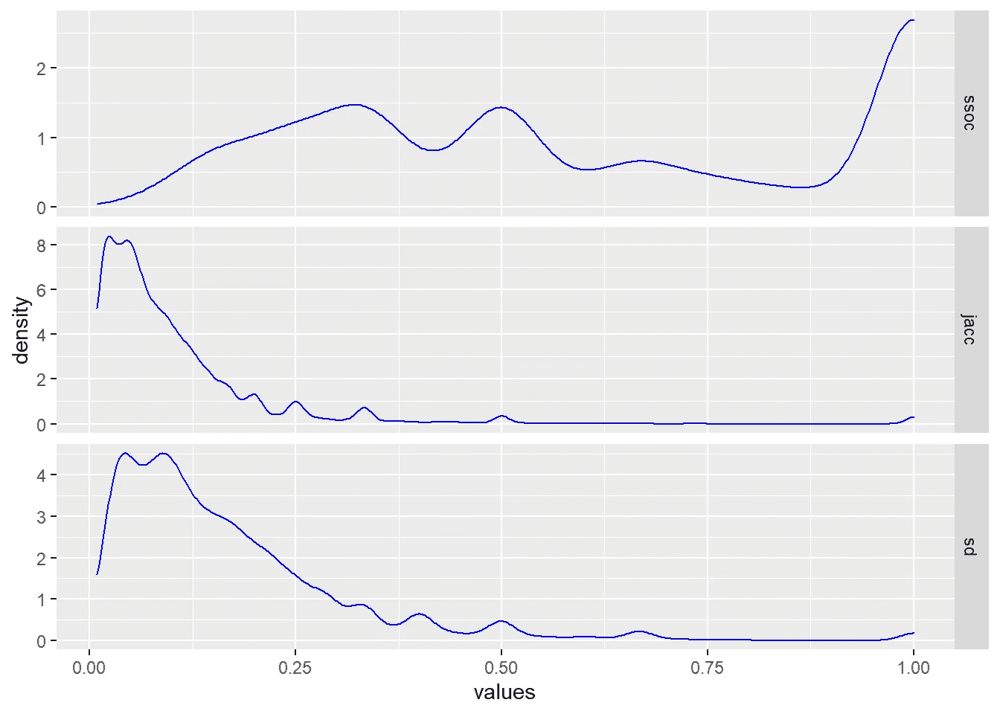*

*三种伪影类型相似性度量的非零值的密度分布*

*当我们从密度分布中去掉零值“尖峰”时，您可以看到三种方法之间相同的加权模式，即重叠寻找子集，Jaccard 寻找差异，s rensen-Dice 寻找它们之间的比例。*

*有趣的是，这三者都在确认我们确实有至少一些出现模式相同的工件类型。*

## *选哪个？*

*我一开始就说，这个问题没有简单明了的答案，我们的探索应该已经展示了为什么会这样。每种方法都突出了我们数据中交互作用的不同方面，所以真正的问题是……嗯……无论你试图解决的是什么问题！*

**我们的*问题(即考古问题)是，样本中是否存在分区或子图，表明社区的存在。我们想找出这些社区是否映射到我们可以解释的离散集合和上下文。我们*确实*想要捕获适当的子集，但是我们*也想要避免*虚假的关联。*

*在这里介绍的三种方法中，你认为哪一种能满足这些限制？*

*用图表的术语来说，我们试图找出数据是否表明类似于无标度网络的东西。这些是其中*度*(即，连接到节点的边的数量)的分布接近幂律曲线的图。如果我们可以找到*和*，那么我们很有可能看到一个“小世界”网络，它具有非常明确的分析和社区检测属性。*

*如果不是，那么我们仍然有明确的和经验的证据，观察到的现象是随机过程的产物。我们将会知道关于这个特定站点的推断的*极限*。换句话说，对于许多人可能认为是主观或定性的评估，我们有一个适当的假设检验。*

# *接下来的步骤…*

*不幸的是，我们还没有准备好选择我们的相似性度量。我们仍然需要做一些探索，看看它们对产生的单模投影图的影响，但是现在我想你可以开始看到它们中的一些可能会导致什么。*

*事实是，他们中的任何一个*都可能*在不同程度上满足我们的标准。不同之处在于分配给所形成的连接的*权重*，这些权重将在我们接下来的几个步骤中被证明是非常重要的。过滤阈值和一些社区检测方法都依赖于边缘权重。*

*这基本上是*数据*和*科学*汇合的地方。虽然有许多方法和算法会产生一个结果，但是数据和方法的*选择*的基本原理和合理性允许我们制定和测试假设。*

*没有这种推理，我们可以让数据以各种方式跳舞和旋转，以获得看起来合法的输出。我会在某个时候写一篇关于*方法*和*方法论*之间区别的文章。*

*我们的下一个任务将是探索相似性度量和阈值对产生的单模图的结构的影响。我们将讨论一下无标度和小世界网络、一般的图形分析，并开始研究社区检测方法。*