# 使用 IVFPQ 进行相似性搜索

> 原文：<https://towardsdatascience.com/similarity-search-with-ivfpq-9c6348fd4db3>

## 了解如何实现倒排文件索引(IVF)和乘积量化(PQ ),以实现快速有效的近似最近邻搜索


Voronoi 细胞。除非另有说明，所有图片均为作者所有

在上一篇关于 [**相似性搜索的产品量化**](/product-quantization-for-similarity-search-2f1f67c5fddd) 的文章中，我们解释了什么是产品量化，并详细介绍了产品量化如何用于相似性搜索。

乘积量化将数据库中的每个向量转换为短码(PQ 码)，这种表示形式对于近似最近邻搜索来说非常节省内存。

</product-quantization-for-similarity-search-2f1f67c5fddd>  

正如文章中提到的，产品量化是高度可扩展的，但是单独实现产品量化对于大规模搜索来说并不是最有效的方法。

在本帖中，我们将研究和学习如何将产品量化与倒排文件索引相结合，以形成一种高效快速且记忆灵敏的搜索方法。

> 在研究论文中，IVFPQ 通常也称为 IVFADC。

# 倒排文件索引

一个[倒排文件](https://en.wikipedia.org/wiki/Inverted_index)是一个索引结构，用于将*内容*映射到它们的*位置*。

你可能会问，*内容*和*位置*是什么，倒排文件索引如何应用于带有产品量化的相似性搜索？

在我们的上下文中，*内容*指的是数据库向量，*位置*指的是这些向量所在的分区。

是的，你没听错，我们需要对数据库向量进行分区。对数据库向量进行分区的原因是为了只对特定分区的向量而不是所有向量进行搜索。

## 粗略量化器

首先，数据库向量被分成`k'`个分区。分割是通过 [k 均值聚类](https://en.wikipedia.org/wiki/K-means_clustering)完成的，产生了我们所说的粗量化器。

这里，构建了一个倒排文件索引，它将用于将向量列表(即倒排列表)映射到相应的分区。

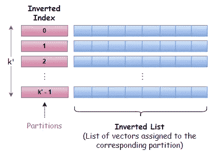

每个分区由一个*分区质心*来表示和定义，每个向量只能属于一个分区。这种结构有时被称为 [Voronoi](https://en.wikipedia.org/wiki/Voronoi_diagram) 单元，因此基于分区的搜索策略也被称为*单元探测*方法*。*

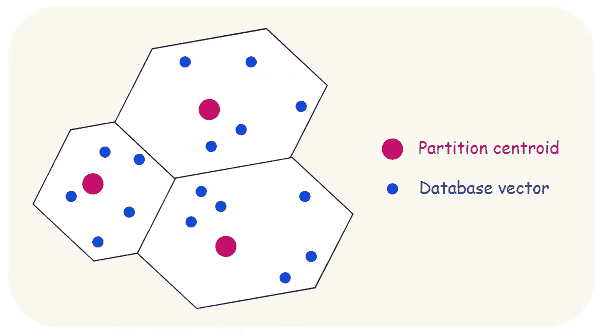

Voronoi 单元的例子

# 剩余向量的乘积量化

接下来，对于训练和编码，我们采用与 [**相似性搜索的产品量化**](/product-quantization-for-similarity-search-2f1f67c5fddd) 中描述的相同的过程，除了这次训练和编码是在剩余向量而不是原始向量上完成的。

## 什么是剩余向量

剩余向量只不过是向量从其*分区质心*的偏移，即原始向量与其关联的*分区质心*之间的差。

为了计算残差，我们只需从原始向量中减去质心。

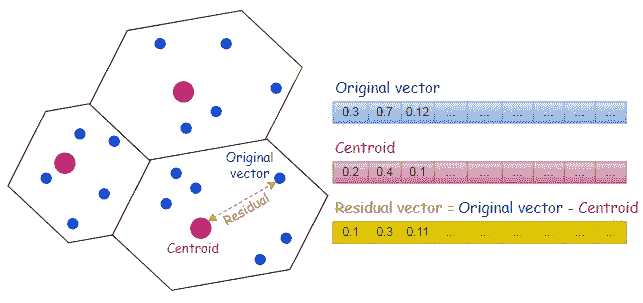

计算残差，向量从其*分区质心*的偏移量

## 为什么是剩余向量

为什么我们要使用残差向量，还要经历额外的计算残差的步骤？

编码残差向量背后的直觉是提高准确性，因为编码残差比编码原始向量更精确。

为了理解这意味着什么，我们用一组三维向量来说明。注意，在现实生活中，对这种低维向量应用乘积量化是不实际的。三维向量在此仅用于在计算残差之前和之后解释和可视化它们。

在这个例子中，向量可以清楚地分成两个分区，分区质心*用红圈表示。还有一个用橙色十字符号表示的查询向量。如下图所示，这个查询向量非常接近`Partition B`。*

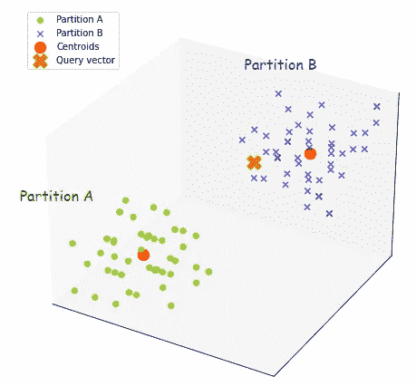

第一个图-具有两个分区的原始向量

计算完剩余向量后，让我们看看它们在下图中的样子。

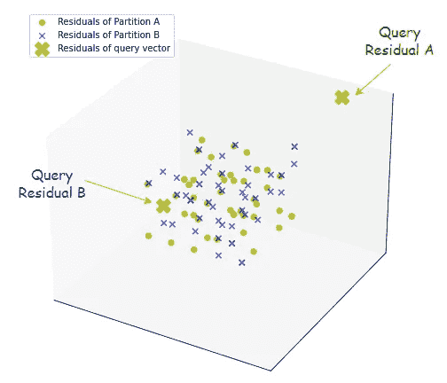

第二幅图——剩余向量

## **第一次观察**

通过获取残差，来自两个分区的数据点实际上已经重新定位到以原点为中心的相同空间，并且彼此重叠。这与第一个图非常不同，在第一个图中，可以看到两个分区彼此隔离。

> 取残差类似于将质心移动到原点，这样所有的数据点现在都聚焦在原点上。

## **第二次观察**

让我们注意第一个图中的查询向量和第二个图中的查询向量的残差。

在第二个图中，`Query Residual A`是查询向量从分区 A 的质心的偏移，而`Query Residual B`是查询向量从分区 b 的质心的偏移。

> 在残差计算之前和之后，查询记录到相应分区和数据点的距离保持不变。

从所有这些观察中我们能得出什么结论？

令人惊讶的是，通过获取残差，我们设法减少了来自所有分区的数据点的分布，并将它们压缩到相同的区域，同时保持了到查询记录的相同距离。

由于数据集中的方差较低，当使用乘积量化进行近似最近邻搜索时，这将转化为较小的误差，并最终导致更好的搜索质量。

现在，在理解了剩余向量以及为什么使用它们之后，让我们回到[乘积量化过程](/product-quantization-for-similarity-search-2f1f67c5fddd)。

概括地说，从乘积量化训练中学习码本，并且从编码过程中生成 PQ 码。

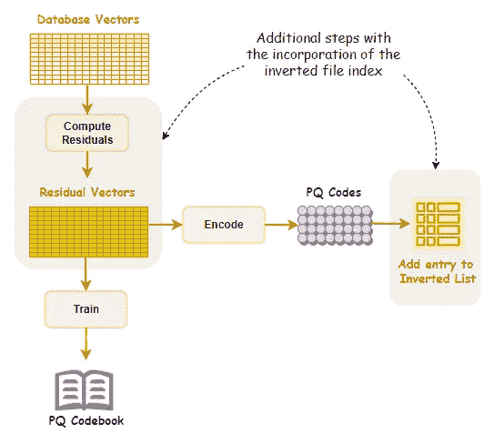

产品量化培训和编码流程

随着倒排文件索引的出现，PQ 代码现在作为倒排列表条目的一部分被包括在内。如下所示，倒排表的条目将由向量标识符(向量 Id)和编码残差(PQ 码)组成。

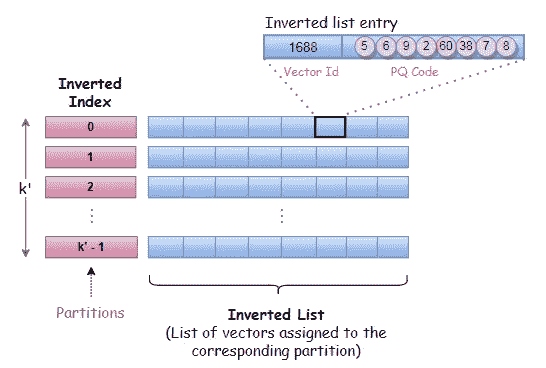

由向量 Id 和 PQ 代码组成的反向列表条目

然后，这些条目被添加到标记为相关分区的相应倒排表中。

# 使用 IVFPQ 搜索

粗略量化器保存关于分区列表和*分区质心*的信息。给定一个查询向量`q`，使用粗量化器来寻找最接近`q`的*分区质心*。

在获得离`q`最近的*分区质心*后，计算查询向量的残差。

类似于在 [**相似性搜索的乘积量化**](/product-quantization-for-similarity-search-2f1f67c5fddd) 中描述的搜索过程，我们使用码本和查询向量的残差来预先计算部分[平方欧几里德距离](https://en.wikipedia.org/wiki/Euclidean_distance#Squared_Euclidean_distance)。

这些部分平方欧几里德距离被记录在具有`k`行和`M`列的距离表中，其中`M`表示向量段的数量，而`k`表示在训练期间被选择来执行 k 均值聚类的值。

现在，有了倒排文件索引，我们可以选择性地查找部分距离并进行求和，只针对倒排列表中那些被标记为分区质心最接近`q`的分区的条目。

> 倒排文件索引是非穷举搜索方法的关键组件。

> 为了找到并返回`*K*`最近的邻居，一种有效的方法是使用固定容量的 [Max-Heap](https://en.wikipedia.org/wiki/Max-heap) 。这是一个基于树的结构，其中根节点总是包含最大值，每个节点的值都等于或小于父节点的值。
> 
> 在每次距离计算之后，只有当向量标识符的距离小于最大堆中的最大距离时，向量标识符才被添加到最大堆结构中。

# 改善搜索结果

早些时候，对于倒排文件索引，我们讨论了编码残差而不是原始向量来改善搜索结果。

然而，如果只从一个分区进行搜索，我们可能会遇到比没有倒排文件索引的基本乘积量化更差的结果。

虽然搜索速度快得令人难以置信，只需探测一个分区，但结果会受到影响，因为搜索范围现在确实局限于很小的记录子集。

根据作者的 [**为最近邻搜索**](https://ieeexplore.ieee.org/document/5432202)【1】、

> 查询向量及其最近的邻居通常不被量化到相同的分区质心，而是被量化到附近的分区质心

如下例所示，尽管查询向量最接近顶部分区的质心，但附近分区中还有其他向量也是查询向量的潜在最近邻居。

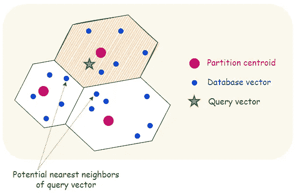

如果搜索仅限于查询向量最接近分区质心的分区，那么我们可能会错过位于附近分区的许多潜在的最近邻居。

当查询向量非常靠近单元或分区的边界时，这种影响会更加明显。

> 为了避免错过那些潜在的最近邻居，可以在更多分区上执行向量搜索。

特别地，我们将在`W`分区上执行搜索，其中来自这些`W`分区的质心最接近查询向量。`W`通常是一个可配置的参数。

拥有`w > 1`有什么寓意？

嗯，随着更多分区的加入，我们将需要使用每个*分区质心*分别计算查询向量的残差。并且对于查询向量的每个残差，需要计算单独的距离表。

最终，在`W`分区上执行搜索的意图将导致计算`W`剩余查询向量和`W`距离表。

尽管构建倒排文件索引会带来开销，但对于大型数据集，拥有更多分区并从更多分区进行搜索通常会提高效率。这是一条可行之路，并且在现实中被证明非常有效。

然而，对于小数据集，如果分区的数量太大，粗量化器的复杂性可能成为瓶颈。

# 摘要

下图总结了使用反向文件索引和产品量化(IVFPQ)进行相似性搜索的过程和步骤。

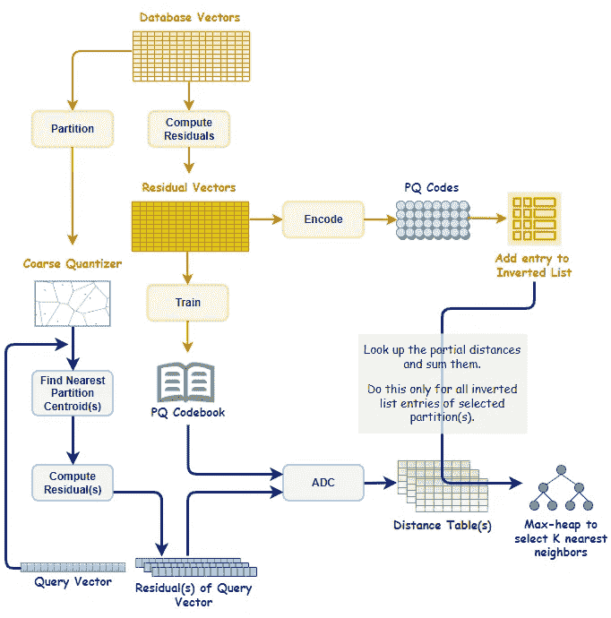

具有倒排文件索引和产品量化的相似性搜索(IVFPQ)

使用**倒排文件索引(IVF)** ，可以在相关分区上执行相似性搜索，将搜索范围限制在高度相关的一个小子集中。

另一方面，**乘积量化(PQ)** 能够用极其节省存储空间的压缩表示对矢量进行编码。

> 利用乘积量化(PQ)实现倒排文件索引(IVF)提出了一种新方法(IVFPQ ),该方法对于大规模相似性搜索非常有效。

将两者结合在一起，我们可以从两个世界中获益。结果呢？对于大规模近似最近邻搜索，搜索时间快，精度好。


詹姆斯·巴尔茨在 [Unsplash](https://unsplash.com?utm_source=medium&utm_medium=referral) 上的照片

> 处理十亿级向量数据集？点击下面的链接，了解 **HNSW** 以及它如何与 **IVFPQ** 一起使用，以形成十亿级相似性搜索的最佳索引方法。

</ivfpq-hnsw-for-billion-scale-similarity-search-89ff2f89d90e>  

# 参考

[1] H. Jégou，M. Douze，C. Schmid，[最近邻搜索的乘积量化](https://ieeexplore.ieee.org/document/5432202) (2010)

[2] C. McCormick，[用于 k-NN 教程的产品量化器第 2 部分](http://mccormickml.com/2017/10/22/product-quantizer-tutorial-part-2/) (2017)

[3] J. Briggs，[产品量化:将高维向量压缩 97%](https://www.pinecone.io/learn/product-quantization/)

```
***Before You Go...****Thank you for reading this post, and I hope you’ve enjoyed learning about similarity search with IVFPQ.**If you like my post, don’t forget to hit* [***Follow***](https://peggy1502.medium.com/) *and* [***Subscribe***](https://peggy1502.medium.com/subscribe) *to get notified via email when I publish.**Optionally, you may also* [*sign up*](https://peggy1502.medium.com/membership) *for a Medium membership to get full access to every story on Medium.*📑 *Visit this* [*GitHub repo*](https://github.com/peggy1502/Data-Science-Articles/blob/main/README.md) *for all codes and notebooks that I shared in my posts.*© 2022 All rights reserved.
```

有兴趣阅读我的其他数据科学文章吗？查看以下内容:

</transformers-can-you-rate-the-complexity-of-reading-passages-17c76da3403>  </advanced-techniques-for-fine-tuning-transformers-82e4e61e16e>  <https://pub.towardsai.net/building-a-product-recommendation-engine-with-aws-sagemaker-321a0e7c7f7b>  </aws-certified-machine-learning-specialty-97eacbd1a0fe>  

[张佩琦](https://peggy1502.medium.com/?source=post_page-----9c6348fd4db3--------------------------------)

## 掌握动态编程系列

[View list](https://peggy1502.medium.com/list/series-on-mastering-dynamic-programming-ce9124edda06?source=post_page-----9c6348fd4db3--------------------------------)2 stories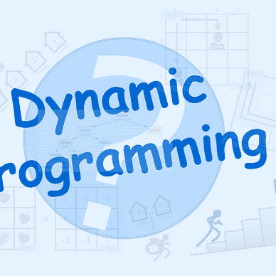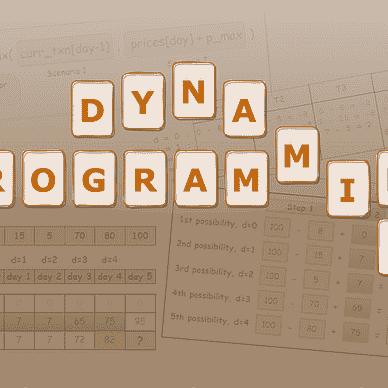