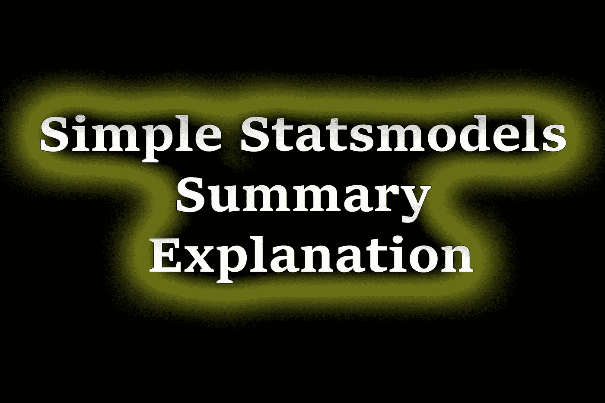
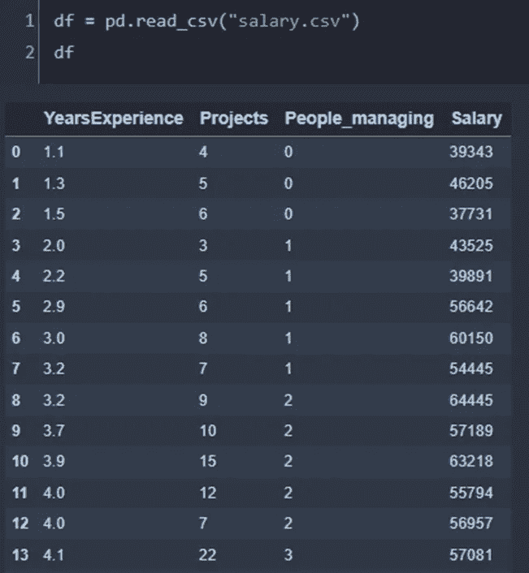
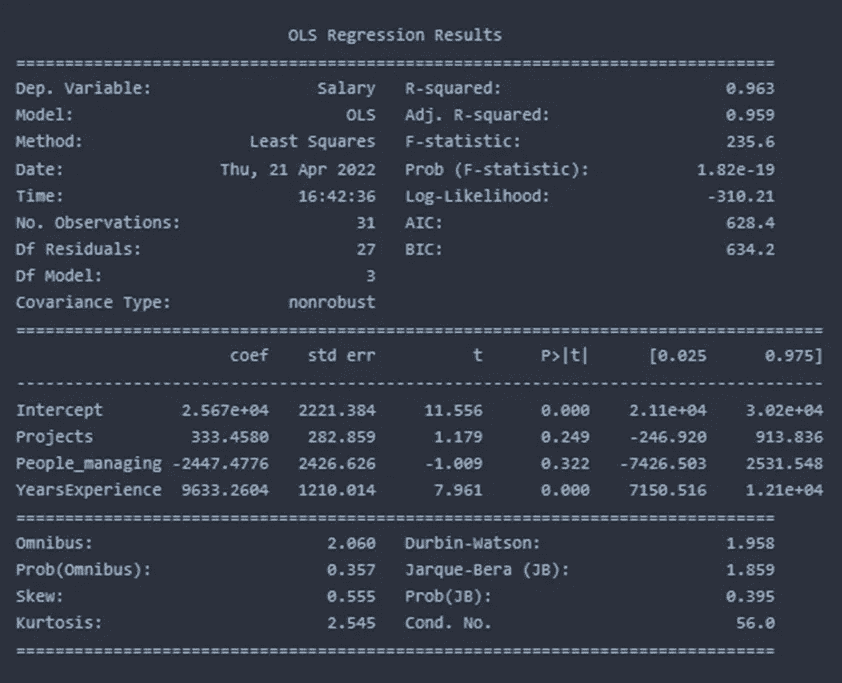
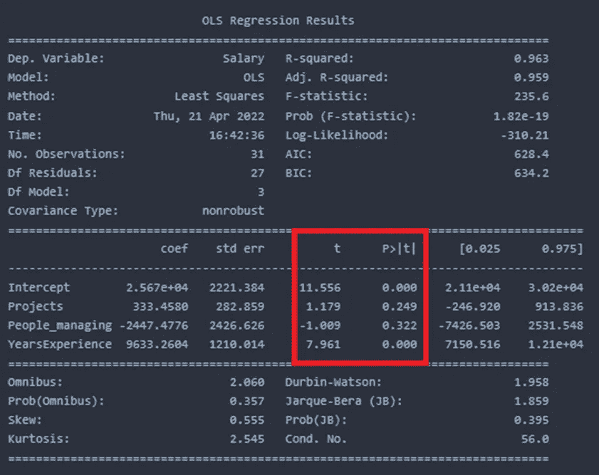
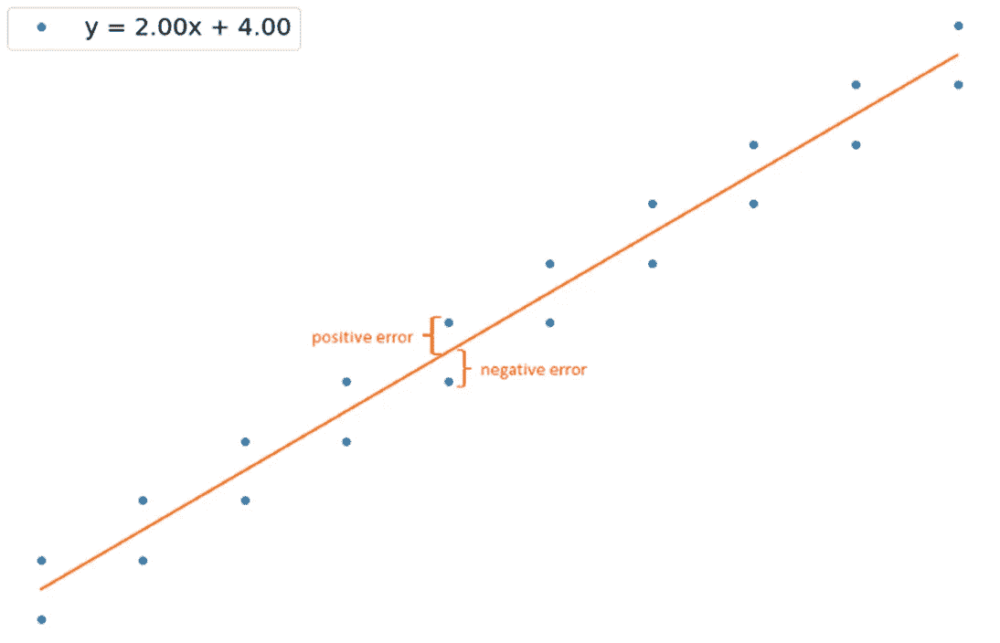
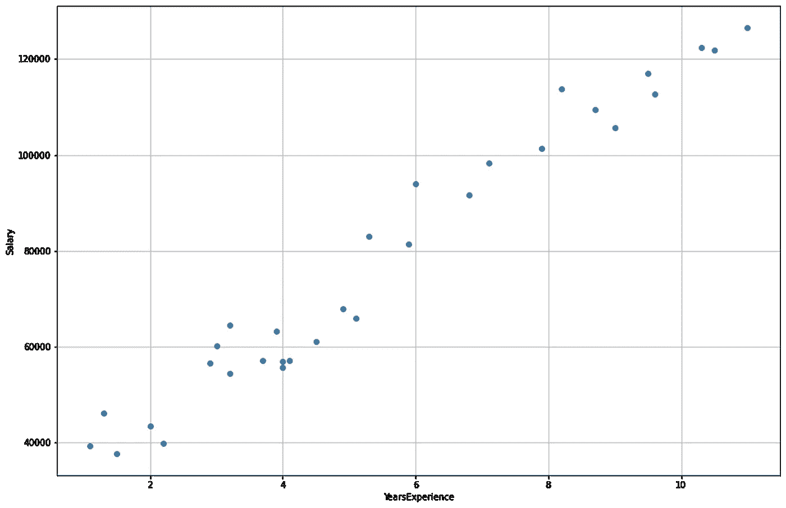
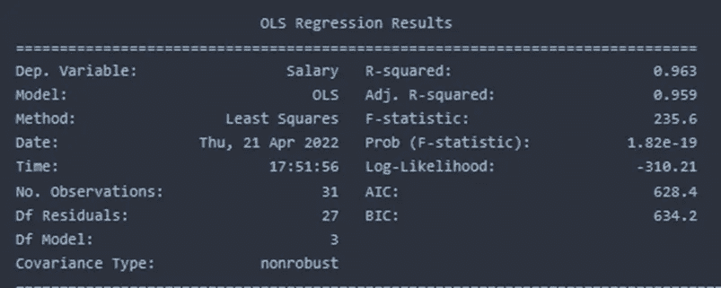
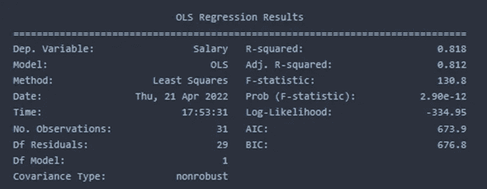

# Statsmodel 线性回归模型概述

> 原文：<https://towardsdatascience.com/simple-explanation-of-statsmodel-linear-regression-model-summary-35961919868b>

## Statsmodel 库模型摘要说明

作者图片

> **简介**

回归分析是许多统计学家和数据科学家的饭碗。我们执行简单和多元线性回归以进行预测，并总是希望获得一个没有任何偏差的稳健模型。在本文中，我将使用一个简单的示例来讨论 python 的 statsmodel 库的摘要输出，并稍微解释一下这些值是如何反映模型性能的。

> **典型模式总结**

出于演示的目的，我将使用 [kaggle 的工资数据集](https://www.kaggle.com/datasets/rohankayan/years-of-experience-and-salary-dataset/code) ( [Apache 2.0](http://www.apache.org/licenses/LICENSE-2.0) 开源许可)。这个数据集有两列:年资和薪水。我还有两个专栏:项目和人员管理。

抽样资料

当我们使用 statsmodel 使用所有三个变量来预测工资时，我们会得到以下汇总结果。

我将在下面的总结中解释所有这些参数。

> **副变量**

“工资”是数据中唯一的因变量。

> **模型和方法**

OLS 代表普通最小二乘。该模型试图找到数据集的线性表达式，该表达式使残差平方和最小化。

> **测向残差和测向模型**

我们总共有 30 个观察和 4 个特征。在 4 个特征中，3 个特征是独立的。因此，DF 模型为 3。测向残差是根据总观测值-测向模型-1 计算的，在我们的例子中是 30–3–1 = 26。

> **协方差类型**

协方差类型通常是非稳健的，这意味着没有消除数据来计算要素之间的协方差。协方差显示两个变量如何相对移动。如果该值大于 0，则两者向同一方向移动，如果该值小于 0，则变量向相反方向移动。协方差不同于相关性。协方差不提供关系的强度，只提供运动的方向，而相关值是归一化的，范围在-1 到+1 之间，相关提供关系的强度。如果我们想获得稳健的协方差，我们可以声明 cov_type=HC0/HC1/HC2/HC3。然而，statsmodel 文档并没有丰富到可以解释所有这些。HC 代表异方差一致性，HC0 实现了所有版本中最简单的版本。

> **R 平方**

r 平方值是决定系数，它表明如果数据由所选的独立变量解释，变异性的百分比。

> **可调 R 平方**

随着我们向模型中添加越来越多的自变量，R 平方值会增加，但实际上，这些变量不一定对解释因变量有任何贡献。因此，添加每个不必要的变量需要某种惩罚。当引入多个变量时，调整原始的 R 平方值。本质上，在执行多元线性回归时，我们应该始终寻找调整后的 R 平方值。对于单个自变量，R 平方值和调整后的 R 平方值是相同的。

在讨论 F-统计量之前，我们需要先了解 t-统计量。下表提供了 t 统计数据。

> **系数和标准误差**

coef 列表示每个自变量的系数以及截距值。Std err 是所有数据点上相应变量系数的标准偏差。当仅使用一个预测变量时，可以从如下所示的二维空间获得标准误差

作者图片

> **t 值和 P 值> |t|**

t 列提供对应于每个自变量的 t 值。例如，这里的项目、人员管理和工资都有不同的 t 值以及与每个变量相关的不同 p 值。t 统计用于计算 p 值。典型地，当 p 值小于 0.05 时，它表示反对零假设的有力证据，该零假设声明相应的自变量对因变量没有影响。项目的 p 值 0.249 告诉我们，有 24.9%的机会项目变量对工资没有影响。似乎 YearsExperience 的 p 值为 0，表明 YearsExperience 的数据具有统计学意义，因为它小于临界极限(0.05)。在这种情况下，我们可以拒绝零假设，并说多年的经验数据在很大程度上控制着工资。

年资与薪水显示出很强的相关性

> **F-统计**

f 检验提供了一种检查所有自变量的方法，如果其中任何一个与因变量相关的话。如果 Prob(F-statistic)大于 0.05，则没有证据表明任何自变量与产出之间存在关系。如果它小于 0.05，我们可以说至少有一个变量与产量显著相关。在我们的例子中，p 值小于 0.05，因此，一个或多个自变量与输出变量薪金相关。我们之前已经看到，工作经验与薪水有很大的关系，而其他的则没有。因此，f 检验数据支持 t 检验结果。然而，在某些情况下，prob(F-statistic)可能大于 0.05，但其中一个独立变量显示出很强的相关性。这是因为每个 t 检验都是用不同的数据集进行的，而 f 检验检查的是包括所有变量在内的综合效应。

> **对数似然**

对数似然值是模型与给定数据拟合程度的度量。当我们比较两个或多个模型时，这是很有用的。对数似然值越高，模型就越符合给定的数据。它的范围可以从负无穷大到正无穷大。

包含所有三个变量时的对数似然

仅包含“项目”时的对数可能性

当所有三个独立变量都包含在模型中时，对数似然值为-310.21，高于仅包含项目数据时的-334.95。这意味着第一个模型更符合数据。如上所述，它还与 R 平方值密切相关。

> **AIC 和 BIC**

AIC(代表由日本统计学家 Hirotugo Akaike 开发的 Akaike 信息标准)和 BIC(代表贝叶斯信息标准)也被用作模型稳健性的标准。目标是最小化这些值以获得更好的模型。我在另一篇文章中讨论了这些话题。

 [## 简单逐步加权回归模型

### 逐步加权回归

逐步加权 Regressiontowardsdatascience.com 模型](/simple-stepwise-and-weighted-regression-model-53a31d9e4746) 

> **综合与 Prob(综合)**

一旦部署了模型，综合测试将检查残差的正态性。如果该值为零，则意味着残差完全正常。这里，在示例中，prob(综合)为 0.357，表明残差呈正态分布的概率为 35.7%。对于一个稳健的模型，除了检查 R 平方和其他量规，残差分布还要求在理想情况下是正态的。换句话说，当对拟合值作图时，残差不应遵循任何模式。

> **偏斜和峰度**

偏斜值告诉我们残差分布的偏斜度。正态分布变量的偏斜值为 0。峰度是与正态分布相比的轻尾或重尾分布的度量。高峰值表示分布太窄，低高峰值表示分布太平。介于-2 和+2 之间的峰度值有助于证明正常状态。

> 德宾-沃森

Durbin-Watson 统计提供了残差中自相关的度量。如果残差值是自相关的，则模型会变得有偏差，这是不期望的。这仅仅意味着一个值不应该依赖于任何先前的值。该测试的理想值范围是从 0 到 4。

> **雅尔克-贝拉(JB)和普罗布(JB)**

Jarque-Bera (JB)和 Prob(JB)类似于测量残差正态性的 Omni 测试。

> **条件号**

高条件数表示数据集中可能存在多重共线性。如果只有一个变量用作预测值，则该值较低，可以忽略。我们可以像逐步回归一样进行，看看当包含额外的变量时，是否有任何多重共线性。

> **结论**

我们已经讨论了 statsmodel 输出中的所有汇总参数。这将对那些有兴趣检查健壮模型的所有规则的读者有用。大多数时候，我们寻找 R 平方值，以确保模型解释了大部分的可变性，但我们已经看到还有更多。

感谢阅读

[Github 页面](https://mdsohelmahmood.github.io/data-science/2022/04/21/Simple-Explanation-of-Statsmodels-Summary.html)

[Youtube 频道](https://www.youtube.com/watch?v=9RzmWGtIdwY)

 [## 用我的推荐链接加入媒体

### 作为一个媒体会员，你的会员费的一部分会给你阅读的作家，你可以完全接触到每一个故事…

mdsohel-mahmood.medium.com](https://mdsohel-mahmood.medium.com/membership)