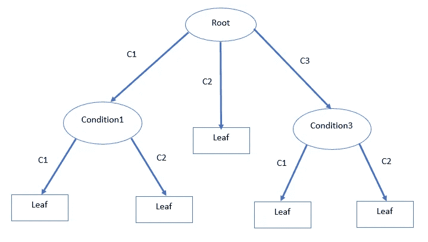
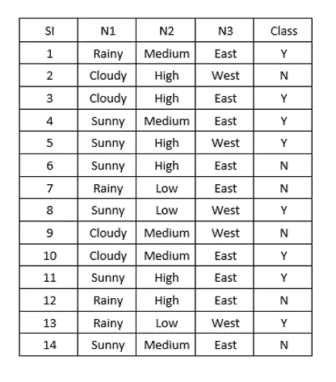
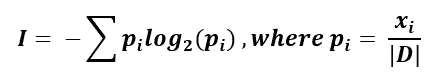
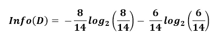
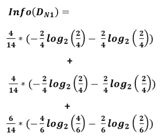
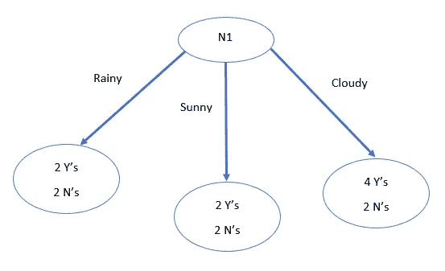

# 浅谈决策树算法如何决策

> 原文：<https://towardsdatascience.com/simple-explanation-on-how-decision-tree-algorithm-makes-decisions-34f56be344e9>

阿达什·库姆穆尔在 [Unsplash](https://unsplash.com?utm_source=medium&utm_medium=referral) 上拍摄的照片

## 决策树算法背后的直觉

决策树是一种非常流行的机器学习算法。它适用于线性和非线性数据。此外，它还可以用于分类和回归。有了 Python 和 R 中的优秀库和包，任何人都可以轻松地使用决策树和其他机器学习算法，甚至不知道它是如何工作的。但是了解算法的直觉或机制有助于决定在哪里使用它。

在这篇文章中，我将尝试给你一个关于决策树算法如何工作的直觉。

> **本文将包括:**

**决策树算法工作流程的高层介绍:**如果这个高层介绍不是那么清楚，也不用担心。接下来的部分是一个例子的详细解释。那就更清楚了。

**决策树中决策背后的一个例子和数学计算:**这部分将展示决策树算法利用数学计算做出的真实决策。

## 决策树介绍

决策树算法基于对特征条件的判定来工作。节点是对属性的条件或测试，分支代表测试的结果，叶节点是基于条件的决策。

作者图片

正如您在图中看到的，它从一个根条件开始，基于该根条件的决策，我们得到三个分支，C1、C2 和 C3。它不一定是三个分支。分支可能更多，这取决于根节点特性中的类的数量。一根树枝最后变成了一片叶子。叶节点意味着最终的决定或预测。根节点的 C1 和 C3 以条件 1 和条件 2 结束。

条件 1 和条件 2 是两种不同的功能。我们将根据条件 1 和条件 3 中的类别进一步拆分数据。上图显示条件 1 和条件 3 各有两个特征。和往常一样，类别可以不止这些。这是一个关于决策树如何进行预测的高级概念。我们将更详细地了解我们实际上是如何为根节点和其他条件选择特性的。

在深入研究之前，需要明确以下一些术语:

**根节点:**正如我已经讨论过的，根节点是决策树的起点。这是开始拆分数据的第一个功能。

**决策节点:**看上面的‘条件 1’和‘条件 3’节点。我们在基于根节点分裂之后得到那些节点，并且我们基于决策节点进一步分裂。

**叶节点:**这些是决策树做出最终决策的最终节点，不能再进一步拆分。在上图中，决策 2 和决策 3 是叶节点。

## 决策树中决策背后的示例和数学计算

这是我为这个例子创建的一个合成数据集。该数据集有一个二进制类和三个变量 N1、N2 和 N3。这三个变量都是绝对的。我采用了所有的分类变量，因为这样更容易解释。**一旦你有了直觉，也就更容易理解连续变量的用途。**

作者图片

我们有数据集。根据前面的讨论，我们需要一个**根节点**，它基于我们将要开始拆分的数据。但是我们有三个变量。**如何决定根节点？我是否应该简单地从 N1 开始，因为它在数据集中排在第一位？**

不完全是。为了理解如何做出关于哪个特征应该是根节点的正确决策，您需要了解信息增益。

基于称为**信息增益**的统计测量来选择根节点或第一测试属性。

总体而言，测试属性的选择取决于“纯度测量”。这些是纯度指标:

1.  信息增益
2.  增益比
3.  基尼指数

在本文中，我们将详细讨论“信息增益”。

> **信息增益**

想象一下 10 个朋友在一起。他们中的 5 个人想看电影，5 个人想出去。在这种情况下做决定真的很难。如果他们中有 8 到 9 个人想看电影，而只有 1 到 2 个人想出去，那就更容易做出决定。对吗？最好的情况是他们 10 个人都想要同样的东西。决策非常容易。一点都不混乱！。

同样在决策树中，如果所有的类都属于 yes 或 no，则数据集是最纯的。另一方面，如果类的 50%属于是，另 50%属于否，那么数据集是极不纯的。因为很难做决定。决定很不确定！

信息增益有助于衡量某一特征的不确定性的减少。**这也有助于决定哪一个特征适合作为根节点。**

信息增益的计算取决于**信息**。那也叫**熵**。

信息的公式:

让我们看一个例子。

我将研究上面的虚拟数据集，找出哪个要素将成为该数据集的根结点。

现在，让我们计算一下虚拟数据集的信息。这个数据集总共有 14 行数据，8 个是类和 6 个否类。

所以，信息是:

信息出来是 0.985。**这是母熵。**

接下来，我们需要逐一计算三个变量 N1、N2 和 N3 的信息。

**从 N1 开始:**

我们需要通过分割 N1 数据集来计算分类样本所需的信息量:

首先，让我们分析一下 N1 的数据。有:

4 '雨天',其中 2 'Y '和 2 'N '类

4 'Sunny ',其中 2 'Y's 和 2 'N's class

6 '多云',其中 4'Y '和 2'N '级

基于 N1 对数据集进行分类所需的信息如下:

它给出 0.964。

**Info _ gain(N1)**= 0.985–0.964 = 0.02

因此，如果 N1 成为根节点**，熵将减少 0.02。**

**同理，我们可以计算出 Info(DN2)和 Info (DN3)分别为 0.972 和 0.983。**

**所以，N2 和 N3 的信息增益是:**

****信息 _ 增益(N2)**= 0.985–0.972 = 0.012**

****信息 _ 增益(N3)**= 0.985–0.983 = 0.001**

**如果我们将 N2 或 N3 作为我们的根节点，熵**将分别减少 0.012 和 0.001。****

> **根据上面的计算，信息增益最高的属性是 N1。所以，N1 将是根。**

**在这个阶段，根节点已经固定，决策树将如下所示:**

****

**作者图片**

**我们选择了根节点，并根据根节点分割数据。图中显示了数据与相应类别的精确划分。**

****接下来呢？****

**如你所见，当“下雨”或“晴天”时，熵值非常高。因为 Y 和 N 的数量相同。但是“多云”时熵更低。所以，在‘多云’的时候，类可以是 Y。我们可以根据 N2 和 N3 再次分割数据。为此，我们必须计算每个子节点“雨天”、“多云”和“晴天”的信息增益，以决定下一个特征出现在哪里。如您所见，对于每个部门，我们现在都有更小的数据集。**

**我不会在这里展示任何进一步的计算。本文的目的是给出一个关于决策树算法如何工作的概念。**

## **哪里停止分裂**

**我们致力于根据特征分割数据。这个虚拟数据集只有 3 个要素。但是真实世界的数据集可能有更多的特征需要处理。如果我们有大量的特征，并且我们想要使用所有的特征来构建树，树将变得太大。这可能导致过拟合和长计算时间。**

**为了处理这个问题，在 scikit-learn 库的决策树函数中有一个 **max_depth** 参数。如果最大深度参数很大，树会更大。所以，我们可以选择树的深度。**尽管你可以使用任何你选择的特征选择方法来为算法选择更少的特征。****

**还有一个参数， **max_features** 。参数的名称说明了它的作用。您可以指定要用于树的最大要素数。**

**其他参数请参见[文档](https://scikit-learn.org/stable/modules/generated/sklearn.tree.DecisionTreeClassifier.html)。**

## **决策树算法的主要优势**

1.  **从我们处理的例子中可以看出，在某种程度上，它给了你一个关于预测如何发生的清晰的可视化。因此，更容易向利益相关者或客户解释。**
2.  **不需要特征缩放。**
3.  **因变量和自变量之间的非线性关系不会影响决策树算法的性能。**
4.  **决策树算法可以自动处理异常值。**
5.  **自动处理缺失值。**

## **决策树算法的主要缺点**

1.  **如前所述，存在过度拟合的主要风险。这也可能导致高方差，从而导致预测中的许多错误。**
2.  **决策树算法很容易不稳定。数据中的一点点噪声或添加一个额外的数据可能会使整个树不稳定，或者可能会重新构建树。**
3.  **决策树算法不适合大型数据集。如示例部分所述，如果数据集太大，算法可能会变得太复杂，并可能导致过拟合问题。**

## **结论**

**Python 和 R 对于所有流行的机器学习算法都有非常好的包。所以，现在工作很轻松。但是了解背后的机制会让你更好地为你的项目选择正确的机器学习算法。**

## **更多阅读**

** [## 使用 Python 从零开始的多类分类算法:分步指南

### 本文介绍两种方法:梯度下降法和优化函数法

towardsdatascience.com](/multiclass-classification-algorithm-from-scratch-with-a-project-in-python-step-by-step-guide-485a83c79992)  [## Seaborn 的 Violinplot 和 Relplot 的细节

### 充分发挥潜力在 Seaborn 使用小提琴和 Relplots

towardsdatascience.com](/details-of-violinplot-and-relplot-in-seaborn-30c63de23a15)  [## Python 中从头开始的完整 K 均值聚类算法:分步指南

### 还有，如何使用 K 均值聚类算法对图像进行降维

towardsdatascience.com](/a-complete-k-mean-clustering-algorithm-from-scratch-in-python-step-by-step-guide-1eb05cdcd461)  [## 随机梯度下降:从头开始的解释和完整实现

### 使用单个感知器

towardsdatascience.com](/stochastic-gradient-descent-explanation-and-complete-implementation-from-scratch-a2c6a02f28bd)  [## Python 中从头开始的完整异常检测算法:分步指南

### 基于概率的异常检测算法

towardsdatascience.com](/a-complete-anomaly-detection-algorithm-from-scratch-in-python-step-by-step-guide-4c115e65d54e)  [## 用 R 中的例子剖析单向方差分析和协方差分析

### 通过分析方差得出的均值差异

pub.towardsai.net](https://pub.towardsai.net/dissecting-1-way-anova-and-ancova-with-examples-in-r-a3a7da83d742)  [## 一个完整的带有亚马逊产品评论数据的 Python 情感分析算法:一步一步

### 使用 Python 的 Scikit_learn 库的 NLP 项目

towardsdatascience.com](/a-complete-sentiment-analysis-algorithm-in-python-with-amazon-product-review-data-step-by-step-2680d2e2c23b)**