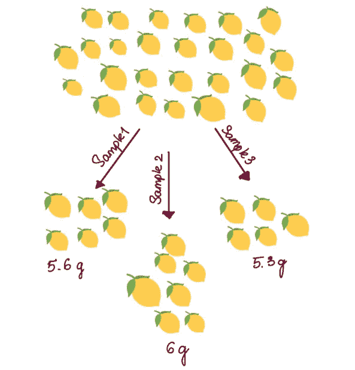
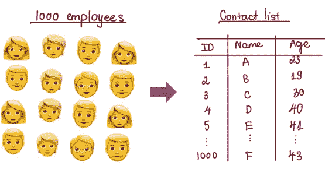
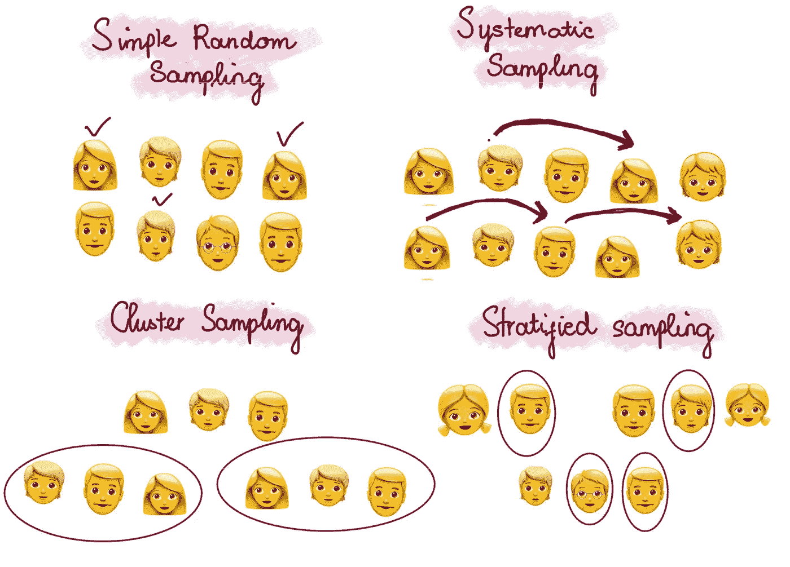
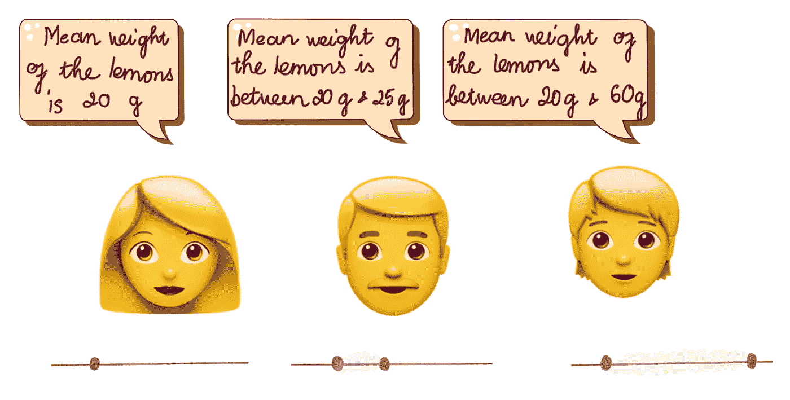
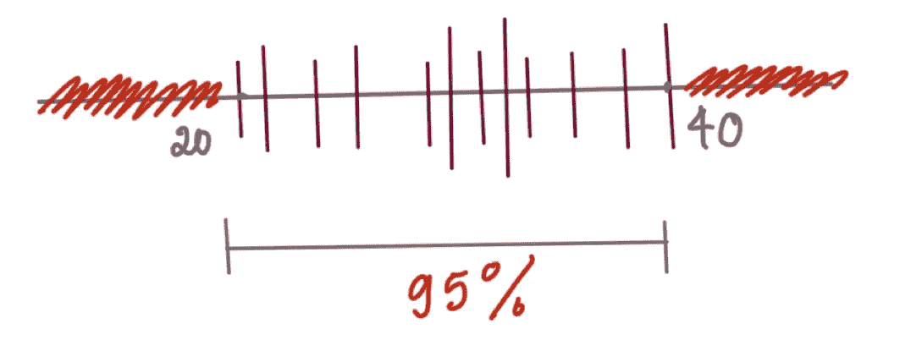
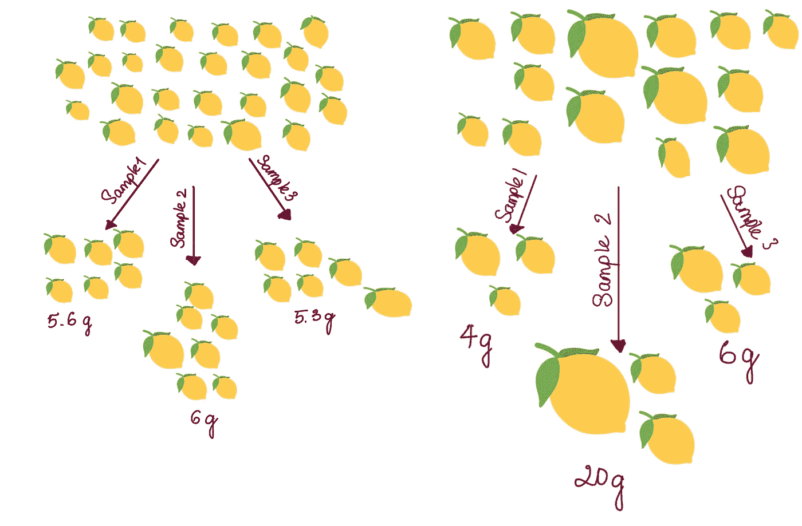

# 统计学基本概念的简单解释(第一部分)

> 原文：<https://towardsdatascience.com/simple-explanations-of-basic-statistics-concepts-part-1-bba66a1761d7>

## 简单明了地解释不同的统计概念

马库斯·温克勒在 [Unsplash](https://unsplash.com?utm_source=medium&utm_medium=referral) 上的照片

# 介绍

我的教授曾经提到过，如果你能向一个完全不熟悉的人解释一个术语，并让他们理解这个概念，那么你就被认为对这个学科很了解。这种方法也是我每当学习新东西时采用的方法。当我在复习面试问题时，我意识到实践这种积极的学习方式是多么重要。

统计学有很多定义和很多知识要涵盖。这就是为什么我认为做评论的最好方法是写下来并向人们解释。带着这个想法，本文将讨论一些基本的统计学概念，我相信任何统计学学习者都应该熟悉这些概念。

# 人口和样本

假设我家拥有一个柠檬农场。当收获季节到来时，我们想知道柠檬的平均大小。农场里有成千上万的柠檬，当然，我们无法测量或称量所有的柠檬。因此，我们决定对它们进行采样，并从每个样本中获取平均值。

农场里所有的柠檬被称为**群体**，每一组被采摘的柠檬就是一个**样本。**

## **样本量**

这是你的样品中柠檬的数量。**样本量**根据不同的标准确定，如研究范围、人口可变性或研究方法。

作者图片

## **样本错误**

从样本中，我们可以得出关于人口的结论。这样的发现被称为推论。然而，我们可能知道，样本永远不会是总体的完美代表，每个样本都会有不同的结果。

抽样总是会有变化。例如，在同一个农场采摘的三组柠檬可能有三种不同的平均重量。这叫做抽样误差。

## 样本框

**样本框架**可以理解为将从中抽取样本的群体个体的列表。理想情况下，这个列表应该包括你想研究的全部人群。**样本框**和**目标人群**的区别在于人群广，框窄。

例如，我想研究 BC 公司的工作满意度。BC 公司的员工总数是研究的总人数。理想情况下，我的抽样框架将包括所有员工的姓名和信息。

作者图片

## 样本空间

一个**样本空间**包含了一个实验的所有可能结果。假设您有一个 BC 公司员工的抽样框架，用于选择最佳支持团队的调查。**样本空间，在本例中，**是您的调查中所有可能的回答:销售团队 1、销售团队 2、人力资源、财务等。

# 取样方法

同时，从人群中抽取样本的行为被称为**抽样**。

抽样方式有两种:**概率抽样&非概率抽样**。然而，在这篇文章中，我将只讨论**概率抽样**，因为它更为人们所熟悉，也更倾向于在研究中使用。

简而言之，**概率抽样**是一种技术，研究人员会预先定义一些标准，然后从人群中随机选择个体。按照这些标准，所有成员都有平等的机会被纳入样本。**概率抽样主要有四种:**

作者图片

## 1.简单随机抽样

这是最好的采样方法之一，因为它有助于节省时间和资源。在简单的随机抽样方法中，抽样框应该包含整个群体，这样群体中的每个个体都有平等的机会被选中。

例如，BC 公司希望从他们的 1000 名员工中选择 50 名员工进行调查。他们给每个雇员分配一个从 1 到 1000 的数字；然后，他们从 1000 个号码中随机选择 50 个号码。

## 2.系统抽样

这种抽样方法很简单，类似于简单的随机抽样，但不同的是，个体是以固定的间隔挑选的，而不是随机产生的。

继续使用前面的示例来选择调查的员工。假设数字按降序排列，我们首先随机选择一个起点，例如，雇员号 2。然后，从数字 2 开始，选择大于先前选择的 2 个单位的数字。这意味着员工编号 2，4，6，…将被选中，直到有足够的 50 人。

## 3.巢式抽样法

现在，假设 BC 公司在全球有 50 个分支机构，拥有数千名员工；公司的高层管理人员不能访问每一个办公室。于是，他们决定随机选择十个城市进行走访，这十个城市对应十个集群。

这种方法产生样本误差的可能性更大，因为在不同的聚类之间可能存在显著的差异。此外，样本聚类不一定能很好地代表整个群体。

## 4.分层抽样

根据收入、性别或受教育程度等类似特征，总人口被分为不同的亚组(阶层)。然后，我们决定从每组中抽取多少人的样本，并进行取样。

分层抽样的一个明显的缺点是，在确定阶层时，选择偏差的机会更大。这种偏差的发生是因为我们在划分子群之前可能已经有了群体共享模式的先验知识或信息。

# 置信区间

正如我上面所说的，在抽样中总会有样本误差，因为没有样本可以完美地代表整个人口。那么，我们如何得到总体参数的结果呢？这时术语**置信区间**就出现了。

**置信区间**有助于表达对总体参数的估计。换句话说，它描述了我们的参数准确的可能性。

作者图片

在统计学中，**信心**是概率的另一种表达。例如，假设您建立了一个置信度为 95%的置信区间。在这种情况下，您确信估计值在 100 次中有 95 次位于置信区间给出的上限值和下限值之间。

让我们回来计算农场里柠檬的平均重量。假设我们取 10 个柠檬样品，并计算样品的平均重量。结果是 20 克。

再取一个样品，继续计算样品的平均重量。重复该过程，直到我们计算出许多平均重量，比如 100 个平均重量。在 100 次计算中，有 95 个数值在 20g-40g 之间。因此，我们有 95%的把握认为柠檬的平均重量在 20 克到 40 克之间。

作者图片

***长话短说，95%的区间就是覆盖均值 95%的区间。所以，任何超出置信区间的事情只发生不到 5%。这也意味着真实均值落在这个区域的概率是< 5%。***

## 什么影响置信区间的宽度

影响置信区间宽度的因素有两个:**总体内的变异**和**样本量。**

想象一下柠檬农场，那里所有的柠檬都有相同的重量，我们从这个群体中抽取的样本应该有相似的重量。因此，样本之间的平均权重**相似，导致**置信区间**变窄。然而，在另一种情况下，当农场中柠檬的重量之间存在**大的差异**时，样本的平均重量之间可能存在**巨大差异**，导致平均重量的**宽置信区间**。**

作者图片

如果我们取一个小样本，信息将是不准确的，因为从几个值中没有多少信息可以反映。因此，样本之间产生较大差异的几率会更高，从而导致更宽的置信区间。

另一方面，在大样本的情况下，获得样本误差的影响减少了，因为从中获得了更多的信息。因此，置信区间将会更窄。

## 如何计算置信区间

有几种方法可以计算置信区间:

*   拔靴带
*   非正式的
*   传统的基于正常的

不过每种方法的细节会在后面的帖子里提到。

# 结论…

以上是对统计学中一些基本概念的一些解释。当然，还有更多的内容需要介绍，我会在接下来的文章中继续分享。我希望我已经把它们说得更清楚了。谢谢你一直读到最后。

## 参考

[https://www . scribbr . com/statistics/confidence-interval/#:~:text = A % 20 confidence % 20 interval % 20 is % 20 the，another % 20 way % 20 to % 20 description % 20 probability](https://www.scribbr.com/statistics/confidence-interval/#:~:text=A%20confidence%20interval%20is%20the,another%20way%20to%20describe%20probability)。