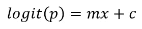
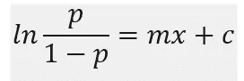
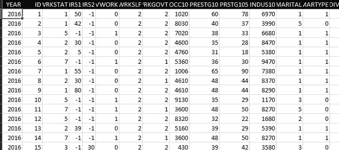
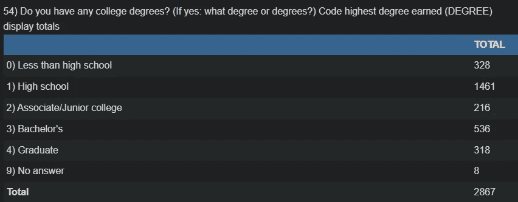
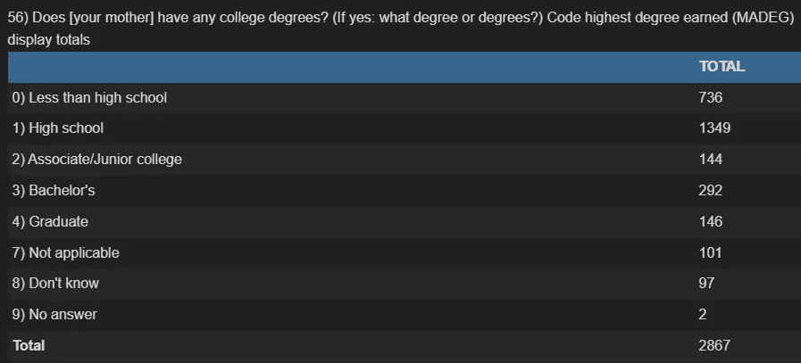
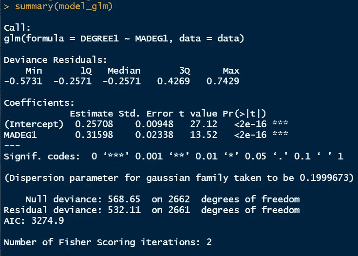

# R 中二分变量的简单 Logistic 回归

> 原文：<https://towardsdatascience.com/simple-logistic-regression-for-dichotomous-variables-in-r-8befbe3e95b4>

## R 系列中的统计

图片来自 [Unsplash](https://unsplash.com/photos/LPckxbrqE5w)

> 一、**简介**

L 逻辑回归是一个基本的统计概念，通过它可以在分类变量之间进行回归分析。很多时候，变量的序数值不一定代表任何数字，而是代表一个类别。我们以前讨论过简单线性回归和多元线性回归。在本文中，我将介绍 R 中逻辑回归的实现，并解释结果。

有时，我们的变量只能采用二进制类型的值，例如性别、就业状况和其他是/否类型的回答。此外，我们可以有两个以上的类别。在简单逻辑回归中，我们有一个二元因变量和一个连续或分类自变量。我们可以利用线性回归来预测二元因变量，但有几个限制。我们将在这里讨论这些假设。

> **假设违反**

线性回归的第一个假设是数据的正态性。在简单线性回归中，我们假设因变量在平均值与中值重叠的地方呈正态分布。在逻辑回归的情况下，因变量有二分输出。这意味着它远非正态分布。事实上它遵循伯努利分布。这意味着我们不能利用最近的创造来预测一个二元变量。

使用线性回归来预测二元变量的另一个限制是违反了同方差假设。在这种假设下，只有预测变量的值的误差方差被认为是一致的。但事实并非如此。在这个逻辑回归中，误差的方差取决于捕食者变量的值，这个变量被称为异方差。

最后，我想指出的是，用这种方法做逻辑回归，也违反了线性假设。我们无法获得二分变量和线性连续变量之间的线性关系。事实上，这种关系遵循 S 形曲线，这是逻辑回归的标志，如下所示。该曲线表明，响应变量只能取两个级别的值。如果这里应用线性回归，有时结果可能小于 0 或大于 1，这违反了概率论的基本假设。

> **解决方案**

为了避免上述违规，当响应变量为二元时，我们需要使用逻辑回归而不是线性回归。我们需要对结果变量的成功概率进行逻辑转换。简单逻辑斯谛方程的最简单形式是

其中 p 是结果变量等于 1 的概率。Logit(p)表示成功概率的逻辑转换。在右边，形成非常类似于线性回归。此逻辑转换方程和简单线性回归之间的基本区别在于，我们不是直接计算响应变量，而是测量响应变量的成功概率。由于这也产生了与成功几率相同的氛围，等式的左边可以改写如下。

因此，“logit”是“成功几率的自然对数”。

逻辑回归背后的理论已经在上面简要讨论过了。接下来我将在 r 中实现一个逻辑回归的例子，并解释所有的输出以获得洞察力。

> **数据集**

为了进行演示，我将使用 2016 年收集的综合社会调查(GSS)数据。这些数据是从[宗教数据档案协会](https://www.thearda.com/Archive/Files/Downloads/GSS2016_DL.asp)下载的，由 Tom W. Smith 收集。该数据集收集了近 3，000 名受访者的回答，并包含与若干社会经济特征相关的数据。例如，它有与婚姻状况、教育背景、工作时间、就业状况等相关的数据。让我们深入这个数据集，以便更好地理解它。

GSS 2016 年数据[图片由作者提供]

学位列提供每个人的教育水平值，MADEG 提供每个母亲的教育程度。我们的目标是找出母亲的本科教育水平是否是孩子本科教育水平的良好预测指标。数据集中的分类数据按顺序编码。

学位数据[图片由作者提供]

MADEG 数据[图片由作者提供]

让我们导入 R 中的数据，并利用 glm()命令来回答我们的问题。我们需要稍微修改一下我们的数据集。对于所有不到学士学位的参与者，标记为 0，其他标记为 1。同样的特征工程是在母亲的教育水平上完成的。新列被重命名为 DEGREE1 和 MADEG1。

r 码[图片由作者提供]

R 中的输出窗口[图片由作者提供]

在这里，上面的输出窗口非常类似于下一篇文章中讨论的线性回归，我们使用了 lm()函数。

</total-interpretation-of-regression-and-anova-commands-in-r-ed8982c12473>  

> **结果解读**

如前所述，要实现逻辑回归，我们需要将输出成功的概率转换为对数度量，然后可以确定预测变量和截距的系数。解释如下。

1.  从输出窗口中，我们观察到存在类似于线性回归情形的残差。截距的估计值为 0.257，MADEG 的系数估计值为 0.316，这基本上告诉我们，预测变量(即母亲的教育水平)每增加一个单位，孩子的教育水平值为 1 的 logit 概率就增加 0.31598(这仍然是一个正斜率，表明响应变量随着预测变量的增加而增加)。换句话说，母亲的学士学位增加了孩子获得学士学位的可能性。
2.  相关的 p 值小于 0.05，这也告诉我们拒绝零假设。这里的零假设是“预测变量的系数为 0，基本上不影响响应变量”。因此，我们可以得出结论，母亲的学士学位教育显著影响孩子的学士学位。至少数据是这么告诉我们的。
3.  t 值的计算方法是将估计值除以标准误差。最后，零偏离值显示了零模型的偏离，其中我们只有截距。剩余偏差是指偏差定义为

> 剩余偏差= -2(当前模型的对数似然性-饱和模型的对数似然性)

零偏差和剩余偏差之间的差异用于确定当前模型的显著性。

> **结论**

我们已经讨论了简单的逻辑回归及其在 R 中的实现。我们还浏览了 R 的输出并解释了来自一般社会调查的结果。预测变量的正系数表明，随着母亲的学士学位值从 0 增加到 1，孩子的学士学位变为 1 的概率增加了 0.31598，或者换句话说，可以得出结论，在我们的数据集中，母亲的教育显著影响孩子的教育。

感谢阅读。

网站:[从数据中学习](https://www.learningfromdata.net/)

<https://mdsohel-mahmood.medium.com/membership>  <https://mdsohel-mahmood.medium.com/subscribe> 