# 制造环境中的简单概率推理

> 原文：<https://towardsdatascience.com/simple-probabilistic-inference-in-a-manufacturing-context-b0f22f7b9a9a>

**TL；** *本文将概率推理应用于一个由来已久的机械工程问题。如果你不太关心理论和认识论(我们是如何来到这里的)，那么只需阅读问题，并着手将先验知识拟合到贝塔分布。如果你是在更大的冲题，只要看完题* [*打开模型*](https://docs.google.com/spreadsheets/d/1ly2_UGa-mrLq5XkGYujbLchIjvwHoCmyeoM-ZMbOfsU/edit?usp=sharing) *就能算出来。*

一个人如何从数据中学习？随着如此多的业务环境中数据的爆炸式增长，数据科学不再是一门可选的学科。随着先进的统计方法打包在漂亮的库中，并被商品化用于机器学习，我们很容易错过 ***概率论*** 的基础，这是我们如何从数据中学习的核心。那些基础有 250 多年的历史了，既直观又有哲理。了解这些基础有助于我们成为数据科学、机器学习和实验的更好的实践者。

为了做到这一点，我将利用我最近在我的母校班加罗尔理工学院主持的 R. Venkatram 博士纪念讲座系列下讲授的题为“概率的魔力”的研讨会(英语和卡纳达语的公共领域双语幻灯片[此处](https://docs.google.com/presentation/d/1263bvlP0UJbn1aEMTpVZNrTrK6AxCHXo/edit?usp=sharing&ouid=104313030205366940545&rtpof=true&sd=true))。参与者大多是工程所有学科的高级教师。作为深入研究的一部分，我要求有人自愿回答一个推理问题。机械工程的教授给了我一个很好的例子，这篇文章的目标是用这个例子来说明简单的概率推理。您可以轻松地用数据丰富的上下文替换制造示例。当将其扩展到 AB 测试时，参见本文。

# 问题:制造的组件不合格

正在制造的特定组件有一个验收公差，大约高于或低于 25 毫米 0.5 毫米。如果超出此范围，该组件被称为不合格，并从该批次中拒收。管理制造车间的人认为，他们将在每批中看到 4%到 6%的不合格零件。当他们运行下一批并计算不合格零件的数量时，他们应该如何更新他们对不合格零件的看法？制造的下一个零件不合格的概率是多少？他们认为低于不合格水平上限的概率是多少？为了获得低于不合格水平上限的 90%置信水平，应该运行多少批次？此外，他们应该预测什么样的年营业利润，达到目标营业利润的概率是多少？

# 经典概率论来拯救

1763 年，一段伟大的友谊改变了人类推理的方式。托马斯·贝叶斯牧师两年前去世了，留下了他未发表的关于概率的著作。他亲爱的朋友、数学家理查德·普莱斯发表了这部著作，名为《解决机会主义中的一个问题的论文》。

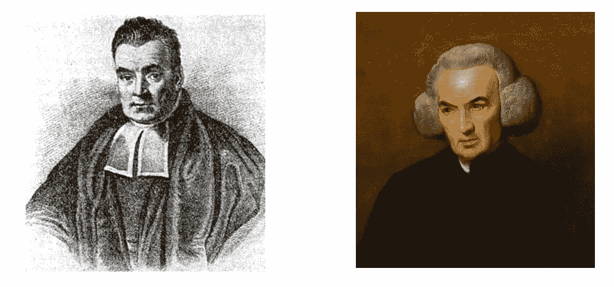

(左)托马斯·贝叶斯牧师，[公共领域](https://en.wikipedia.org/wiki/File:Thomas_Bayes.gif) |(右)贝叶斯的朋友托马斯·普莱斯，[公共领域](https://en.wikipedia.org/wiki/File:Richard_Price_West.jpg)。

这项工作取得了两项重要进展。第一个是从条件概率推导出贝叶斯定理。第二个是 Beta 分布的引入。皮埃尔·西蒙·拉普拉斯独立地提出了同样的定理和贝塔分布，还提出了很多我们今天称之为概率论的东西。

贝塔分布以掷硬币的比喻开始，它只有两种可能的结果，正面或反面。因此，在 n 次试验中 k 次成功的概率由二项式分布给出(bi =“二”)。这在贝叶斯和拉普拉斯出现之前就已经知道了。他们从离散的二项式分布中获得灵感，并通过应用微积分，把它带到了连续分布领域。他们保留了 k 和 n，但将其称为 alpha(或成功次数=k)和 beta(或失败次数= n-k)，这成为了这种新分布的形状参数，他们将其称为“Beta”分布。

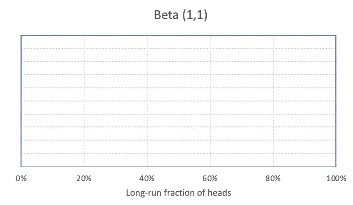

设置为(α= 1，β= 1)的β分布产生均匀分布。作者制作的图像。

关于这种分布的惊人之处在于，它正在以一种符合我们常识的方式改变形状。如果你开始你的概率推断，相信你在两次试验中只看到一次成功，那么α= 1，β= 2–1 = 1。β(1，1)实际上是均匀分布。改变α和β会改变分布，帮助我们表达不同的信念。

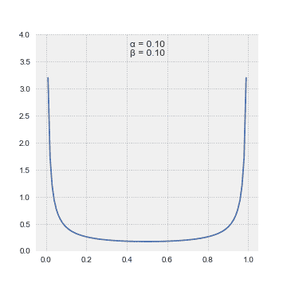

变形贝塔分布，[公共域](https://upload.wikimedia.org/wikipedia/commons/7/78/PDF_of_the_Beta_distribution.gif)。

贝叶斯“带着很大的疑问”提出均匀分布是先验概率分布，以表示对正确先验分布的无知。拉普拉斯没有这样的犹豫，并断言当我们觉得每种结果都有相同的可能性时，这就是要走的路。此外，拉普拉斯提供了一个继承规则，基本上是说我们 ***必须*** 使用分布的平均值来为下一个硬币落地头(或者下一次试验被认为是成功的)设定一个概率。

拉普拉斯的巨著《事件起因的概率回忆录》对他的影响如此之大，以至于大多数西方人不再关注概率论，认为在那里已经没有太多东西可以推进了。俄罗斯人没有得到那个备忘录，所以他们继续思考概率，产生了像马尔可夫过程这样的基本进展。

然而，就我们的目的而言，经典概率的下一次大飞跃是 E. T .杰恩斯的工作，随后是罗纳德. a .霍华德的工作。在我们去那里之前，你注意到一个重要的细节了吗？本部分第一个图表的 x 轴表示“长期人头比例”，而不是“人头概率”。这是一个重要的细节，因为不可能有一个概率的概率分布——那是不可解释的。这种想法从何而来？

像贝叶斯一样，杰恩斯的开创性工作在他有生之年从未发表过。他的学生拉里·布雷特索斯特在杰恩斯去世后出版了他的著作《概率论:科学的逻辑》。杰恩斯的课堂笔记对我的老师罗纳德·a·霍华德的工作产生了巨大的影响，他是决策分析的共同创始人。

杰恩斯介绍了推理机器人的概念，它将使用我们会同意的逻辑原理。他在上述书中写道:“为了将注意力引向建设性的事物，远离有争议的不相关事物，我们应该发明一个虚构的存在。它的大脑是由我们设计的，这样它就可以根据某些明确的规则进行推理。这些规则将从简单的欲望中推导出来，在我们看来，这是人类大脑所需要的；也就是说，我们认为，一个理性的人，在发现他们违反了这些欲望之一时，会希望修正他们的想法。”

“我们的机器人将对命题进行推理。如上所述，我们将用斜体大写字母{A、B、C 等}来表示各种命题。}，目前我们必须要求所使用的任何命题必须对机器人具有明确的意义，并且必须是简单、明确的逻辑类型，必须是真或假。”

杰恩斯的机器人是霍华德的“千里眼”的祖先，这是一种想象中的生物，它不理解模型，但可以回答关于未来的实际问题。言外之意:我们只能把概率放在清晰的区别上，而其中没有一丝不确定性。在一些早期的著作中，你会看到贝塔分布被公式化在“正面概率”上“正面概率”的概率分布无法以任何有意义的方式解释。因此，罗纳德·霍华德在他 1970 年的开创性论文《推理的视角》中提供的编辑是将这种区别重新定义为长期的分数(或成功)，这是一个千里眼可以回答的问题。

贝塔分布有一个非常有趣的性质。当我们发现更多的证据时，我们可以简单地更新α和β，因为它们对应于成功的次数和失败的次数，以便获得关于感兴趣的区别的更新的概率分布。下面是 alpha 和 beta 不同配置的简单示例(S =成功次数，N =投掷次数):

根据观察更新 Beta(1，1)先验，图片由作者创建。

我们可以用这个分布来做我们的推论。我准备了一个公共领域 Google sheet ( [美版](https://docs.google.com/spreadsheets/d/1i40QU5Yj6kApQZSyoHPtybgxz9NTL8XiXV-1plXOozA/edit?usp=sharing)、[印度英文版](https://docs.google.com/spreadsheets/d/1ly2_UGa-mrLq5XkGYujbLchIjvwHoCmyeoM-ZMbOfsU/edit?usp=sharing)、[印度卡纳达语版](https://docs.google.com/spreadsheets/d/1VeY6f1_Mxq_jE8YCooD1jDr5pTj3xEit1lXJnCz0FTk/edit?usp=sharing))，你复制后可以玩玩。我将用这张纸来解释其余的理论。

最后，决策分析推理需要的最后一个主要进步是霍华德的个人概率概念。他在 1966 年的经典论文[决策分析:应用决策理论](https://sdg.com/wp-content/uploads/2015/06/Decision-Analysis-Applied-Decision-Theory.pdf)中介绍了这一点。[2]虽然大多数人认为这篇论文是决策分析领域的开山之作，也是“决策分析”这个术语的第一次出现，但它对概率论的贡献并没有得到广泛的重视。在那之前，概率是一种学术追求，而不是用于专业决策。

这篇论文提出了一个关键的观点——概率的构造应该用来捕捉你对不确定性的“感觉”。在第 104 页，Howard 讨论了为什么人们以前没有听说过决策分析。其中之一是“概率是一种精神状态，而不是事物状态，这一概念直到现在才在思想世界中重获其应有的位置。”在论文中，霍华德花了很大的篇幅展示了构建良好先验的严谨性，他称之为“几乎是心理分析的先验测量过程”，当决策者说“是的，这是我真正相信的”时，它的有效性就成立了。在最近与他的一次谈话中，他更喜欢“个人概率/先验”这个术语，而不是“精神分析先验”，我也是这样。

# 用先验知识拟合贝塔分布

还记得我们从不符合项的分布(4%到 6%)开始的吗？作为读者的练习，请参考[贝塔分布](https://en.wikipedia.org/wiki/Beta_distribution)的均值和方差，并使用均值和方差推导出阿尔法和贝塔的公式。

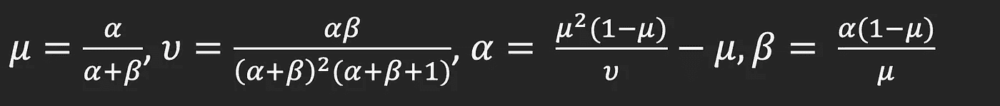

前两个来自维基百科，第三个和第四个来自基础代数，由作者创建的图像。

我们如何找到我们先前评估的均值和方差？我们评估了来自机械工程专家的以下百分位数/概率对(个人先验):

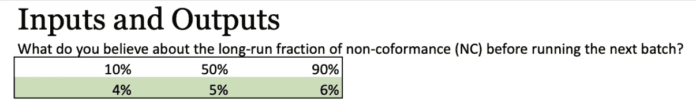

来自[电子表格](https://docs.google.com/spreadsheets/d/1ly2_UGa-mrLq5XkGYujbLchIjvwHoCmyeoM-ZMbOfsU/edit?usp=sharing)的快照，图片由作者创建。

上面的解释是，不符合率低于 4%的几率只有 10%，高于 6%的几率有 10%。高于或低于 5%的可能性各占一半。经验法则是将 25%/50%/25%分配给第 10/50/90 百分位。如果你想了解更多关于它背后的理论，请看[1][3][4]。这个快捷方式使我们可以很容易地计算平均值:

平均值= 25% x 4% + 50% x 5% + 25% x 6% = 5%

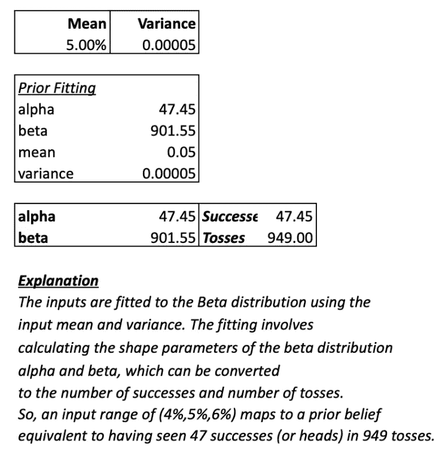

快照来自[电子表格](https://docs.google.com/spreadsheets/d/1ly2_UGa-mrLq5XkGYujbLchIjvwHoCmyeoM-ZMbOfsU/edit?usp=sharing)，图片由作者创作。

类似地，我们可以使用标准公式计算方差，得出以下 alpha 和 beta 形状参数。

正如您所看到的，工作表显示了相同数量的成功和失败。提供一个 4%-5%-6%的输入作为我们的先验信念，就等于说，“我们有一个信念强度，相当于在 949 次投掷中看到 47 次成功。”这个框架允许我们的专家反复检查 949 次投掷中的 47 次是否对他们有直观意义。

我们还可以将拟合的 beta 分布离散化，并与原始输入进行比较，如下所示。

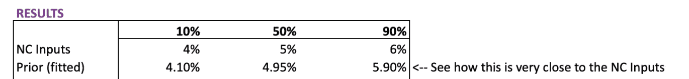

将拟合的分布与原始输入进行比较，快照来自[电子表格](https://docs.google.com/spreadsheets/d/1ly2_UGa-mrLq5XkGYujbLchIjvwHoCmyeoM-ZMbOfsU/edit?usp=sharing)，图片由作者创建。

# 用观察值更新

现在我们有了先验，我们可以很容易地用我们的观察来更新它。我们提出以下问题:

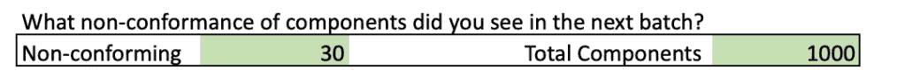

观察输入，来自[电子表格](https://docs.google.com/spreadsheets/d/1ly2_UGa-mrLq5XkGYujbLchIjvwHoCmyeoM-ZMbOfsU/edit?usp=sharing)的快照，由作者创建的图像。

新的 alpha(成功)和 beta(失败)参数分别是前一个 alpha 和新的成功以及前一个 beta 和新的失败的总和。这在下面的部分中单独显示:

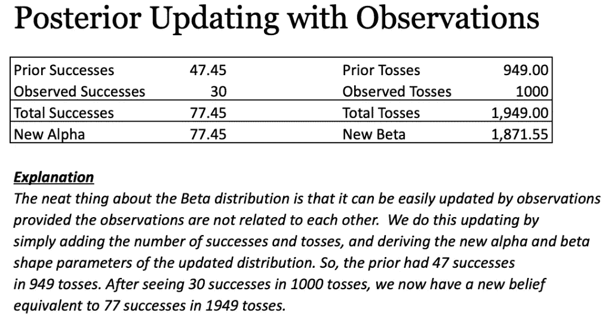

模型中显示 beta 版更新的部分，来自[电子表格](https://docs.google.com/spreadsheets/d/1ly2_UGa-mrLq5XkGYujbLchIjvwHoCmyeoM-ZMbOfsU/edit?usp=sharing)的快照，由作者创建的图像。

这现在可以用不同的方式来形象化。首先，我们可以看到离散化的后验分布，并将其与输入进行比较:

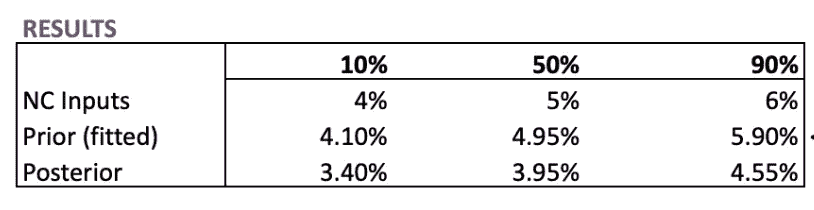

将后验与前验进行比较，快照来自[电子表格](https://docs.google.com/spreadsheets/d/1ly2_UGa-mrLq5XkGYujbLchIjvwHoCmyeoM-ZMbOfsU/edit?usp=sharing)，图片由作者创建。

我们看到后验分布左移。我们也可以在下面的图像中看到这一点:

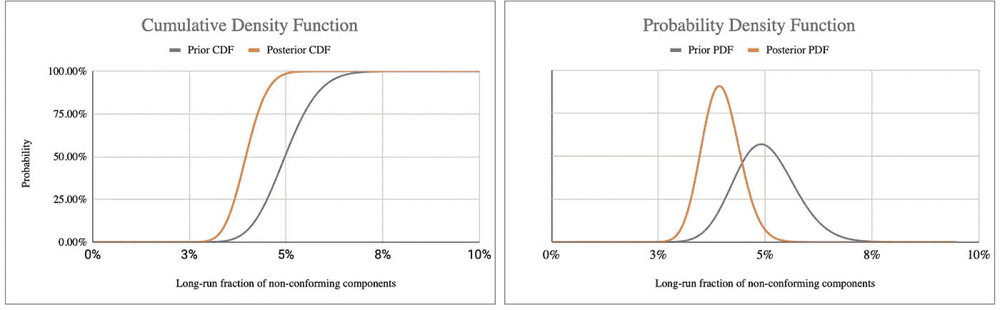

快照来自[电子表格](https://docs.google.com/spreadsheets/d/1ly2_UGa-mrLq5XkGYujbLchIjvwHoCmyeoM-ZMbOfsU/edit?usp=sharing)，图片由作者创作。

# 回答概率问题

首先，通过拉普拉斯继承规则，我们可以回答这个问题:下一个组件不符合的概率是多少？

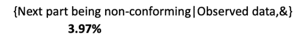

快照来自[电子表格](https://docs.google.com/spreadsheets/d/1ly2_UGa-mrLq5XkGYujbLchIjvwHoCmyeoM-ZMbOfsU/edit?usp=sharing)，图片由作者创作。

这是通过简单地将后验成功次数(后验α)除以后验试验次数(后验α+后验β)或后验分布的平均值得出的。

接下来，我们想知道低于目标不合格水平的概率。由于我们有了后验累积分布，我们可以很容易地阅读它来回答概率问题。让我们通过读取相对于目标水平的累积分布函数来实现。在下面的例子中，我们可以对先验和后验进行读出。

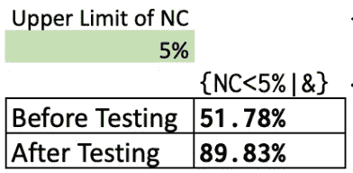

低于不合格目标的概率，测试当前批次之前和之后，来自[电子表格](https://docs.google.com/spreadsheets/d/1ly2_UGa-mrLq5XkGYujbLchIjvwHoCmyeoM-ZMbOfsU/edit?usp=sharing)的快照，由作者创建的图像。

如我们所见，我们的观察使我们对低于不合格水平更有信心。注意，这个推论就其本身而言是好的。这里可以提出的一个批评是，我们从表面上看所有的数据，而没有考虑这些数据可能出现的更广泛的背景(例如，一年中我们会看到多少批次？)使用这些信息会让我们引入一种后验标度能力(也称为数据标度能力)，这种能力会缓和我们从数据中得出的推论。

后验规模功效或数据规模功效可以被认为是以下问题的答案:“我需要在该测试/批次中看到多少次试验(成功)才能被认为是一次试验(成功)？”默认情况下，工作表已将数据比例设置为 1，这意味着所有数据都被视为真实值并得到充分利用。这样做的问题是，我们可以太快下定决心。数据标度幂为 10，这意味着我们将每 10 次试验视为 1 次试验，每 10 次成功视为 1 次成功，这将立即改变我们的结论。正如我们在下面看到的，指针几乎不会从先前的位置移动，因为我们现在将 1000 次试验中的 30 次成功视为 100 次试验中的 3 次成功(除以 10)。

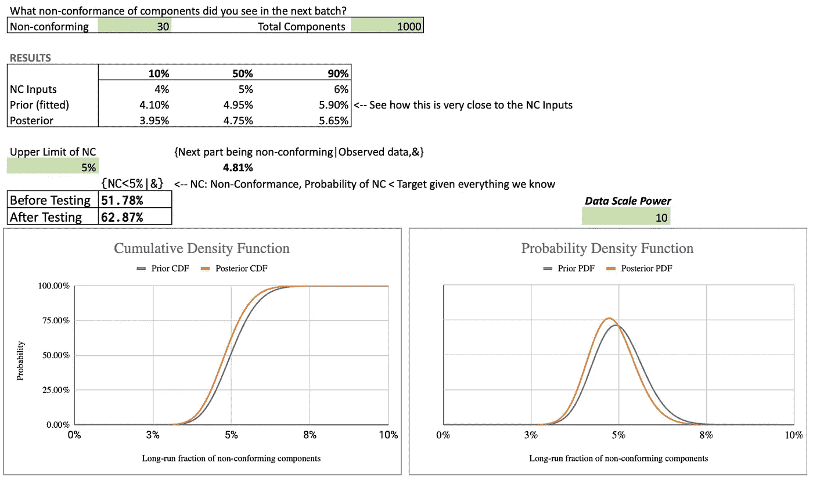

从分布中读取概率，从[电子表格](https://docs.google.com/spreadsheets/d/1ly2_UGa-mrLq5XkGYujbLchIjvwHoCmyeoM-ZMbOfsU/edit?usp=sharing)中获取快照，由作者创建图像。

看了上面，我们会很快意识到，为了获得更多的信心，我们需要运行更多的批次，这是应该的。假设我们运行了 5 批，每批 1000 个组件，在 1，000 次试验中，我们看到了 30 次成功的相同比例，只是在 1，000 次试验中，我们看到了 30 x 5 = 150 次成功。我们现在看到接近 90%的置信度，我们将低于 5%的目标不合格水平。

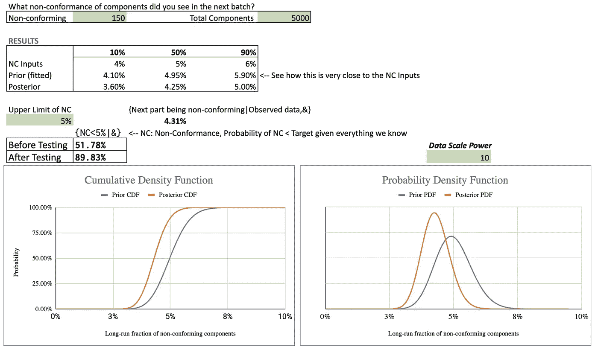

快照来自[电子表格](https://docs.google.com/spreadsheets/d/1ly2_UGa-mrLq5XkGYujbLchIjvwHoCmyeoM-ZMbOfsU/edit?usp=sharing)，图片由作者创作。

现在，一个关键问题是:什么是设定数据规模功效的原则性方法？假设我们希望预测每年都有效。我们可以使用的一个原则是用于推断的生产批次在一年中生产的总批次中所占的比例。假设我们的计划是制造 50 个批次，我们已经使用了 5 个批次进行推断。然后，我们可以将数据比例功效设置为 50/5 (=10)。另一种解释数据规模威力的方法是，我们必须将数据稀释 10 倍，以便对全年进行解释。

现在让我们转向关于运营经济学的最后一个预测问题。

# 经营经济学

在我们已经完成的预测工作的基础上建立一个经济模型是非常容易的。通过将每个组件的价格和成本、一年中要处理的批次数量以及每批中的组件数量作为输入，我们可以通过将制造的组件总数(例如 50，000)乘以我们在上一节中生成的 NC 后验分布中的每一项来获得不合格组件数量的分布。然后，我们可以通过将 NC 预测乘以每个组件的成本来直接计算损失分布。通过计算每个合规组件的净收入并减去不合规组件的损失，也可以很容易地计算出营业利润。

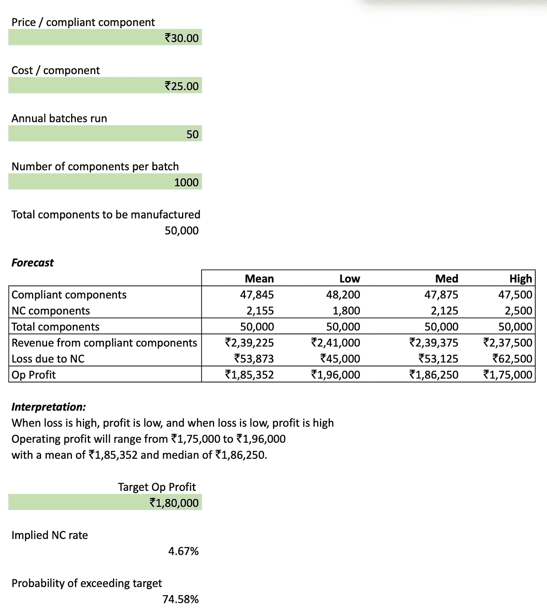

预测营业利润。还有:[美版](https://docs.google.com/spreadsheets/d/1i40QU5Yj6kApQZSyoHPtybgxz9NTL8XiXV-1plXOozA/edit?usp=sharing)和[卡纳达版](https://docs.google.com/spreadsheets/d/1VeY6f1_Mxq_jE8YCooD1jDr5pTj3xEit1lXJnCz0FTk/edit?usp=sharing)。快照来自[电子表格](https://docs.google.com/spreadsheets/d/1ly2_UGa-mrLq5XkGYujbLchIjvwHoCmyeoM-ZMbOfsU/edit?usp=sharing)，图片由作者创作。

此外，如上面的屏幕截图所示，我们可以计算超过目标运营利润的概率，这与低于该利润目标的隐含不符合率的概率相同，这是我们从上一节中的后验(不符合)累积密度函数中读取的。

# 其他想法

这是一个简单的模型，展示了我们如何开始在预测中使用概率。这种方法有局限性，其中一个重要的局限性是，我们考虑的是价格、成本、批量运行次数以及固定生产的组件数量。这些可能都是不确定的，当这种情况发生时，模型必须变得更加复杂。读者可以参考[龙卷风图工具](http://coda.io/@somik-raha/product-pricing-strategy)来制作更复杂的经济模型，处理多因素的不确定性。

此外，贝塔-二项式更新模型只有在我们假设零件制造过程稳定时才有效，这意味着没有漂移。统计过程控制领域[5]陷入了困境，这超出了本文的范围。

—

*感谢 Brad Powley 博士审阅本文，并感谢 Anmol Mandhania 提供的有益评论。错误是我的。*

# 参考

罗纳德·霍华德，《决策分析的基础》IEEE 系统科学与控制论汇刊 4，第 3 期(1968):211–219。

[2]霍华德，罗纳德 A. [*决策分析:应用决策理论*](https://sdg.com/wp-content/uploads/2015/06/Decision-Analysis-Applied-Decision-Theory.pdf) 。斯坦福研究所，1966 年。

[3]米勒三世、艾伦 c .和托马斯 r .赖斯。"概率分布的离散近似值."管理科学 29，第 3 期(1983):352–362。参见第 8 页。

[4]麦克纳米、彼得和约翰·农齐奥·塞罗纳。专业决策分析。SmartOrg 公司，2007 年。免费[在线 PDF](https://smartorg.com/wp-content/uploads/2021/01/Decision-Analysis-for-the-Professional.pdf) 本书。参见第 36 页“编码概率”一章。

[5]《走出危机》惠勒，D . J .和钱伯斯，D . S .(1992)理解统计过程控制