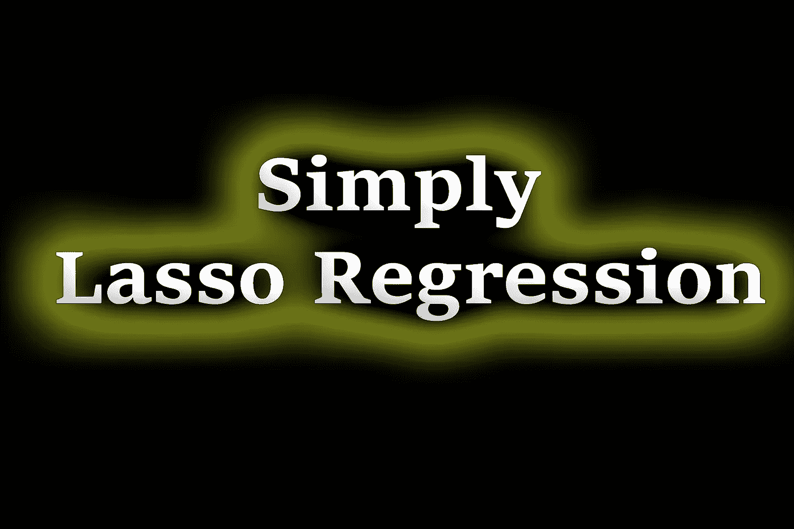
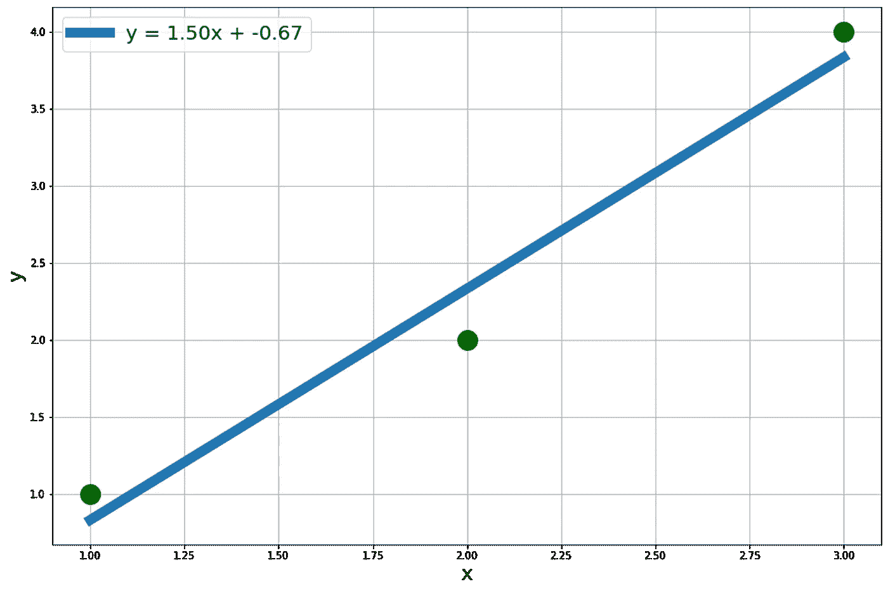
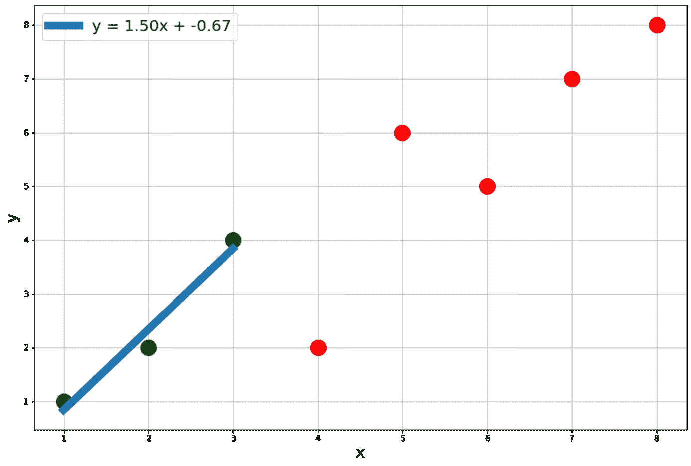
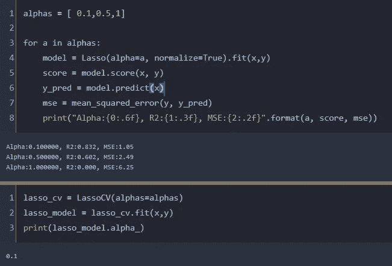

# 简单正则化套索回归

> 原文：<https://towardsdatascience.com/simple-regularized-lasso-regression-31ef20eb3c21>

## L1 正则化

作者图片

> **简介**

当我们从使用训练数据拟合的模型中观察到测试数据中的高方差时，我们知道需要在模型中引入一些偏差。否则，从长期来看，它将始终产生很高的方差，因此被认为是一个弱模型。实现这一点的几种方法之一是套索回归。套索回归与岭回归非常相似，但也有一个非常重要的区别。读者可以查看关于岭回归的文章，因为我将使用相同的例子来实现套索回归。

</simple-regularized-linear-and-polynomial-regression-37d0d634ece3>  

> **山脊 vs 拉索**

先说简单的线性回归。在这种情况下，我们尝试最小化残差的平方，从而得到一条生成最小误差平方和的线。线性拟合的示例如下所示。这是根据以下字典创建的合成数据集。

以下示例中的均方误差为 0.055，这是所有其他可能的线中最小的。

线性拟合的训练数据[图片由作者提供]

在岭回归中，我们以训练数据中的方差为代价引入了一个小的偏差，但它减少了测试数据中的长期方差，这是偏差-方差权衡的一个典型场景。岭回归的核心是最小化残差平方和以及λ乘以斜率的平方。然而，套索的目标是相同的，但程序是不同的。这里，要最小化的项是残差的平方和加上λ乘以斜率的绝对值。就是这样。这是核心区别。这些回归模型中要最小化的项总结如下。当然，lambda 项可以通过交叉验证来确定，并针对给定数据集取最佳值。

简单线性回归 vs 岭回归 vs 套索回归

> **套索在行动**

为了便于比较，让我们使用用于演示岭回归的同一个数据集。蓝点是训练数据，红点是测试数据。测试数据集也是从以下字典创建的合成数据集。

训练(蓝色)和测试(红色)数据[图片由作者提供]

在上面的例子中，当 lasso 回归被实施并且模型被拟合在训练数据上时，测试数据的均方误差是 5.41，这略小于岭的情况，在岭的情况下，我们获得的值是 6.88 的均方误差，并且也明显小于简单的线性回归结果，简单的线性回归结果以 8.41 的均方误差结束。同样，alpha 值越高，自变量对回归模型的影响越小。这基本上意味着当我们增加α值时，模型的系数接近零。对于非常高的α值，它将是完全水平的，对独立变量没有依赖性。因此，需要优化以通过交叉验证来确定 alpha 值。

套索回归的交叉验证

我们可以从很低到很高随机选择α的值。这里，我们扫描了特定数据集的 alpha 值，并确定了每种情况下的 MSE(均方误差)值。最小的 MSE 是α= 0.1，然后当使用 LassoCV 时获得相同的结果。

> **结论**

岭回归和套索回归都是非常有用的工具，可以有效地消除训练数据集的过度拟合。这两种方法都惩罚模型系数，并试图最小化误差平方和加上惩罚项。只有这个罚项在山脊法和套索法之间有所不同。随着我们对高维回归分析的深入研究，我们将会看到，当存在大量不必要的独立变量时，岭方法可以降低不必要变量的系数，而 lasso 可以有效地使它们为零，从而完全消除它们对结果的影响。

<https://mdsohel-mahmood.medium.com/membership> 