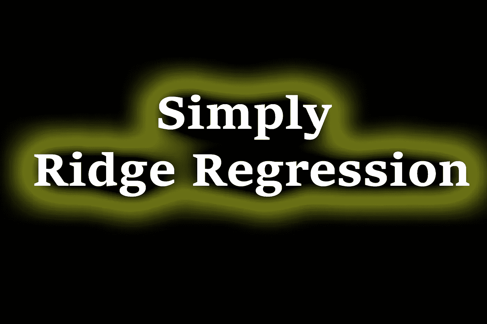
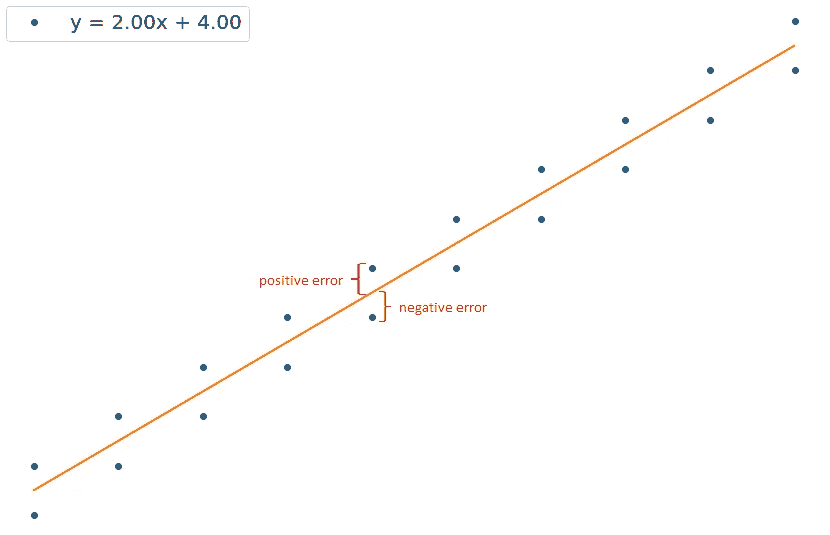
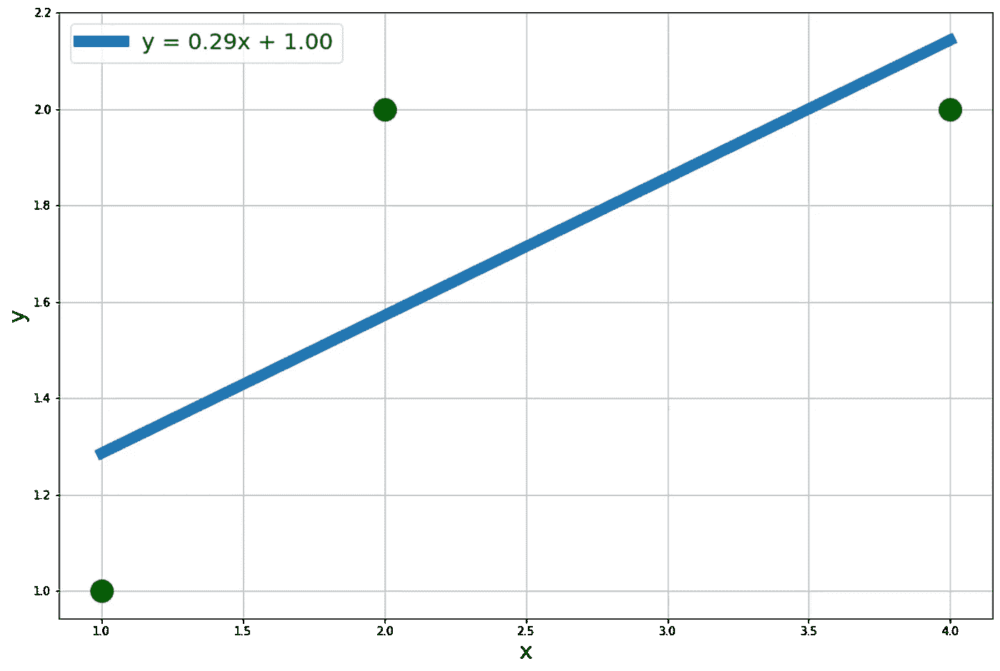
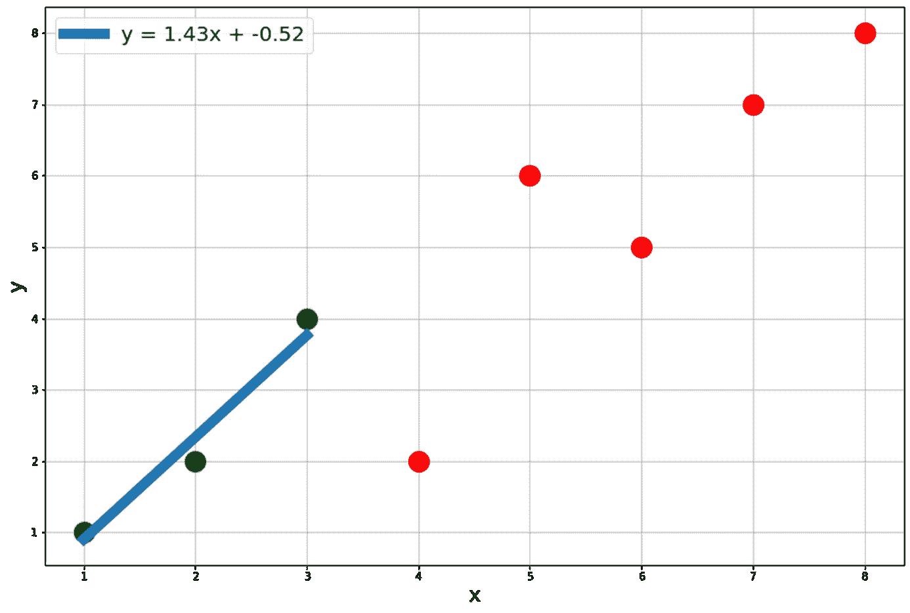
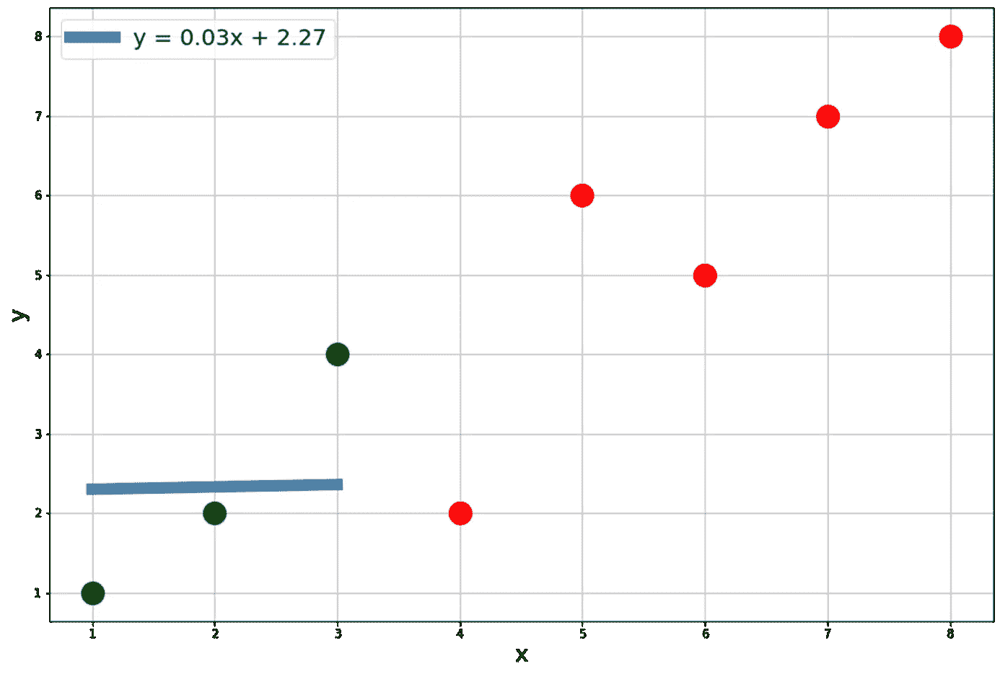
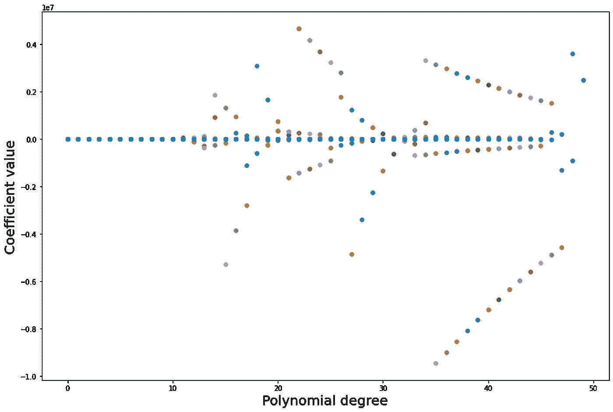
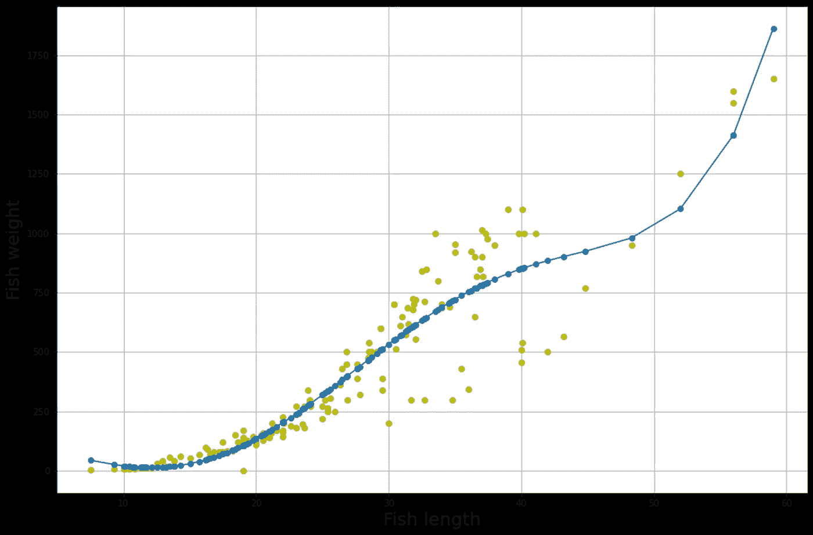
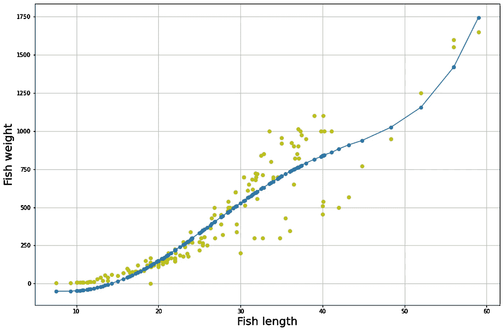
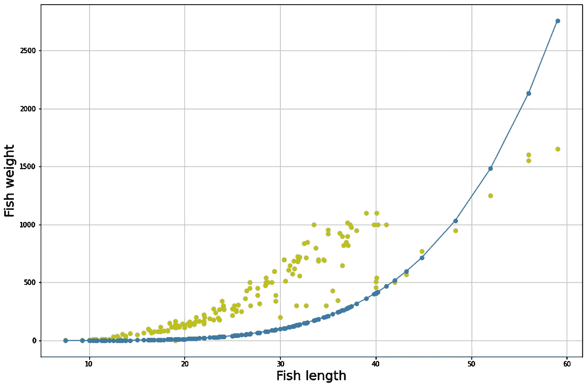

# 简单正则化线性和多项式回归

> 原文：<https://towardsdatascience.com/simple-regularized-linear-and-polynomial-regression-37d0d634ece3>

## L2 正则化

作者图片

> **简介**

显然，线性和多项式回归在数据分析领域被广泛用于医药、金融以及工程等部门的未来趋势预测。不存在完美的回归，但我们可以通过调整多项式的次数等参数使其接近完美。对于线性回归，我们不能增加次数，但我们可以根据现有的训练数据进行最佳拟合。然而，问题是这种调整对测试数据会有什么影响。模型会像训练数据一样完美还是会有更多的变化？如果我们能在模型中引入一个偏差呢？这就是我们要讨论的。

> **线性回归**

执行线性回归时，最佳拟合线往往会使平方误差最小化。误差可以是正的，也可以是负的，这取决于数据点在哪一边。因此，平方项被认为具有平方误差，并且拟合线是对应于最小误差量的线。

回归中的正负误差[图片由作者提供]

用多项式拟合数据时也会发生同样的情况。最小二乘误差线/曲线可以通过 R 平方值来解释，R 平方值基本上告诉我们独立变量可以描述多少变化。

通常，在 ML 应用程序中，我们有训练和测试数据集，我们使用训练数据集拟合数据，并对剩余数据进行测试，以了解模型的有效性。为此，整个数据集通常分为两组:训练数据集和测试数据集。我们需要找到最符合训练数据的直线/曲线。为了实现这一点，我们可能会过度拟合数据，模型在训练数据上变得非常有经验，最终，它在任何测试数据或任何尚未看到的数据上都表现不佳。

这是偏差-方差权衡现象的本质。当我们在开发的模型中有较低的偏差时，在部署模型时，测试数据中会有较高的方差。通过引入偏差，我们最终可以最小化方差。

> **偏差-方差权衡解释简单**

假设我们有以下训练数据，这些数据符合线性模型。该数据集的均方误差为 0.095，很小。

线性拟合的训练数据[图片由作者提供]

还假设红点是测试数据集。很明显，当我们扩展线性拟合时，会有持续的误差。换句话说，会有很高的方差。该数据集的均方误差为 8.41，与来自训练数据集的剩余均方误差相比更高。

训练(蓝色)和测试(红色)数据[图片由作者提供]

让我们给这个模型加上一个偏差。岭回归根据 alpha 值给模型引入了偏差。阿尔法值可以通过脊交叉验证来确定，脊交叉验证使选择最佳阿尔法值的过程自动化。因此，Alpha 是向模型引入惩罚的度量。alpha 值越高，模型对模型系数的惩罚越大。这是因为它想减少自变量对因变量的影响。如果 alpha 值太高，它会使线性拟合成为一条完全平坦的线，从而使系数实际上为 0，并消除自变量的影响。

让我们对 alpha = 0.1 的同一数据集应用岭回归来可视化影响。

alpha = 0.1 的岭回归[图片由作者提供]

正如所料，系数的值已经减少，我们可以看到惩罚的效果。该数据集的均方误差为 6.88，与来自没有惩罚的模型的剩余均方误差相比较小。因此，通过在模型中引入偏差，我们减少了测试数据的剩余误差，也实现了更低的方差。当我们有高 alpha 值时，模型变成一条扁平的线，如下所示。

alpha = 100 的岭回归[图片由作者提供]

> **外卖**

1.  Alpha 值是惩罚的度量。可以使用交叉验证进行优化。
2.  alpha 值越高，模型系数的值越小。因此，它通过引入偏差减少了自变量的影响。
3.  在模型中引入偏差实质上减少了测试数据中的方差。

> **多项式回归**

岭回归也可以应用于多项式模型。多项式回归也有同样的发现。让我们在 GPL 2.0 许可下处理[“鱼”数据集](https://www.kaggle.com/aungpyaeap/fish-market)。有 5 个独立变量和一个响应变量。当我们增加多项式的次数以找到数据集上的最佳拟合时，它增加了一些系数的值，这使得它比其他自变量更占优势。从下图(使用重量与长度数据)可以明显看出，x 轴代表多项式次数，y 轴代表系数值。它实际上意味着什么？高系数值意味着我们更加强调某个特征，使其成为响应变量的一个非常好的预测器，同时抑制其他特征。这导致对训练数据的过度拟合，这是不希望的。

多项式高次的高系数值[图片由作者提供]

我们可以利用核脊来惩罚模型系数。但是我们先用一个次数=5 的多项式来拟合数据。

用次数= 5 的多项式拟合的鱼体重与长度数据[图片由作者提供]

具有小α值的核脊模型产生类似的拟合曲线。

应用 alpha = 0.5 的核脊后，用次数= 5 的多项式拟合的鱼体重与长度数据[图片由作者提供]

当αin 增加时，模型的复杂性降低。从下图可以明显看出，α= 5e 15。

应用 alpha = 5e15 的核脊后，用次数= 5 的多项式拟合的鱼体重与长度数据[图片由作者提供]

> **外卖**

1.  Scikit-learn 的核岭用于多项式岭回归。
2.  较小的 alpha 值模拟具有常规多项式拟合的相同模型。
3.  较高的 alpha 值降低了模型的复杂性。

> **结论**

岭回归(L2 正则化)只是一种减少模型过度拟合对训练数据集的影响的方法。它可以在线性和非线性模型上工作来惩罚系数。需要交叉验证步骤来确定α的最佳值，α的最佳值定义了惩罚系数的水平，因此，当应用于测试数据集时，使模型的方差减小。简而言之，通过引入一个小的偏差(取决于 alpha 水平)，我们可以调整模型在测试数据集上的方差，以实现增强的性能。