# 用熊猫操纵日期时间变量的简单方法

> 原文：<https://towardsdatascience.com/simple-ways-to-manipulate-datetime-variables-with-pandas-cfe9e8d36d24>


[Icons8 团队](https://unsplash.com/@icons8?utm_source=medium&utm_medium=referral)在 [Unsplash](https://unsplash.com?utm_source=medium&utm_medium=referral) 上的照片

## 熊猫的提示和技巧

# 用熊猫操纵日期时间变量的简单方法

## 在 Python 中使用时间相关变量的基础知识

当分析数据、特征工程和数据争论时，能够容易地操纵日期时间变量是很方便的。在本帖中，我们将看看在 pandas 中操作日期时间变量的一些简单而有用的方法。


照片由[埃琳娜·科伊切娃](https://unsplash.com/@lenneek?utm_source=medium&utm_medium=referral)在 [Unsplash](https://unsplash.com?utm_source=medium&utm_medium=referral) 上拍摄

# 📦 0.准备数据

让我们导入熊猫并准备要使用的样本数据:

```
import pandas as pd
df = pd.DataFrame({'flight_start': ['2019-02-04 13:15:00', 
                                       '2020-01-01 21:30:00', 
                                       '2021-10-28 02:00:00'],
                   'flight_length': [7, 21.5, 30],
                   'return_start': ['01/03/2019 10:00:00', 
                                   '11/01/2020 20:50:00', 
                                   '05/11/2021 08:20:00']})
df
```

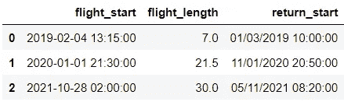

以下是列的数据类型:

```
df.dtypes
```

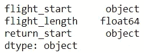

将这些数据类型转换成更合适的数据类型将使操作变得更加容易。在下一节中，我们将学习将这些列转换为适当的与日期时间相关的数据类型。

# 📍 1.转换为 datetime 或 timedelta 数据类型

我们将用`[pd.to_datetime()](https://pandas.pydata.org/docs/reference/api/pandas.to_datetime.html)`将`flight_start`和`return_start`转换为*日期时间*，用`[pd.to_timedelta()](https://pandas.pydata.org/docs/reference/api/pandas.to_timedelta.html?highlight=pandas%20to_timedelta#pandas.to_timedelta)`将`flight_length`转换为*时间增量*。

```
df['flight_start'] = pd.to_datetime(df['flight_start'])
df['flight_length'] = pd.to_timedelta(df['flight_length'], 'h')
df['return_start'] = pd.to_datetime(df['return_start'], 
                                    format='%d/%m/%Y %H:%M:%S')
df
```

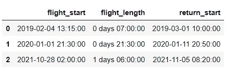

在这个代码片段中需要注意一些事情:在第 2 行中，我们使用代码`'h'`将 timedelta 单位指定为小时。其他代码及其含义记录在[日期时间单位文档](https://numpy.org/doc/stable/reference/arrays.datetime.html#datetime-units)中。在第 4 行，我们使用`format`参数指定了日期时间格式。如果我们不指定它，熊猫会聪明地在这个例子中正确地转换它。我们使用`format`参数的原因是为了熟悉它，以便我们知道如果将来需要它，如何指定格式。如果您有兴趣了解更多关于这些格式的信息，strftime 的这份备忘单很好地总结了每个代码的含义。现在，让我们再次检查数据类型:

```
df.dtypes
```

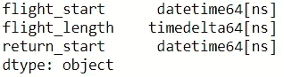

太棒了，数据已经可以操作了！

在我们继续之前，我想展示一个在转换脏数据时有用的技巧。有时，我们可能会处理像这样的坏数据:`202Y-01–01 21:30:00`包含字符串或其他无效的日期时间。尝试像下面这样转换它会触发一个错误:

```
pd.to_datetime(pd.Series(['2019-02-04 13:15:00', 
                          '202Y-01-01 21:30:00']))
```

在这种情况下，我们可以在函数中指定`errors='coerce'`来只转换有效案例，并将无效案例替换为 missing:

```
pd.to_datetime(pd.Series(['2019-02-04 13:15:00', 
                          '202Y-01-01 21:30:00']), errors='coerce')
```

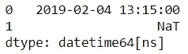

同样，在将脏数据转换为 timedelta 时，我们会得到一个错误:

```
pd.to_timedelta(pd.Series([7, 'T']), unit=’H’)
```

我们也可以使用`errors='coerce'`:

```
pd.to_timedelta(pd.Series([7, 'T']), unit='H', errors='coerce')
```

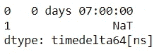

如果您对处理无效数据的其他方法感兴趣，而不是用丢失的数据替换它们，请查看本文档。

# 📍 2.提取日期时间部分

通过`.dt`访问器，用 pandas datetime 提取 datetime 部分很容易。例如，下面是我们如何使用访问器提取日期:

```
df['flight_start'].dt.date
```

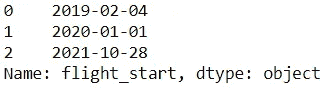

下面是常用属性的总结，示例基于第一个`flight_start`:

完整列表，请查看[这份熊猫文档](https://pandas.pydata.org/docs/reference/arrays.html#datetime-data)。

# 📍 3.查找日期时间差异

让我们看看`return_start`已经过去多长时间了。在熊猫中，我们可以用`pd.Timestamp.now()`得到当前的当地时间:

```
pd.Timestamp.now() - df['return_start']
```

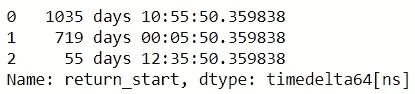

产生的新系列已经在`timedelta`数据类型中。由于[广播](https://stackoverflow.com/a/29955358/9724079)，我们能够在不同长度的两个对象(一个标量和一个数组)之间进行这个操作。现在，让我们计算两个航班开始日期时间之间的持续时间，并将其保存为`duration`:

```
df['duration'] = df['return_start'] - df['flight_start']
df
```

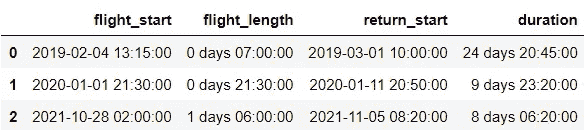

像以前一样，我们可以使用`.dt`访问器提取 timedelta 部分。我们可以提取如下日期:

```
df['duration'].dt.days
```


下面是常用属性的总结:

如果我们想得到更精确的持续时间，我们可以如下计算:

```
df['duration'].dt.days + df['duration'].dt.seconds/(24*60*60)
```

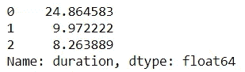

这里有另一种方法来计算两个日期时间之间的差异:

```
df['return_start'].dt.dayofyear - df['flight_start'].dt.dayofyear
```

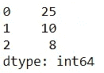

另一个:

```
df['return_start'].dt.date - df['flight_start'].dt.date
```

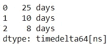

从这些不同的方法中，我们得到了略有不同的答案。正确的方法取决于计算的应用和目的。

# 📍 4.从 datetime 和 timedeltas 派生 datetime

最后，让我们看看如何使用 datetime 和 timedelta 变量计算 datetime:

```
df['flight_end'] = df['flight_start'] + df['flight_length']
df[['flight_start', 'flight_length', 'flight_end']]
```

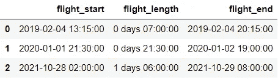

Datetimes 和 timedeltas 完美地结合在一起，使它们更容易操作。

这就把它带到了这篇帖子的结尾！虽然我们只是触及了 pandas 功能的皮毛，但希望这些基本的数据时间操作技巧将在您的下一个涉及数据时间的数据操作任务中有用。⌚️:如果你想了解更多，这和[这](https://pandas.pydata.org/pandas-docs/stable/user_guide/timedeltas.html)是熊猫提供的额外学习资源。


[Malvestida 杂志](https://unsplash.com/@malvestida?utm_source=medium&utm_medium=referral)在 [Unsplash](https://unsplash.com?utm_source=medium&utm_medium=referral) 上拍摄的照片

*您想访问更多这样的内容吗？媒体会员可以无限制地访问媒体上的任何文章。如果你使用* [*我的推荐链接*](https://zluvsand.medium.com/membership)*成为会员，你的一部分会费会直接去支持我。*

感谢您阅读这篇文章。如果你感兴趣，这里有我其他一些关于熊猫的帖子的链接:

◼️️ [在 pandas 中编写 5 个常用 SQL 查询](/writing-5-common-sql-queries-in-pandas-90b52f17ad76?source=your_stories_page-------------------------------------)
◼️️ [在 pandas 中编写高级 SQL 查询](/writing-advanced-sql-queries-in-pandas-1dc494a17afe?source=your_stories_page-------------------------------------)
◼️️ [给 pandas 用户的 5 个提示](/5-tips-for-pandas-users-e73681d16d17?source=your_stories_page-------------------------------------)
◼️️ [在 pandas 中进行数据聚合的 5 个提示](/5-tips-for-data-aggregation-in-pandas-7eaa8476dc75?source=your_stories_page-------------------------------------)
◼️️ [如何在 pandas DataFrame 中转换变量](/transforming-variables-in-a-pandas-dataframe-bce2c6ef91a1?source=your_stories_page-------------------------------------)
◼️️ [3 种重塑 pandas DataFrame 的简单方法](https://medium.com/p/5b2cbe73d60e/edit)
◼️️ [3 种简单方法](/3-easy-ways-to-crosstab-in-pandas-4123383bfbf2)

再见🏃 💨