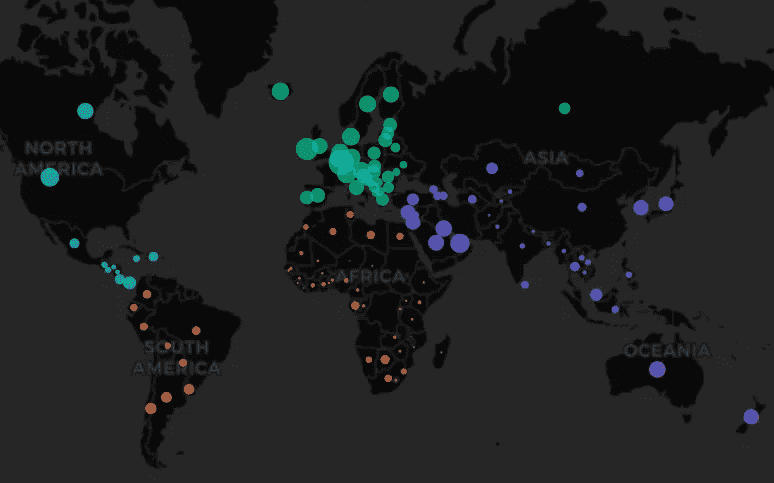
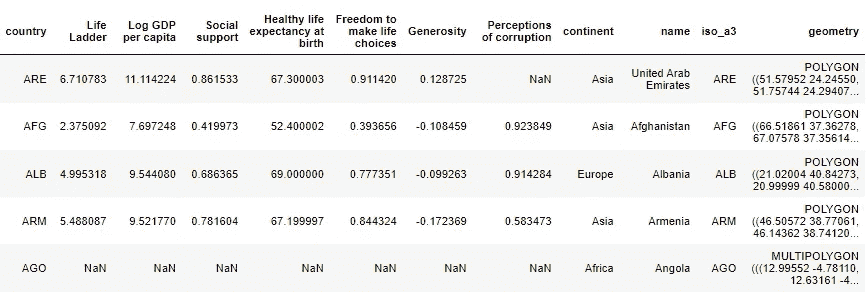
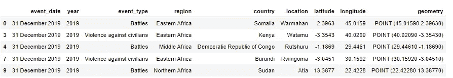
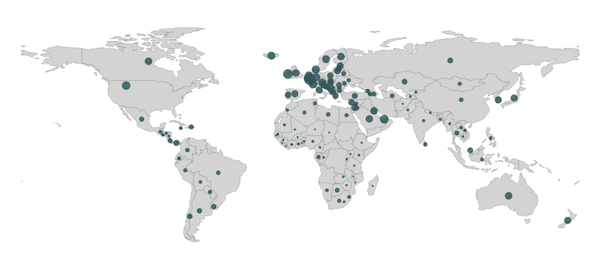
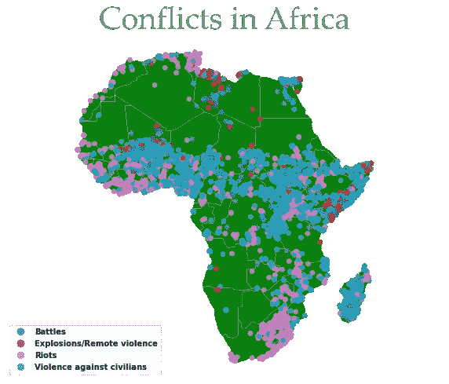
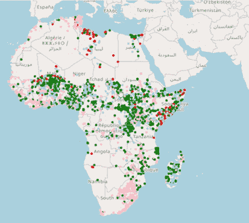
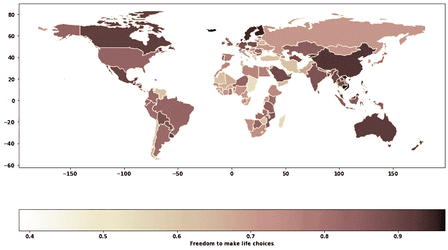

# 使用快乐和冲突数据的简单而惊人且有意义的地理空间可视化

> 原文：<https://towardsdatascience.com/simple-yet-stunning-and-meaningful-geospatial-visualization-using-happiness-and-confict-data-e9fbf690675c>

## 用 Geopandas，Plotly Express，和 leav

在这一块，我们将涵盖如何创造惊人的(我认为😊)使用 Geopandas 和其他交互式库(如 Folium 和 Plotly Express)在 Python 中进行静态和交互式地理空间数据可视化。



作者图片

# **数据介绍**

本文使用世界幸福和非洲冲突数据进行可视化，这些数据来自两个主要来源。世界幸福数据取自《世界幸福报告(WHR)》，从 1970 年到 2020 年，这是一个开放的数据，可以从[世界幸福报告](https://worldhappiness.report/ed/2020/)【1】中获取。这是一项具有里程碑意义的全球幸福状况调查，根据 156 个国家(2020 年世界幸福指数中的国家数量)的公民对自己的幸福程度进行排名。WHR 不仅根据福利，还根据公民的主观幸福感对各国进行排名，并更深入地探究社会、政府因素如何影响我们的幸福。



WHR 数据集中的一些属性(2019 年)。来源:[世界幸福报告](https://worldhappiness.report/ed/2020/)

非洲冲突数据集取自武装冲突地点和事件数据项目，该项目公开发布，可通过[数据导出工具 ACLED](https://acleddata.com/data-export-tool/)【2】访问。ACLED 包含关于世界各地政治暴力、冲突和无序模式的高质量和最广泛使用的实时数据源。



非洲冲突数据集中的一些属性(2019 年)。来源:[武装冲突地点&事件数据项目](https://acleddata.com/data-export-tool/)

本文的重点是地理空间可视化。在以后的文章中，我将讲述如何处理和准备可视化数据。

得到💬任何数据科学或编程问题的 GPT 式答案。为成千上万的人生成摘要和学习笔记📚只需一次点击即可获得学习资源。👉

<https://aigents.co/learn>  

# **地理空间数据可视化**

在本节中，我将分享一些最流行的可视化地理空间数据的方法，如使用气泡图、多层地图、Choropleth 地图和标志性的 GapMinder 动画。让我们首先导入一些我们需要的库。如果你还没有，请安装它们。

```
import pandas as pd
import numpy as np
import plotly.express as px
import geopandas as gpd
from geopandas import GeoDataFrame
from shapely.geometry import Point
from matplotlib import pyplot as plt
import folium
```

# 1.气泡图

气泡图使用圆形大小作为编码变量。圆圈的大小表示特定地理坐标的特征的数值。让我们学习如何使用 Geopandas 和 Plotly 创建静态和交互式气泡图。

## 地质公园

我们可以很容易地用 Geopandas 创建一个静态气泡图。首先，我们使用的数据集 WHR 包含多边形几何。为了创建气泡图，我们需要创建点几何体。我们可以使用`GeoSeries`的属性`centroid`来生成代表每个多边形几何形状的质心的几何点。

```
gdf_worldhappiness_point = gdf_worldhappiness.copy()
gdf_worldhappiness_point['geometry']= gdf_worldhappiness_point['geometry'].centroid
gdf_worldhappiness_2019 = gdf_worldhappiness[gdf_worldhappiness['year']==2019]
gdf_worldhappiness_point_2019 = gdf_worldhappiness_point[gdf_worldhappiness_point['year']==2019]
fig, ax = plt.subplots(figsize=(16,16))
marker = gdf_worldhappiness_point_2019['GDP per Capita']/500
gdf_worldhappiness_2019.plot(ax=ax, color="lightgray",edgecolor="grey",
 linewidth=0.4)
gdf_worldhappiness_point_2019.plot(ax=ax,color="#07424A", 
markersize=marker,alpha=0.7, categorical=False, 
legend=True plt.axis('equal')
plt.show()
```

下面的地图显示了 2019 年 WHR 所有国家的人均 GPD 泡沫图(请注意，有些国家的数据缺失)。圆圈的大小代表每个国家的人均 GDP 该国的地理坐标。可以看出，非洲国家似乎是世界上人均国内生产总值最低的一些国家，据报告，布隆迪的人均国内生产总值是有史以来最低的，紧随其后的是南苏丹和索马里。一个简单但有见地的可视化，不是吗？



人均国内生产总值(WHR 2019)。作者可视化。

## Plotly 散点图 _ 框

上面的气泡贴图完成了它的工作，但是它是一个静态贴图。为了创建令人惊叹的交互式地图，允许用户与感兴趣的区域进行交互和放大，我们可以构建一个交互式气泡地图。

有不同的 Python 库用于绘制交互式地图。一个有用的库来构造它是 Plotly Express。几年前，以 R 和 Python 的交互式可视化而闻名的 Plotly 提出了一个名为 Plotly Express 的新库，它具有一个 scatter_mapbox()函数，可以使用地理数据框和用于气泡大小的列/属性来创建交互式气泡图。

```
fig = px.scatter_mapbox
(gdf_worldhappiness_point_2019.dropna(subset = 'GDP per Capita'), 
lat="latitude",lon="longitude",color = 'continent', 
size= 'GDP per Capita', 
color_continuous_scale=px.colors.cyclical.IceFire,size_max=15,
hover_name = 'name',mapbox_style="carto-darkmatter", zoom=1)

fig.show()
```

以下交互式图形提供了与静态气泡图相同的洞察力，但用户现在可以将鼠标悬停在几何点位置上并与地图进行交互。所以，我们做得更好，不是吗？

人均 GDP(WHR 2019)，Plotly Scatter_Mapbox。作者可视化

# 2.多层地图

我们有时需要将多个数据集相互叠加在一起。让我们看看如何用 Geopandas 和 Let 来实现这一点。

## ***地质公园***

有几种方法可以叠加图。制作多图层地图的一种方法是使用 Geopandas。绘图功能。这可以在同一组轴上绘制多个数据集。通过添加额外的 plot 命令并将轴传递给 ax 关键字，可以将每个数据集添加到前一个数据集的顶部。在下面的代码中，我有两个数据集:“非洲”和“acled”。“Acled”绘制在数据集“非洲”的顶部。

```
fig, ax = plt.subplots(1,1,  figsize=(12,10))
Africa.plot(ax=ax, linewidth=0.5,edgecolor = 'white',facecolor = 'Green', 
alpha=0.5);
acled.plot(ax= ax,column = 'event_type',alpha=0.7,legend = 'event_type');
plt.title('Conflicts in Africa', fontsize=40, 
fontname="Palatino Linotype", color="grey")
ax.axis("off")
plt.axis('equal')
plt.show() 
```

剧情显示西非是一个充满战斗、暴乱和暴力等冲突的次区域，这非常有意义，因为那里的大多数国家都经历过内战，如塞拉利昂、利比里亚、几内亚比绍和科特迪瓦。此外，所有类型的冲突似乎也存在于东非的一些地区。令我惊讶的是，马达加斯加似乎正在发生一些战斗和暴力事件。在使用这个数据集之前，我对此一无所知，所以我学到了一些新东西。



非洲的冲突(ACLED 2019)。作者的视觉化

## 薄层

为了允许用户与冲突地图中感兴趣的不同区域进行交互和放大，我们可以使用 allow，这是一个功能强大的 Python 库，可以创建多种类型的传单地图。首先，我们通过简单地调用 follow 来创建一个底图。地图()。然后，我们可以使用 CircleMarker 在基本地图的顶部添加标记，circle marker 是一个在基本地图上绘制圆形覆盖图的类，用于使用坐标信息精确定位位置。

```
fm = folium.Map()
geo_Africa_list = [[point.xy[1][0], point.xy[0][0]] for point in acled.geometry ]
def color_producer(event_type):
    if event_type == 'Battles':
        return 'lightblue'
    elif event_type == 'Violence against civilians':
        return 'green'
    elif event_type == 'Riots':
        return 'pink'
    else:
        return 'red'
for i, coordinates in enumerate(geo_Africa_list):
    color = color_producer(acled.event_type.iloc[i])
    folium.CircleMarker(location = coordinates, color = color, radius = 0.5
        ,popup =  f"{acled.event_type.iloc[i]}"
                       ).add_to(fm)
fm
```



非洲的冲突(ACLED 2019)。交互式树叶地图。作者可视化

# 3.等值区域图

Choropleth 地图可能是最常用的地理空间可视化。choropleth 地图是一种专题地图，它使用颜色强度来对应空间单元内的地理特征摘要，例如人口密度或人均 GDP。同样，Geopandas.plot 函数或 leav。Choropleth()可用于创建 Choropleth 映射。

```
gdf_worldhappiness_2019.plot(column = "Freedom to make life choices",
figsize=(15,10),legend=True, edgecolor="white", 
cmap = 'pink_r',
legend_kwds={"label":"Freedom to make life choices",
 "orientation":"horizontal"})
```

我美丽的祖国越南在选择生活的自由方面获得了很高的分数。多么令人惊喜啊！我从发展研究课上学到了一个很好的概念化发展的方法。它说，“发展应被视为人们有自由过他们有理由珍视的生活”。这是回答这个问题的全国平均分:“你对自己选择生活的自由满意还是不满意？”



自由穹顶做出人生选择(WHR 2019)。作者可视化

# 4.用 PlotlyExpress 重新制作 Gapminder 动画

当汉斯·罗斯林在他著名的增强现实动画作品和 [Ted 演讲](https://www.youtube.com/watch?v=hVimVzgtD6w)中展示这个令人惊叹的动画时，Gapminder 动画已经成为数据可视化的标志性时刻之一。在本节中，我们将学习如何使用 Plotlyexpress 通过以下代码重新创建一个类似的图标 Gapminder 动画:

```
fig = px.scatter(
    gdf_worldhappiness_point.dropna(subset = 'GDP per Capita'),   
    color = 'Region Name',
    size= 'GDP per Capita', 
    color_continuous_scale=px.colors.cyclical.IceFire, 
    animation_frame= "year",
    animation_group="country",
    hover_name = 'name',
    size_max=35, 
    x="GDP per Capita", y="Healthy life expectancy at birth",
    color_discrete_map={"Europe": 'rgba(260,0,0,0.4)'},
    log_x = True
)
fig.show()
```

这很容易实现。普洛特利。express 模块(通常作为 px 导入)具有从地理数据框架获取数据的函数`px.scatter()`。然后你需要定义`x`和`y`轴以及每年递增的`animation_frame, animation_group`。随着更多关于外观改进的争论，动画泡泡图来了！你现在可以与这张地图互动，看看各国的收入和预期寿命在过去 15 年里发生了怎样的变化。

作者可视化

嘣，你有它！三种出色的绘制地理空间数据的方式:GeoPandas、Plotly 和 Folium。请在评论中告诉我你的想法:)

*感谢您的阅读。如果你觉得我的帖子有用，并且正在考虑成为中级会员，你可以考虑通过这个* [*推荐会员链接*](https://medium.com/@huonglanchu0712/membership) *:)来支持我，我将收取你的一部分会员费，不需要你额外付费。如果你决定这样做，非常感谢！*

## 参考

[1]公开数据:世界幸福报告[首页|世界幸福报告](https://worldhappiness.report/)。Helliwell，John F .，Richard Layard，Jeffrey Sachs 和 Jan-Emmanuel 德·内维编辑。2020.2020 年世界幸福报告。纽约:可持续发展解决方案网络

[2]开放数据:武装冲突地点和事件数据项目[ACLED(acleddata.com)](https://acleddata.com/#/dashboard)。罗利、克里纳德、安德鲁·克林、哈瓦德·黑格雷和约阿金·卡尔森。(2010)."介绍武装冲突地点和事件数据."和平研究杂志 47(5) 651- 660。

[剧情文档](https://plotly.com/python/plotly-express/)