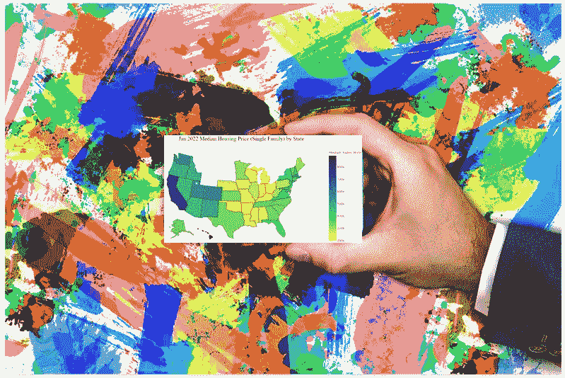
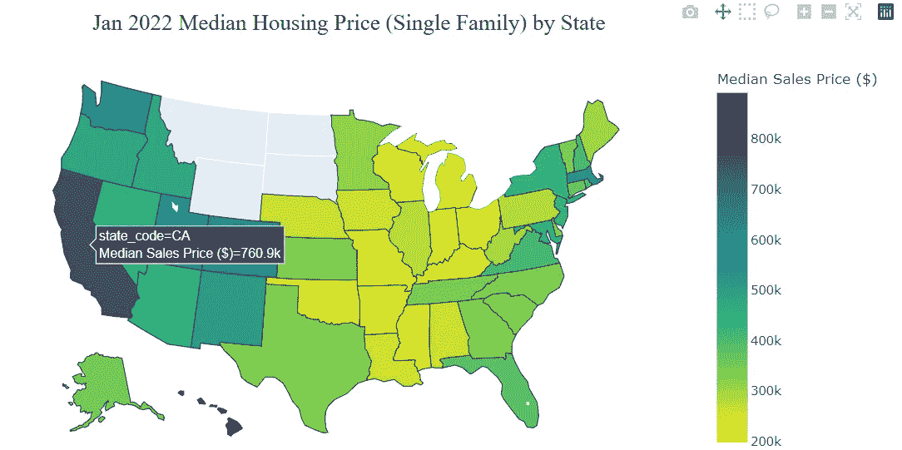
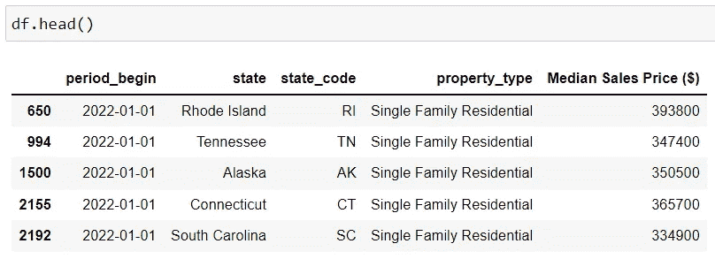
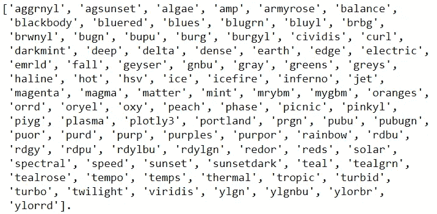
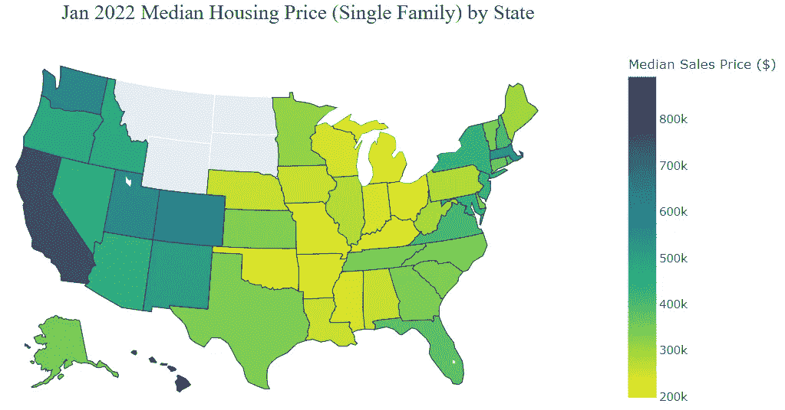
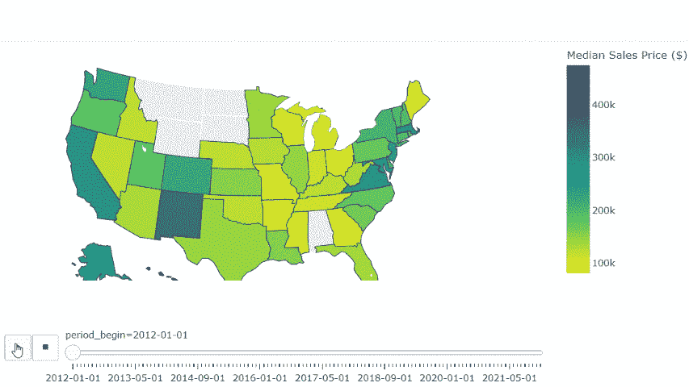

# 用 Python 创建美国各州 Choropleth 地图的最简单方法

> 原文：<https://towardsdatascience.com/simplest-way-of-creating-a-choropleth-map-by-u-s-states-in-python-f359ada7735e>

## 使用此代码模板在两分钟内创建一个美国 Choropleth 地图，无需 GeoJSON



图片由 [Pixabay](https://pixabay.com/photos/business-card-mockup-to-dye-hand-3847385/) 提供(作者修改)

Choropleth 地图是最流行的地理空间数据可视化之一。它是一种专题地图，在地图上的预定义区域使用不同的阴影来表示与度量相关的地理特征。它可以被标绘在任何地图上，也可以被标绘在不同的地理区域，如国家、州、县、邮政编码等。

follous 通常是我创建 choropleth 地图的首选包，尤其是那些可能需要对风格和设计进行大量定制的地图。然而，很多时候，我们可能只需要按美国各州绘制一个简单的 choropleth 地图(就像下面的例子)，而不想经历使用`geopandas`或导入`geojson`文件来完成工作的麻烦。



作者图片

在对比了多个图形库如 Folium、Plotly、Matplotlib 等之后。，我发现使用`Plotly_Express`是按州创建美丽的美国 choropleth 地图的最简单快捷的方法。`Plotly_Express`内置了美国各州的几何图形，因此无需使用任何 GeoJson 文件。您所需要的只是在一个简单的代码模板中指定几个参数，一切都准备好了！

## 先决条件

如果您还没有这样做，您将需要使用以下命令安装`Plotly_Express`:

```
pip install plotly-express
```

此外，在本帖中，我们将使用一个小样本数据集来创建一个 choropleth 地图，该地图可视化了 2022 年 1 月美国各州的单户房产价格。

要下载原始数据集，请转到 [Redfin 的数据中心](https://www.redfin.com/news/data-center/)，向下滚动到“它如何工作”部分，并下载“州”级别的区域数据。这是一个免费的、开放的数据集，你可以下载并根据自己的目的使用，并注明出处。然后，我们可以使用下面的代码来选择绘制地图所需的列和数据。



作者图片

## 创建美国各州的 Choropleth 地图

现在我们的数据已经准备好了，让我们看看使用`Plotly_Express`创建美国各州的 choropleth 地图有多简单。下面是代码模板，您可以使用`Plotly_Express`来绘制美国各州的 choropleth 地图。

```
import plotly.express as pxfig = px.choropleth(df,
                    locations='state_code', 
                    locationmode="USA-states", 
                    scope="usa",
                    color='Median Sales Price ($)',
                    color_continuous_scale="Viridis_r", 

                    )
fig.show()
```

以下是您需要在代码模板中指定的一些重要参数:

*   `locations`:这应该是数据帧中代表美国各州的列名。确保您提供的`locations`是两个字母的州名缩写。
*   `locationmode`:要使用 Plotly_Express 内置的美国州几何图形，需要设置`locationmode='USA-states'`。
*   `scope`:这里应该指定为‘美国’。
*   `color`:这应该是表示您希望按状态可视化的指标的列的名称。
*   `color_continuous_scale`:您可以使用以下任何一种指定的色标。您可以将“_r”添加到已命名的色标中以反转它。



作者图片

基本就是这样！如果您想向地图添加带有某种格式的标题，也可以简单地添加以下代码:

```
fig.update_layout(
      title_text = 'Jan 2022 Median Housing Price by State',
      title_font_family="Times New Roman",
      title_font_size = 22,
      title_font_color="black", 
      title_x=0.45, 
         )
```



作者图片

## 奖励:创建美国各州的动画 Choropleth 地图

在上面的例子中，我们使用`plotly_express`创建了一个快照 choropleth 地图，它可视化了 2022 年 1 月各州的房价。使用动画的 choropleth 地图来观察各州的房价如何随着时间的推移而演变将会很有趣。

好消息是用`plotly_express`做起来超级简单。您所需要做的就是确保您的时间范围列(在我们的例子中是:“period_begin”)以升序排序(第 9 行)，然后在您的`px.choropleth()`代码中添加`animation_frame`参数(第 17 行)！



作者 GIF

`Plotly_Express`还具有内置的几何图形，可显示自然地球数据集中定义的国家/地区的世界地图。根据 [Plotly](https://plotly.com/python/choropleth-maps/) 的文档，要使用内置国家几何图形，您需要提供`locations`作为[三个字母的 ISO 国家代码](https://en.wikipedia.org/wiki/ISO_3166-1_alpha-3)。其他一切都遵循美国各州 choropleth 地图的相同代码模板。

如果您需要按美国各州或世界各国以外的地理区域绘制 choropleth 地图，则需要使用适当的 GeoJson 文件来定义相应的地理区域边界，例如县、邮政编码等。您可以使用`Plotly_Express`、`Plotly_Go`或`Folium`来创建地图。如果你想学习如何使用`Folium`创建一个高度可定制和复杂的 choropleth 地图，你可以阅读下面的文章。

</folium-and-choropleth-map-from-zero-to-pro-6127f9e68564>  

感谢阅读！我希望你喜欢这个教程，并且学到了一些关于地理空间数据可视化的新知识。

## 参考和数据源

1.  Plotly 文档:[https://plotly.com/python/choropleth-maps/](https://plotly.com/python/choropleth-maps/)
2.  数据来源:Redfin 月度住房市场数据——州一级。这是由 [Redfin](https://www.redfin.com/news/data-center/) 、*一家全国性房地产经纪公司提供的一个开放数据集，你可以免费下载，并注明出处。*

你可以通过这个[推荐链接](https://medium.com/@insightsbees/membership)注册 Medium 会员(每月 5 美元)来获得我的作品和 Medium 的其他内容。通过这个链接注册，我将收到你的一部分会员费，不需要你额外付费。谢谢大家！